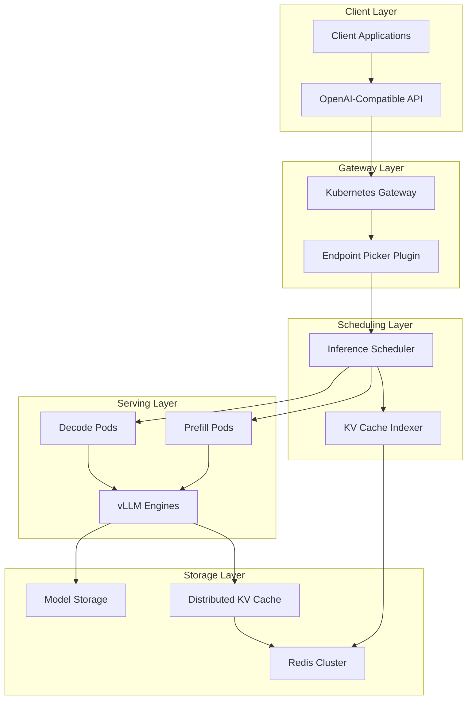

# Understanding the Architecture

:::info Chapter Overview
This chapter explores llm-d's distributed architecture, explaining how its components work together to provide high-performance LLM inference on Kubernetes. You'll understand the core design principles, component interactions, and how vLLM powers the serving layer.
:::

## Architectural Overview

llm-d implements a **disaggregated, Kubernetes-native architecture** designed for scalable LLM inference. The system separates concerns into specialized components that can scale independently based on workload requirements.

### Core Design Principles

#### 1. Disaggregated Serving

- Separates prefill and decode operations into dedicated pods
- Enables independent scaling of compute-intensive vs. memory-intensive workloads
- Optimizes resource utilization across different inference phases

#### 2. Kubernetes-Native Operations

- Leverages Kubernetes APIs for service discovery and routing
- Uses Custom Resource Definitions (CRDs) for declarative configuration
- Integrates with Kubernetes autoscaling and monitoring

#### 3. vLLM-Powered Inference

- Built on vLLM's high-performance serving engine
- Leverages PagedAttention for efficient memory management
- Supports continuous batching and optimized CUDA kernels

#### 4. Intelligent Caching

- Distributed KV cache management across the cluster
- Cache-aware request routing for optimal performance
- Support for long-context conversations and prefix reuse

## Component Architecture



### Component Deep Dive

#### Inference Scheduler

The **llm-d-inference-scheduler** serves as the orchestration brain of the system:

**Key Responsibilities:**

- Routes inference requests to optimal prefill/decode pods
- Makes cache-aware scheduling decisions
- Integrates with Kubernetes Gateway API for load balancing
- Manages request queuing and batching

**Technical Implementation:**

```yaml
apiVersion: gateway.llm-d.ai/v1alpha1
kind: InferenceGateway
metadata:
  name: llm-service-gateway
spec:
  listeners:
  - name: http
    port: 8080
    protocol: HTTP
  routes:
  - name: inference-route
    matches:
    - path: /v1/chat/completions
    backends:
    - name: prefill-service
      schedulingPolicy: "cache-aware"
    - name: decode-service
      schedulingPolicy: "latency-optimized"
```

**Scheduling Algorithms:**

- **Cache-Aware Routing**: Prioritizes pods with relevant cached prefixes
- **Load-Based Balancing**: Considers current queue depth and GPU utilization
- **Latency Optimization**: Minimizes total request completion time

#### Prefill and Decode Separation

llm-d implements **disaggregated serving** by separating the inference pipeline:

**Prefill Pods:**

- Process input tokens and generate initial key-value pairs
- Compute-intensive operations requiring high memory bandwidth
- Typically require fewer replicas but more powerful GPUs

**Decode Pods:**

- Generate output tokens using cached key-value pairs
- Memory-intensive operations with predictable compute patterns
- Scale horizontally for higher throughput

**Example Configuration:**

```yaml
apiVersion: apps/v1
kind: Deployment
metadata:
  name: llm-d-prefill
spec:
  replicas: 2
  template:
    spec:
      containers:
      - name: vllm-prefill
        image: vllm/vllm-openai:latest
        args:
        - "--model"
        - "meta-llama/Llama-3.1-70B-Instruct"
        - "--tensor-parallel-size"
        - "4"
        - "--pipeline-parallel-size"
        - "1"
        - "--enable-chunked-prefill"
        - "--kv-cache-dtype"
        - "fp8"
        resources:
          limits:
            nvidia.com/gpu: 4
            memory: "256Gi"
          requests:
            nvidia.com/gpu: 4
            memory: "256Gi"
---
apiVersion: apps/v1
kind: Deployment
metadata:
  name: llm-d-decode
spec:
  replicas: 8
  template:
    spec:
      containers:
      - name: vllm-decode
        image: vllm/vllm-openai:latest
        args:
        - "--model"
        - "meta-llama/Llama-3.1-70B-Instruct"
        - "--tensor-parallel-size"
        - "2"
        - "--pipeline-parallel-size"
        - "1"
        - "--enable-chunked-prefill"
        - "false"
        - "--kv-cache-dtype"
        - "fp8"
        resources:
          limits:
            nvidia.com/gpu: 2
            memory: "128Gi"
          requests:
            nvidia.com/gpu: 2
            memory: "128Gi"
```

#### KV Cache Management

The **llm-d-kv-cache-manager** provides intelligent distributed caching:

**Architecture Components:**

- **KVCacheIndexer**: Maintains global view of cache states
- **PrefixStore**: LRU-based storage for conversation prefixes
- **Redis Backend**: Centralized index for cache coordination

**Cache Operations:**

```golang
// Pseudo-code for cache operations
type KVCacheManager struct {
    indexer    KVCacheIndexer
    prefixStore PrefixStore
    redis      RedisClient
}

func (m *KVCacheManager) RouteRequest(req InferenceRequest) (targetPod string) {
    // Check for existing cache hits
    cacheKeys := m.extractCacheKeys(req.Messages)
    podMap := m.redis.MGet(cacheKeys)
    
    // Find pod with best cache locality
    return m.selectOptimalPod(podMap, req.Requirements)
}

func (m *KVCacheManager) UpdateCache(kvBlocks []KVBlock, nodeIP string) {
    // Update global cache index
    m.redis.HMSet(kvBlockKeys, nodeIP)
    m.indexer.UpdateLocalView(kvBlocks, nodeIP)
}
```

**Cache Hit Optimization:**

- Tracks conversation prefixes across multiple pods
- Routes follow-up requests to pods with relevant cached context
- Implements intelligent eviction policies for memory management

#### vLLM Integration

llm-d leverages vLLM's advanced serving capabilities:

**PagedAttention Integration:**

- Manages GPU memory in fixed-size pages
- Enables dynamic memory allocation for variable-length sequences
- Reduces memory fragmentation and improves utilization

**Continuous Batching:**

- Processes multiple requests simultaneously
- Dynamically adds/removes requests from batches
- Maximizes GPU throughput without sacrificing latency

**Quantization Support:**

```yaml
# Example quantized model configuration
apiVersion: v1
kind: ConfigMap
metadata:
  name: quantized-model-config
data:
  vllm-args: |
    --model meta-llama/Llama-3.1-70B-Instruct
    --quantization gptq
    --dtype auto
    --kv-cache-dtype fp8
    --max-model-len 32768
    --gpu-memory-utilization 0.90
```

## Request Flow

Understanding how requests flow through the system helps optimize performance:

### Typical Request Lifecycle

1. **Request Ingestion**

   ```bash
   # Client sends OpenAI-compatible request
   curl -X POST http://llm-d-gateway:8080/v1/chat/completions \
     -H "Content-Type: application/json" \
     -d '{
       "model": "llama3-70b",
       "messages": [{"role": "user", "content": "Explain quantum computing"}],
       "max_tokens": 1000
     }'
   ```

2. **Gateway Processing**
   - Kubernetes Gateway receives the request
   - Endpoint Picker Plugin (EPP) analyzes request characteristics
   - Gateway consults inference scheduler for routing decision

3. **Scheduling Decision**

   ```mermaid
   sequenceDiagram
       participant Client
       participant Gateway
       participant Scheduler
       participant KVCache
       participant Prefill
       participant Decode
       
       Client->>Gateway: POST /v1/chat/completions
       Gateway->>Scheduler: Route request
       Scheduler->>KVCache: Check cache locality
       KVCache-->>Scheduler: Pod recommendations
       Scheduler-->>Gateway: Route to prefill-pod-2
       Gateway->>Prefill: Forward request
       Prefill->>Decode: Stream tokens
       Decode-->>Client: Stream response
   ```

4. **Prefill Processing**
   - Selected prefill pod receives request
   - vLLM processes input tokens using PagedAttention
   - Generates initial key-value cache entries
   - Streams first token and cache metadata to decode pod

5. **Decode Processing**
   - Decode pod receives cache context and generates subsequent tokens
   - Uses cached key-value pairs for efficient autoregressive generation
   - Streams tokens back to client via gateway

6. **Cache Updates**
   - KV cache manager updates global index with new cache entries
   - Future requests with similar prefixes can leverage cached computation

### Performance Characteristics

**Latency Optimization:**

- First token latency: Optimized through prefill pod selection
- Token generation rate: Enhanced via decode pod scaling
- Cache hit ratio: Improved through intelligent routing

**Throughput Scaling:**

- Horizontal scaling of decode pods for higher concurrent requests
- Vertical scaling of prefill pods for larger model support
- Dynamic autoscaling based on queue depth and latency targets

## Custom Resource Definitions (CRDs)

llm-d extends Kubernetes with custom resources for declarative LLM management:

### InferenceService CRD

```yaml
apiVersion: apiextensions.k8s.io/v1
kind: CustomResourceDefinition
metadata:
  name: inferenceservices.serving.llm-d.ai
spec:
  group: serving.llm-d.ai
  versions:
  - name: v1alpha1
    served: true
    storage: true
    schema:
      openAPIV3Schema:
        type: object
        properties:
          spec:
            type: object
            properties:
              model:
                type: object
                properties:
                  modelUri:
                    type: string
                    description: "Hugging Face model identifier or custom URI"
                  quantization:
                    type: string
                    enum: ["none", "gptq", "awq", "fp8"]
                  tensorParallelSize:
                    type: integer
                    minimum: 1
              serving:
                type: object
                properties:
                  prefill:
                    type: object
                    properties:
                      replicas:
                        type: integer
                        minimum: 1
                      resources:
                        type: object
                  decode:
                    type: object
                    properties:
                      replicas:
                        type: integer
                        minimum: 1
                      autoscaling:
                        type: object
                        properties:
                          enabled:
                            type: boolean
                          minReplicas:
                            type: integer
                          maxReplicas:
                            type: integer
                          targetLatency:
                            type: string
```

**Example Usage:**

```yaml
apiVersion: serving.llm-d.ai/v1alpha1
kind: InferenceService
metadata:
  name: llama-3.1-70b-service
  namespace: production
spec:
  model:
    modelUri: "hf://meta-llama/Llama-3.1-70B-Instruct"
    quantization: "fp8"
    tensorParallelSize: 4
  serving:
    prefill:
      replicas: 2
      resources:
        limits:
          nvidia.com/gpu: 4
          memory: "256Gi"
    decode:
      replicas: 4
      autoscaling:
        enabled: true
        minReplicas: 4
        maxReplicas: 16
        targetLatency: "100ms"
  caching:
    enabled: true
    redis:
      cluster: "redis-cluster"
    prefixCaching:
      enabled: true
      maxPrefixLength: 4096
```

### CachePolicy CRD

```yaml
apiVersion: serving.llm-d.ai/v1alpha1
kind: CachePolicy
metadata:
  name: conversation-cache-policy
spec:
  selector:
    matchLabels:
      app: "chat-application"
  caching:
    strategy: "prefix-aware"
    ttl: "1h"
    maxEntries: 10000
  eviction:
    policy: "lru"
    memoryThreshold: "80%"
  routing:
    cacheLocalityWeight: 0.7
    latencyWeight: 0.3
```

## Integration Patterns

### With Kubernetes Ecosystem

**Horizontal Pod Autoscaler (HPA) Integration:**

```yaml
apiVersion: autoscaling/v2
kind: HorizontalPodAutoscaler
metadata:
  name: llm-d-decode-hpa
spec:
  scaleTargetRef:
    apiVersion: apps/v1
    kind: Deployment
    name: llm-d-decode
  minReplicas: 2
  maxReplicas: 20
  metrics:
  - type: Custom
    custom:
      metric:
        name: llm_d_queue_depth
      target:
        type: AverageValue
        averageValue: "5"
  - type: Custom
    custom:
      metric:
        name: llm_d_token_latency_p95
      target:
        type: AverageValue
        averageValue: "200m"
```

**Service Mesh Integration:**

```yaml
apiVersion: networking.istio.io/v1beta1
kind: VirtualService
metadata:
  name: llm-d-routing
spec:
  hosts:
  - llm-d-service
  http:
  - match:
    - headers:
        priority:
          exact: "high"
    route:
    - destination:
        host: llm-d-prefill-high-priority
      weight: 100
  - route:
    - destination:
        host: llm-d-prefill-standard
      weight: 100
```

## Monitoring and Observability

### Key Metrics

**System-Level Metrics:**

- `llm_d_requests_total` - Total inference requests
- `llm_d_request_duration_seconds` - End-to-end request latency
- `llm_d_tokens_per_second` - Token generation throughput
- `llm_d_gpu_utilization` - GPU usage across pods

**Cache Metrics:**

- `llm_d_cache_hit_ratio` - Percentage of cache hits
- `llm_d_cache_memory_usage` - Cache memory consumption
- `llm_d_prefix_reuse_ratio` - Conversation prefix reuse efficiency

**Component Health:**

- `llm_d_scheduler_decisions_total` - Scheduling decisions made
- `llm_d_prefill_queue_depth` - Pending requests in prefill queue
- `llm_d_decode_active_sequences` - Active generation sequences

### Performance Tuning

**Memory Optimization:**

```yaml
# Optimize KV cache memory usage
env:
- name: VLLM_GPU_MEMORY_UTILIZATION
  value: "0.85"
- name: VLLM_KV_CACHE_DTYPE
  value: "fp8"
- name: VLLM_SWAP_SPACE
  value: "16GiB"
```

**Throughput Optimization:**

```yaml
# Maximize token throughput
env:
- name: VLLM_MAX_NUM_BATCHED_TOKENS
  value: "8192"
- name: VLLM_MAX_NUM_SEQS
  value: "512"
- name: VLLM_ENABLE_CHUNKED_PREFILL
  value: "true"
```

## Summary

llm-d's architecture provides:

- **Scalable Design**: Disaggregated prefill/decode for independent scaling
- **Intelligent Caching**: Distributed KV cache with cache-aware routing
- **Kubernetes Integration**: Native CRDs and ecosystem compatibility
- **vLLM Performance**: Advanced serving optimizations and memory management
- **Operational Excellence**: Comprehensive monitoring and tuning capabilities

This architecture enables production-scale LLM serving with optimal resource utilization and performance characteristics.

## Next Steps

Now that you understand the architecture, explore:

- **Chapter 4**: Data Scientist workflows and model deployment patterns
- **Chapter 5**: SRE operations and production management
- **Chapter 6**: Performance optimization and tuning strategies

---

:::info References

- [llm-d Architecture Documentation](https://github.com/llm-d/llm-d)
- [vLLM Serving Documentation](https://docs.vllm.ai/)
- [Kubernetes Gateway API](https://gateway-api.sigs.k8s.io/)
- [PagedAttention Paper](https://arxiv.org/abs/2309.06180)

:::
