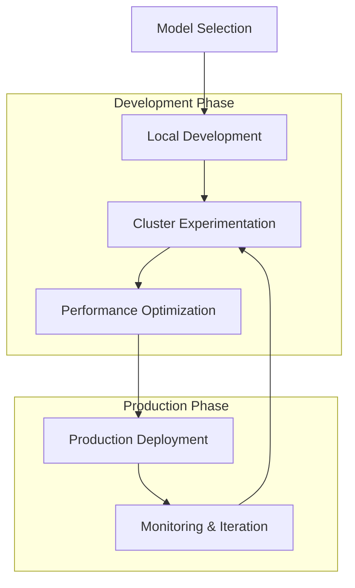

# Data Scientist Workflows

:::info Chapter Overview
This chapter focuses on the data scientist experience with llm-d, covering common workflows, model deployment patterns, experiment management, and best practices for productive LLM development. You'll learn how to efficiently iterate on models, manage experiments, and transition from development to production.
:::

## The Data Scientist Journey

Data scientists working with llm-d typically follow a structured workflow that spans from initial experimentation to production deployment. This journey involves several key phases:

### Workflow Overview



### Key Responsibilities

**Model Development:**

- Selecting appropriate base models for specific use cases
- Fine-tuning and adaptation for domain-specific requirements
- Implementing prompt engineering and few-shot learning strategies
- Evaluating model performance and quality metrics

**Deployment Management:**

- Configuring deployment parameters for optimal performance
- Managing model versioning and rollback strategies
- Implementing A/B testing for model comparison
- Monitoring model drift and performance degradation

**Operational Excellence:**

- Establishing monitoring and alerting for model health
- Implementing automated retraining pipelines
- Managing resource allocation and cost optimization
- Collaborating with SRE teams for production reliability

## Model Selection and Preparation

### Choosing the Right Base Model

llm-d supports a wide range of models from Hugging Face and custom repositories. The selection process involves several considerations:

**Model Categories:**

```yaml
# Code generation models
code_models:
  - "codellama/CodeLlama-7b-Instruct-hf"
  - "codellama/CodeLlama-13b-Instruct-hf"
  - "codellama/CodeLlama-34b-Instruct-hf"

# General conversation models
chat_models:
  - "meta-llama/Llama-3.1-8B-Instruct"
  - "meta-llama/Llama-3.1-70B-Instruct"
  - "meta-llama/Llama-3.1-405B-Instruct"

# Specialized domain models
domain_models:
  - "microsoft/DialoGPT-medium"
  - "facebook/blenderbot-400M-distill"
  - "microsoft/BioGPT-Large"
```

**Selection Criteria:**

1. **Task Alignment**: Match model capabilities to specific use cases
2. **Resource Requirements**: Consider GPU memory and compute needs
3. **Latency Requirements**: Balance model size with response time needs
4. **Quality Benchmarks**: Evaluate performance on relevant datasets
5. **License Compatibility**: Ensure compliance with deployment requirements

### Model Configuration

Create deployment configurations that balance performance with resource utilization:

```yaml
# development-config.yaml
apiVersion: serving.llm-d.ai/v1alpha1
kind: InferenceService
metadata:
  name: llama3-8b-dev
  namespace: data-science-dev
spec:
  model:
    modelUri: "hf://meta-llama/Llama-3.1-8B-Instruct"
    quantization: "none"  # Full precision for development
    tensorParallelSize: 1
  
  serving:
    prefill:
      replicas: 1
      resources:
        limits:
          nvidia.com/gpu: 1
          memory: "32Gi"
        requests:
          nvidia.com/gpu: 1
          memory: "32Gi"
    
    decode:
      replicas: 1
      resources:
        limits:
          nvidia.com/gpu: 1
          memory: "32Gi"
        requests:
          nvidia.com/gpu: 1
          memory: "32Gi"
  
  # Development-specific configurations
  development:
    logging:
      level: "DEBUG"
      requestTracing: true
    
    experimentation:
      allowModelReload: true
      enableMetricsCollection: true
      
  caching:
    enabled: false  # Disable for consistent experiment results
```

## Development Workflow

### Local Development Setup

Before deploying to the cluster, establish a local development environment:

**Prerequisites:**

```bash
# Install development tools
pip install vllm transformers torch
pip install jupyter notebook jupyterlab
pip install matplotlib seaborn pandas numpy

# Install llm-d CLI tools
curl -sSL https://install.llm-d.ai | bash
export PATH=$PATH:~/.llm-d/bin

# Configure cluster access
llmd config set-cluster dev-cluster \
  --server=https://k8s-dev.company.com \
  --token=${KUBE_TOKEN}
```

**Development Notebook Setup:**

```python
# development_notebook.ipynb
import requests
import json
import pandas as pd
import matplotlib.pyplot as plt
from datetime import datetime

# Configure llm-d client
class LLMDClient:
    def __init__(self, endpoint, model_name):
        self.endpoint = endpoint
        self.model_name = model_name
        self.session = requests.Session()
    
    def chat_completion(self, messages, **kwargs):
        """Send chat completion request to llm-d"""
        payload = {
            "model": self.model_name,
            "messages": messages,
            "max_tokens": kwargs.get("max_tokens", 1000),
            "temperature": kwargs.get("temperature", 0.7),
            "top_p": kwargs.get("top_p", 0.9),
            "stream": kwargs.get("stream", False)
        }
        
        response = self.session.post(
            f"{self.endpoint}/v1/chat/completions",
            json=payload,
            headers={"Content-Type": "application/json"}
        )
        return response.json()
    
    def embeddings(self, input_text, model=None):
        """Generate embeddings for input text"""
        payload = {
            "model": model or self.model_name,
            "input": input_text
        }
        
        response = self.session.post(
            f"{self.endpoint}/v1/embeddings",
            json=payload,
            headers={"Content-Type": "application/json"}
        )
        return response.json()

# Initialize client
client = LLMDClient(
    endpoint="http://localhost:8080",  # Port-forwarded service
    model_name="llama3-8b-dev"
)

# Test connection
test_response = client.chat_completion([
    {"role": "user", "content": "Hello! Please respond with a simple greeting."}
])
print(json.dumps(test_response, indent=2))
```

### Experiment Management

Implement structured experimentation to track model performance:

**Experiment Framework:**

```python
class ExperimentManager:
    def __init__(self, experiment_name, client):
        self.experiment_name = experiment_name
        self.client = client
        self.results = []
        self.start_time = datetime.now()
    
    def run_experiment(self, test_cases, model_configs):
        """Run experiments across multiple configurations"""
        for config_name, config in model_configs.items():
            print(f"Running experiment: {config_name}")
            
            config_results = []
            for test_case in test_cases:
                result = self._run_single_test(test_case, config)
                config_results.append(result)
            
            self.results.append({
                "config_name": config_name,
                "config": config,
                "results": config_results,
                "avg_latency": self._calculate_avg_latency(config_results),
                "avg_quality": self._calculate_avg_quality(config_results)
            })
    
    def _run_single_test(self, test_case, config):
        """Execute individual test case"""
        start_time = datetime.now()
        
        response = self.client.chat_completion(
            messages=test_case["messages"],
            **config
        )
        
        end_time = datetime.now()
        latency = (end_time - start_time).total_seconds()
        
        return {
            "test_case": test_case,
            "response": response,
            "latency": latency,
            "tokens_generated": response.get("usage", {}).get("completion_tokens", 0),
            "timestamp": start_time.isoformat()
        }
    
    def _calculate_avg_latency(self, results):
        return sum(r["latency"] for r in results) / len(results)
    
    def _calculate_avg_quality(self, results):
        # Implement quality scoring based on your metrics
        pass
    
    def export_results(self, filename):
        """Export experiment results to CSV"""
        df = pd.DataFrame(self.results)
        df.to_csv(filename, index=False)
        print(f"Results exported to {filename}")
    
    def visualize_results(self):
        """Create visualizations of experiment results"""
        configs = [r["config_name"] for r in self.results]
        latencies = [r["avg_latency"] for r in self.results]
        
        plt.figure(figsize=(10, 6))
        plt.bar(configs, latencies)
        plt.title(f"Experiment: {self.experiment_name} - Average Latency")
        plt.xlabel("Configuration")
        plt.ylabel("Latency (seconds)")
        plt.xticks(rotation=45)
        plt.tight_layout()
        plt.show()

# Example usage
experiment = ExperimentManager("temperature_comparison", client)

# Define test cases
test_cases = [
    {
        "name": "creative_writing",
        "messages": [
            {"role": "user", "content": "Write a creative short story about a robot learning to paint."}
        ]
    },
    {
        "name": "technical_explanation", 
        "messages": [
            {"role": "user", "content": "Explain how neural networks work in simple terms."}
        ]
    },
    {
        "name": "code_generation",
        "messages": [
            {"role": "user", "content": "Write a Python function to calculate the Fibonacci sequence."}
        ]
    }
]

# Define model configurations to test
model_configs = {
    "low_temp": {"temperature": 0.3, "max_tokens": 500},
    "medium_temp": {"temperature": 0.7, "max_tokens": 500},
    "high_temp": {"temperature": 1.0, "max_tokens": 500}
}

# Run experiments
experiment.run_experiment(test_cases, model_configs)
experiment.visualize_results()
experiment.export_results(f"experiment_{experiment.experiment_name}_{datetime.now().strftime('%Y%m%d_%H%M%S')}.csv")
```

## Model Deployment Patterns

### Progressive Deployment

Implement a progressive deployment strategy to minimize risk:

#### Stage 1: Development Deployment

```yaml
# Stage 1: Development environment
apiVersion: serving.llm-d.ai/v1alpha1
kind: InferenceService
metadata:
  name: model-dev-v1
  namespace: data-science-dev
  labels:
    environment: "development"
    version: "v1.0.0"
spec:
  model:
    modelUri: "hf://meta-llama/Llama-3.1-8B-Instruct"
    quantization: "none"
    tensorParallelSize: 1
  
  serving:
    prefill:
      replicas: 1
      resources:
        limits:
          nvidia.com/gpu: 1
          memory: "32Gi"
    
    decode:
      replicas: 1
      resources:
        limits:
          nvidia.com/gpu: 1
          memory: "32Gi"
  
  # Development-specific settings
  development:
    enableDebugLogging: true
    allowExperimentalFeatures: true
    
  monitoring:
    enabled: true
    metricsCollection:
      detailed: true
      sampleRate: 1.0  # Collect all metrics in dev
```

#### Stage 2: Staging Deployment

```yaml
# Stage 2: Staging environment
apiVersion: serving.llm-d.ai/v1alpha1
kind: InferenceService
metadata:
  name: model-staging-v1
  namespace: data-science-staging
  labels:
    environment: "staging"
    version: "v1.0.0"
spec:
  model:
    modelUri: "hf://meta-llama/Llama-3.1-8B-Instruct"
    quantization: "fp8"  # Use quantization for staging
    tensorParallelSize: 1
  
  serving:
    prefill:
      replicas: 2
      resources:
        limits:
          nvidia.com/gpu: 1
          memory: "24Gi"
    
    decode:
      replicas: 2
      autoscaling:
        enabled: true
        minReplicas: 2
        maxReplicas: 4
        targetLatency: "500ms"
  
  # Production-like settings
  monitoring:
    enabled: true
    metricsCollection:
      detailed: false
      sampleRate: 0.1  # Sample 10% in staging
    
  caching:
    enabled: true
    redis:
      cluster: "redis-staging"
```

#### Stage 3: Production Deployment

```yaml
# Stage 3: Production environment
apiVersion: serving.llm-d.ai/v1alpha1
kind: InferenceService
metadata:
  name: model-prod-v1
  namespace: data-science-production
  labels:
    environment: "production"
    version: "v1.0.0"
spec:
  model:
    modelUri: "hf://meta-llama/Llama-3.1-8B-Instruct"
    quantization: "fp8"
    tensorParallelSize: 2
  
  serving:
    prefill:
      replicas: 4
      resources:
        limits:
          nvidia.com/gpu: 2
          memory: "48Gi"
    
    decode:
      replicas: 8
      autoscaling:
        enabled: true
        minReplicas: 4
        maxReplicas: 16
        targetLatency: "200ms"
  
  # Production settings
  monitoring:
    enabled: true
    alerting:
      enabled: true
      thresholds:
        latencyP95: "1s"
        errorRate: "1%"
        throughput: "100rqs"
    
  caching:
    enabled: true
    redis:
      cluster: "redis-production"
      replication: true
    
  # High availability
  availability:
    multiZone: true
    podDisruptionBudget:
      minAvailable: 2
```

### A/B Testing Framework

Implement A/B testing to compare model performance:

```yaml
# A/B Testing Configuration
apiVersion: serving.llm-d.ai/v1alpha1
kind: ABTestConfig
metadata:
  name: model-comparison-test
  namespace: data-science-production
spec:
  # Define model variants
  variants:
    - name: "model-a"
      weight: 50  # 50% of traffic
      service: "model-prod-v1"
    
    - name: "model-b"
      weight: 50  # 50% of traffic
      service: "model-prod-v2"
  
  # Traffic routing rules
  routing:
    strategy: "random"  # or "user-based", "session-based"
    stickiness: "session"  # Maintain user consistency
  
  # Metrics collection
  metrics:
    - name: "latency"
      threshold: "1s"
      comparison: "lower_is_better"
    
    - name: "user_satisfaction"
      threshold: "4.0"
      comparison: "higher_is_better"
    
    - name: "error_rate"
      threshold: "1%"
      comparison: "lower_is_better"
  
  # Test duration and criteria
  duration: "7d"
  minSamples: 10000
  confidenceLevel: 0.95
  
  # Automatic rollback conditions
  rollback:
    enabled: true
    conditions:
      - metric: "error_rate"
        threshold: "5%"
        duration: "5m"
      
      - metric: "latency"
        threshold: "2s"
        duration: "10m"
```

## Performance Optimization

### Model Optimization Techniques

Optimize model performance through various techniques:

**Quantization Configuration:**

```yaml
# Quantization comparison
quantization_configs:
  fp16:
    quantization: "fp16"
    expected_memory_reduction: "50%"
    expected_performance_impact: "minimal"
    
  fp8:
    quantization: "fp8"
    expected_memory_reduction: "62.5%"
    expected_performance_impact: "low"
    
  int8:
    quantization: "int8"
    expected_memory_reduction: "75%"
    expected_performance_impact: "moderate"
    
  int4:
    quantization: "int4"
    expected_memory_reduction: "87.5%"
    expected_performance_impact: "high"
```

**Optimization Experiment:**

```python
class QuantizationExperiment:
    def __init__(self, base_model_uri):
        self.base_model_uri = base_model_uri
        self.results = {}
    
    def test_quantization_levels(self, test_dataset):
        """Test different quantization levels"""
        quantization_levels = ["none", "fp16", "fp8", "int8", "int4"]
        
        for quant_level in quantization_levels:
            print(f"Testing quantization: {quant_level}")
            
            # Deploy model with quantization
            deployment_config = self._create_deployment_config(quant_level)
            deployment = self._deploy_model(deployment_config)
            
            # Run performance tests
            performance_results = self._run_performance_tests(deployment, test_dataset)
            
            # Collect metrics
            self.results[quant_level] = {
                "deployment_config": deployment_config,
                "performance": performance_results,
                "memory_usage": self._measure_memory_usage(deployment),
                "throughput": self._measure_throughput(deployment),
                "quality_score": self._evaluate_quality(deployment, test_dataset)
            }
            
            # Cleanup
            self._cleanup_deployment(deployment)
    
    def _create_deployment_config(self, quantization):
        return {
            "model": {
                "modelUri": self.base_model_uri,
                "quantization": quantization,
                "tensorParallelSize": 1
            },
            "serving": {
                "prefill": {"replicas": 1},
                "decode": {"replicas": 1}
            }
        }
    
    def analyze_results(self):
        """Analyze and visualize quantization results"""
        df = pd.DataFrame(self.results).T
        
        # Create comparison plots
        fig, axes = plt.subplots(2, 2, figsize=(15, 10))
        
        # Latency comparison
        axes[0,0].bar(df.index, df['performance'].apply(lambda x: x['avg_latency']))
        axes[0,0].set_title('Average Latency by Quantization')
        axes[0,0].set_ylabel('Latency (ms)')
        
        # Memory usage comparison
        axes[0,1].bar(df.index, df['memory_usage'])
        axes[0,1].set_title('Memory Usage by Quantization')
        axes[0,1].set_ylabel('Memory (GB)')
        
        # Throughput comparison
        axes[1,0].bar(df.index, df['throughput'])
        axes[1,0].set_title('Throughput by Quantization')
        axes[1,0].set_ylabel('Requests/second')
        
        # Quality score comparison
        axes[1,1].bar(df.index, df['quality_score'])
        axes[1,1].set_title('Quality Score by Quantization')
        axes[1,1].set_ylabel('Quality Score')
        
        plt.tight_layout()
        plt.show()
        
        return df

# Example usage
experiment = QuantizationExperiment("meta-llama/Llama-3.1-8B-Instruct")
experiment.test_quantization_levels(test_dataset)
results_df = experiment.analyze_results()
```

### Resource Optimization

Optimize resource allocation based on workload patterns:

```python
class ResourceOptimizer:
    def __init__(self, monitoring_client):
        self.monitoring_client = monitoring_client
    
    def analyze_utilization_patterns(self, service_name, time_range="7d"):
        """Analyze resource utilization patterns"""
        metrics = self.monitoring_client.get_metrics(
            service=service_name,
            time_range=time_range,
            metrics=[
                "gpu_utilization",
                "memory_utilization", 
                "cpu_utilization",
                "request_rate",
                "queue_depth"
            ]
        )
        
        # Analyze patterns
        patterns = {
            "peak_hours": self._identify_peak_hours(metrics),
            "avg_utilization": self._calculate_avg_utilization(metrics),
            "scaling_opportunities": self._identify_scaling_opportunities(metrics),
            "cost_optimization": self._calculate_cost_optimization(metrics)
        }
        
        return patterns
    
    def recommend_configuration(self, current_config, utilization_patterns):
        """Recommend optimized configuration based on patterns"""
        recommendations = {
            "scaling": self._recommend_scaling(utilization_patterns),
            "resource_allocation": self._recommend_resources(utilization_patterns),
            "autoscaling": self._recommend_autoscaling(utilization_patterns),
            "cost_savings": self._calculate_potential_savings(current_config, utilization_patterns)
        }
        
        return recommendations
    
    def generate_optimized_config(self, recommendations):
        """Generate optimized YAML configuration"""
        config = {
            "apiVersion": "serving.llm-d.ai/v1alpha1",
            "kind": "InferenceService",
            "metadata": {
                "name": "optimized-model",
                "labels": {
                    "optimization": "resource-optimized",
                    "generated": "true"
                }
            },
            "spec": {
                "serving": {
                    "prefill": {
                        "replicas": recommendations["scaling"]["prefill_replicas"],
                        "resources": recommendations["resource_allocation"]["prefill"],
                        "autoscaling": recommendations["autoscaling"]["prefill"]
                    },
                    "decode": {
                        "replicas": recommendations["scaling"]["decode_replicas"],
                        "resources": recommendations["resource_allocation"]["decode"],
                        "autoscaling": recommendations["autoscaling"]["decode"]
                    }
                }
            }
        }
        
        return config

# Example usage
optimizer = ResourceOptimizer(monitoring_client)
patterns = optimizer.analyze_utilization_patterns("llama3-8b-prod")
recommendations = optimizer.recommend_configuration(current_config, patterns)
optimized_config = optimizer.generate_optimized_config(recommendations)

print("Optimized Configuration:")
print(yaml.dump(optimized_config, default_flow_style=False))
```

## Model Lifecycle Management

### Version Control and Rollback

Implement comprehensive version control for models:

```yaml
# Model Version Management
apiVersion: serving.llm-d.ai/v1alpha1
kind: ModelVersion
metadata:
  name: llama3-8b-v1-2-0
  namespace: data-science-production
spec:
  model:
    name: "llama3-8b"
    version: "1.2.0"
    modelUri: "hf://meta-llama/Llama-3.1-8B-Instruct"
    
  # Version metadata
  metadata:
    author: "data-science-team"
    description: "Optimized version with improved latency"
    changeLog: |
      - Updated quantization to fp8
      - Optimized tensor parallel configuration
      - Improved cache efficiency
    
  # Deployment configuration
  deployment:
    strategy: "blue-green"  # or "rolling", "canary"
    rollbackPolicy:
      enabled: true
      automaticRollback: true
      conditions:
        - metric: "error_rate"
          threshold: "2%"
          duration: "5m"
        - metric: "latency_p95"
          threshold: "1s"
          duration: "10m"
  
  # Testing requirements
  testing:
    required: true
    suites:
      - name: "regression_tests"
        required: true
      - name: "performance_tests"
        required: true
      - name: "quality_tests"
        required: false
    
    approvals:
      required: 2
      roles: ["data-scientist", "ml-engineer"]
```

### Automated Retraining Pipeline

Set up automated retraining based on performance metrics:

```python
class RetrainingPipeline:
    def __init__(self, model_config, training_config):
        self.model_config = model_config
        self.training_config = training_config
        self.monitoring_client = MonitoringClient()
    
    def should_retrain(self):
        """Determine if model should be retrained"""
        current_metrics = self.monitoring_client.get_current_metrics()
        
        retrain_conditions = [
            current_metrics['quality_score'] < self.training_config['min_quality_threshold'],
            current_metrics['drift_score'] > self.training_config['max_drift_threshold'],
            self._time_since_last_training() > self.training_config['max_training_interval']
        ]
        
        return any(retrain_conditions)
    
    def trigger_retraining(self):
        """Trigger automated retraining process"""
        if not self.should_retrain():
            return {"status": "no_retraining_needed"}
        
        # Create retraining job
        job_config = {
            "apiVersion": "batch/v1",
            "kind": "Job",
            "metadata": {
                "name": f"retrain-{self.model_config['name']}-{int(time.time())}",
                "namespace": "data-science-training"
            },
            "spec": {
                "template": {
                    "spec": {
                        "containers": [{
                            "name": "retraining",
                            "image": "llm-d/retraining:latest",
                            "env": [
                                {"name": "MODEL_NAME", "value": self.model_config['name']},
                                {"name": "TRAINING_DATA", "value": self.training_config['data_source']},
                                {"name": "OUTPUT_PATH", "value": self.training_config['output_path']}
                            ],
                            "resources": {
                                "limits": {
                                    "nvidia.com/gpu": "4",
                                    "memory": "64Gi"
                                }
                            }
                        }],
                        "restartPolicy": "Never"
                    }
                }
            }
        }
        
        # Submit job
        result = self._submit_kubernetes_job(job_config)
        
        # Set up monitoring
        self._monitor_training_job(result['job_name'])
        
        return result
    
    def _monitor_training_job(self, job_name):
        """Monitor training job progress"""
        # Implementation for job monitoring
        pass
```

## Best Practices

### Development Guidelines

**Code Organization:**

```python
# Project structure for data science workflows
project_structure = {
    "notebooks/": {
        "01_data_exploration.ipynb": "Initial data analysis",
        "02_model_selection.ipynb": "Model comparison and selection",
        "03_hyperparameter_tuning.ipynb": "Optimization experiments",
        "04_evaluation.ipynb": "Model evaluation and validation"
    },
    
    "src/": {
        "models/": {
            "__init__.py": "",
            "llm_wrapper.py": "LLM client wrapper",
            "evaluation.py": "Evaluation metrics and functions",
            "deployment.py": "Deployment utilities"
        },
        "utils/": {
            "__init__.py": "",
            "data_processing.py": "Data preprocessing utilities",
            "config.py": "Configuration management",
            "monitoring.py": "Monitoring and logging utilities"
        }
    },
    
    "configs/": {
        "development.yaml": "Development environment config",
        "staging.yaml": "Staging environment config", 
        "production.yaml": "Production environment config"
    },
    
    "tests/": {
        "test_models.py": "Model testing",
        "test_deployment.py": "Deployment testing",
        "test_evaluation.py": "Evaluation testing"
    },
    
    "deployment/": {
        "kubernetes/": "Kubernetes manifests",
        "helm/": "Helm charts",
        "monitoring/": "Monitoring configurations"
    }
}
```

**Quality Assurance:**

```python
class ModelQualityAssurance:
    def __init__(self, model_client):
        self.model_client = model_client
        self.test_suites = {
            "functional": self._functional_tests,
            "performance": self._performance_tests,
            "safety": self._safety_tests,
            "bias": self._bias_tests
        }
    
    def run_qa_pipeline(self, model_name, test_data):
        """Run comprehensive QA pipeline"""
        results = {}
        
        for suite_name, test_function in self.test_suites.items():
            print(f"Running {suite_name} tests...")
            
            try:
                suite_results = test_function(model_name, test_data)
                results[suite_name] = {
                    "status": "passed" if suite_results["passed"] else "failed",
                    "results": suite_results,
                    "timestamp": datetime.now().isoformat()
                }
            except Exception as e:
                results[suite_name] = {
                    "status": "error",
                    "error": str(e),
                    "timestamp": datetime.now().isoformat()
                }
        
        # Generate QA report
        self._generate_qa_report(results)
        
        return results
    
    def _functional_tests(self, model_name, test_data):
        """Test basic functionality"""
        tests = [
            self._test_basic_response,
            self._test_response_format,
            self._test_token_limits,
            self._test_error_handling
        ]
        
        results = []
        for test in tests:
            result = test(model_name, test_data)
            results.append(result)
        
        return {
            "passed": all(r["passed"] for r in results),
            "tests": results
        }
    
    def _performance_tests(self, model_name, test_data):
        """Test performance characteristics"""
        # Implement performance testing
        pass
    
    def _safety_tests(self, model_name, test_data):
        """Test safety and content filtering"""
        # Implement safety testing
        pass
    
    def _bias_tests(self, model_name, test_data):
        """Test for bias and fairness"""
        # Implement bias testing
        pass

# Example usage
qa = ModelQualityAssurance(model_client)
qa_results = qa.run_qa_pipeline("llama3-8b-v1", test_dataset)
```

### Collaboration Patterns

**Team Workflow:**

```yaml
# Team collaboration workflow
team_workflow:
  roles:
    - name: "data_scientist"
      responsibilities:
        - "Model selection and experimentation"
        - "Performance optimization"
        - "Quality evaluation"
      
    - name: "ml_engineer"
      responsibilities:
        - "Deployment automation"
        - "Infrastructure management"
        - "Monitoring setup"
      
    - name: "sre"
      responsibilities:
        - "Production reliability"
        - "Incident response"
        - "Capacity planning"
  
  handoff_points:
    - from: "data_scientist"
      to: "ml_engineer"
      criteria:
        - "Model performance meets requirements"
        - "QA tests pass"
        - "Documentation complete"
    
    - from: "ml_engineer"
      to: "sre"
      criteria:
        - "Deployment automation tested"
        - "Monitoring configured"
        - "Runbooks updated"
  
  review_process:
    model_reviews:
      required_reviewers: 2
      review_checklist:
        - "Performance benchmarks met"
        - "Resource requirements documented"
        - "Deployment strategy defined"
        - "Rollback plan documented"
    
    deployment_reviews:
      required_reviewers: 1
      review_checklist:
        - "Configuration follows standards"
        - "Monitoring alerts configured"
        - "Security requirements met"
        - "Documentation updated"
```

## Monitoring and Observability

### Model Performance Monitoring

Set up comprehensive monitoring for model performance:

```python
class ModelPerformanceMonitor:
    def __init__(self, model_name, prometheus_client):
        self.model_name = model_name
        self.prometheus = prometheus_client
        self.alerts = []
        
    def setup_monitoring_dashboard(self):
        """Set up Grafana dashboard for model monitoring"""
        dashboard_config = {
            "dashboard": {
                "title": f"Model Performance - {self.model_name}",
                "panels": [
                    {
                        "title": "Request Rate",
                        "type": "graph",
                        "targets": [{
                            "expr": f"rate(llm_d_requests_total{{model='{self.model_name}'}}[5m])",
                            "legendFormat": "Requests/sec"
                        }]
                    },
                    {
                        "title": "Latency Distribution",
                        "type": "heatmap",
                        "targets": [{
                            "expr": f"histogram_quantile(0.95, rate(llm_d_request_duration_seconds_bucket{{model='{self.model_name}'}}[5m]))",
                            "legendFormat": "P95 Latency"
                        }]
                    },
                    {
                        "title": "Quality Metrics",
                        "type": "stat",
                        "targets": [{
                            "expr": f"llm_d_model_quality_score{{model='{self.model_name}'}}",
                            "legendFormat": "Quality Score"
                        }]
                    },
                    {
                        "title": "Resource Utilization",
                        "type": "graph",
                        "targets": [
                            {
                                "expr": f"llm_d_gpu_utilization{{model='{self.model_name}'}}",
                                "legendFormat": "GPU Utilization"
                            },
                            {
                                "expr": f"llm_d_memory_utilization{{model='{self.model_name}'}}",
                                "legendFormat": "Memory Utilization"
                            }
                        ]
                    }
                ]
            }
        }
        
        return dashboard_config
    
    def setup_alerting_rules(self):
        """Configure alerting rules for model performance"""
        alerting_rules = [
            {
                "alert": "HighModelLatency",
                "expr": f"histogram_quantile(0.95, rate(llm_d_request_duration_seconds_bucket{{model='{self.model_name}'}}[5m])) > 2",
                "for": "5m",
                "labels": {
                    "severity": "warning",
                    "model": self.model_name
                },
                "annotations": {
                    "summary": "High model latency detected",
                    "description": f"Model {self.model_name} P95 latency is above 2 seconds"
                }
            },
            {
                "alert": "ModelQualityDegradation",
                "expr": f"llm_d_model_quality_score{{model='{self.model_name}'}} < 0.8",
                "for": "10m",
                "labels": {
                    "severity": "critical",
                    "model": self.model_name
                },
                "annotations": {
                    "summary": "Model quality degradation detected",
                    "description": f"Model {self.model_name} quality score has dropped below 0.8"
                }
            },
            {
                "alert": "HighErrorRate",
                "expr": f"rate(llm_d_errors_total{{model='{self.model_name}'}}[5m]) / rate(llm_d_requests_total{{model='{self.model_name}'}}[5m]) > 0.05",
                "for": "5m",
                "labels": {
                    "severity": "critical",
                    "model": self.model_name
                },
                "annotations": {
                    "summary": "High error rate detected",
                    "description": f"Model {self.model_name} error rate is above 5%"
                }
            }
        ]
        
        return alerting_rules
```

## Summary

This chapter covered the essential workflows and best practices for data scientists working with llm-d:

**Key Takeaways:**

- **Structured Workflow**: Follow a systematic approach from model selection to production deployment
- **Experiment Management**: Implement comprehensive experimentation frameworks for model comparison
- **Progressive Deployment**: Use staged deployments to minimize risk and ensure reliability
- **Performance Optimization**: Apply quantization, resource optimization, and caching strategies
- **Quality Assurance**: Establish comprehensive testing and validation processes
- **Monitoring**: Set up detailed monitoring and alerting for production models
- **Collaboration**: Define clear roles and handoff points for effective teamwork

## Next Steps

Continue your journey with:

- **Chapter 5**: SRE operations and production management
- **Chapter 6**: Performance optimization and tuning strategies
- **Chapter 7**: Troubleshooting guide with decision trees and solutions

---

:::info References

- [llm-d Model Service Documentation](https://github.com/llm-d/llm-d-model-service)
- [Hugging Face Model Hub](https://huggingface.co/models)
- [vLLM Performance Optimization](https://docs.vllm.ai/en/latest/performance.html)
- [MLOps Best Practices](https://cloud.google.com/architecture/mlops-continuous-delivery-and-automation-pipelines-in-machine-learning)
- [Shared Configuration Reference](./appendix/shared-config.md)

:::
