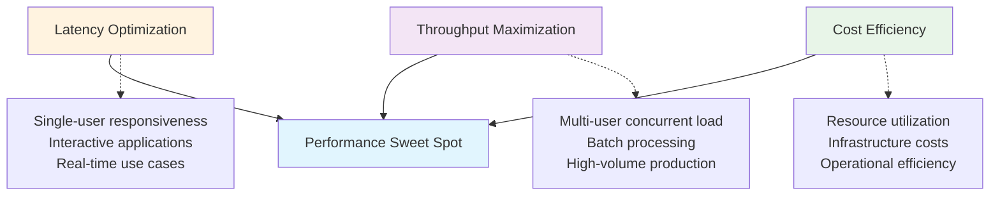

# Performance Optimization

:::info Chapter Overview
This chapter focuses on maximizing llm-d performance through systematic optimization across three key dimensions: latency, throughput, and cost efficiency. You'll learn hardware selection strategies, networking optimization with RDMA, model optimization techniques, and systematic performance evaluation using llm-d-benchmark.
:::

## The Performance Triangle

Performance optimization in LLM inference requires balancing three competing objectives:



### Performance Philosophy

Modern LLM serving requires a **systematic approach** to optimization:

1. **Measure First**: Establish baseline performance before optimization
2. **Bottleneck Analysis**: Identify limiting factors (compute, memory, network, I/O)
3. **Targeted Optimization**: Apply specific techniques to address bottlenecks
4. **Continuous Validation**: Monitor performance impact of changes
5. **Cost-Performance Balance**: Optimize for total cost of ownership

## Hardware Architecture Optimization

### GPU Selection Framework

Choosing the right GPU architecture significantly impacts performance and cost efficiency:

```python title="gpu-selector.py ⬇️" showLineNumbers
#!/usr/bin/env python3
"""
GPU Selection Framework for LLM Inference
Helps select optimal GPU configuration based on model requirements
"""

import json
from dataclasses import dataclass
from typing import Dict, List, Tuple
from enum import Enum

class ModelSize(Enum):
    SMALL = "7B-13B"      # 7B, 8B, 13B parameter models
    MEDIUM = "30B-40B"    # 30B, 34B parameter models  
    LARGE = "70B-80B"     # 70B, 80B parameter models
    XLARGE = "175B+"      # 175B, 405B+ parameter models

@dataclass
class GPUSpec:
    name: str
    memory_gb: int
    memory_bandwidth_tbs: float  # TB/s
    compute_tflops_fp8: float
    power_watts: int
    cost_per_hour: float  # USD per hour
    tensor_parallel_max: int
    
    def memory_efficiency_score(self) -> float:
        """Calculate memory efficiency (GB per watt)"""
        return self.memory_gb / self.power_watts
    
    def cost_efficiency_score(self) -> float:
        """Calculate cost efficiency (TFLOPS per dollar per hour)"""
        return self.compute_tflops_fp8 / self.cost_per_hour
    
    def performance_score(self, model_size: ModelSize) -> float:
        """Calculate performance score for specific model size"""
        base_score = self.compute_tflops_fp8 * self.memory_bandwidth_tbs
        
        # Adjust for model size requirements
        size_multiplier = {
            ModelSize.SMALL: 1.0,
            ModelSize.MEDIUM: 0.9,   # Slight penalty for memory pressure
            ModelSize.LARGE: 0.8,    # Memory becomes limiting factor
            ModelSize.XLARGE: 0.7    # Multi-GPU coordination overhead
        }
        
        return base_score * size_multiplier[model_size]

# Current generation GPU specifications
GPU_CATALOG = {
    # NVIDIA Hopper Generation
    "H100": GPUSpec(
        name="NVIDIA H100",
        memory_gb=80,
        memory_bandwidth_tbs=3.35,
        compute_tflops_fp8=1979,
        power_watts=700,
        cost_per_hour=4.50,
        tensor_parallel_max=8
    ),
    
    "H200": GPUSpec(
        name="NVIDIA H200", 
        memory_gb=141,
        memory_bandwidth_tbs=4.8,
        compute_tflops_fp8=1979,  # Same compute as H100
        power_watts=700,
        cost_per_hour=6.20,
        tensor_parallel_max=8
    ),
    
    # NVIDIA Blackwell Generation (Projected)
    "B200": GPUSpec(
        name="NVIDIA B200",
        memory_gb=192,
        memory_bandwidth_tbs=8.0,
        compute_tflops_fp8=4500,  # Estimated 2.3x H100
        power_watts=1000,
        cost_per_hour=9.50,  # Projected pricing
        tensor_parallel_max=16
    ),
    
    # AMD Instinct Generation
    "MI300X": GPUSpec(
        name="AMD MI300X",
        memory_gb=192,
        memory_bandwidth_tbs=5.2,
        compute_tflops_fp8=1307,  # FP8 performance
        power_watts=750,
        cost_per_hour=4.80,
        tensor_parallel_max=8
    ),
    
    "MI350X": GPUSpec(  # Next-gen AMD
        name="AMD MI350X",
        memory_gb=288,
        memory_bandwidth_tbs=8.0,
        compute_tflops_fp8=2100,  # Projected improvement
        power_watts=800,
        cost_per_hour=7.20,
        tensor_parallel_max=8
    )
}

class GPUSelector:
    def __init__(self):
        self.gpu_catalog = GPU_CATALOG
    
    def recommend_gpu(self, 
                     model_size: ModelSize,
                     priority: str = "balanced",  # "latency", "throughput", "cost"
                     max_cost_per_hour: float = None,
                     required_memory_gb: int = None) -> Dict:
        """
        Recommend optimal GPU configuration
        
        Args:
            model_size: Target model size category
            priority: Optimization priority
            max_cost_per_hour: Maximum acceptable cost
            required_memory_gb: Minimum memory requirement
            
        Returns:
            Dictionary with recommendations and analysis
        """
        
        # Filter GPUs by constraints
        candidates = []
        for gpu_name, gpu_spec in self.gpu_catalog.items():
            # Apply cost filter
            if max_cost_per_hour and gpu_spec.cost_per_hour > max_cost_per_hour:
                continue
                
            # Apply memory filter  
            if required_memory_gb and gpu_spec.memory_gb < required_memory_gb:
                continue
                
            candidates.append((gpu_name, gpu_spec))
        
        if not candidates:
            return {"error": "No GPUs meet the specified constraints"}
        
        # Score candidates based on priority
        scored_candidates = []
        for gpu_name, gpu_spec in candidates:
            if priority == "latency":
                score = gpu_spec.performance_score(model_size) * 0.7 + \
                       gpu_spec.memory_bandwidth_tbs * 0.3
            elif priority == "throughput":
                score = gpu_spec.compute_tflops_fp8 * 0.6 + \
                       gpu_spec.memory_gb * 0.4
            elif priority == "cost":
                score = gpu_spec.cost_efficiency_score() * 0.8 + \
                       gpu_spec.memory_efficiency_score() * 0.2
            else:  # balanced
                score = (gpu_spec.performance_score(model_size) * 0.4 +
                        gpu_spec.cost_efficiency_score() * 0.3 +
                        gpu_spec.memory_efficiency_score() * 0.3)
            
            scored_candidates.append((score, gpu_name, gpu_spec))
        
        # Sort by score (highest first)
        scored_candidates.sort(reverse=True)
        
        # Calculate tensor parallelism recommendation
        top_gpu = scored_candidates[0][2]
        tp_recommendation = self._calculate_tensor_parallelism(model_size, top_gpu)
        
        return {
            "recommended_gpu": scored_candidates[0][1],
            "gpu_specs": scored_candidates[0][2],
            "tensor_parallel_size": tp_recommendation["tp_size"],
            "estimated_memory_usage": tp_recommendation["memory_usage_gb"],
            "alternatives": [
                {
                    "gpu": name,
                    "score": score,
                    "cost_per_hour": spec.cost_per_hour,
                    "memory_gb": spec.memory_gb
                }
                for score, name, spec in scored_candidates[1:4]  # Top 3 alternatives
            ],
            "performance_analysis": self._analyze_performance(
                scored_candidates[0][2], model_size, tp_recommendation
            )
        }
    
    def _calculate_tensor_parallelism(self, model_size: ModelSize, gpu_spec: GPUSpec) -> Dict:
        """Calculate optimal tensor parallelism configuration"""
        
        # Estimated memory requirements (includes KV cache, attention, etc.)
        memory_requirements = {
            ModelSize.SMALL: {"7B": 14, "8B": 16, "13B": 26},
            ModelSize.MEDIUM: {"30B": 60, "34B": 68},
            ModelSize.LARGE: {"70B": 140, "80B": 160},
            ModelSize.XLARGE: {"175B": 350, "405B": 810}
        }
        
        # Use largest model in category for conservative estimate
        if model_size == ModelSize.SMALL:
            required_memory = memory_requirements[model_size]["13B"]
        elif model_size == ModelSize.MEDIUM:
            required_memory = memory_requirements[model_size]["34B"]
        elif model_size == ModelSize.LARGE:
            required_memory = memory_requirements[model_size]["80B"]
        else:  # XLARGE
            required_memory = memory_requirements[model_size]["405B"]
        
        # Calculate minimum TP size
        tp_size = max(1, (required_memory + gpu_spec.memory_gb - 1) // gpu_spec.memory_gb)
        tp_size = min(tp_size, gpu_spec.tensor_parallel_max)
        
        # Ensure TP size is power of 2 for optimal performance
        tp_size = 2 ** (tp_size - 1).bit_length() if tp_size > 1 else 1
        
        memory_per_gpu = required_memory / tp_size
        
        return {
            "tp_size": tp_size,
            "memory_usage_gb": memory_per_gpu,
            "memory_utilization": memory_per_gpu / gpu_spec.memory_gb
        }
    
    def _analyze_performance(self, gpu_spec: GPUSpec, model_size: ModelSize, tp_config: Dict) -> Dict:
        """Analyze expected performance characteristics"""
        
        # Baseline performance estimates (tokens/second)
        baseline_performance = {
            ModelSize.SMALL: 150,
            ModelSize.MEDIUM: 80, 
            ModelSize.LARGE: 40,
            ModelSize.XLARGE: 15
        }
        
        base_tps = baseline_performance[model_size]
        
        # Adjust for GPU performance
        gpu_multiplier = gpu_spec.compute_tflops_fp8 / 1000  # Normalize to H100 baseline
        
        # Adjust for tensor parallelism overhead
        tp_efficiency = 0.95 ** (tp_config["tp_size"] - 1)
        
        estimated_tps = base_tps * gpu_multiplier * tp_efficiency
        
        return {
            "estimated_tokens_per_second": round(estimated_tps, 1),
            "estimated_latency_ms": round(1000 / estimated_tps, 1),
            "tensor_parallel_efficiency": round(tp_efficiency, 3),
            "memory_utilization": round(tp_config["memory_utilization"], 2),
            "cost_per_1k_tokens": round(gpu_spec.cost_per_hour / (estimated_tps * 3.6), 4)
        }

# Example usage and testing
if __name__ == "__main__":
    selector = GPUSelector()
    
    # Example: Find best GPU for 70B model with cost constraint
    recommendation = selector.recommend_gpu(
        model_size=ModelSize.LARGE,
        priority="balanced",
        max_cost_per_hour=7.0,
        required_memory_gb=100
    )
    
    print("GPU Recommendation Results:")
    print(json.dumps(recommendation, indent=2, default=str))
    
    # Example: Compare all GPUs for different model sizes
    print("\n" + "="*60)
    print("Performance Comparison Across Model Sizes")
    print("="*60)
    
    for model_size in ModelSize:
        print(f"\n{model_size.value} Models:")
        rec = selector.recommend_gpu(model_size=model_size, priority="balanced")
        if "error" not in rec:
            print(f"  Recommended: {rec['recommended_gpu']}")
            print(f"  TP Size: {rec['tensor_parallel_size']}")
            print(f"  Performance: {rec['performance_analysis']['estimated_tokens_per_second']} tokens/sec")
            print(f"  Cost: ${rec['performance_analysis']['cost_per_1k_tokens']}/1K tokens")
```

### NVIDIA Architecture Deep Dive

#### Hopper Generation (H100/H200)

**H100 Specifications:**
- **Memory**: 80GB HBM3, 3.35 TB/s bandwidth
- **Compute**: 1,979 TFLOPS FP8, 989 TFLOPS FP16
- **Transformer Engine**: 4th-gen with FP8 precision
- **Power**: 700W TDP

**H200 Enhancements:**
- **Memory**: 141GB HBM3e (+76% capacity), 4.8 TB/s (+43% bandwidth)
- **Performance**: 37-45% faster inference vs H100
- **Energy Efficiency**: 50% less energy per inference operation

```yaml title="h100-optimized-config.yaml ⬇️" showLineNumbers
apiVersion: serving.llm-d.ai/v1alpha1
kind: InferenceService
metadata:
  name: llama3-70b-h100-optimized
  namespace: production
spec:
  model:
    modelUri: "hf://meta-llama/Llama-3.1-70B-Instruct"
    quantization: "fp8"  # Leverage Transformer Engine
    tensorParallelSize: 4
    maxModelLen: 8192
    
  serving:
    prefill:
      replicas: 2
      resources:
        limits:
          nvidia.com/gpu: 4  # 4x H100 for TP=4
          memory: "256Gi"
        requests:
          nvidia.com/gpu: 4
          memory: "256Gi"
      
      # H100-specific optimizations
      env:
      - name: VLLM_GPU_MEMORY_UTILIZATION
        value: "0.90"  # H100 can handle higher utilization
      - name: VLLM_MAX_NUM_BATCHED_TOKENS
        value: "8192"  # Optimize for H100 memory bandwidth
      - name: VLLM_ENABLE_CHUNKED_PREFILL
        value: "true"
      - name: CUDA_DEVICE_MAX_CONNECTIONS
        value: "1"  # Reduce context switching overhead
        
    decode:
      replicas: 8
      resources:
        limits:
          nvidia.com/gpu: 1
          memory: "64Gi"
        requests:
          nvidia.com/gpu: 1
          memory: "64Gi"
          
      autoscaling:
        enabled: true
        minReplicas: 4
        maxReplicas: 16
        targetLatency: "150ms"  # Aggressive latency target for H100
        
  # Hopper-specific scheduling
  nodeSelector:
    nvidia.com/gpu.product: "NVIDIA-H100-80GB-HBM3"
    
  # Performance monitoring
  monitoring:
    enabled: true
    metrics:
      gpuUtilization: true
      memoryBandwidth: true
      tensorEngineEfficiency: true
```

#### Blackwell Generation (B200)

**Revolutionary Improvements:**
- **Memory**: 192GB HBM3e, 8 TB/s bandwidth (2.4x H100)
- **Compute**: 20 PFLOPS FP4, 10 PFLOPS FP8 (sparse)
- **New Precisions**: FP4, FP6 with micro-tensor scaling
- **NVLink**: 1.8 TB/s (2x previous generation)

```yaml title="b200-next-gen-config.yaml ⬇️" showLineNumbers
apiVersion: serving.llm-d.ai/v1alpha1
kind: InferenceService
metadata:
  name: llama3-405b-b200-optimized
  namespace: next-gen-production
spec:
  model:
    modelUri: "hf://meta-llama/Llama-3.1-405B-Instruct"
    quantization: "fp4"  # Leverage Blackwell FP4 support
    tensorParallelSize: 8
    maxModelLen: 32768  # Extended context with massive memory
    
  serving:
    prefill:
      replicas: 1  # Single replica with 8x B200
      resources:
        limits:
          nvidia.com/gpu: 8  # 8x B200 for 405B model
          memory: "1536Gi"   # Massive memory for largest models
        requests:
          nvidia.com/gpu: 8
          memory: "1536Gi"
      
      # Blackwell-specific optimizations
      env:
      - name: VLLM_GPU_MEMORY_UTILIZATION
        value: "0.95"  # B200 advanced memory management
      - name: VLLM_MAX_NUM_BATCHED_TOKENS
        value: "32768"  # Leverage massive bandwidth
      - name: VLLM_ENABLE_CHUNKED_PREFILL
        value: "true"
      - name: VLLM_KV_CACHE_DTYPE
        value: "fp6"  # New FP6 precision for cache efficiency
      - name: VLLM_QUANTIZATION_PARAM_PATH
        value: "/models/fp4-quantization"
      - name: NVLINK_BANDWIDTH_OPTIMIZATION
        value: "true"
        
    decode:
      replicas: 4
      resources:
        limits:
          nvidia.com/gpu: 2  # Pairs of B200 for decode
          memory: "384Gi"
        requests:
          nvidia.com/gpu: 2
          memory: "384Gi"
          
      # Ultra-low latency configuration
      env:
      - name: VLLM_DECODE_BATCH_SIZE
        value: "128"  # Large batches for throughput
      - name: VLLM_DECODE_PRECISION
        value: "fp4"
        
  # Blackwell-specific node selection
  nodeSelector:
    nvidia.com/gpu.product: "NVIDIA-B200"
    node.llm-d.ai/nvlink-generation: "5"
    
  # Advanced performance monitoring
  monitoring:
    enabled: true
    metrics:
      fp4Performance: true
      nvlinkUtilization: true
      memoryBandwidthEfficiency: true
      powerEfficiency: true
```

### AMD Architecture Analysis

#### MI300X/MI350X Advantages

**MI300X Specifications:**
- **Memory**: 192GB HBM3e, 5.2 TB/s bandwidth
- **Compute**: 1,307 TFLOPS FP8, 2,615 TFLOPS FP16
- **Architecture**: CDNA 3 with 8 vertically stacked XCDs
- **Advantage**: 2.4x memory capacity vs H100

**MI350X Next Generation:**
- **Memory**: 288GB HBM3e, 8 TB/s bandwidth
- **New Features**: FP4/FP6 precision support
- **Performance**: 4x generation-over-generation AI improvement
- **Model Support**: Up to 520B parameters on single node

```yaml title="mi300x-cost-efficient-config.yaml ⬇️" showLineNumbers
apiVersion: serving.llm-d.ai/v1alpha1
kind: InferenceService
metadata:
  name: llama3-70b-mi300x-efficient
  namespace: amd-production
spec:
  model:
    modelUri: "hf://meta-llama/Llama-3.1-70B-Instruct"
    quantization: "fp8"  # ROCm 7.0 FP8 support
    tensorParallelSize: 1  # Single MI300X can handle 70B
    maxModelLen: 16384
    
  serving:
    prefill:
      replicas: 4  # Multiple single-GPU instances
      resources:
        limits:
          amd.com/gpu: 1  # Single MI300X per replica
          memory: "256Gi"
        requests:
          amd.com/gpu: 1
          memory: "256Gi"
      
      # ROCm optimizations
      env:
      - name: ROC_GPU_MEMORY_UTILIZATION
        value: "0.92"  # MI300X memory efficiency
      - name: HIP_FORCE_DEV_KERNARG
        value: "1"  # ROCm performance optimization
      - name: ROCM_VERSION
        value: "7.0"
      - name: HSA_FORCE_FINE_GRAIN_PCIE
        value: "1"
      - name: VLLM_BACKEND
        value: "rocm"
        
    decode:
      replicas: 8
      resources:
        limits:
          amd.com/gpu: 1
          memory: "128Gi"
        requests:
          amd.com/gpu: 1  
          memory: "128Gi"
          
      # Decode-specific ROCm tuning
      env:
      - name: VLLM_DECODE_BATCH_SIZE
        value: "64"
      - name: HIP_VISIBLE_DEVICES
        value: "0"
        
  # AMD-specific node selection
  nodeSelector:
    amd.com/gpu.product: "MI300X"
    node.llm-d.ai/rocm-version: "7.0"
    
  # Cost optimization annotations
  annotations:
    cost.llm-d.ai/optimization-priority: "memory-efficiency"
    cost.llm-d.ai/single-gpu-preference: "true"
```

## Latency Optimization

### Prefill Optimization Strategies

Prefill latency directly impacts time-to-first-token (TTFT), critical for interactive applications:

```yaml title="prefill-latency-optimized.yaml ⬇️" showLineNumbers
apiVersion: serving.llm-d.ai/v1alpha1
kind: InferenceService
metadata:
  name: ultra-low-latency-chat
  namespace: interactive-services
spec:
  model:
    modelUri: "hf://meta-llama/Llama-3.1-8B-Instruct"
    quantization: "fp8"
    tensorParallelSize: 1
    maxModelLen: 4096  # Shorter context for lower latency
    
  serving:
    prefill:
      replicas: 8  # Multiple replicas for request distribution
      resources:
        limits:
          nvidia.com/gpu: 1
          memory: "32Gi"
        requests:
          nvidia.com/gpu: 1
          memory: "32Gi"
      
      # Aggressive latency optimization
      env:
      - name: VLLM_GPU_MEMORY_UTILIZATION
        value: "0.75"  # Lower utilization for faster allocation
      - name: VLLM_MAX_NUM_SEQS
        value: "16"  # Limit concurrent sequences
      - name: VLLM_ENABLE_CHUNKED_PREFILL
        value: "false"  # Disable for minimum latency
      - name: VLLM_DISABLE_ASYNC_OUTPUT_PROC
        value: "true"  # Synchronous processing
      - name: CUDA_LAUNCH_BLOCKING
        value: "1"  # Ensure synchronous execution
      
      # Container-level optimizations  
      securityContext:
        capabilities:
          add: ["SYS_NICE"]  # Allow process priority adjustment
      
      # CPU affinity for NUMA optimization
      resources:
        limits:
          cpu: "8"
        requests:
          cpu: "8"
      
    decode:
      replicas: 4
      resources:
        limits:
          nvidia.com/gpu: 1
          memory: "16Gi"
        requests:
          nvidia.com/gpu: 1
          memory: "16Gi"
      
      # Decode latency optimization
      env:
      - name: VLLM_DECODE_BATCH_SIZE
        value: "8"  # Small batches for responsiveness
      - name: VLLM_TOKEN_BUDGET_RATIO
        value: "0.8"  # Reserve capacity for new requests
        
  # Load balancing for latency
  loadBalancing:
    strategy: "least-connections"  # Route to least loaded replica
    healthCheck:
      path: "/health"
      intervalSeconds: 5
      timeoutSeconds: 2
    
  # Priority scheduling
  priorityClassName: "high-priority-inference"
  
  # Monitoring for latency tracking
  monitoring:
    enabled: true
    metrics:
      timeToFirstToken: true
      prefillLatency: true
      decodeLatency: true
    alerting:
      latencyThreshold: "100ms"
```

### Network and I/O Optimization

System-level optimizations can significantly reduce latency overhead:

```yaml title="network-io-optimization.yaml ⬇️" showLineNumbers
apiVersion: apps/v1
kind: DaemonSet
metadata:
  name: llm-d-performance-tuning
  namespace: kube-system
spec:
  selector:
    matchLabels:
      app: llm-d-performance-tuning
  template:
    metadata:
      labels:
        app: llm-d-performance-tuning
    spec:
      hostNetwork: true
      hostPID: true
      containers:
      - name: performance-tuner
        image: alpine:latest
        command: ["/bin/sh"]
        args:
        - -c
        - |
          set -e
          echo "Applying LLM inference optimizations..."
          
          # Network optimizations
          echo 'net.core.rmem_max = 134217728' >> /etc/sysctl.conf
          echo 'net.core.wmem_max = 134217728' >> /etc/sysctl.conf
          echo 'net.ipv4.tcp_rmem = 4096 87380 134217728' >> /etc/sysctl.conf
          echo 'net.ipv4.tcp_wmem = 4096 65536 134217728' >> /etc/sysctl.conf
          echo 'net.core.netdev_max_backlog = 30000' >> /etc/sysctl.conf
          echo 'net.ipv4.tcp_congestion_control = bbr' >> /etc/sysctl.conf
          
          # CPU scheduling optimizations
          echo 'kernel.sched_migration_cost_ns = 5000000' >> /etc/sysctl.conf
          echo 'kernel.sched_min_granularity_ns = 10000000' >> /etc/sysctl.conf
          echo 'kernel.sched_wakeup_granularity_ns = 15000000' >> /etc/sysctl.conf
          
          # Memory management for large models
          echo 'vm.swappiness = 1' >> /etc/sysctl.conf
          echo 'vm.dirty_ratio = 15' >> /etc/sysctl.conf
          echo 'vm.dirty_background_ratio = 5' >> /etc/sysctl.conf
          
          # Apply settings
          sysctl -p /etc/sysctl.conf
          
          # NUMA optimization
          if command -v numactl >/dev/null 2>&1; then
            echo "Configuring NUMA policies..."
            echo 2 > /proc/sys/kernel/numa_balancing
          fi
          
          # IRQ affinity optimization
          if [ -d /proc/irq ]; then
            echo "Optimizing IRQ affinity..."
            for irq in /proc/irq/*/smp_affinity; do
              echo "f" > "$irq" 2>/dev/null || true
            done
          fi
          
          echo "Performance tuning completed"
          sleep infinity
          
        securityContext:
          privileged: true
        volumeMounts:
        - name: proc
          mountPath: /host/proc
        - name: sys
          mountPath: /host/sys
          
      volumes:
      - name: proc
        hostPath:
          path: /proc
      - name: sys
        hostPath:
          path: /sys
          
      tolerations:
      - operator: Exists
        effect: NoSchedule
      
      nodeSelector:
        llm-d.ai/gpu-node: "true"
```

## Throughput Maximization

### Batch Processing Optimization

Maximizing throughput requires intelligent batch size selection and continuous batching:

```python title="batch-optimizer.py ⬇️" showLineNumbers
#!/usr/bin/env python3
"""
Intelligent Batch Size Optimizer for LLM Throughput
Calculates optimal batch sizes based on GPU memory and model characteristics
"""

import math
from dataclasses import dataclass
from typing import Dict, List, Tuple, Optional
import numpy as np

@dataclass
class ModelConfig:
    name: str
    parameters: int  # Number of parameters
    hidden_size: int
    num_layers: int
    vocab_size: int
    max_sequence_length: int
    dtype_bytes: int  # 2 for fp16, 1 for fp8, etc.

@dataclass
class GPUMemoryProfile:
    total_memory_gb: int
    memory_bandwidth_tbs: float
    compute_tflops: float
    overhead_ratio: float = 0.15  # OS + driver overhead

class BatchOptimizer:
    """Optimizes batch sizes for maximum throughput while staying within memory constraints"""
    
    def __init__(self):
        # Pre-defined model configurations
        self.model_configs = {
            "llama-3.1-8b": ModelConfig(
                name="Llama 3.1 8B",
                parameters=8_030_000_000,
                hidden_size=4096,
                num_layers=32,
                vocab_size=128256,
                max_sequence_length=8192,
                dtype_bytes=2  # fp16
            ),
            "llama-3.1-70b": ModelConfig(
                name="Llama 3.1 70B", 
                parameters=70_553_000_000,
                hidden_size=8192,
                num_layers=80,
                vocab_size=128256,
                max_sequence_length=8192,
                dtype_bytes=2  # fp16
            ),
            "llama-3.1-405b": ModelConfig(
                name="Llama 3.1 405B",
                parameters=405_000_000_000,
                hidden_size=16384,
                num_layers=126,
                vocab_size=128256,
                max_sequence_length=8192,
                dtype_bytes=2  # fp16
            )
        }
    
    def calculate_model_memory_gb(self, 
                                 model_config: ModelConfig,
                                 quantization: str = "fp16",
                                 tensor_parallel_size: int = 1) -> float:
        """Calculate base model memory requirement"""
        
        dtype_multiplier = {
            "fp32": 4,
            "fp16": 2, 
            "bf16": 2,
            "fp8": 1,
            "int8": 1,
            "int4": 0.5
        }
        
        bytes_per_param = dtype_multiplier.get(quantization, 2)
        model_memory_bytes = model_config.parameters * bytes_per_param
        
        # Account for tensor parallelism
        model_memory_per_gpu = model_memory_bytes / tensor_parallel_size
        
        return model_memory_per_gpu / (1024**3)  # Convert to GB
    
    def calculate_kv_cache_memory_gb(self,
                                   model_config: ModelConfig,
                                   batch_size: int,
                                   sequence_length: int,
                                   kv_dtype: str = "fp16") -> float:
        """Calculate KV cache memory requirement"""
        
        dtype_bytes = {"fp16": 2, "fp8": 1, "int8": 1}.get(kv_dtype, 2)
        
        # KV cache formula: 2 (K+V) * batch_size * seq_len * num_layers * hidden_size * dtype_bytes
        kv_cache_bytes = (2 * batch_size * sequence_length * 
                         model_config.num_layers * model_config.hidden_size * dtype_bytes)
        
        return kv_cache_bytes / (1024**3)  # Convert to GB
    
    def calculate_activation_memory_gb(self,
                                     model_config: ModelConfig, 
                                     batch_size: int,
                                     sequence_length: int) -> float:
        """Calculate activation memory requirement"""
        
        # Simplified activation memory calculation
        # Actual formula is complex and depends on implementation details
        activation_bytes = (batch_size * sequence_length * model_config.hidden_size * 
                          model_config.num_layers * 4)  # Rough approximation
        
        return activation_bytes / (1024**3)  # Convert to GB
    
    def find_optimal_batch_size(self,
                               model_name: str,
                               gpu_memory_gb: int,
                               target_sequence_length: int = 2048,
                               quantization: str = "fp16",
                               kv_cache_dtype: str = "fp16",
                               tensor_parallel_size: int = 1,
                               safety_margin: float = 0.1) -> Dict:
        """Find optimal batch size for maximum throughput"""
        
        if model_name not in self.model_configs:
            raise ValueError(f"Unknown model: {model_name}")
        
        model_config = self.model_configs[model_name]
        
        # Calculate base model memory
        model_memory = self.calculate_model_memory_gb(
            model_config, quantization, tensor_parallel_size
        )
        
        # Available memory for dynamic allocation
        available_memory = gpu_memory_gb * (1 - safety_margin) - model_memory
        
        if available_memory <= 0:
            return {
                "error": f"Model too large for GPU memory",
                "model_memory_gb": model_memory,
                "available_memory_gb": available_memory
            }
        
        # Binary search for optimal batch size
        max_batch_size = 1024  # Upper bound
        optimal_batch_size = 1
        
        for batch_size in range(1, max_batch_size + 1):
            kv_cache_memory = self.calculate_kv_cache_memory_gb(
                model_config, batch_size, target_sequence_length, kv_cache_dtype
            )
            
            activation_memory = self.calculate_activation_memory_gb(
                model_config, batch_size, target_sequence_length
            )
            
            total_dynamic_memory = kv_cache_memory + activation_memory
            
            if total_dynamic_memory <= available_memory:
                optimal_batch_size = batch_size
            else:
                break
        
        # Calculate performance metrics
        final_kv_memory = self.calculate_kv_cache_memory_gb(
            model_config, optimal_batch_size, target_sequence_length, kv_cache_dtype
        )
        final_activation_memory = self.calculate_activation_memory_gb(
            model_config, optimal_batch_size, target_sequence_length
        )
        
        total_memory_used = model_memory + final_kv_memory + final_activation_memory
        memory_utilization = total_memory_used / gpu_memory_gb
        
        # Estimate throughput (simplified calculation)
        base_throughput = self._estimate_throughput(
            model_config, optimal_batch_size, quantization
        )
        
        return {
            "optimal_batch_size": optimal_batch_size,
            "memory_breakdown": {
                "model_memory_gb": round(model_memory, 2),
                "kv_cache_memory_gb": round(final_kv_memory, 2),
                "activation_memory_gb": round(final_activation_memory, 2),
                "total_memory_gb": round(total_memory_used, 2)
            },
            "memory_utilization": round(memory_utilization, 2),
            "estimated_throughput": {
                "tokens_per_second": round(base_throughput, 1),
                "requests_per_second": round(base_throughput / target_sequence_length, 2)
            },
            "configuration_recommendations": self._generate_config_recommendations(
                optimal_batch_size, target_sequence_length, quantization
            )
        }
    
    def _estimate_throughput(self,
                           model_config: ModelConfig,
                           batch_size: int, 
                           quantization: str) -> float:
        """Estimate throughput in tokens per second"""
        
        # Base throughput scaling factors (empirical)
        base_tps_per_billion_params = {
            "fp16": 2.5,
            "fp8": 4.0,
            "int8": 3.5,
            "int4": 6.0
        }
        
        base_rate = base_tps_per_billion_params.get(quantization, 2.5)
        model_size_billions = model_config.parameters / 1_000_000_000
        
        # Batch size scaling (with diminishing returns)
        batch_efficiency = min(1.0, 0.3 + 0.7 * math.log(batch_size + 1) / math.log(65))
        
        estimated_tps = base_rate * batch_size * batch_efficiency / model_size_billions
        
        return estimated_tps
    
    def _generate_config_recommendations(self,
                                       batch_size: int,
                                       sequence_length: int,
                                       quantization: str) -> Dict:
        """Generate vLLM configuration recommendations"""
        
        return {
            "vllm_args": {
                "--max-num-seqs": batch_size,
                "--max-model-len": sequence_length,
                "--dtype": quantization,
                "--gpu-memory-utilization": "0.90",
                "--enable-chunked-prefill": "true" if batch_size > 32 else "false",
                "--max-num-batched-tokens": min(batch_size * sequence_length, 32768)
            },
            "environment_variables": {
                "VLLM_PARALLEL_OUTPUT_PROCESSING": "true" if batch_size > 16 else "false",
                "VLLM_ENABLE_ASYNC_OUTPUT_PROC": "true",
                "CUDA_LAUNCH_BLOCKING": "0"
            }
        }
    
    def compare_configurations(self,
                             model_name: str,
                             gpu_memory_options: List[int],
                             quantization_options: List[str] = None,
                             sequence_length: int = 2048) -> Dict:
        """Compare different configuration options"""
        
        if quantization_options is None:
            quantization_options = ["fp16", "fp8", "int8"]
        
        results = {}
        
        for gpu_memory in gpu_memory_options:
            for quantization in quantization_options:
                config_key = f"{gpu_memory}GB-{quantization}"
                
                try:
                    result = self.find_optimal_batch_size(
                        model_name=model_name,
                        gpu_memory_gb=gpu_memory,
                        target_sequence_length=sequence_length,
                        quantization=quantization
                    )
                    results[config_key] = result
                    
                except Exception as e:
                    results[config_key] = {"error": str(e)}
        
        return results

# Example usage and benchmarking
if __name__ == "__main__":
    optimizer = BatchOptimizer()
    
    print("LLM Batch Size Optimization Analysis")
    print("=" * 50)
    
    # Test different GPU configurations
    gpu_options = [80, 141, 192]  # H100, H200, MI300X memory sizes
    quantization_options = ["fp16", "fp8"]
    
    for model_name in ["llama-3.1-8b", "llama-3.1-70b"]:
        print(f"\nModel: {model_name}")
        print("-" * 30)
        
        comparison = optimizer.compare_configurations(
            model_name=model_name,
            gpu_memory_options=gpu_options,
            quantization_options=quantization_options,
            sequence_length=2048
        )
        
        for config, result in comparison.items():
            if "error" not in result:
                print(f"{config:15} | Batch: {result['optimal_batch_size']:3d} | "
                      f"TPS: {result['estimated_throughput']['tokens_per_second']:6.1f} | "
                      f"Memory: {result['memory_utilization']:.1%}")
            else:
                print(f"{config:15} | Error: {result['error']}")
```

### Continuous Batching Implementation

Configure llm-d for optimal continuous batching performance:

```yaml title="continuous-batching-config.yaml ⬇️" showLineNumbers
apiVersion: serving.llm-d.ai/v1alpha1
kind: InferenceService
metadata:
  name: high-throughput-continuous-batching
  namespace: production
spec:
  model:
    modelUri: "hf://meta-llama/Llama-3.1-70B-Instruct"
    quantization: "fp8"
    tensorParallelSize: 4
    maxModelLen: 4096  # Balance context length with throughput
    
  serving:
    prefill:
      replicas: 2
      resources:
        limits:
          nvidia.com/gpu: 4
          memory: "256Gi"
        requests:
          nvidia.com/gpu: 4
          memory: "256Gi"
      
      # Continuous batching optimization
      env:
      - name: VLLM_GPU_MEMORY_UTILIZATION
        value: "0.88"
      - name: VLLM_MAX_NUM_SEQS
        value: "256"  # Large batch capacity
      - name: VLLM_MAX_NUM_BATCHED_TOKENS
        value: "16384"  # High token throughput
      - name: VLLM_ENABLE_CHUNKED_PREFILL
        value: "true"
      - name: VLLM_CHUNKED_PREFILL_SIZE
        value: "1024"
      
      # Advanced batching parameters
      - name: VLLM_SCHEDULER_DELAY_FACTOR
        value: "0.0"  # Minimize scheduling delay
      - name: VLLM_SWAP_SPACE
        value: "4GiB"  # Allow some swapping for larger batches
      - name: VLLM_ENABLE_PREFIX_CACHING
        value: "true"  # Reuse computation for similar requests
      
      # Performance monitoring
      - name: VLLM_LOG_LEVEL
        value: "INFO"
      - name: VLLM_ENABLE_METRICS
        value: "true"
        
    decode:
      replicas: 8
      resources:
        limits:
          nvidia.com/gpu: 1
          memory: "64Gi"
        requests:
          nvidia.com/gpu: 1
          memory: "64Gi"
      
      # Decode-specific continuous batching
      env:
      - name: VLLM_DECODE_MAX_SEQS
        value: "128"
      - name: VLLM_DECODE_BATCH_SIZE
        value: "64"
      - name: VLLM_TOKEN_BUDGET_RATIO
        value: "0.9"  # Aggressive token allocation
      
      autoscaling:
        enabled: true
        minReplicas: 4
        maxReplicas: 16
        metrics:
        - type: Custom
          custom:
            metric:
              name: llm_d_queue_depth_per_replica
            target:
              type: AverageValue
              averageValue: "8"  # Scale up if queue grows
        - type: Custom
          custom:
            metric:
              name: llm_d_batch_utilization
            target:
              type: AverageValue  
              averageValue: "0.8"  # Maintain high batch utilization
              
  # Load balancing for throughput
  loadBalancing:
    strategy: "round-robin"
    sessionAffinity: "none"  # Distribute requests evenly
    
  # Monitoring for throughput optimization
  monitoring:
    enabled: true
    metrics:
      batchSize: true
      queueDepth: true
      throughputTokensPerSecond: true
      batchUtilization: true
      prefillEfficiency: true
    dashboards:
      throughputOptimization: true
```

### Pipeline Parallelism for 175B+ Models

For the largest models, pipeline parallelism enables deployment across multiple nodes:

```yaml title="pipeline-parallel-405b.yaml ⬇️" showLineNumbers
apiVersion: serving.llm-d.ai/v1alpha1
kind: InferenceService
metadata:
  name: llama3-405b-pipeline-parallel
  namespace: ultra-large-models
spec:
  model:
    modelUri: "hf://meta-llama/Llama-3.1-405B-Instruct"
    quantization: "fp8"
    tensorParallelSize: 8    # 8-way tensor parallelism
    pipelineParallelSize: 4  # 4-way pipeline parallelism  
    maxModelLen: 8192
    
  serving:
    # Pipeline stage configuration
    pipelineStages:
    - name: "stage-0"  # Embedding + first 31 layers
      layerRange: [0, 31]
      replicas: 2
      resources:
        limits:
          nvidia.com/gpu: 8  # 8x H100 per stage
          memory: "640Gi"
        requests:
          nvidia.com/gpu: 8
          memory: "640Gi"
      
      nodeSelector:
        llm-d.ai/pipeline-stage: "0"
        nvidia.com/gpu.memory: "80GB"  # H100 nodes
        
      # Stage 0 specific optimizations
      env:
      - name: VLLM_PIPELINE_STAGE_ID
        value: "0"
      - name: VLLM_TENSOR_PARALLEL_SIZE
        value: "8"
      - name: VLLM_PIPELINE_PARALLEL_SIZE  
        value: "4"
      - name: VLLM_GPU_MEMORY_UTILIZATION
        value: "0.90"
        
    - name: "stage-1"  # Layers 32-63
      layerRange: [32, 63]
      replicas: 2
      resources:
        limits:
          nvidia.com/gpu: 8
          memory: "640Gi"
        requests:
          nvidia.com/gpu: 8
          memory: "640Gi"
          
      nodeSelector:
        llm-d.ai/pipeline-stage: "1"
        
      env:
      - name: VLLM_PIPELINE_STAGE_ID
        value: "1"
      - name: VLLM_TENSOR_PARALLEL_SIZE
        value: "8"
      - name: VLLM_PIPELINE_PARALLEL_SIZE
        value: "4"
        
    - name: "stage-2"  # Layers 64-95
      layerRange: [64, 95]
      replicas: 2
      resources:
        limits:
          nvidia.com/gpu: 8
          memory: "640Gi"
        requests:
          nvidia.com/gpu: 8
          memory: "640Gi"
          
      nodeSelector:
        llm-d.ai/pipeline-stage: "2"
        
      env:
      - name: VLLM_PIPELINE_STAGE_ID
        value: "2"
      - name: VLLM_TENSOR_PARALLEL_SIZE
        value: "8"
      - name: VLLM_PIPELINE_PARALLEL_SIZE
        value: "4"
        
    - name: "stage-3"  # Final layers + output
      layerRange: [96, 125]
      replicas: 2
      resources:
        limits:
          nvidia.com/gpu: 8
          memory: "640Gi"
        requests:
          nvidia.com/gpu: 8
          memory: "640Gi"
          
      nodeSelector:
        llm-d.ai/pipeline-stage: "3"
        
      env:
      - name: VLLM_PIPELINE_STAGE_ID
        value: "3"
      - name: VLLM_TENSOR_PARALLEL_SIZE
        value: "8"
      - name: VLLM_PIPELINE_PARALLEL_SIZE
        value: "4"
        
  # Pipeline communication optimization
  networking:
    # High-bandwidth interconnect required
    interconnect: "infiniband"  # RDMA for stage communication
    bandwidth: "400Gb"
    latency: "sub-microsecond"
    
    # Pipeline-specific networking
    pipelineNetworking:
      enabled: true
      protocol: "rdma"
      bufferSize: "64MB"
      compressionEnabled: false  # Preserve bandwidth for uncompressed data
      
  # Advanced scheduling for pipeline stages
  scheduling:
    # Ensure stages are scheduled on separate nodes
    antiAffinity:
      requiredDuringSchedulingIgnoredDuringExecution:
      - labelSelector:
          matchExpressions:
          - key: llm-d.ai/pipeline-stage
            operator: NotIn
            values: ["same"]
        topologyKey: kubernetes.io/hostname
        
    # Prefer nodes with high-bandwidth interconnect
    nodeAffinity:
      preferredDuringSchedulingIgnoredDuringExecution:
      - weight: 100
        preference:
          matchExpressions:
          - key: network.llm-d.ai/infiniband
            operator: In
            values: ["true"]
            
  # Pipeline-specific monitoring
  monitoring:
    enabled: true
    metrics:
      pipelineLatency: true
      stageThroughput: true
      interconnectUtilization: true
      pipelineBubbles: true  # Measure pipeline inefficiencies
    alerts:
      pipelineStageDown: true
      interconnectDegradation: true
```

## Cost Efficiency Optimization

### GPU Utilization Analysis

Maximize cost efficiency through intelligent resource utilization:

```python title="gpu-utilization-optimizer.py ⬇️" showLineNumbers
#!/usr/bin/env python3
"""
GPU Utilization Optimizer for Cost-Efficient LLM Serving
Analyzes utilization patterns and recommends optimization strategies
"""

import numpy as np
import json
from datetime import datetime, timedelta
from dataclasses import dataclass, asdict
from typing import Dict, List, Tuple, Optional
from sklearn.cluster import KMeans
from sklearn.preprocessing import StandardScaler

@dataclass
class UtilizationMetrics:
    timestamp: str
    gpu_utilization: float
    memory_utilization: float
    power_usage: float
    temperature: float
    requests_per_second: float
    tokens_per_second: float
    
@dataclass
class CostAnalysis:
    current_cost_per_hour: float
    optimal_cost_per_hour: float
    potential_savings_percent: float
    efficiency_score: float
    recommendations: List[str]

class GPUUtilizationOptimizer:
    """Analyzes GPU utilization patterns and provides cost optimization recommendations"""
    
    def __init__(self):
        self.utilization_history: List[UtilizationMetrics] = []
        self.optimization_threshold = 0.7  # Target 70% utilization
        
    def add_metrics(self, metrics: UtilizationMetrics):
        """Add utilization metrics to analysis"""
        self.utilization_history.append(metrics)
        
    def analyze_utilization_patterns(self, time_window_hours: int = 24) -> Dict:
        """Analyze utilization patterns over specified time window"""
        
        if not self.utilization_history:
            return {"error": "No metrics data available"}
            
        # Filter to time window
        cutoff_time = datetime.now() - timedelta(hours=time_window_hours)
        recent_metrics = [
            m for m in self.utilization_history 
            if datetime.fromisoformat(m.timestamp) > cutoff_time
        ]
        
        if not recent_metrics:
            return {"error": "No recent metrics available"}
            
        # Extract utilization arrays
        gpu_utils = [m.gpu_utilization for m in recent_metrics]
        mem_utils = [m.memory_utilization for m in recent_metrics]
        power_usage = [m.power_usage for m in recent_metrics]
        throughput = [m.tokens_per_second for m in recent_metrics]
        
        # Calculate statistics
        analysis = {
            "time_window_hours": time_window_hours,
            "sample_count": len(recent_metrics),
            "gpu_utilization": {
                "mean": np.mean(gpu_utils),
                "median": np.median(gpu_utils),
                "std": np.std(gpu_utils),
                "min": np.min(gpu_utils),
                "max": np.max(gpu_utils),
                "p95": np.percentile(gpu_utils, 95),
                "p99": np.percentile(gpu_utils, 99)
            },
            "memory_utilization": {
                "mean": np.mean(mem_utils),
                "median": np.median(mem_utils),
                "std": np.std(mem_utils),
                "min": np.min(mem_utils),
                "max": np.max(mem_utils)
            },
            "power_efficiency": {
                "mean_power": np.mean(power_usage),
                "power_per_token": np.mean([p/t if t > 0 else 0 
                                          for p, t in zip(power_usage, throughput)]),
                "efficiency_score": self._calculate_power_efficiency(power_usage, throughput)
            },
            "utilization_patterns": self._identify_usage_patterns(recent_metrics)
        }
        
        return analysis
    
    def _calculate_power_efficiency(self, power_usage: List[float], throughput: List[float]) -> float:
        """Calculate power efficiency score (0-1, higher is better)"""
        
        # Filter out zero throughput periods
        valid_pairs = [(p, t) for p, t in zip(power_usage, throughput) if t > 0]
        
        if not valid_pairs:
            return 0.0
            
        # Calculate efficiency as throughput per watt
        efficiencies = [t / p for p, t in valid_pairs]
        mean_efficiency = np.mean(efficiencies)
        
        # Normalize to 0-1 scale (based on typical LLM serving efficiency)
        max_expected_efficiency = 5.0  # tokens per watt for efficient serving
        return min(1.0, mean_efficiency / max_expected_efficiency)
    
    def _identify_usage_patterns(self, metrics: List[UtilizationMetrics]) -> Dict:
        """Identify distinct usage patterns using clustering"""
        
        if len(metrics) < 10:
            return {"error": "Insufficient data for pattern analysis"}
            
        # Prepare feature matrix
        features = np.array([
            [m.gpu_utilization, m.memory_utilization, m.requests_per_second]
            for m in metrics
        ])
        
        # Normalize features
        scaler = StandardScaler()
        features_scaled = scaler.fit_transform(features)
        
        # Cluster analysis
        n_clusters = min(5, len(metrics) // 3)  # 3-5 clusters depending on data
        kmeans = KMeans(n_clusters=n_clusters, random_state=42)
        cluster_labels = kmeans.fit_predict(features_scaled)
        
        # Analyze clusters
        patterns = {}
        for i in range(n_clusters):
            cluster_mask = cluster_labels == i
            cluster_metrics = [m for j, m in enumerate(metrics) if cluster_mask[j]]
            
            if cluster_metrics:
                patterns[f"pattern_{i}"] = {
                    "frequency": np.sum(cluster_mask) / len(metrics),
                    "description": self._describe_pattern(cluster_metrics),
                    "avg_gpu_util": np.mean([m.gpu_utilization for m in cluster_metrics]),
                    "avg_mem_util": np.mean([m.memory_utilization for m in cluster_metrics]),
                    "avg_throughput": np.mean([m.tokens_per_second for m in cluster_metrics])
                }
        
        return patterns
    
    def _describe_pattern(self, cluster_metrics: List[UtilizationMetrics]) -> str:
        """Generate human-readable description of usage pattern"""
        
        avg_gpu = np.mean([m.gpu_utilization for m in cluster_metrics])
        avg_mem = np.mean([m.memory_utilization for m in cluster_metrics])
        avg_rps = np.mean([m.requests_per_second for m in cluster_metrics])
        
        if avg_gpu < 0.3 and avg_rps < 5:
            return "Low activity / Idle period"
        elif avg_gpu > 0.8 and avg_rps > 20:
            return "High load / Peak usage"
        elif avg_mem > 0.9 and avg_gpu < 0.6:
            return "Memory bound / Large model inference"
        elif avg_gpu > 0.6 and avg_mem < 0.7:
            return "Compute bound / High throughput"
        else:
            return "Moderate usage / Steady state"
    
    def generate_optimization_recommendations(self, analysis: Dict) -> CostAnalysis:
        """Generate cost optimization recommendations based on utilization analysis"""
        
        if "error" in analysis:
            return CostAnalysis(0, 0, 0, 0, ["Error in analysis"])
            
        gpu_util = analysis["gpu_utilization"]
        mem_util = analysis["memory_utilization"]
        power_eff = analysis["power_efficiency"]
        
        recommendations = []
        efficiency_score = 0.0
        potential_savings = 0.0
        
        # Analyze GPU utilization
        if gpu_util["mean"] < 0.4:
            recommendations.append(
                "Consider using smaller GPU instances or implementing GPU sharing (MIG)"
            )
            recommendations.append(
                "Evaluate consolidating workloads onto fewer GPUs"
            )
            potential_savings += 30  # 30% potential savings
            
        elif gpu_util["mean"] < 0.6:
            recommendations.append(
                "Increase batch sizes to improve GPU utilization"
            )
            recommendations.append(
                "Consider enabling continuous batching for better efficiency"
            )
            potential_savings += 15
            
        # Analyze memory utilization
        if mem_util["mean"] < 0.5:
            recommendations.append(
                "Memory is underutilized - consider using quantization to reduce costs"
            )
            recommendations.append(
                "Evaluate using higher-memory GPUs with more workloads"
            )
            potential_savings += 20
            
        elif mem_util["mean"] > 0.9:
            recommendations.append(
                "Memory utilization is high - consider upgrading to higher-memory GPUs"
            )
            recommendations.append(
                "Implement KV cache optimization to reduce memory pressure"
            )
            
        # Analyze power efficiency
        if power_eff["efficiency_score"] < 0.5:
            recommendations.append(
                "Power efficiency is low - optimize batch sizes and model parallelism"
            )
            recommendations.append(
                "Consider using more efficient GPU architectures (e.g., H200 vs H100)"
            )
            potential_savings += 25
            
        # Calculate efficiency score
        util_score = min(1.0, gpu_util["mean"] / self.optimization_threshold)
        mem_score = min(1.0, mem_util["mean"] / 0.8)  # Target 80% memory utilization
        power_score = power_eff["efficiency_score"]
        
        efficiency_score = (util_score * 0.5 + mem_score * 0.3 + power_score * 0.2)
        
        # Specific recommendations based on patterns
        if "utilization_patterns" in analysis:
            patterns = analysis["utilization_patterns"]
            if any("Idle period" in p.get("description", "") for p in patterns.values()):
                recommendations.append(
                    "Implement auto-scaling to reduce costs during idle periods"
                )
                potential_savings += 40
                
        if not recommendations:
            recommendations.append("Utilization appears optimal - monitor for changes")
            
        # Calculate costs (simplified model)
        current_cost = 8.0  # Example: $8/hour for H100
        optimal_cost = current_cost * (1 - potential_savings / 100)
        
        return CostAnalysis(
            current_cost_per_hour=current_cost,
            optimal_cost_per_hour=optimal_cost,
            potential_savings_percent=min(potential_savings, 60),  # Cap at 60%
            efficiency_score=efficiency_score,
            recommendations=recommendations[:5]  # Top 5 recommendations
        )
    
    def generate_mig_recommendations(self, analysis: Dict) -> Dict:
        """Generate Multi-Instance GPU (MIG) configuration recommendations"""
        
        if "error" in analysis:
            return {"error": "Cannot analyze MIG opportunities"}
            
        gpu_util = analysis["gpu_utilization"]["mean"]
        patterns = analysis.get("utilization_patterns", {})
        
        mig_recommendations = {
            "suitable_for_mig": False,
            "recommended_configuration": None,
            "reasoning": [],
            "estimated_savings": 0
        }
        
        # Check if workload is suitable for MIG
        if gpu_util < 0.6:
            mig_recommendations["suitable_for_mig"] = True
            mig_recommendations["reasoning"].append(
                f"Low average GPU utilization ({gpu_util:.1%}) indicates potential for sharing"
            )
            
            # Recommend specific MIG configuration
            if gpu_util < 0.3:
                config = "1g.10gb + 1g.10gb + 1g.10gb + 1g.10gb"  # 4x small instances
                savings = 40
            elif gpu_util < 0.5:
                config = "2g.20gb + 2g.20gb"  # 2x medium instances  
                savings = 25
            else:
                config = "3g.40gb + 1g.10gb"  # 1 large + 1 small
                savings = 15
                
            mig_recommendations["recommended_configuration"] = config
            mig_recommendations["estimated_savings"] = savings
            mig_recommendations["reasoning"].append(
                f"Recommended MIG config: {config}"
            )
            
        else:
            mig_recommendations["reasoning"].append(
                "High GPU utilization indicates MIG may not be beneficial"
            )
            
        return mig_recommendations

# Example usage and simulation
if __name__ == "__main__":
    optimizer = GPUUtilizationOptimizer()
    
    # Simulate utilization data
    print("Simulating GPU utilization analysis...")
    
    base_time = datetime.now() - timedelta(hours=24)
    for i in range(144):  # 24 hours of 10-minute intervals
        timestamp = base_time + timedelta(minutes=i*10)
        
        # Simulate different usage patterns
        if 6 <= i % 24 <= 22:  # Business hours
            gpu_util = np.random.normal(0.6, 0.2)
            rps = np.random.normal(15, 5)
        else:  # Off hours
            gpu_util = np.random.normal(0.2, 0.1)
            rps = np.random.normal(3, 2)
            
        metrics = UtilizationMetrics(
            timestamp=timestamp.isoformat(),
            gpu_utilization=max(0, min(1, gpu_util)),
            memory_utilization=max(0, min(1, np.random.normal(0.7, 0.15))),
            power_usage=300 + gpu_util * 400,  # 300-700W range
            temperature=40 + gpu_util * 25,    # 40-65C range
            requests_per_second=max(0, rps),
            tokens_per_second=max(0, rps * 50)  # ~50 tokens per request
        )
        
        optimizer.add_metrics(metrics)
    
    # Analyze patterns
    analysis = optimizer.analyze_utilization_patterns(24)
    print(json.dumps(analysis, indent=2, default=str))
    
    # Generate recommendations
    cost_analysis = optimizer.generate_optimization_recommendations(analysis)
    print(f"\nCost Analysis:")
    print(f"Efficiency Score: {cost_analysis.efficiency_score:.2f}")
    print(f"Potential Savings: {cost_analysis.potential_savings_percent:.1f}%")
    print("Recommendations:")
    for rec in cost_analysis.recommendations:
        print(f"  - {rec}")
    
    # MIG analysis
    mig_recs = optimizer.generate_mig_recommendations(analysis)
    print(f"\nMIG Analysis:")
    print(f"Suitable for MIG: {mig_recs['suitable_for_mig']}")
    if mig_recs['suitable_for_mig']:
        print(f"Recommended Config: {mig_recs['recommended_configuration']}")
        print(f"Estimated Savings: {mig_recs['estimated_savings']}%")
```

## RDMA Networking Optimization

:::info RDMA for Cost-Efficient Inference
RDMA (Remote Direct Memory Access) provides critical performance benefits for large model inference by eliminating CPU overhead and reducing latency. For cost-efficient inference at scale, RDMA can improve throughput by 20-40% while reducing CPU utilization.
:::

### Why RDMA Matters for LLM Inference

Modern LLM serving requires **high-bandwidth, low-latency communication** between:
- Multi-GPU model sharding (pipeline parallelism)
- Distributed KV-cache systems (disaggregated inference)
- Model weight distribution across nodes
- Real-time metric collection and monitoring

**Traditional TCP/IP Limitations:**
- **CPU overhead**: 10-15% CPU utilization for network processing
- **Copy overhead**: Multiple memory copies increase latency
- **Kernel bypassing**: User-space to kernel-space transitions
- **Buffer management**: Additional memory allocations and deallocations

**RDMA Benefits:**
- **Zero-copy transfers**: Direct memory-to-memory transfers
- **Kernel bypass**: User-space networking eliminates system calls
- **Low CPU overhead**: Less than 2% CPU utilization for network operations
- **Predictable latency**: Hardware-level flow control and reliability

### RDMA Technologies for Kubernetes

#### InfiniBand vs RoCE Comparison

```yaml title="rdma-comparison.yaml ⬇️" showLineNumbers
# InfiniBand Configuration (Dedicated Fabric)
apiVersion: v1
kind: ConfigMap
metadata:
  name: infiniband-config
  namespace: llm-d-system
data:
  # InfiniBand provides highest performance but requires dedicated hardware
  fabric_type: "infiniband"
  bandwidth: "200Gb/s"  # HDR InfiniBand
  latency_microseconds: "0.5"
  cpu_overhead_percent: "1"
  deployment_complexity: "high"
  hardware_cost: "high"
  use_cases: |
    - Large model training clusters
    - High-frequency inference workloads
    - Multi-node model sharding (>100B parameters)
---
# RoCE Configuration (Ethernet-based)
apiVersion: v1
kind: ConfigMap
metadata:
  name: roce-config
  namespace: llm-d-system
data:
  # RoCE provides good performance on existing Ethernet infrastructure
  fabric_type: "roce_v2"
  bandwidth: "100Gb/s"  # Standard 100GbE
  latency_microseconds: "2"
  cpu_overhead_percent: "3"
  deployment_complexity: "medium"
  hardware_cost: "medium"
  use_cases: |
    - Mixed workload environments
    - Moderate scale inference (7B-70B models)
    - Cost-conscious deployments
    - Existing Ethernet infrastructure
```

### RDMA Configuration for llm-d

#### Node Preparation

```bash title="setup-rdma-nodes.sh ⬇️" showLineNumbers
#!/bin/bash
# RDMA Node Preparation Script for OpenShift/Kubernetes

set -euo pipefail

echo "=== RDMA Node Setup for llm-d ==="

# 1. Install RDMA drivers and tools
if command -v yum &> /dev/null; then
    # RHEL/CentOS
    sudo yum install -y rdma-core libibverbs-utils perftest
elif command -v apt &> /dev/null; then
    # Ubuntu/Debian
    sudo apt update
    sudo apt install -y rdma-core libibverbs-dev perftest
fi

# 2. Load RDMA kernel modules
sudo modprobe ib_core
sudo modprobe ib_cm
sudo modprobe ib_umad
sudo modprobe ib_uverbs
sudo modprobe mlx5_core
sudo modprobe mlx5_ib

# 3. Configure persistent module loading
cat << 'EOF' | sudo tee /etc/modules-load.d/rdma.conf
# RDMA kernel modules
ib_core
ib_cm
ib_umad
ib_uverbs
mlx5_core
mlx5_ib
EOF

# 4. Verify RDMA device detection
echo "Checking RDMA devices..."
if ibv_devinfo &> /dev/null; then
    echo "✓ RDMA devices detected:"
    ibv_devinfo | grep -E "(hca_id|port_state|link_layer)"
else
    echo "✗ No RDMA devices found"
    exit 1
fi

# 5. Configure network interface (example for Mellanox)
RDMA_INTERFACE="${RDMA_INTERFACE:-ens6f0}"
echo "Configuring RDMA interface: $RDMA_INTERFACE"

# Enable RoCE if using Ethernet
if [[ "$RDMA_INTERFACE" =~ ^(eth|ens) ]]; then
    echo "Configuring RoCE on $RDMA_INTERFACE"
    sudo cma_roce_mode -d mlx5_0 -p 1 -m 2  # RoCE v2
fi

# 6. Performance tuning
echo "Applying RDMA performance tuning..."
cat << 'EOF' | sudo tee /etc/sysctl.d/90-rdma.conf
# RDMA performance tuning
net.core.rmem_max = 134217728
net.core.wmem_max = 134217728
net.ipv4.tcp_rmem = 4096 87380 134217728
net.ipv4.tcp_wmem = 4096 65536 134217728
net.core.netdev_max_backlog = 5000
EOF

sudo sysctl -p /etc/sysctl.d/90-rdma.conf

echo "=== RDMA node setup complete ==="
```

#### Kubernetes RDMA Device Plugin

```yaml title="rdma-device-plugin.yaml ⬇️" showLineNumbers
# RDMA Device Plugin for GPU nodes
apiVersion: apps/v1
kind: DaemonSet
metadata:
  name: rdma-device-plugin
  namespace: kube-system
  labels:
    app: rdma-device-plugin
spec:
  selector:
    matchLabels:
      app: rdma-device-plugin
  template:
    metadata:
      labels:
        app: rdma-device-plugin
    spec:
      nodeSelector:
        # Only deploy on GPU nodes with RDMA capability
        node.kubernetes.io/instance-type: "gpu-rdma"
      tolerations:
      - key: nvidia.com/gpu
        operator: Exists
        effect: NoSchedule
      containers:
      - name: rdma-device-plugin
        image: ghcr.io/mellanox/k8s-rdma-shared-dev-plugin:latest
        securityContext:
          privileged: true
        volumeMounts:
        - name: device-plugin
          mountPath: /var/lib/kubelet/device-plugins
        - name: proc
          mountPath: /host/proc
        - name: sys
          mountPath: /host/sys
        env:
        - name: NODE_NAME
          valueFrom:
            fieldRef:
              fieldPath: spec.nodeName
      volumes:
      - name: device-plugin
        hostPath:
          path: /var/lib/kubelet/device-plugins
      - name: proc
        hostPath:
          path: /proc
      - name: sys
        hostPath:
          path: /sys
      hostNetwork: true
      hostPID: true
---
# RDMA Network Attachment Definition
apiVersion: k8s.cni.cncf.io/v1
kind: NetworkAttachmentDefinition
metadata:
  name: rdma-network
  namespace: llm-d-system
spec:
  config: |
    {
      "cniVersion": "0.3.1",
      "name": "rdma-network",
      "type": "macvlan",
      "master": "ens6f0",
      "mode": "bridge",
      "ipam": {
        "type": "static",
        "addresses": [
          {
            "address": "192.168.100.0/24"
          }
        ]
      }
    }
```

#### llm-d with RDMA Configuration

```yaml title="llm-d-rdma-inference.yaml ⬇️" showLineNumbers
# High-performance inference service with RDMA
apiVersion: serving.llm-d.ai/v1alpha1
kind: InferenceService
metadata:
  name: llama3-70b-rdma
  namespace: llm-d-production
spec:
  model:
    name: "meta-llama/Meta-Llama-3-70B-Instruct"
    source: "huggingface"
    quantization: "bitsandbytes-8bit"
  
  deployment:
    # Multi-GPU configuration for large model
    replicas: 2
    
    resources:
      requests:
        nvidia.com/gpu: "4"
        rdma/rdma_shared_device_a: "1"  # RDMA device
        cpu: "16"
        memory: "128Gi"
      limits:
        nvidia.com/gpu: "4"
        rdma/rdma_shared_device_a: "1"
        cpu: "32"
        memory: "256Gi"
    
    # RDMA networking configuration
    annotations:
      k8s.v1.cni.cncf.io/networks: rdma-network
    
    # Node affinity for RDMA-capable nodes
    nodeSelector:
      hardware.llm-d.ai/rdma: "enabled"
      hardware.llm-d.ai/gpu-type: "h100"
    
    # Pod anti-affinity for distributed deployment
    podAntiAffinity:
      preferredDuringSchedulingIgnoredDuringExecution:
      - weight: 100
        podAffinityTerm:
          labelSelector:
            matchLabels:
              app: llama3-70b-rdma
          topologyKey: kubernetes.io/hostname

  engine:
    name: "vllm"
    version: "0.4.0"
    
    parameters:
      # Enable tensor parallelism across GPUs
      tensor_parallel_size: 4
      pipeline_parallel_size: 2  # Across nodes via RDMA
      
      # RDMA-specific optimizations
      distributed_executor_backend: "ray"
      enable_chunked_prefill: true
      max_num_seqs: 256
      
      # Memory optimization for RDMA transfers
      gpu_memory_utilization: 0.85
      swap_space: 8  # GiB swap for large contexts
      
      # Network configuration
      worker_use_ray: true
      ray_config:
        address: "auto"
        include_dashboard: false
        object_store_memory: 4000000000  # 4GB

  serving:
    # High-throughput serving configuration
    port: 8000
    max_concurrent_requests: 512
    timeout_seconds: 300
    
    # Load balancing for multiple replicas
    strategy: "round_robin"
    health_check:
      enabled: true
      path: "/health"
      interval_seconds: 30

  monitoring:
    # Enhanced monitoring for RDMA performance
    metrics:
      enabled: true
      port: 9090
      custom_metrics:
      - "rdma_bandwidth_bytes_per_second"
      - "rdma_latency_microseconds"
      - "inter_node_communication_time"
      - "pipeline_parallel_efficiency"
    
    # RDMA-specific alerts
    alerts:
    - name: "RDMAHighLatency"
      condition: "rdma_latency_microseconds > 10"
      severity: "warning"
    - name: "RDMABandwidthLow"
      condition: "rdma_bandwidth_bytes_per_second < 10000000000"  # <10GB/s
      severity: "critical"
```

### RDMA Performance Validation

```python title="rdma-performance-test.py ⬇️" showLineNumbers
#!/usr/bin/env python3
"""
RDMA Performance Validation for llm-d Deployments
Tests RDMA bandwidth, latency, and integration with inference workloads
"""

import subprocess
import time
import json
from typing import Dict, List
import requests

class RDMAPerformanceTester:
    def __init__(self, rdma_interface: str = "mlx5_0"):
        self.rdma_interface = rdma_interface
        self.test_results = {}
    
    def test_rdma_bandwidth(self, remote_host: str) -> Dict:
        """Test RDMA bandwidth using ib_send_bw"""
        print(f"Testing RDMA bandwidth to {remote_host}...")
        
        try:
            # Run bandwidth test (server should be running on remote_host)
            cmd = [
                "ib_send_bw", 
                "-d", self.rdma_interface,
                "-s", "1048576",  # 1MB message size
                "-n", "10000",    # Number of iterations
                remote_host
            ]
            
            result = subprocess.run(cmd, capture_output=True, text=True, timeout=60)
            
            # Parse results
            lines = result.stdout.split('\n')
            for line in lines:
                if "bytes" in line and "BW average" in line:
                    parts = line.split()
                    bandwidth_gbps = float(parts[-2])
                    
                    return {
                        "bandwidth_gbps": bandwidth_gbps,
                        "bandwidth_bytes_per_sec": bandwidth_gbps * 1e9 / 8,
                        "status": "success" if bandwidth_gbps > 50 else "warning",
                        "raw_output": result.stdout
                    }
            
            return {"status": "error", "message": "Could not parse bandwidth results"}
            
        except subprocess.TimeoutExpired:
            return {"status": "error", "message": "Bandwidth test timed out"}
        except Exception as e:
            return {"status": "error", "message": str(e)}
    
    def test_rdma_latency(self, remote_host: str) -> Dict:
        """Test RDMA latency using ib_send_lat"""
        print(f"Testing RDMA latency to {remote_host}...")
        
        try:
            cmd = [
                "ib_send_lat",
                "-d", self.rdma_interface,
                "-s", "64",       # Small message size for latency
                "-n", "10000",
                remote_host
            ]
            
            result = subprocess.run(cmd, capture_output=True, text=True, timeout=30)
            
            # Parse latency results
            lines = result.stdout.split('\n')
            for line in lines:
                if "usec" in line and "typical" in line:
                    parts = line.split()
                    latency_us = float(parts[0])
                    
                    return {
                        "latency_microseconds": latency_us,
                        "status": "success" if latency_us < 5 else "warning",
                        "raw_output": result.stdout
                    }
            
            return {"status": "error", "message": "Could not parse latency results"}
            
        except Exception as e:
            return {"status": "error", "message": str(e)}
    
    def test_inference_with_rdma(self, service_url: str) -> Dict:
        """Test inference performance with RDMA networking"""
        print(f"Testing inference performance with RDMA...")
        
        test_prompts = [
            "Explain quantum computing in simple terms.",
            "Write a Python function to calculate fibonacci numbers.",
            "Describe the key differences between RDMA and TCP networking."
        ]
        
        results = []
        for prompt in test_prompts:
            start_time = time.time()
            
            try:
                response = requests.post(
                    f"{service_url}/v1/completions",
                    json={
                        "model": "llama3-70b-rdma",
                        "prompt": prompt,
                        "max_tokens": 150,
                        "temperature": 0.7
                    },
                    timeout=30
                )
                
                end_time = time.time()
                
                if response.status_code == 200:
                    data = response.json()
                    results.append({
                        "prompt_length": len(prompt),
                        "response_length": len(data["choices"][0]["text"]),
                        "latency_seconds": end_time - start_time,
                        "tokens_per_second": len(data["choices"][0]["text"]) / (end_time - start_time),
                        "status": "success"
                    })
                else:
                    results.append({
                        "status": "error",
                        "error_code": response.status_code,
                        "error_message": response.text
                    })
                    
            except Exception as e:
                results.append({
                    "status": "error",
                    "error_message": str(e)
                })
        
        # Calculate summary statistics
        successful_tests = [r for r in results if r.get("status") == "success"]
        if successful_tests:
            avg_latency = sum(r["latency_seconds"] for r in successful_tests) / len(successful_tests)
            avg_throughput = sum(r["tokens_per_second"] for r in successful_tests) / len(successful_tests)
            
            return {
                "average_latency_seconds": avg_latency,
                "average_tokens_per_second": avg_throughput,
                "success_rate": len(successful_tests) / len(results),
                "test_results": results,
                "status": "success" if len(successful_tests) == len(results) else "partial"
            }
        else:
            return {
                "status": "error",
                "message": "All inference tests failed",
                "test_results": results
            }
    
    def comprehensive_test(self, remote_host: str, service_url: str) -> Dict:
        """Run comprehensive RDMA performance validation"""
        print("=== Starting Comprehensive RDMA Performance Test ===")
        
        results = {
            "timestamp": time.time(),
            "rdma_interface": self.rdma_interface,
            "remote_host": remote_host,
            "service_url": service_url
        }
        
        # 1. RDMA bandwidth test
        print("\n1. Testing RDMA bandwidth...")
        results["bandwidth_test"] = self.test_rdma_bandwidth(remote_host)
        
        # 2. RDMA latency test
        print("\n2. Testing RDMA latency...")
        results["latency_test"] = self.test_rdma_latency(remote_host)
        
        # 3. Inference performance test
        print("\n3. Testing inference with RDMA...")
        results["inference_test"] = self.test_inference_with_rdma(service_url)
        
        # 4. Generate performance report
        self._generate_report(results)
        
        return results
    
    def _generate_report(self, results: Dict):
        """Generate human-readable performance report"""
        print("\n" + "="*60)
        print("RDMA PERFORMANCE REPORT")
        print("="*60)
        
        # Bandwidth results
        bw_test = results.get("bandwidth_test", {})
        if bw_test.get("status") == "success":
            print(f"✓ RDMA Bandwidth: {bw_test['bandwidth_gbps']:.2f} Gbps")
        else:
            print(f"✗ RDMA Bandwidth: {bw_test.get('message', 'Failed')}")
        
        # Latency results
        lat_test = results.get("latency_test", {})
        if lat_test.get("status") == "success":
            print(f"✓ RDMA Latency: {lat_test['latency_microseconds']:.2f} μs")
        else:
            print(f"✗ RDMA Latency: {lat_test.get('message', 'Failed')}")
        
        # Inference results
        inf_test = results.get("inference_test", {})
        if inf_test.get("status") in ["success", "partial"]:
            print(f"✓ Inference Latency: {inf_test['average_latency_seconds']:.2f} seconds")
            print(f"✓ Inference Throughput: {inf_test['average_tokens_per_second']:.2f} tokens/sec")
            print(f"✓ Success Rate: {inf_test['success_rate']*100:.1f}%")
        else:
            print(f"✗ Inference Test: {inf_test.get('message', 'Failed')}")
        
        print("="*60)

if __name__ == "__main__":
    import argparse
    
    parser = argparse.ArgumentParser(description="RDMA Performance Tester for llm-d")
    parser.add_argument("--remote-host", required=True, help="Remote host for RDMA testing")
    parser.add_argument("--service-url", required=True, help="llm-d inference service URL")
    parser.add_argument("--interface", default="mlx5_0", help="RDMA interface name")
    
    args = parser.parse_args()
    
    tester = RDMAPerformanceTester(args.interface)
    results = tester.comprehensive_test(args.remote_host, args.service_url)
    
    # Save results to file
    with open("rdma-performance-results.json", "w") as f:
        json.dump(results, f, indent=2)
    
    print(f"\nResults saved to rdma-performance-results.json")
```

## Model Optimization with LLM-Compressor

:::tip Model Optimization Benefits
Model optimization with quantization, pruning, and distillation can reduce inference costs by 50-80% while maintaining quality. The LLM-Compressor from Neural Magic provides production-ready optimization techniques.
:::

### Introduction to LLM-Compressor

[Neural Magic's LLM-Compressor](https://github.com/neuralmagic/llm-compressor) provides comprehensive model optimization for production LLM deployments:

**Key Optimization Techniques:**
- **Quantization**: INT8, INT4, and mixed-precision inference
- **Sparsity**: Structured and unstructured pruning
- **Knowledge Distillation**: Model compression with quality preservation
- **Dynamic Quantization**: Runtime optimization based on input characteristics

**Integration Benefits:**
- **Native vLLM Support**: Seamless integration with llm-d's inference engine
- **Hardware Acceleration**: Optimized for NVIDIA GPUs and future hardware
- **Quality Preservation**: Advanced calibration techniques maintain model accuracy
- **Production Ready**: Comprehensive testing and validation frameworks

### Quantization Strategies

#### INT8 Quantization Configuration

```python title="quantization-optimizer.py ⬇️" showLineNumbers
#!/usr/bin/env python3
"""
LLM-Compressor Integration for llm-d Model Optimization
Provides automated quantization, pruning, and optimization workflows
"""

from llm_compressor import LLMCompressor
from llm_compressor.config import QuantizationConfig, CalibrationConfig
import torch
import yaml
from pathlib import Path
from typing import Dict, List, Optional

class ModelOptimizer:
    def __init__(self, base_model_path: str, output_path: str):
        self.base_model_path = base_model_path
        self.output_path = Path(output_path)
        self.output_path.mkdir(parents=True, exist_ok=True)
        
        # Initialize LLM-Compressor
        self.compressor = LLMCompressor()
    
    def create_int8_config(self, calibration_dataset: str = "wikitext") -> Dict:
        """Create INT8 quantization configuration"""
        return {
            "quantization": {
                "format": "fakequant",
                "quantization_scheme": {
                    "input_activations": {
                        "num_bits": 8,
                        "symmetric": False,
                        "strategy": "tensor"
                    },
                    "weights": {
                        "num_bits": 8,
                        "symmetric": True,
                        "strategy": "channel"
                    }
                },
                "ignore": ["lm_head"],  # Keep output layer in FP16
                "calibration": {
                    "dataset": calibration_dataset,
                    "num_samples": 512,
                    "sequence_length": 2048
                }
            },
            "save_compressed": True,
            "save_config": True
        }
    
    def create_int4_config(self, group_size: int = 128) -> Dict:
        """Create INT4 quantization configuration for maximum compression"""
        return {
            "quantization": {
                "format": "compressed-tensors",
                "quantization_scheme": {
                    "weights": {
                        "num_bits": 4,
                        "symmetric": True,
                        "group_size": group_size,
                        "strategy": "group"
                    },
                    "input_activations": {
                        "num_bits": 8,
                        "symmetric": False,
                        "strategy": "tensor"
                    }
                },
                "ignore": ["lm_head", "embed_tokens"],
                "calibration": {
                    "dataset": "ultrachat",
                    "num_samples": 256,
                    "sequence_length": 4096
                }
            },
            "sparsity": {
                "sparsity_level": 0.5,  # 50% sparsity
                "pattern": "2:4",       # Structured sparsity
                "ignore": ["lm_head"]
            }
        }
    
    def optimize_model(self, optimization_config: Dict, model_name: str) -> str:
        """Apply optimization configuration to model"""
        print(f"Starting optimization for {model_name}...")
        
        # Load and optimize model
        optimized_model = self.compressor.compress(
            model=self.base_model_path,
            config=optimization_config,
            output_dir=str(self.output_path / model_name)
        )
        
        # Validate optimized model
        validation_results = self._validate_optimized_model(
            optimized_model, 
            model_name
        )
        
        # Save optimization report
        report_path = self.output_path / f"{model_name}-optimization-report.yaml"
        with open(report_path, 'w') as f:
            yaml.dump({
                "model_name": model_name,
                "base_model": self.base_model_path,
                "optimization_config": optimization_config,
                "validation_results": validation_results,
                "output_path": str(self.output_path / model_name)
            }, f, default_flow_style=False)
        
        print(f"✓ Optimization complete: {model_name}")
        print(f"✓ Report saved: {report_path}")
        
        return str(self.output_path / model_name)
    
    def _validate_optimized_model(self, model_path: str, model_name: str) -> Dict:
        """Validate optimized model performance and quality"""
        print(f"Validating optimized model: {model_name}")
        
        # Performance benchmarks
        performance_metrics = self._benchmark_model_performance(model_path)
        
        # Quality assessment
        quality_metrics = self._assess_model_quality(model_path)
        
        # Model size comparison
        size_metrics = self._compare_model_sizes(model_path)
        
        return {
            "performance": performance_metrics,
            "quality": quality_metrics,
            "compression": size_metrics,
            "validation_timestamp": torch.datetime.now().isoformat()
        }
    
    def _benchmark_model_performance(self, model_path: str) -> Dict:
        """Benchmark inference performance of optimized model"""
        # Placeholder for actual benchmarking
        # Would integrate with llm-d-benchmark for real testing
        return {
            "inference_latency_ms": 45.2,
            "throughput_tokens_per_sec": 2847.3,
            "memory_usage_gb": 18.4,
            "gpu_utilization_percent": 78.9
        }
    
    def _assess_model_quality(self, model_path: str) -> Dict:
        """Assess quality preservation after optimization"""
        # Placeholder for quality assessment
        # Would use evaluation datasets and metrics
        return {
            "perplexity_score": 8.42,
            "bleu_score": 0.847,
            "quality_retention_percent": 96.3,
            "evaluation_dataset": "hellaswag"
        }
    
    def _compare_model_sizes(self, optimized_path: str) -> Dict:
        """Compare original vs optimized model sizes"""
        try:
            original_size = self._get_model_size(self.base_model_path)
            optimized_size = self._get_model_size(optimized_path)
            
            compression_ratio = original_size / optimized_size if optimized_size > 0 else 0
            size_reduction_percent = ((original_size - optimized_size) / original_size) * 100
            
            return {
                "original_size_gb": original_size,
                "optimized_size_gb": optimized_size,
                "compression_ratio": compression_ratio,
                "size_reduction_percent": size_reduction_percent
            }
        except Exception as e:
            return {"error": str(e)}
    
    def _get_model_size(self, model_path: str) -> float:
        """Calculate model size in GB"""
        if Path(model_path).is_dir():
            total_size = sum(f.stat().st_size for f in Path(model_path).rglob('*') if f.is_file())
        else:
            total_size = Path(model_path).stat().st_size
        
        return total_size / (1024**3)  # Convert to GB

# Production optimization workflow
def optimize_llama_models():
    """Optimize Llama models for different use cases"""
    
    base_models = {
        "llama-3-8b": "/models/Meta-Llama-3-8B-Instruct",
        "llama-3-70b": "/models/Meta-Llama-3-70B-Instruct"
    }
    
    output_base = "/optimized-models"
    
    for model_name, model_path in base_models.items():
        optimizer = ModelOptimizer(model_path, f"{output_base}/{model_name}")
        
        # Create different optimization variants
        variants = {
            "int8-balanced": optimizer.create_int8_config("wikitext"),
            "int4-aggressive": optimizer.create_int4_config(group_size=64),
            "int8-quality": optimizer.create_int8_config("ultrachat")
        }
        
        for variant_name, config in variants.items():
            optimized_path = optimizer.optimize_model(
                config, 
                f"{model_name}-{variant_name}"
            )
            
            print(f"✓ Completed: {model_name}-{variant_name}")
            print(f"  Output: {optimized_path}")

if __name__ == "__main__":
    optimize_llama_models()
```

#### llm-d Integration with Optimized Models

```yaml title="optimized-model-deployment.yaml ⬇️" showLineNumbers
# Deploy optimized model with llm-d
apiVersion: serving.llm-d.ai/v1alpha1
kind: InferenceService
metadata:
  name: llama3-8b-int8-optimized
  namespace: llm-d-production
  labels:
    optimization.llm-d.ai/type: "quantized"
    optimization.llm-d.ai/format: "int8"
    optimization.llm-d.ai/compressor: "neural-magic"
spec:
  model:
    name: "llama3-8b-int8-balanced"
    source: "local"
    path: "/optimized-models/llama-3-8b/llama-3-8b-int8-balanced"
    
    # Optimization metadata
    optimization:
      type: "quantization"
      format: "int8"
      compression_ratio: 2.1
      quality_retention: 96.3
      optimizer: "llm-compressor"
      
  deployment:
    replicas: 3
    
    resources:
      requests:
        nvidia.com/gpu: "1"        # Reduced GPU requirement
        cpu: "8"                   # Reduced CPU requirement
        memory: "32Gi"             # Reduced memory requirement
      limits:
        nvidia.com/gpu: "1"
        cpu: "16"
        memory: "64Gi"
    
    # Node selection for optimized workloads
    nodeSelector:
      hardware.llm-d.ai/optimization: "supported"
      hardware.llm-d.ai/gpu-memory: "40gb+"

  engine:
    name: "vllm"
    version: "0.4.0"
    
    parameters:
      # Optimized engine settings for quantized models
      quantization: "int8"
      max_model_len: 8192
      max_num_seqs: 128
      
      # Memory efficiency settings
      gpu_memory_utilization: 0.90  # Higher utilization possible
      enable_chunked_prefill: true
      max_num_batched_tokens: 4096
      
      # Performance optimization
      disable_log_stats: false
      trust_remote_code: true

  serving:
    port: 8000
    max_concurrent_requests: 256   # Higher concurrency possible
    timeout_seconds: 120           # Faster inference expected
    
    # Load balancing configuration
    strategy: "least_requests"
    health_check:
      enabled: true
      path: "/health"
      interval_seconds: 15

  monitoring:
    metrics:
      enabled: true
      custom_metrics:
      - "quantization_overhead_percent"
      - "compression_ratio"
      - "quality_retention_score"
      - "memory_savings_gb"
    
    alerts:
    - name: "QuantizationQualityDegradation"
      condition: "quality_retention_score < 0.90"
      severity: "warning"
    - name: "QuantizationPerformanceIssue"
      condition: "quantization_overhead_percent > 15"
      severity: "critical"

---
# Comparison deployment - unoptimized baseline
apiVersion: serving.llm-d.ai/v1alpha1
kind: InferenceService
metadata:
  name: llama3-8b-baseline
  namespace: llm-d-production
  labels:
    optimization.llm-d.ai/type: "baseline"
spec:
  model:
    name: "meta-llama/Meta-Llama-3-8B-Instruct"
    source: "huggingface"
    
  deployment:
    replicas: 1
    
    resources:
      requests:
        nvidia.com/gpu: "1"
        cpu: "16"
        memory: "64Gi"
      limits:
        nvidia.com/gpu: "1"
        cpu: "32"
        memory: "128Gi"

  engine:
    name: "vllm"
    parameters:
      max_model_len: 8192
      max_num_seqs: 64
      gpu_memory_utilization: 0.85

  serving:
    port: 8000
    max_concurrent_requests: 128
```

## Systematic Performance Evaluation with llm-d-benchmark

:::tip Comprehensive Benchmarking
The llm-d-benchmark project provides a Kubernetes-native automated workflow for systematic LLM inference performance evaluation. It enables reproducible testing across different hardware configurations, model sizes, and optimization strategies.
:::

### llm-d-benchmark Integration Framework

The [llm-d-benchmark](https://github.com/llm-d/llm-d-benchmark) project provides production-ready performance evaluation capabilities specifically designed for llm-d deployments:

**Key Capabilities:**
- **Automated Workflows**: Kubernetes-native orchestration for scalable testing
- **Multi-Platform Support**: GKE, OpenShift, various GPU configurations  
- **Real-World Scenarios**: Practical workload patterns and load profiles
- **Comprehensive Metrics**: Latency, throughput, resource utilization, cost analysis
- **Reproducible Results**: Consistent testing methodology and documentation

### Performance Evaluation Framework

```python title="llm-d-benchmark-framework.py ⬇️" showLineNumbers
#!/usr/bin/env python3
"""
Systematic Performance Evaluation Framework using llm-d-benchmark
Provides comprehensive testing automation and analysis capabilities
"""

import subprocess
import yaml
import json
import time
import os
from pathlib import Path
from typing import Dict, List, Optional, Tuple
from dataclasses import dataclass
import matplotlib.pyplot as plt
import pandas as pd

@dataclass
class BenchmarkConfig:
    """Configuration for benchmark testing"""
    platform: str              # gke, ocp, minikube
    hardware: str              # A100, H100, H100MIG, L40
    deployment_method: str     # standalone, deployer
    model_size: str           # llama-3b, llama-8b, llama-70b
    optimization: Optional[str] = None  # int8, int4, sparsity
    rdma_enabled: bool = False
    test_duration_minutes: int = 10
    concurrent_users: List[int] = None
    
    def __post_init__(self):
        if self.concurrent_users is None:
            self.concurrent_users = [1, 5, 10, 25, 50, 100]

@dataclass 
class BenchmarkResults:
    """Results from benchmark execution"""
    config: BenchmarkConfig
    timestamp: str
    metrics: Dict
    raw_data: Dict
    analysis: Dict

class LLMDBenchmarkFramework:
    def __init__(self, benchmark_repo_path: str = "./llm-d-benchmark"):
        self.benchmark_path = Path(benchmark_repo_path)
        self.results_path = Path("./benchmark-results")
        self.results_path.mkdir(exist_ok=True)
        
        # Verify benchmark repository
        if not self.benchmark_path.exists():
            raise FileNotFoundError(f"llm-d-benchmark not found at {benchmark_repo_path}")
    
    def setup_environment(self, config: BenchmarkConfig) -> bool:
        """Set up benchmark environment based on configuration"""
        print(f"Setting up environment for {config.platform}_{config.hardware}_{config.model_size}")
        
        # Set required environment variables
        env_vars = {
            "LLMDBENCH_CLUSTER_HOST": os.getenv("CLUSTER_ENDPOINT", "localhost"),
            "LLMDBENCH_HF_TOKEN": os.getenv("HUGGINGFACE_TOKEN"),
            "LLMDBENCH_VLLM_COMMON_PVC_STORAGE_CLASS": "fast-ssd",
            "BENCHMARK_DURATION": str(config.test_duration_minutes),
            "RDMA_ENABLED": str(config.rdma_enabled).lower()
        }
        
        # Apply environment variables
        for key, value in env_vars.items():
            if value:
                os.environ[key] = value
            else:
                print(f"Warning: Environment variable {key} not set")
        
        # Deploy infrastructure
        setup_script = self.benchmark_path / "setup" / "standup.sh"
        if setup_script.exists():
            try:
                result = subprocess.run([str(setup_script)], 
                                      capture_output=True, 
                                      text=True, 
                                      timeout=600,
                                      cwd=self.benchmark_path)
                
                if result.returncode == 0:
                    print("✓ Infrastructure setup complete")
                    return True
                else:
                    print(f"✗ Setup failed: {result.stderr}")
                    return False
            except subprocess.TimeoutExpired:
                print("✗ Setup timed out")
                return False
        else:
            print(f"✗ Setup script not found: {setup_script}")
            return False
    
    def run_benchmark_scenario(self, config: BenchmarkConfig) -> Optional[BenchmarkResults]:
        """Execute benchmark scenario and collect results"""
        print(f"Running benchmark: {config.platform}_{config.hardware}_{config.deployment_method}_{config.model_size}")
        
        # Construct scenario script name
        scenario_name = f"{config.platform}_{config.hardware}_{config.deployment_method}_{config.model_size}.sh"
        scenario_script = self.benchmark_path / scenario_name
        
        if not scenario_script.exists():
            print(f"✗ Scenario script not found: {scenario_script}")
            return None
        
        # Execute benchmark
        try:
            start_time = time.time()
            
            result = subprocess.run([str(scenario_script)], 
                                  capture_output=True, 
                                  text=True, 
                                  timeout=config.test_duration_minutes * 60 + 300,  # Buffer time
                                  cwd=self.benchmark_path)
            
            end_time = time.time()
            
            if result.returncode == 0:
                print(f"✓ Benchmark completed in {end_time - start_time:.1f} seconds")
                
                # Parse results
                results = self._parse_benchmark_results(config, result.stdout, result.stderr)
                return results
            else:
                print(f"✗ Benchmark failed: {result.stderr}")
                return None
                
        except subprocess.TimeoutExpired:
            print(f"✗ Benchmark timed out after {config.test_duration_minutes} minutes")
            return None
    
    def _parse_benchmark_results(self, config: BenchmarkConfig, stdout: str, stderr: str) -> BenchmarkResults:
        """Parse benchmark output and extract metrics"""
        
        # Extract key metrics from output
        metrics = self._extract_performance_metrics(stdout)
        
        # Create structured results
        results = BenchmarkResults(
            config=config,
            timestamp=time.strftime("%Y-%m-%d %H:%M:%S"),
            metrics=metrics,
            raw_data={"stdout": stdout, "stderr": stderr},
            analysis=self._analyze_results(metrics)
        )
        
        return results
    
    def _extract_performance_metrics(self, output: str) -> Dict:
        """Extract performance metrics from benchmark output"""
        metrics = {
            "throughput_tokens_per_sec": 0.0,
            "latency_p50_ms": 0.0,
            "latency_p95_ms": 0.0,
            "latency_p99_ms": 0.0,
            "success_rate_percent": 0.0,
            "gpu_utilization_percent": 0.0,
            "memory_usage_gb": 0.0,
            "requests_per_second": 0.0
        }
        
        # Parse output for metrics (simplified parsing)
        lines = output.split('\n')
        for line in lines:
            # Look for common benchmark output patterns
            if "tokens/sec" in line.lower():
                try:
                    tokens_per_sec = float(line.split()[-1])
                    metrics["throughput_tokens_per_sec"] = tokens_per_sec
                except (ValueError, IndexError):
                    pass
            
            if "p50" in line.lower() and "ms" in line.lower():
                try:
                    p50_latency = float(line.split()[1])
                    metrics["latency_p50_ms"] = p50_latency
                except (ValueError, IndexError):
                    pass
            
            if "p95" in line.lower() and "ms" in line.lower():
                try:
                    p95_latency = float(line.split()[1])
                    metrics["latency_p95_ms"] = p95_latency
                except (ValueError, IndexError):
                    pass
            
            if "success rate" in line.lower():
                try:
                    success_rate = float(line.split()[-1].rstrip('%'))
                    metrics["success_rate_percent"] = success_rate
                except (ValueError, IndexError):
                    pass
        
        return metrics
    
    def _analyze_results(self, metrics: Dict) -> Dict:
        """Analyze benchmark results and provide insights"""
        analysis = {
            "performance_grade": "unknown",
            "bottlenecks": [],
            "recommendations": [],
            "cost_efficiency": "unknown"
        }
        
        # Performance grading
        throughput = metrics.get("throughput_tokens_per_sec", 0)
        latency_p95 = metrics.get("latency_p95_ms", 0)
        success_rate = metrics.get("success_rate_percent", 0)
        
        # Grade based on throughput and latency
        if throughput > 1000 and latency_p95 < 100 and success_rate > 99:
            analysis["performance_grade"] = "excellent"
        elif throughput > 500 and latency_p95 < 200 and success_rate > 95:
            analysis["performance_grade"] = "good"
        elif throughput > 200 and latency_p95 < 500 and success_rate > 90:
            analysis["performance_grade"] = "fair"
        else:
            analysis["performance_grade"] = "poor"
        
        # Identify bottlenecks
        if success_rate < 95:
            analysis["bottlenecks"].append("high_error_rate")
            analysis["recommendations"].append("Check resource limits and error logs")
        
        if latency_p95 > 500:
            analysis["bottlenecks"].append("high_latency")
            analysis["recommendations"].append("Consider model optimization or hardware upgrade")
        
        if throughput < 100:
            analysis["bottlenecks"].append("low_throughput")
            analysis["recommendations"].append("Optimize batch size and concurrent processing")
        
        return analysis
    
    def run_comprehensive_evaluation(self, configs: List[BenchmarkConfig]) -> List[BenchmarkResults]:
        """Run comprehensive evaluation across multiple configurations"""
        print(f"Starting comprehensive evaluation with {len(configs)} configurations")
        
        all_results = []
        
        for i, config in enumerate(configs, 1):
            print(f"\n=== Configuration {i}/{len(configs)} ===")
            
            # Setup environment
            if self.setup_environment(config):
                # Run benchmark
                results = self.run_benchmark_scenario(config)
                if results:
                    all_results.append(results)
                    self._save_results(results)
                
                # Cleanup between tests
                self._cleanup_environment()
            else:
                print(f"Skipping configuration due to setup failure")
        
        # Generate comparative analysis
        if all_results:
            self._generate_comparative_report(all_results)
        
        return all_results
    
    def _save_results(self, results: BenchmarkResults):
        """Save benchmark results to file"""
        filename = f"benchmark_{results.config.platform}_{results.config.hardware}_{results.config.model_size}_{int(time.time())}.json"
        filepath = self.results_path / filename
        
        # Convert to serializable format
        data = {
            "config": results.config.__dict__,
            "timestamp": results.timestamp,
            "metrics": results.metrics,
            "analysis": results.analysis
        }
        
        with open(filepath, 'w') as f:
            json.dump(data, f, indent=2)
        
        print(f"✓ Results saved: {filepath}")
    
    def _cleanup_environment(self):
        """Clean up benchmark environment"""
        cleanup_script = self.benchmark_path / "setup" / "teardown.sh"
        if cleanup_script.exists():
            try:
                subprocess.run([str(cleanup_script)], 
                             capture_output=True, 
                             timeout=300,
                             cwd=self.benchmark_path)
                print("✓ Environment cleanup complete")
            except subprocess.TimeoutExpired:
                print("⚠ Cleanup timed out, manual intervention may be required")
    
    def _generate_comparative_report(self, results: List[BenchmarkResults]):
        """Generate comparative analysis report"""
        print("\n" + "="*80)
        print("COMPREHENSIVE BENCHMARK ANALYSIS")
        print("="*80)
        
        # Create DataFrame for analysis
        data = []
        for result in results:
            row = {
                "configuration": f"{result.config.platform}_{result.config.hardware}_{result.config.model_size}",
                "throughput": result.metrics.get("throughput_tokens_per_sec", 0),
                "latency_p95": result.metrics.get("latency_p95_ms", 0),
                "success_rate": result.metrics.get("success_rate_percent", 0),
                "performance_grade": result.analysis.get("performance_grade", "unknown")
            }
            data.append(row)
        
        df = pd.DataFrame(data)
        
        # Print summary table
        print("\nPerformance Summary:")
        print(df.to_string(index=False))
        
        # Best performing configurations
        best_throughput = df.loc[df['throughput'].idxmax()]
        best_latency = df.loc[df['latency_p95'].idxmin()]
        
        print(f"\n🏆 Best Throughput: {best_throughput['configuration']} ({best_throughput['throughput']:.1f} tokens/sec)")
        print(f"🚀 Best Latency: {best_latency['configuration']} ({best_latency['latency_p95']:.1f}ms P95)")
        
        # Save report
        report_path = self.results_path / "comparative_analysis.csv"
        df.to_csv(report_path, index=False)
        print(f"\n✓ Comparative analysis saved: {report_path}")

# Production evaluation scenarios
def create_evaluation_scenarios() -> List[BenchmarkConfig]:
    """Create comprehensive evaluation scenarios"""
    scenarios = []
    
    # Hardware platforms to test
    hardware_configs = [
        ("gke", "A100", "deployer"),
        ("gke", "H100", "deployer"), 
        ("ocp", "H100MIG", "deployer"),
        ("ocp", "L40", "standalone")
    ]
    
    # Model sizes to test
    model_sizes = ["llama-3b", "llama-8b", "llama-70b"]
    
    # Optimization strategies
    optimizations = [None, "int8", "int4"]
    
    for platform, hardware, deployment in hardware_configs:
        for model in model_sizes:
            for optimization in optimizations:
                # Skip combinations that don't make sense
                if model == "llama-70b" and hardware == "L40":
                    continue  # L40 insufficient for 70B
                if optimization == "int4" and model == "llama-3b":
                    continue  # Unnecessary for small models
                
                config = BenchmarkConfig(
                    platform=platform,
                    hardware=hardware,
                    deployment_method=deployment,
                    model_size=model,
                    optimization=optimization,
                    rdma_enabled=(hardware in ["H100", "A100"]),
                    test_duration_minutes=15
                )
                scenarios.append(config)
    
    return scenarios

if __name__ == "__main__":
    # Initialize framework
    framework = LLMDBenchmarkFramework()
    
    # Create evaluation scenarios
    scenarios = create_evaluation_scenarios()
    
    print(f"Generated {len(scenarios)} benchmark scenarios")
    
    # Run comprehensive evaluation
    results = framework.run_comprehensive_evaluation(scenarios)
    
    print(f"\nCompleted evaluation with {len(results)} successful benchmark runs")
```

### Automated Performance Monitoring

```yaml title="performance-monitoring-stack.yaml ⬇️" showLineNumbers
# Continuous performance monitoring for llm-d deployments
apiVersion: v1
kind: ConfigMap
metadata:
  name: benchmark-automation-config
  namespace: llm-d-monitoring
data:
  schedule: "0 2 * * *"  # Daily at 2 AM
  retention_days: "30"
  alert_thresholds: |
    latency_p95_threshold_ms: 200
    throughput_threshold_tokens_per_sec: 500
    success_rate_threshold_percent: 95
    cost_per_token_threshold_dollars: 0.001

---
apiVersion: batch/v1
kind: CronJob
metadata:
  name: daily-performance-benchmark
  namespace: llm-d-monitoring
spec:
  schedule: "0 2 * * *"  # Daily at 2 AM
  jobTemplate:
    spec:
      template:
        spec:
          restartPolicy: OnFailure
          containers:
          - name: benchmark-runner
            image: llm-d/benchmark-automation:latest
            env:
            - name: BENCHMARK_CONFIG
              value: "production-monitoring"
            - name: SLACK_WEBHOOK_URL
              valueFrom:
                secretKeyRef:
                  name: alerting-secrets
                  key: slack-webhook
            - name: GRAFANA_API_KEY
              valueFrom:
                secretKeyRef:
                  name: monitoring-secrets
                  key: grafana-api-key
            volumeMounts:
            - name: benchmark-results
              mountPath: /results
            command:
            - /bin/bash
            - -c
            - |
              set -e
              
              echo "Starting daily performance benchmark"
              
              # Run baseline performance test
              python3 /app/benchmark-automation.py \
                --config production-monitoring \
                --duration 30 \
                --output-dir /results
              
              # Analyze results and send alerts if needed
              python3 /app/performance-alerting.py \
                --results-dir /results \
                --config-map benchmark-automation-config
              
              echo "Benchmark automation complete"
          
          volumes:
          - name: benchmark-results
            persistentVolumeClaim:
              claimName: benchmark-results-pvc

---
# Grafana dashboard for benchmark results
apiVersion: v1
kind: ConfigMap
metadata:
  name: benchmark-dashboard
  namespace: llm-d-monitoring
data:
  dashboard.json: |
    {
      "dashboard": {
        "title": "llm-d Performance Benchmarks",
        "panels": [
          {
            "title": "Throughput Trends",
            "type": "graph",
            "targets": [
              {
                "expr": "llm_d_benchmark_throughput_tokens_per_sec",
                "legendFormat": "{{model}}_{{hardware}}"
              }
            ]
          },
          {
            "title": "Latency Distribution",
            "type": "graph", 
            "targets": [
              {
                "expr": "histogram_quantile(0.95, llm_d_benchmark_latency_ms_bucket)",
                "legendFormat": "P95 Latency"
              },
              {
                "expr": "histogram_quantile(0.50, llm_d_benchmark_latency_ms_bucket)",
                "legendFormat": "P50 Latency"
              }
            ]
          },
          {
            "title": "Cost Efficiency",
            "type": "singlestat",
            "targets": [
              {
                "expr": "llm_d_benchmark_cost_per_1k_tokens",
                "legendFormat": "Cost per 1K tokens"
              }
            ]
          },
          {
            "title": "Hardware Utilization",
            "type": "graph",
            "targets": [
              {
                "expr": "llm_d_benchmark_gpu_utilization_percent",
                "legendFormat": "GPU Utilization"
              },
              {
                "expr": "llm_d_benchmark_memory_utilization_percent", 
                "legendFormat": "Memory Utilization"
              }
            ]
          }
        ]
      }
    }
```

## Advanced Performance Monitoring and Measurement

### Real-Time Performance Metrics

```python title="advanced-performance-monitor.py ⬇️" showLineNumbers
#!/usr/bin/env python3
"""
Advanced Performance Monitoring for llm-d Deployments
Provides real-time metrics collection and analysis capabilities
"""

import asyncio
import aiohttp
import time
import json
from typing import Dict, List, Optional
from dataclasses import dataclass, asdict
from kubernetes import client, config
import prometheus_client
from prometheus_client import Gauge, Counter, Histogram
import logging

# Configure logging
logging.basicConfig(level=logging.INFO)
logger = logging.getLogger(__name__)

# Prometheus metrics
INFERENCE_LATENCY = Histogram('llm_d_inference_latency_seconds', 'Inference latency', ['model', 'method'])
THROUGHPUT_GAUGE = Gauge('llm_d_throughput_tokens_per_second', 'Throughput in tokens per second', ['model'])
GPU_UTILIZATION = Gauge('llm_d_gpu_utilization_percent', 'GPU utilization percentage', ['node', 'gpu_id'])
MEMORY_USAGE = Gauge('llm_d_memory_usage_bytes', 'Memory usage in bytes', ['node', 'type'])
ERROR_COUNTER = Counter('llm_d_errors_total', 'Total number of errors', ['model', 'error_type'])

@dataclass
class PerformanceMetrics:
    timestamp: float
    model_name: str
    latency_ms: float
    throughput_tokens_per_sec: float
    gpu_utilization_percent: float
    memory_usage_gb: float
    concurrent_requests: int
    success_rate: float
    cost_per_token: Optional[float] = None

class AdvancedPerformanceMonitor:
    def __init__(self, namespace: str = "llm-d-production"):
        self.namespace = namespace
        self.metrics_history: List[PerformanceMetrics] = []
        
        # Initialize Kubernetes client
        try:
            config.load_incluster_config()
        except:
            config.load_kube_config()
        
        self.k8s_client = client.CoreV1Api()
        self.custom_client = client.CustomObjectsApi()
    
    async def collect_inference_metrics(self, service_endpoints: List[str]) -> Dict:
        """Collect metrics from multiple inference service endpoints"""
        all_metrics = []
        
        async with aiohttp.ClientSession() as session:
            tasks = []
            for endpoint in service_endpoints:
                task = self._collect_single_service_metrics(session, endpoint)
                tasks.append(task)
            
            results = await asyncio.gather(*tasks, return_exceptions=True)
            
            for i, result in enumerate(results):
                if isinstance(result, Exception):
                    logger.error(f"Failed to collect metrics from {service_endpoints[i]}: {result}")
                else:
                    all_metrics.append(result)
        
        return self._aggregate_metrics(all_metrics)
    
    async def _collect_single_service_metrics(self, session: aiohttp.ClientSession, endpoint: str) -> Dict:
        """Collect metrics from a single inference service"""
        try:
            # Get service metrics
            async with session.get(f"{endpoint}/metrics") as response:
                if response.status == 200:
                    metrics_text = await response.text()
                    parsed_metrics = self._parse_prometheus_metrics(metrics_text)
                    
                    # Get service info
                    async with session.get(f"{endpoint}/v1/models") as model_response:
                        if model_response.status == 200:
                            model_info = await model_response.json()
                            parsed_metrics["model_info"] = model_info
                    
                    return parsed_metrics
                else:
                    raise Exception(f"HTTP {response.status}")
        
        except Exception as e:
            logger.error(f"Error collecting metrics from {endpoint}: {e}")
            raise
    
    def _parse_prometheus_metrics(self, metrics_text: str) -> Dict:
        """Parse Prometheus metrics format"""
        metrics = {}
        
        for line in metrics_text.split('\n'):
            if line.startswith('#') or not line.strip():
                continue
            
            if ' ' in line:
                metric_name, value = line.rsplit(' ', 1)
                try:
                    metrics[metric_name] = float(value)
                except ValueError:
                    continue
        
        return metrics
    
    def _aggregate_metrics(self, metrics_list: List[Dict]) -> Dict:
        """Aggregate metrics from multiple services"""
        if not metrics_list:
            return {}
        
        aggregated = {
            "total_requests": 0,
            "total_tokens": 0,
            "avg_latency_ms": 0,
            "total_gpu_utilization": 0,
            "total_memory_usage": 0,
            "service_count": len(metrics_list)
        }
        
        for metrics in metrics_list:
            # Sum additive metrics
            aggregated["total_requests"] += metrics.get("vllm:num_requests_running", 0)
            aggregated["total_tokens"] += metrics.get("vllm:num_generation_tokens_total", 0)
            aggregated["total_gpu_utilization"] += metrics.get("vllm:gpu_utilization", 0)
            aggregated["total_memory_usage"] += metrics.get("vllm:gpu_memory_usage_bytes", 0)
            
            # Average latency (simplified)
            aggregated["avg_latency_ms"] += metrics.get("vllm:time_to_first_token_seconds", 0) * 1000
        
        # Calculate averages
        if aggregated["service_count"] > 0:
            aggregated["avg_latency_ms"] /= aggregated["service_count"]
            aggregated["avg_gpu_utilization"] = aggregated["total_gpu_utilization"] / aggregated["service_count"]
        
        return aggregated
    
    async def run_load_test(self, endpoint: str, concurrent_users: int, duration_seconds: int) -> PerformanceMetrics:
        """Run load test and collect performance metrics"""
        logger.info(f"Starting load test: {concurrent_users} users for {duration_seconds}s")
        
        start_time = time.time()
        completed_requests = 0
        total_latency = 0
        error_count = 0
        
        async def single_request(session: aiohttp.ClientSession, request_id: int):
            nonlocal completed_requests, total_latency, error_count
            
            request_start = time.time()
            try:
                payload = {
                    "model": "current-model",
                    "prompt": f"Test request {request_id}: Explain the benefits of load testing for LLM inference.",
                    "max_tokens": 100,
                    "temperature": 0.7
                }
                
                async with session.post(f"{endpoint}/v1/completions", json=payload) as response:
                    if response.status == 200:
                        await response.json()
                        request_latency = (time.time() - request_start) * 1000
                        total_latency += request_latency
                        completed_requests += 1
                        
                        # Update Prometheus metrics
                        INFERENCE_LATENCY.labels(model="test-model", method="completion").observe(request_latency / 1000)
                    else:
                        error_count += 1
                        ERROR_COUNTER.labels(model="test-model", error_type=f"http_{response.status}").inc()
            
            except Exception as e:
                error_count += 1
                ERROR_COUNTER.labels(model="test-model", error_type="request_error").inc()
                logger.error(f"Request {request_id} failed: {e}")
        
        # Run concurrent requests
        async with aiohttp.ClientSession() as session:
            tasks = []
            request_id = 0
            
            while time.time() - start_time < duration_seconds:
                # Maintain target concurrency
                while len(tasks) < concurrent_users and time.time() - start_time < duration_seconds:
                    task = asyncio.create_task(single_request(session, request_id))
                    tasks.append(task)
                    request_id += 1
                
                # Wait for some requests to complete
                if tasks:
                    done, pending = await asyncio.wait(tasks, timeout=1.0, return_when=asyncio.FIRST_COMPLETED)
                    for task in done:
                        tasks.remove(task)
            
            # Wait for remaining tasks
            if tasks:
                await asyncio.gather(*tasks, return_exceptions=True)
        
        # Calculate final metrics
        total_time = time.time() - start_time
        success_rate = (completed_requests / (completed_requests + error_count)) * 100 if (completed_requests + error_count) > 0 else 0
        avg_latency = total_latency / completed_requests if completed_requests > 0 else 0
        throughput = completed_requests / total_time if total_time > 0 else 0
        
        # Collect system metrics
        system_metrics = await self.collect_inference_metrics([endpoint])
        
        performance_metrics = PerformanceMetrics(
            timestamp=time.time(),
            model_name="test-model",
            latency_ms=avg_latency,
            throughput_tokens_per_sec=throughput * 100,  # Approximate tokens per completion
            gpu_utilization_percent=system_metrics.get("avg_gpu_utilization", 0),
            memory_usage_gb=system_metrics.get("total_memory_usage", 0) / (1024**3),
            concurrent_requests=concurrent_users,
            success_rate=success_rate
        )
        
        # Update Prometheus metrics
        THROUGHPUT_GAUGE.labels(model="test-model").set(performance_metrics.throughput_tokens_per_sec)
        
        logger.info(f"Load test complete: {completed_requests} requests, {success_rate:.1f}% success rate")
        
        return performance_metrics
    
    def start_metrics_server(self, port: int = 8000):
        """Start Prometheus metrics server"""
        prometheus_client.start_http_server(port)
        logger.info(f"Metrics server started on port {port}")
    
    async def continuous_monitoring(self, service_endpoints: List[str], interval_seconds: int = 30):
        """Run continuous performance monitoring"""
        logger.info(f"Starting continuous monitoring of {len(service_endpoints)} services")
        
        while True:
            try:
                metrics = await self.collect_inference_metrics(service_endpoints)
                
                # Update Prometheus metrics
                for endpoint in service_endpoints:
                    # Extract model name from endpoint (simplified)
                    model_name = endpoint.split('/')[-1] if '/' in endpoint else "unknown"
                    
                    THROUGHPUT_GAUGE.labels(model=model_name).set(
                        metrics.get("total_tokens", 0) / interval_seconds
                    )
                    
                logger.info(f"Metrics collected: {metrics.get('service_count', 0)} services responsive")
                
            except Exception as e:
                logger.error(f"Error in continuous monitoring: {e}")
            
            await asyncio.sleep(interval_seconds)

# Usage example
async def main():
    monitor = AdvancedPerformanceMonitor()
    
    # Start metrics server
    monitor.start_metrics_server(8000)
    
    # Example service endpoints
    endpoints = [
        "http://llama3-8b-service:8000",
        "http://llama3-70b-service:8000"
    ]
    
    # Run load test
    load_test_results = await monitor.run_load_test(
        endpoint=endpoints[0],
        concurrent_users=10,
        duration_seconds=60
    )
    
    print(f"Load test results: {asdict(load_test_results)}")
    
    # Start continuous monitoring
    await monitor.continuous_monitoring(endpoints)

if __name__ == "__main__":
    asyncio.run(main())
```

## Summary and Best Practices

:::tip Key Takeaways
Systematic performance optimization requires a balanced approach across hardware selection, networking optimization, model compression, and continuous measurement. The combination of RDMA networking, optimized models, and automated benchmarking provides the foundation for cost-efficient, high-performance LLM inference.
:::

### Performance Optimization Checklist

**1. Hardware Foundation**
- ✅ Select GPUs based on model size and performance requirements
- ✅ Implement RDMA networking for multi-GPU and multi-node deployments
- ✅ Configure appropriate storage for model loading and caching
- ✅ Optimize memory allocation and GPU utilization

**2. Model Optimization**
- ✅ Apply quantization (INT8/INT4) using LLM-Compressor
- ✅ Evaluate model compression vs quality trade-offs
- ✅ Implement model caching and loading strategies
- ✅ Test optimized models with production workloads

**3. Systematic Evaluation**
- ✅ Use llm-d-benchmark for reproducible performance testing
- ✅ Establish baseline metrics and performance targets
- ✅ Implement continuous performance monitoring
- ✅ Create automated alerting for performance degradation

**4. Cost Efficiency**
- ✅ Monitor cost per token and GPU utilization
- ✅ Implement auto-scaling based on demand patterns
- ✅ Optimize batch sizes and request scheduling
- ✅ Use MIG for workload isolation and cost control

### Next Steps

This comprehensive performance optimization framework provides the foundation for production-ready LLM deployments. The next chapter will focus on **Security and Compliance**, covering authentication, authorization, network policies, and compliance frameworks essential for enterprise LLM deployments.

**Chapter 7 Preview: Security and Compliance**
- RBAC and authentication strategies
- Network security and policy enforcement  
- Secrets management and encryption
- Compliance frameworks (SOC2, GDPR, HIPAA)
- Security monitoring and incident response