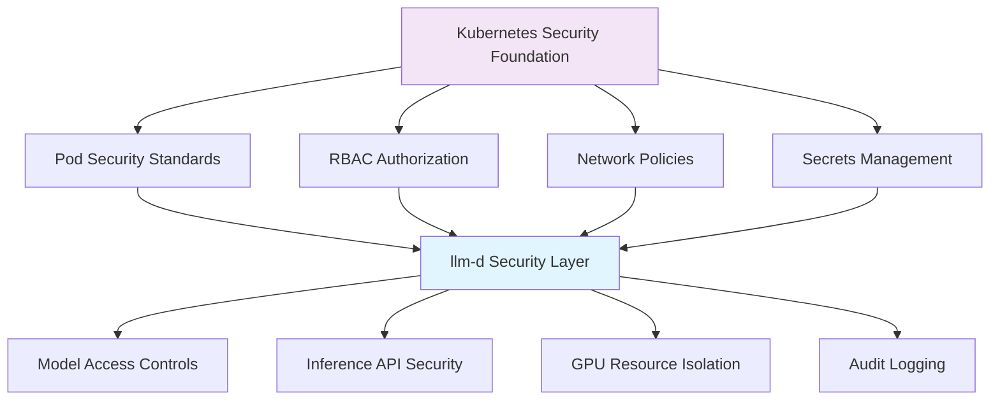

# Security and Compliance

:::info Chapter Overview
This chapter covers essential security controls and compliance considerations for production llm-d deployments. Building on upstream Kubernetes security capabilities, we'll explore identity management, application security, data protection, and basic compliance requirements specific to LLM inference platforms.

**What you'll learn:**
- LLM-specific security challenges and threat vectors
- RBAC configuration patterns for llm-d resources
- API security and prompt injection defenses
- Data protection and privacy controls
- Compliance frameworks (SOC 2, GDPR, HIPAA)
- HashiCorp Vault integration for secrets management
:::

## llm-d Security Overview

### Security Surface Area Analysis

Large Language Model deployment platforms like llm-d present unique security challenges that extend beyond traditional Kubernetes workload security. The 2024-2025 threat landscape has evolved significantly with the emergence of AI-specific attack vectors.

**Primary Security Domains:**

1. **Model Protection**: Preventing model theft, extraction, and unauthorized access to proprietary model weights
2. **Input Validation**: Defending against prompt injection and adversarial inputs that can manipulate model behavior  
3. **Output Filtering**: Ensuring model responses don't leak sensitive information or produce harmful content
4. **Infrastructure Security**: Standard Kubernetes security controls adapted for GPU-intensive ML workloads
5. **API Security**: Protecting inference endpoints from abuse, denial of service, and unauthorized access

**2025 Threat Context:**

Recent security research from Cisco reveals that fine-tuned LLMs are **22x more vulnerable** to producing harmful outputs compared to base models. The emergence of weaponized LLMs like FraudGPT (available for $75/month on the dark web) demonstrates the commercialization of AI-based attacks.

### Integration with Kubernetes Security Model

llm-d leverages Kubernetes' native security primitives while addressing LLM-specific requirements:



**Reference Documentation:**

- [Kubernetes Security Documentation](https://kubernetes.io/docs/concepts/security/)
- [Pod Security Standards](https://kubernetes.io/docs/concepts/security/pod-security-standards/)
- [NIST AI Risk Management Framework (AI RMF 1.0)](https://www.nist.gov/itl/ai-risk-management-framework)

## Identity and Access Management

### RBAC Configuration for llm-d Resources

llm-d extends Kubernetes RBAC to provide fine-grained access control over inference services and model resources. The framework includes three primary roles:

- **Model Operator**: Full control over llm-d resources for platform administrators
- **Data Scientist**: Limited model access for development and experimentation
- **SRE**: Full operational access for production support and monitoring

**Key RBAC Features:**
- Granular permissions for llm-d custom resources
- Namespace-scoped access controls
- Integration with existing identity providers
- Automated role binding for teams and groups

For complete RBAC configuration including ClusterRoles, RoleBindings, and user/group mappings, see:

:::note Configuration Files
📁 **[RBAC Configuration](./security-configs/rbac-configuration.yaml)** - Complete RBAC setup with all roles and bindings
:::

**Quick Setup:**
```bash
kubectl apply -f security-configs/rbac-configuration.yaml
```

### ServiceAccount Management for Inference Workloads

Each inference service should run with a dedicated ServiceAccount following the principle of least privilege. Key security practices include:

- **Dedicated ServiceAccounts** per inference service
- **Minimal permission grants** for specific resources only
- **Disabled automatic token mounting** for security
- **Security context hardening** with non-root users
- **Read-only root filesystem** with writable volumes only where needed

:::note Configuration Files
📁 **[ServiceAccount Management](./security-configs/serviceaccount-management.yaml)** - Complete ServiceAccount patterns with security hardening
:::

**Security Context Best Practices:**
- Run as non-root user (UID 1000+)
- Drop all capabilities
- Use read-only root filesystem
- Enable seccomp profiles

### API Authentication Patterns

llm-d supports multiple authentication mechanisms aligned with Kubernetes standards:

- **JWT Token Validation**: Integration with external identity providers (OAuth2/OIDC)
- **API Key Authentication**: Secure key-based access with rate limiting
- **Basic Authentication**: Simple username/password for development environments
- **mTLS**: Certificate-based authentication for service-to-service communication

**Authentication Flow:**
1. Client presents credentials (JWT, API key, certificate)
2. llm-d validates against configured providers
3. Rate limits applied based on authentication method
4. Request routed to appropriate inference service

The complete authentication configuration includes ingress setup, TLS termination, and rate limiting policies.

### Identity Management Threat Model

**Top 10 Identity and Access Considerations:**

1. **Service Account Token Exposure**: Disable automatic token mounting unless required
2. **RBAC Privilege Escalation**: Use principle of least privilege for all roles
3. **Cross-Namespace Access**: Restrict access between production/development namespaces
4. **API Key Rotation**: Implement automated key rotation policies
5. **Shared Service Accounts**: Avoid using default or shared service accounts
6. **Admin Access Persistence**: Implement time-bound admin access tokens
7. **Third-Party Integration**: Validate external identity provider configurations
8. **Group Membership Management**: Regularly audit group memberships and permissions
9. **Emergency Access**: Maintain break-glass procedures for emergency access
10. **Audit Trail Gaps**: Ensure all authentication events are logged and monitored

**Mitigation Strategies:**

- Regular RBAC reviews and access audits
- Implementation of just-in-time (JIT) access for administrative functions
- Multi-factor authentication for all human access
- Automated detection of suspicious authentication patterns

## Application-Level Security

### Model Protection and Access Controls

Protecting model assets requires both infrastructure and application-level controls. llm-d provides comprehensive model protection through:

- **Model Access Policies**: Fine-grained access control per model and user group
- **Network Isolation**: Kubernetes NetworkPolicies for model server protection
- **Rate Limiting**: Per-user and per-model request rate controls
- **Model Integrity**: Checksum validation and signature verification
- **Audit Logging**: Comprehensive access logging for compliance

**Key Protection Mechanisms:**
- Model servers isolated from external traffic
- Access only through authenticated inference gateway
- Monitoring system health checks allowed
- Egress controls for model downloads and updates

:::note Configuration Files
📁 **[Network Policies](./security-configs/network-policies.yaml)** - Complete network isolation and access control policies
:::

### API Security and Rate Limiting

Protect inference APIs from abuse and resource exhaustion through comprehensive middleware:

**Security Middleware Features:**
- **Token Bucket Rate Limiting**: Per-client request throttling with configurable windows
- **Prompt Injection Detection**: Pattern-based detection of malicious input attempts
- **Input Validation**: Length limits, content filtering, and parameter validation
- **PII Detection**: Automatic detection and redaction of sensitive information
- **Audit Logging**: Comprehensive request logging for security monitoring
- **Blocked Pattern Detection**: Configurable patterns for common attack vectors

**Key Protection Mechanisms:**
- Rate limiting with exponential backoff
- Real-time prompt injection detection
- Automatic sensitive content filtering
- Security event alerting and monitoring
- Integration with FastAPI, Flask, and other Python frameworks

:::note Configuration Files
📁 **[API Security Middleware](./security-configs/api-security-middleware.py)** - Production-ready security middleware with rate limiting and threat detection
:::

**Quick Integration:**
```python
from api_security_middleware import SecurityMiddleware, SecurityConfig

config = SecurityConfig(max_requests_per_minute=60)
middleware = SecurityMiddleware(config)
result = middleware.validate_request(request_data)
```

### Input Validation and Prompt Injection Defense

Implement comprehensive input validation to defend against prompt injection attacks:

**Input Validation Framework:**
- **Length Limits**: Configurable maximum prompt and context lengths
- **Pattern Detection**: Regex-based detection of injection attempts
- **PII Detection**: Automatic detection of sensitive information
- **Rate Limiting**: Per-user and global request throttling
- **Output Filtering**: Response validation and content safety checks

**Common Injection Patterns Detected:**
- System instruction overrides ("ignore previous instructions")
- Jailbreak attempts ("developer mode", "admin mode")  
- Information extraction ("show your training data")
- Role-playing attacks ("act as a different AI")

The validation system integrates with Kubernetes admission controllers to validate InferenceService configurations at deployment time.

### Application Security Threat Model

**Top 10 Application Security Considerations:**

1. **Prompt Injection Attacks**: Malicious prompts designed to manipulate model behavior
2. **Model Extraction**: Attempts to reverse-engineer model capabilities through API queries
3. **Data Exfiltration**: Extracting sensitive information from model training data
4. **Resource Exhaustion**: Large context lengths or complex prompts causing DoS
5. **Output Manipulation**: Crafted inputs producing harmful or biased outputs
6. **API Abuse**: Automated scraping or bulk model queries
7. **Sensitive Data Leakage**: PII or confidential information in prompts or responses
8. **Model Poisoning**: Feedback mechanisms that could influence model behavior
9. **Third-Party Integration Risks**: Vulnerabilities in model serving frameworks
10. **Adversarial Examples**: Inputs designed to cause model misclassification

**Reference**: [OWASP Top 10 for LLMs](https://owasp.org/www-project-top-10-for-large-language-model-applications/)

## Data Protection and Privacy

### Basic Encryption Patterns

Implement encryption for data at rest and in transit:

**Encryption Requirements:**
- **TLS Termination**: All external API traffic encrypted with TLS 1.2+
- **Data at Rest**: Model storage encrypted using cloud provider KMS
- **In-Transit**: Internal service communication over encrypted channels
- **Certificate Management**: Automated certificate rotation and renewal

**Key Management:**
- Cloud provider KMS integration (AWS KMS, GCP Cloud KMS, Azure Key Vault)
- Certificate automation with cert-manager
- Secret rotation policies and procedures
- Hardware Security Module (HSM) support for enterprise deployments

### Model Weight Protection Strategies

Protect valuable model assets from unauthorized access:

**Model Repository Security:**
- **Encrypted Storage**: S3 with SSE-KMS encryption for model files
- **Access Controls**: ServiceAccount-based access restrictions
- **Network Isolation**: IP-based access controls for internal networks
- **Integrity Verification**: Checksum validation and signature verification
- **Audit Logging**: Comprehensive access logging for compliance

**Security Controls:**
- Download rate limiting and concurrent access controls
- Model caching policies and retention management
- Version control and rollback procedures
- Regular security assessments and penetration testing

### User Data Handling Best Practices

Implement privacy controls for user interactions:

**Privacy Control Framework:**
- **Data Minimization**: Collect only necessary data for inference operations
- **PII Detection**: Automatic detection and anonymization of sensitive information
- **Retention Policies**: Configurable data retention periods with automatic cleanup
- **Data Classification**: Multi-tier classification system (Public, Internal, Confidential, Restricted)
- **Anonymization**: Pattern-based replacement of PII with anonymized tokens
- **Audit Logging**: Comprehensive logging of all data processing activities

**Key Features:**
- Email, phone, SSN, and credit card detection
- Configurable retention periods (7-365 days)
- Automatic data expiration and cleanup
- GDPR-compliant data handling procedures
- Session-based anonymization for user tracking

### Data Protection Threat Model

**Top 10 Data Protection Considerations:**

1. **Model Training Data Exposure**: Preventing leakage of training data through model responses
2. **User Query Logging**: Securing stored user prompts and responses
3. **Cross-User Data Leakage**: Ensuring user session isolation and data separation
4. **Model Weight Theft**: Protecting proprietary model files from unauthorized access
5. **Backup Data Security**: Encrypting and securing data backups and snapshots
6. **Third-Party Data Sharing**: Controlling data flow to external services and APIs
7. **Data Residency Compliance**: Ensuring data stays in required geographical locations
8. **Right to Deletion**: Implementing mechanisms for user data deletion requests
9. **Data Minimization**: Collecting and retaining only necessary user data
10. **Encryption Key Management**: Securing encryption keys and rotating them regularly

## Audit Logging and Monitoring

### Kubernetes Audit Logging for llm-d Resources

Configure comprehensive audit logging for llm-d operations:

**Audit Policy Framework:**
- **Request-level logging** for all llm-d custom resources
- **Metadata logging** for secret access in production namespaces
- **RequestResponse logging** for model serving endpoints
- **Authentication event tracking** for all service accounts
- **Selective exclusions** to reduce log volume from routine operations

**Key Audit Capabilities:**
- Complete audit trail for compliance requirements
- Integration with external SIEM systems via webhooks
- Configurable log retention and rotation policies
- Support for multiple audit backends (files, webhooks, external systems)

### Security Alerting and Monitoring

Implement automated security monitoring and alerting through Prometheus rules and AlertManager integration:

**Security Monitoring Components:**
- **Prometheus AlertRules**: Authentication failures, API access anomalies, model access attempts
- **AlertManager Configuration**: Critical alert routing with PagerDuty and email integration  
- **Grafana Dashboards**: Real-time security event visualization and trend analysis
- **Log Aggregation**: Fluentd/Fluent Bit integration for centralized security logging
- **SIEM Integration**: Elasticsearch and external security system connectivity

**Key Security Alerts:**
- High authentication failure rates (>10 failures/5min)
- Unusual API access patterns (>2 requests/sec)
- Unauthorized model access attempts  
- Resource exhaustion attacks (>90% memory usage)
- Prompt injection attempt detection

:::note Configuration Files
📁 **[Security Monitoring](./security-configs/security-monitoring.yaml)** - Complete monitoring, alerting, and dashboard configuration
:::

**Quick Setup:**
```bash
kubectl apply -f security-configs/security-monitoring.yaml
```
```

### Integration with Popular Monitoring Solutions

**Monitoring Stack Integration:**
- **Fluentd/Fluent Bit**: Log aggregation and forwarding to Elasticsearch
- **Elasticsearch**: Security log indexing and search capabilities  
- **Jaeger**: Distributed tracing for security-relevant operations
- **Grafana**: Security dashboard creation and visualization
- **SIEM Integration**: Support for Splunk, QRadar, and other enterprise systems

**Key Integrations:**
- Kubernetes audit log collection and parsing
- llm-d application log processing with security context
- Elasticsearch index templates for efficient security log storage
- Distributed tracing for authentication and model access patterns

### Security Monitoring Threat Model

**Top 10 Monitoring and Detection Considerations:**

1. **Blind Spots in Logging**: Ensuring comprehensive coverage of all security-relevant events
2. **Log Tampering**: Protecting audit logs from modification or deletion
3. **Alert Fatigue**: Balancing sensitivity with actionable alerts
4. **Data Retention**: Meeting compliance requirements for log retention periods
5. **Real-Time Detection**: Minimizing time between attack and detection
6. **False Positives**: Reducing noise while maintaining security coverage
7. **Performance Impact**: Monitoring overhead on inference performance
8. **Correlation Across Systems**: Linking events across multiple system components
9. **Insider Threats**: Detecting malicious activity by privileged users
10. **Supply Chain Monitoring**: Tracking security events in dependencies and integrations

## Compliance Considerations

### SOC 2 Type II Requirements

**Key Security Controls for SOC 2 Compliance:**
- **Access Controls (CC6.1-CC6.3)**: RBAC implementation, MFA enforcement, regular access reviews
- **System Operations (CC7.1-CC7.5)**: Comprehensive logging, change management, security assessments
- **Risk Assessment (CC3.1-CC3.4)**: Annual risk assessments, policy documentation, incident response

### GDPR Privacy Protection

**Essential GDPR Controls for LLM Platforms:**
- **Data Minimization (Article 5.1.c)**: Collect only necessary user data for inference
- **Right to Erasure (Article 17)**: Provide mechanisms for user data deletion
- **Data Protection by Design (Article 25)**: Privacy-preserving model architectures

### HIPAA Compliance for Healthcare AI

**Key Requirements for Healthcare LLM Deployments:**
- **Administrative Safeguards**: Security officer designation, workforce training, incident response
- **Physical Safeguards**: Secure facilities, workstation controls, media disposal
- **Technical Safeguards**: Access controls, encryption, integrity controls for PHI

### ISO 27001 Information Security Management

**Core Components for LLM Platform Security:**
- **Risk Assessment (Clause 6.1.2)**: AI-specific threat modeling and risk treatment
- **Asset Management (Clause 8.1)**: Model inventory and data handling procedures
- **Incident Management (Clause 16.1)**: Response procedures and post-incident analysis

## HashiCorp Vault Integration

### Basic Open Source Vault Setup

Configure HashiCorp Vault for sensitive configuration management:

**Vault Integration Features:**
- **Basic Open Source Deployment**: Single-instance Vault for development and testing
- **Kubernetes Authentication**: Native integration with Kubernetes ServiceAccounts
- **External Secrets Operator**: Automated secret synchronization into Kubernetes
- **Policy-Based Access**: Fine-grained access controls for different secret types
- **Secret Rotation**: Automated credential rotation and renewal

**Managed Secrets:**
- Model repository credentials (AWS, GCP, Azure)
- API keys for external services (HuggingFace, OpenAI)
- TLS certificates and private keys
- Database passwords and connection strings

:::note Configuration Files
📁 **[Vault Integration](./security-configs/vault-integration.yaml)** - Complete Vault deployment and External Secrets configuration  
📁 **[Vault Setup Script](./security-configs/vault-setup.sh)** - Automated Vault configuration and policy setup
:::

### llm-d Integration Patterns

**Secret Management Workflow:**
1. Deploy Vault using provided configuration
2. Run setup script to configure policies and roles  
3. Deploy External Secrets Operator
4. Configure ExternalSecret resources for automatic sync
5. Reference secrets in llm-d deployments

**Quick Setup:**
```bash
kubectl apply -f security-configs/vault-integration.yaml
./security-configs/vault-setup.sh
```

## Summary and Best Practices

### Security Implementation Checklist

**Identity and Access Management:**

- ✅ Implement RBAC with principle of least privilege
- ✅ Use dedicated ServiceAccounts for each inference service
- ✅ Enable multi-factor authentication for administrative access
- ✅ Regular access reviews and permission audits

**Application Security:**

- ✅ Deploy input validation and prompt injection defenses
- ✅ Implement rate limiting and API abuse protection
- ✅ Configure model access controls and isolation
- ✅ Monitor for suspicious usage patterns

**Data Protection:**

- ✅ Encrypt data at rest and in transit
- ✅ Implement data classification and handling procedures
- ✅ Configure automated data retention and purging
- ✅ Protect model weights and intellectual property

**Monitoring and Compliance:**

- ✅ Enable comprehensive audit logging
- ✅ Configure security alerting and incident response
- ✅ Implement compliance controls for relevant frameworks
- ✅ Regular security assessments and penetration testing

### Security Maturity Model

**Level 1 - Basic**: Essential security controls implemented
**Level 2 - Managed**: Automated security processes and monitoring
**Level 3 - Optimized**: Continuous security improvement and threat hunting

### Next Steps

This security foundation enables production deployment of llm-d with appropriate enterprise controls. The next chapter will focus on **Troubleshooting Guide**, providing systematic approaches to diagnosing and resolving common operational issues.

**Chapter 8 Preview: Troubleshooting Guide**

- Decision trees for common issues
- Performance debugging techniques
- Infrastructure problem resolution
- Emergency response procedures

---

**References:**

- [Kubernetes Security Documentation](https://kubernetes.io/docs/concepts/security/)
- [NIST AI Risk Management Framework](https://www.nist.gov/itl/ai-risk-management-framework)
- [OWASP Top 10 for LLMs](https://owasp.org/www-project-top-10-for-large-language-model-applications/)
- [HashiCorp Vault Documentation](https://developer.hashicorp.com/vault/docs)
- [Shared Configuration Reference](./appendix/shared-config.md)
