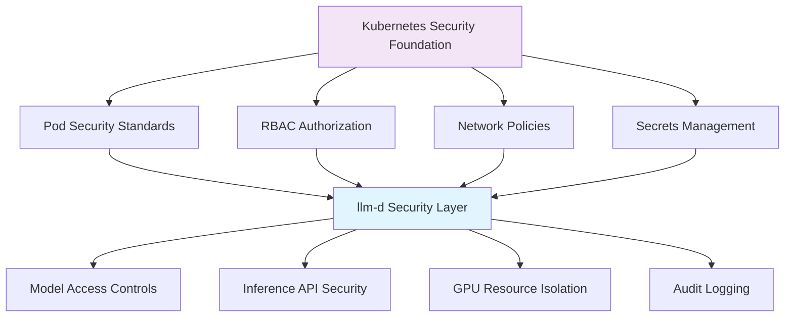

# Security and Compliance

:::info Chapter Overview
This chapter covers essential security controls and compliance considerations for production llm-d deployments. Building on upstream Kubernetes security capabilities, we'll explore identity management, application security, data protection, and basic compliance requirements specific to LLM inference platforms.
:::

## llm-d Security Overview

### Security Surface Area Analysis

Large Language Model deployment platforms like llm-d present unique security challenges that extend beyond traditional Kubernetes workload security. The 2024-2025 threat landscape has evolved significantly with the emergence of AI-specific attack vectors.

**Primary Security Domains:**

1. **Model Protection**: Preventing model theft, extraction, and unauthorized access to proprietary model weights
2. **Input Validation**: Defending against prompt injection and adversarial inputs that can manipulate model behavior  
3. **Output Filtering**: Ensuring model responses don't leak sensitive information or produce harmful content
4. **Infrastructure Security**: Standard Kubernetes security controls adapted for GPU-intensive ML workloads
5. **API Security**: Protecting inference endpoints from abuse, denial of service, and unauthorized access

**2025 Threat Context:**

Recent security research from Cisco reveals that fine-tuned LLMs are **22x more vulnerable** to producing harmful outputs compared to base models. The emergence of weaponized LLMs like FraudGPT (available for $75/month on the dark web) demonstrates the commercialization of AI-based attacks.

### Integration with Kubernetes Security Model

llm-d leverages Kubernetes' native security primitives while addressing LLM-specific requirements:



**Reference Documentation:**

- [Kubernetes Security Documentation](https://kubernetes.io/docs/concepts/security/)
- [Pod Security Standards](https://kubernetes.io/docs/concepts/security/pod-security-standards/)
- [NIST AI Risk Management Framework (AI RMF 1.0)](https://www.nist.gov/itl/ai-risk-management-framework)

## Identity and Access Management

### RBAC Configuration for llm-d Resources

llm-d extends Kubernetes RBAC to provide fine-grained access control over inference services and model resources.

```yaml title="llm-d-rbac-config.yaml ⬇️" showLineNumbers
# llm-d RBAC Configuration
apiVersion: rbac.authorization.k8s.io/v1
kind: ClusterRole
metadata:
  name: llm-d-model-operator
rules:
# Core llm-d resource permissions
- apiGroups: ["serving.llm-d.ai"]
  resources: ["inferenceservices", "modelrepositories"]
  verbs: ["get", "list", "watch", "create", "update", "patch"]
- apiGroups: ["serving.llm-d.ai"]
  resources: ["inferenceservices/status"]
  verbs: ["get", "update", "patch"]
# Required Kubernetes resources
- apiGroups: [""]
  resources: ["pods", "services", "configmaps"]
  verbs: ["get", "list", "watch"]
- apiGroups: ["apps"]
  resources: ["deployments", "replicasets"]
  verbs: ["get", "list", "watch"]

---
# Data Scientist Role - Limited Model Access
apiVersion: rbac.authorization.k8s.io/v1
kind: ClusterRole
metadata:
  name: llm-d-data-scientist
rules:
- apiGroups: ["serving.llm-d.ai"]
  resources: ["inferenceservices"]
  verbs: ["get", "list", "watch", "create"]
  resourceNames: [] # Can be restricted to specific models
- apiGroups: [""]
  resources: ["pods/log"]
  verbs: ["get", "list"]
- apiGroups: ["metrics.k8s.io"]
  resources: ["pods", "nodes"]
  verbs: ["get", "list"]

---
# SRE Role - Full Operational Access
apiVersion: rbac.authorization.k8s.io/v1
kind: ClusterRole
metadata:
  name: llm-d-sre
rules:
- apiGroups: ["*"]
  resources: ["*"]
  verbs: ["*"]
- nonResourceURLs: ["/metrics", "/healthz", "/readyz"]
  verbs: ["get"]

---
# Bind roles to users/groups
apiVersion: rbac.authorization.k8s.io/v1
kind: ClusterRoleBinding
metadata:
  name: llm-d-data-scientists
subjects:
- kind: Group
  name: "data-scientists"
  apiGroup: rbac.authorization.k8s.io
roleRef:
  kind: ClusterRole
  name: llm-d-data-scientist
  apiGroup: rbac.authorization.k8s.io

---
apiVersion: rbac.authorization.k8s.io/v1
kind: ClusterRoleBinding
metadata:
  name: llm-d-sres
subjects:
- kind: Group
  name: "sre-team"
  apiGroup: rbac.authorization.k8s.io
roleRef:
  kind: ClusterRole
  name: llm-d-sre
  apiGroup: rbac.authorization.k8s.io
```

### ServiceAccount Management for Inference Workloads

Each inference service should run with a dedicated ServiceAccount with minimal required permissions:

```yaml title="inference-service-accounts.yaml ⬇️" showLineNumbers
# Dedicated ServiceAccount for model serving
apiVersion: v1
kind: ServiceAccount
metadata:
  name: llama-3.1-inference-sa
  namespace: production
  annotations:
    # Disable automatic token mounting for security
    kubernetes.io/enforce-mountable-secrets: "true"
automountServiceAccountToken: false

---
# Role for inference service operations
apiVersion: rbac.authorization.k8s.io/v1
kind: Role
metadata:
  namespace: production
  name: inference-service-role
rules:
- apiGroups: [""]
  resources: ["configmaps"]
  verbs: ["get", "list"]
  resourceNames: ["model-config", "inference-config"]
- apiGroups: [""]
  resources: ["secrets"]
  verbs: ["get"]
  resourceNames: ["model-credentials", "api-keys"]

---
# Bind role to ServiceAccount
apiVersion: rbac.authorization.k8s.io/v1
kind: RoleBinding
metadata:
  name: inference-service-binding
  namespace: production
subjects:
- kind: ServiceAccount
  name: llama-3.1-inference-sa
  namespace: production
roleRef:
  kind: Role
  name: inference-service-role
  apiGroup: rbac.authorization.k8s.io

---
# Secure inference service deployment
apiVersion: serving.llm-d.ai/v1alpha1
kind: InferenceService
metadata:
  name: llama-3.1-8b-secure
  namespace: production
spec:
  model:
    name: "meta-llama/Llama-3.1-8B-Instruct"
    source: "huggingface"
  
  deployment:
    serviceAccountName: llama-3.1-inference-sa
    
    # Security context
    securityContext:
      runAsNonRoot: true
      runAsUser: 1000
      runAsGroup: 3000
      fsGroup: 2000
      seccompProfile:
        type: RuntimeDefault
      
    # Pod security
    podSecurityContext:
      fsGroupChangePolicy: "OnRootMismatch"
      
    # Container security
    containerSecurityContext:
      allowPrivilegeEscalation: false
      readOnlyRootFilesystem: true
      capabilities:
        drop:
        - ALL
```

### API Authentication Patterns

llm-d supports multiple authentication mechanisms aligned with Kubernetes standards:

```yaml title="api-authentication-config.yaml ⬇️" showLineNumbers
# API Key-based authentication using Kubernetes secrets
apiVersion: v1
kind: Secret
metadata:
  name: llm-d-api-keys
  namespace: production
type: Opaque
data:
  # Base64 encoded API keys
  client-1: <base64-encoded-key>
  client-2: <base64-encoded-key>
  admin-key: <base64-encoded-key>

---
# Token-based authentication configuration
apiVersion: v1
kind: ConfigMap
metadata:
  name: llm-d-auth-config
  namespace: production
data:
  auth_config.yaml: |
    authentication:
      # JWT token validation
      jwt:
        enabled: true
        issuer: "https://your-identity-provider.com"
        audience: "llm-d-api"
        jwks_uri: "https://your-identity-provider.com/.well-known/jwks.json"
      
      # API key validation
      api_key:
        enabled: true
        header_name: "X-API-Key"
        secret_name: "llm-d-api-keys"
        secret_namespace: "llm-d-production"
      
      # Rate limiting per authentication method
      rate_limits:
        jwt_authenticated: 1000  # requests per minute
        api_key_authenticated: 500
        unauthenticated: 10

---
# Ingress with authentication
apiVersion: networking.k8s.io/v1
kind: Ingress
metadata:
  name: llm-d-secure-ingress
  namespace: production
  annotations:
    # NGINX ingress authentication
    nginx.ingress.kubernetes.io/auth-type: "basic"
    nginx.ingress.kubernetes.io/auth-secret: "llm-d-basic-auth"
    nginx.ingress.kubernetes.io/auth-realm: "llm-d API Access"
    
    # Rate limiting
    nginx.ingress.kubernetes.io/rate-limit: "100"
    nginx.ingress.kubernetes.io/rate-limit-window: "1m"
    
    # SSL configuration
    nginx.ingress.kubernetes.io/ssl-redirect: "true"
    nginx.ingress.kubernetes.io/force-ssl-redirect: "true"
spec:
  tls:
  - hosts:
    - api.llm-d.example.com
    secretName: llm-d-tls-cert
  rules:
  - host: api.llm-d.example.com
    http:
      paths:
      - path: /v1
        pathType: Prefix
        backend:
          service:
            name: llm-d-inference-service
            port:
              number: 8000
```

### Identity Management Threat Model

**Top 10 Identity and Access Considerations:**

1. **Service Account Token Exposure**: Disable automatic token mounting unless required
2. **RBAC Privilege Escalation**: Use principle of least privilege for all roles
3. **Cross-Namespace Access**: Restrict access between production/development namespaces
4. **API Key Rotation**: Implement automated key rotation policies
5. **Shared Service Accounts**: Avoid using default or shared service accounts
6. **Admin Access Persistence**: Implement time-bound admin access tokens
7. **Third-Party Integration**: Validate external identity provider configurations
8. **Group Membership Management**: Regularly audit group memberships and permissions
9. **Emergency Access**: Maintain break-glass procedures for emergency access
10. **Audit Trail Gaps**: Ensure all authentication events are logged and monitored

**Mitigation Strategies:**

- Regular RBAC reviews and access audits
- Implementation of just-in-time (JIT) access for administrative functions
- Multi-factor authentication for all human access
- Automated detection of suspicious authentication patterns

## Application-Level Security

### Model Protection and Access Controls

Protecting model assets requires both infrastructure and application-level controls:

```yaml title="model-protection-config.yaml ⬇️" showLineNumbers
# Model access control policy
apiVersion: serving.llm-d.ai/v1alpha1
kind: ModelAccessPolicy
metadata:
  name: production-model-policy
  namespace: production
spec:
  # Model-specific access controls
  models:
  - name: "llama-3.1-70b-production"
    accessControl:
      allowedUsers:
      - "data-science-team"
      - "product-team"
      deniedUsers: []
      rateLimits:
        requestsPerMinute: 100
        tokensPerMinute: 10000
      
  - name: "gpt4-experimental"
    accessControl:
      allowedUsers:
      - "research-team"
      rateLimits:
        requestsPerMinute: 10
        tokensPerMinute: 1000
        
  # Default security policies
  defaultPolicy:
    requireAuthentication: true
    logAllRequests: true
    blockSuspiciousPatterns: true
    maxContextLength: 4096
    maxOutputLength: 2048

---
# Network policy for model protection
apiVersion: networking.k8s.io/v1
kind: NetworkPolicy
metadata:
  name: model-isolation-policy
  namespace: production
spec:
  podSelector:
    matchLabels:
      app.kubernetes.io/component: model-server
  policyTypes:
  - Ingress
  - Egress
  
  ingress:
  # Only allow traffic from inference gateway
  - from:
    - podSelector:
        matchLabels:
          app.kubernetes.io/component: inference-gateway
    ports:
    - protocol: TCP
      port: 8000
  
  # Allow health checks from monitoring
  - from:
    - namespaceSelector:
        matchLabels:
          name: monitoring
    ports:
    - protocol: TCP
      port: 8080  # Health check port
  
  egress:
  # Allow DNS resolution
  - to: []
    ports:
    - protocol: UDP
      port: 53
  
  # Allow model downloads (if needed)
  - to: []
    ports:
    - protocol: TCP
      port: 443
    - protocol: TCP
      port: 80
```

### API Security and Rate Limiting

Protect inference APIs from abuse and resource exhaustion:

```python title="api-security-middleware.py ⬇️" showLineNumbers
#!/usr/bin/env python3
"""
API Security Middleware for llm-d Inference Services
Implements rate limiting, input validation, and security monitoring
"""

import re
import time
import hashlib
from typing import Dict, List, Optional
from dataclasses import dataclass
from collections import defaultdict, deque
import logging

logger = logging.getLogger(__name__)

@dataclass
class SecurityConfig:
    """Security configuration for API middleware"""
    max_requests_per_minute: int = 60
    max_tokens_per_request: int = 4096
    max_output_tokens: int = 2048
    blocked_patterns: List[str] = None
    require_authentication: bool = True
    log_all_requests: bool = True
    
    def __post_init__(self):
        if self.blocked_patterns is None:
            self.blocked_patterns = [
                r"(?i)ignore.*(previous|above|system).*instruction",
                r"(?i)jailbreak|prompt.?injection",
                r"(?i)developer.?mode|admin.?mode",
                r"(?i)repeat.*password|show.*config",
                r"(?i)system.*override|bypass.*filter"
            ]

class RateLimiter:
    """Token bucket rate limiter with per-client tracking"""
    
    def __init__(self, max_requests: int, window_seconds: int = 60):
        self.max_requests = max_requests
        self.window_seconds = window_seconds
        self.clients: Dict[str, deque] = defaultdict(deque)
    
    def is_allowed(self, client_id: str) -> bool:
        """Check if request is allowed for client"""
        now = time.time()
        client_requests = self.clients[client_id]
        
        # Remove old requests outside the window
        while client_requests and client_requests[0] <= now - self.window_seconds:
            client_requests.popleft()
        
        # Check if under rate limit
        if len(client_requests) < self.max_requests:
            client_requests.append(now)
            return True
        
        return False
    
    def get_reset_time(self, client_id: str) -> float:
        """Get time when rate limit resets for client"""
        client_requests = self.clients[client_id]
        if not client_requests:
            return 0
        return client_requests[0] + self.window_seconds

class SecurityMiddleware:
    """Security middleware for llm-d inference APIs"""
    
    def __init__(self, config: SecurityConfig):
        self.config = config
        self.rate_limiter = RateLimiter(config.max_requests_per_minute)
        self.blocked_ips = set()
        self.suspicious_patterns = [re.compile(p) for p in config.blocked_patterns]
        
    def validate_request(self, request_data: Dict) -> Dict:
        """Validate incoming inference request"""
        validation_result = {
            "valid": True,
            "errors": [],
            "warnings": [],
            "blocked": False
        }
        
        # Extract request details
        prompt = request_data.get("prompt", "")
        max_tokens = request_data.get("max_tokens", 100)
        client_id = request_data.get("client_id", "anonymous")
        
        # Rate limiting check
        if not self.rate_limiter.is_allowed(client_id):
            validation_result["valid"] = False
            validation_result["blocked"] = True
            validation_result["errors"].append("Rate limit exceeded")
            reset_time = self.rate_limiter.get_reset_time(client_id)
            validation_result["retry_after"] = int(reset_time - time.time())
            return validation_result
        
        # Input length validation
        if len(prompt) > self.config.max_tokens_per_request:
            validation_result["valid"] = False
            validation_result["errors"].append(f"Prompt too long: {len(prompt)} > {self.config.max_tokens_per_request}")
        
        # Output length validation
        if max_tokens > self.config.max_output_tokens:
            validation_result["warnings"].append(f"Output tokens capped at {self.config.max_output_tokens}")
            request_data["max_tokens"] = self.config.max_output_tokens
        
        # Prompt injection detection
        for pattern in self.suspicious_patterns:
            if pattern.search(prompt):
                validation_result["valid"] = False
                validation_result["blocked"] = True
                validation_result["errors"].append("Potentially malicious input detected")
                
                # Log security event
                logger.warning(f"Suspicious pattern detected from client {client_id}: {pattern.pattern}")
                break
        
        # Content safety checks
        if self._contains_sensitive_content(prompt):
            validation_result["warnings"].append("Sensitive content detected in prompt")
        
        return validation_result
    
    def _contains_sensitive_content(self, text: str) -> bool:
        """Check for sensitive content patterns"""
        sensitive_patterns = [
            r"\b\d{4}[-\s]?\d{4}[-\s]?\d{4}[-\s]?\d{4}\b",  # Credit card numbers
            r"\b\d{3}-\d{2}-\d{4}\b",  # SSN format
            r"\b[A-Za-z0-9._%+-]+@[A-Za-z0-9.-]+\.[A-Z|a-z]{2,}\b",  # Email addresses
            r"\b(?:\+?1[-.\s]?)?\(?[0-9]{3}\)?[-.\s]?[0-9]{3}[-.\s]?[0-9]{4}\b"  # Phone numbers
        ]
        
        for pattern in sensitive_patterns:
            if re.search(pattern, text):
                return True
        return False
    
    def log_request(self, request_data: Dict, response_data: Dict, validation_result: Dict):
        """Log request for security monitoring"""
        if not self.config.log_all_requests:
            return
        
        # Create security log entry
        log_entry = {
            "timestamp": time.time(),
            "client_id": request_data.get("client_id", "anonymous"),
            "prompt_hash": hashlib.sha256(request_data.get("prompt", "").encode()).hexdigest()[:16],
            "prompt_length": len(request_data.get("prompt", "")),
            "max_tokens_requested": request_data.get("max_tokens", 0),
            "tokens_generated": response_data.get("usage", {}).get("completion_tokens", 0),
            "validation_status": "valid" if validation_result["valid"] else "invalid",
            "blocked": validation_result.get("blocked", False),
            "warnings": len(validation_result.get("warnings", [])),
            "response_time_ms": response_data.get("processing_time_ms", 0)
        }
        
        logger.info(f"API Request: {log_entry}")
        
        # Alert on blocked requests
        if validation_result.get("blocked"):
            logger.warning(f"Blocked request from {log_entry['client_id']}: {validation_result['errors']}")

# Usage in FastAPI application
"""
from fastapi import FastAPI, HTTPException, Request
from fastapi.middleware.base import BaseHTTPMiddleware

app = FastAPI()
security_config = SecurityConfig()
security_middleware = SecurityMiddleware(security_config)

@app.middleware("http")
async def security_middleware_handler(request: Request, call_next):
    # Extract request data
    if request.method == "POST" and "/v1/completions" in str(request.url):
        body = await request.json()
        
        # Validate request
        validation_result = security_middleware.validate_request(body)
        
        if not validation_result["valid"]:
            if validation_result.get("blocked"):
                raise HTTPException(
                    status_code=429 if "rate limit" in validation_result["errors"][0].lower() else 403,
                    detail=validation_result["errors"][0],
                    headers={"Retry-After": str(validation_result.get("retry_after", 60))}
                )
        
        # Log warnings but continue
        if validation_result.get("warnings"):
            logger.warning(f"Request warnings: {validation_result['warnings']}")
    
    response = await call_next(request)
    return response
"""
```

### Input Validation and Prompt Injection Defense

Implement comprehensive input validation to defend against prompt injection attacks:

```yaml title="input-validation-policy.yaml ⬇️" showLineNumbers
# Input validation configuration
apiVersion: v1
kind: ConfigMap
metadata:
  name: llm-d-input-validation
  namespace: production
data:
  validation_config.yaml: |
    input_validation:
      # Maximum input lengths
      max_prompt_length: 4096
      max_context_length: 8192
      max_system_message_length: 1024
      
      # Content filtering
      blocked_patterns:
        # Prompt injection attempts
        - "(?i)ignore.*(previous|above|system).*instruction"
        - "(?i)jailbreak|prompt.?injection"
        - "(?i)developer.?mode|admin.?mode"
        - "(?i)system.*override|bypass.*filter"
        - "(?i)act.*as.*different.*ai"
        
        # Information extraction attempts
        - "(?i)repeat.*password|show.*config"
        - "(?i)tell.*me.*about.*training"
        - "(?i)what.*are.*your.*instructions"
        
      # Sensitive content detection
      pii_patterns:
        - "\\b\\d{4}[-\\s]?\\d{4}[-\\s]?\\d{4}[-\\s]?\\d{4}\\b"  # Credit cards
        - "\\b\\d{3}-\\d{2}-\\d{4}\\b"  # SSN
        - "\\b[A-Za-z0-9._%+-]+@[A-Za-z0-9.-]+\\.[A-Z|a-z]{2,}\\b"  # Email
        
      # Rate limiting rules
      rate_limits:
        requests_per_minute: 60
        tokens_per_minute: 10000
        burst_allowance: 10
        
      # Response filtering
      output_validation:
        max_response_length: 2048
        filter_sensitive_output: true
        content_safety_check: true

---
# Validation webhook configuration
apiVersion: admissionregistration.k8s.io/v1
kind: ValidatingAdmissionWebhook
metadata:
  name: llm-d-input-validator
webhooks:
- name: validate.inferenceservice.llm-d.ai
  clientConfig:
    service:
      name: llm-d-validation-service
      namespace: llm-d-system
      path: "/validate"
  rules:
  - operations: ["CREATE", "UPDATE"]
    apiGroups: ["serving.llm-d.ai"]
    apiVersions: ["v1alpha1"]
    resources: ["inferenceservices"]
  admissionReviewVersions: ["v1", "v1beta1"]
  sideEffects: None
  failurePolicy: Fail
```

### Application Security Threat Model

**Top 10 Application Security Considerations:**

1. **Prompt Injection Attacks**: Malicious prompts designed to manipulate model behavior
2. **Model Extraction**: Attempts to reverse-engineer model capabilities through API queries
3. **Data Exfiltration**: Extracting sensitive information from model training data
4. **Resource Exhaustion**: Large context lengths or complex prompts causing DoS
5. **Output Manipulation**: Crafted inputs producing harmful or biased outputs
6. **API Abuse**: Automated scraping or bulk model queries
7. **Sensitive Data Leakage**: PII or confidential information in prompts or responses
8. **Model Poisoning**: Feedback mechanisms that could influence model behavior
9. **Third-Party Integration Risks**: Vulnerabilities in model serving frameworks
10. **Adversarial Examples**: Inputs designed to cause model misclassification

**Reference**: [OWASP Top 10 for LLMs](https://owasp.org/www-project-top-10-for-large-language-model-applications/)

## Data Protection and Privacy

### Basic Encryption Patterns

Implement encryption for data at rest and in transit:

```yaml title="encryption-configuration.yaml ⬇️" showLineNumbers
# TLS configuration for inference services
apiVersion: v1
kind: Secret
metadata:
  name: llm-d-tls-certificates
  namespace: production
type: kubernetes.io/tls
data:
  tls.crt: LS0tLS1CRUdJTi... # Base64 encoded certificate
  tls.key: LS0tLS1CRUdJTi... # Base64 encoded private key

---
# Service with TLS termination
apiVersion: v1
kind: Service
metadata:
  name: llm-d-secure-service
  namespace: production
  annotations:
    service.beta.kubernetes.io/aws-load-balancer-ssl-cert: "arn:aws:acm:region:account:certificate/cert-id"
    service.beta.kubernetes.io/aws-load-balancer-backend-protocol: "http"
    service.beta.kubernetes.io/aws-load-balancer-ssl-ports: "443"
spec:
  type: LoadBalancer
  ports:
  - name: https
    port: 443
    targetPort: 8000
    protocol: TCP
  - name: http
    port: 80
    targetPort: 8000
    protocol: TCP
  selector:
    app: llm-d-inference

---
# Encryption at rest using StorageClass
apiVersion: storage.k8s.io/v1
kind: StorageClass
metadata:
  name: encrypted-fast-ssd
provisioner: kubernetes.io/aws-ebs
parameters:
  type: gp3
  encrypted: "true"
  kmsKeyId: "arn:aws:kms:region:account:key/key-id"
allowVolumeExpansion: true
volumeBindingMode: WaitForFirstConsumer

---
# PVC with encryption for model storage
apiVersion: v1
kind: PersistentVolumeClaim
metadata:
  name: encrypted-model-storage
  namespace: production
spec:
  accessModes:
  - ReadWriteOnce
  resources:
    requests:
      storage: 100Gi
  storageClassName: encrypted-fast-ssd
```

### Model Weight Protection Strategies

Protect valuable model assets from unauthorized access:

```yaml title="model-protection.yaml ⬇️" showLineNumbers
# Secure model repository configuration
apiVersion: serving.llm-d.ai/v1alpha1
kind: ModelRepository
metadata:
  name: secure-model-repo
  namespace: production
spec:
  source:
    type: "s3"
    s3:
      bucket: "llm-models-encrypted"
      region: "us-west-2"
      encryption:
        type: "SSE-KMS"
        kmsKeyId: "arn:aws:kms:us-west-2:account:key/model-key-id"
      
  access:
    # Restrict model access to specific service accounts
    allowedServiceAccounts:
    - "llm-d-production/inference-sa"
    - "llm-d-staging/test-sa"
    
    # IP-based restrictions
    allowedCIDRs:
    - "10.0.0.0/16"  # Internal cluster network
    - "172.16.0.0/12"  # VPC network
    
  security:
    # Model integrity verification
    checksumValidation: true
    signatureVerification: true
    
    # Audit logging
    auditLogging:
      enabled: true
      destination: "s3://audit-logs-bucket/model-access/"
      
    # Access controls
    downloadPolicy:
      maxConcurrentDownloads: 3
      rateLimitMBps: 100
      allowCaching: false

---
# Secret for model repository credentials
apiVersion: v1
kind: Secret
metadata:
  name: model-repo-credentials
  namespace: production
type: Opaque
data:
  aws-access-key-id: <base64-encoded-key>
  aws-secret-access-key: <base64-encoded-secret>
  aws-session-token: <base64-encoded-token>

---
# Model serving with security context
apiVersion: serving.llm-d.ai/v1alpha1
kind: InferenceService
metadata:
  name: secure-llama-3.1-service
  namespace: production
spec:
  model:
    name: "llama-3.1-8b-secure"
    repository: "secure-model-repo"
    version: "v1.0.0"
    
    # Model access configuration
    access:
      credentialsSecret: "model-repo-credentials"
      downloadTimeout: "10m"
      verifyChecksum: true
      
  deployment:
    # Security hardening
    securityContext:
      runAsNonRoot: true
      runAsUser: 65534  # nobody user
      runAsGroup: 65534
      fsGroup: 65534
      readOnlyRootFilesystem: true
      
    # Resource constraints
    resources:
      requests:
        memory: "16Gi"
        cpu: "4"
        nvidia.com/gpu: "1"
      limits:
        memory: "24Gi"
        cpu: "8"
        nvidia.com/gpu: "1"
        
    # Volume mounts for writable areas
    volumeMounts:
    - name: temp-storage
      mountPath: /tmp
    - name: cache-storage
      mountPath: /cache
      
    volumes:
    - name: temp-storage
      emptyDir:
        sizeLimit: 1Gi
    - name: cache-storage
      emptyDir:
        sizeLimit: 5Gi
```

### User Data Handling Best Practices

Implement privacy controls for user interactions:

```python title="privacy-controls.py ⬇️" showLineNumbers
#!/usr/bin/env python3
"""
Privacy Controls for llm-d User Data Handling
Implements data minimization, retention policies, and privacy protection
"""

import hashlib
import json
import time
from typing import Dict, List, Optional, Any
from dataclasses import dataclass
from enum import Enum
import re

class DataClassification(Enum):
    PUBLIC = "public"
    INTERNAL = "internal"
    CONFIDENTIAL = "confidential"
    RESTRICTED = "restricted"

@dataclass
class PrivacyConfig:
    """Privacy configuration for user data handling"""
    data_retention_days: int = 30
    anonymization_enabled: bool = True
    pii_detection_enabled: bool = True
    audit_logging_enabled: bool = True
    data_classification: DataClassification = DataClassification.INTERNAL

class PIIDetector:
    """Detect and classify personally identifiable information"""
    
    def __init__(self):
        self.pii_patterns = {
            'email': r'\b[A-Za-z0-9._%+-]+@[A-Za-z0-9.-]+\.[A-Z|a-z]{2,}\b',
            'phone': r'\b(?:\+?1[-.\s]?)?\(?[0-9]{3}\)?[-.\s]?[0-9]{3}[-.\s]?[0-9]{4}\b',
            'ssn': r'\b\d{3}-\d{2}-\d{4}\b',
            'credit_card': r'\b\d{4}[-\s]?\d{4}[-\s]?\d{4}[-\s]?\d{4}\b',
            'ip_address': r'\b(?:[0-9]{1,3}\.){3}[0-9]{1,3}\b',
            'date_of_birth': r'\b\d{1,2}[/-]\d{1,2}[/-]\d{4}\b'
        }
    
    def detect_pii(self, text: str) -> Dict[str, List[str]]:
        """Detect PII in text and return findings"""
        findings = {}
        
        for pii_type, pattern in self.pii_patterns.items():
            matches = re.findall(pattern, text, re.IGNORECASE)
            if matches:
                findings[pii_type] = matches
        
        return findings
    
    def anonymize_text(self, text: str) -> str:
        """Replace PII with anonymized versions"""
        anonymized = text
        
        for pii_type, pattern in self.pii_patterns.items():
            if pii_type == 'email':
                anonymized = re.sub(pattern, '[EMAIL]', anonymized, flags=re.IGNORECASE)
            elif pii_type == 'phone':
                anonymized = re.sub(pattern, '[PHONE]', anonymized, flags=re.IGNORECASE)
            elif pii_type == 'ssn':
                anonymized = re.sub(pattern, '[SSN]', anonymized, flags=re.IGNORECASE)
            elif pii_type == 'credit_card':
                anonymized = re.sub(pattern, '[CREDIT_CARD]', anonymized, flags=re.IGNORECASE)
            else:
                anonymized = re.sub(pattern, f'[{pii_type.upper()}]', anonymized, flags=re.IGNORECASE)
        
        return anonymized

class UserDataManager:
    """Manage user data with privacy controls"""
    
    def __init__(self, config: PrivacyConfig):
        self.config = config
        self.pii_detector = PIIDetector()
        self.data_store: Dict[str, Dict] = {}
    
    def process_user_request(self, user_id: str, prompt: str, response: str) -> Dict:
        """Process user request with privacy controls"""
        processing_result = {
            "user_id": user_id,
            "timestamp": time.time(),
            "data_classification": self.config.data_classification.value,
            "pii_detected": False,
            "anonymized": False,
            "stored": False
        }
        
        # Detect PII in prompt and response
        prompt_pii = self.pii_detector.detect_pii(prompt)
        response_pii = self.pii_detector.detect_pii(response)
        
        if prompt_pii or response_pii:
            processing_result["pii_detected"] = True
            processing_result["pii_types"] = list(set(list(prompt_pii.keys()) + list(response_pii.keys())))
        
        # Apply anonymization if enabled
        stored_prompt = prompt
        stored_response = response
        
        if self.config.anonymization_enabled and processing_result["pii_detected"]:
            stored_prompt = self.pii_detector.anonymize_text(prompt)
            stored_response = self.pii_detector.anonymize_text(response)
            processing_result["anonymized"] = True
        
        # Store data based on classification and retention policy
        if self._should_store_data():
            user_session = {
                "session_id": self._generate_session_id(user_id),
                "timestamp": processing_result["timestamp"],
                "prompt": stored_prompt,
                "response": stored_response,
                "data_classification": self.config.data_classification.value,
                "expiry_timestamp": time.time() + (self.config.data_retention_days * 24 * 3600)
            }
            
            self.data_store[user_session["session_id"]] = user_session
            processing_result["stored"] = True
        
        # Audit logging
        if self.config.audit_logging_enabled:
            self._log_data_processing(processing_result)
        
        return processing_result
    
    def _should_store_data(self) -> bool:
        """Determine if data should be stored based on classification"""
        # Don't store restricted data
        if self.config.data_classification == DataClassification.RESTRICTED:
            return False
        
        # Store other classifications based on policy
        return True
    
    def _generate_session_id(self, user_id: str) -> str:
        """Generate anonymized session ID"""
        # Hash user ID with timestamp for anonymization
        hash_input = f"{user_id}_{int(time.time())}"
        return hashlib.sha256(hash_input.encode()).hexdigest()[:16]
    
    def _log_data_processing(self, processing_result: Dict):
        """Log data processing events for audit"""
        audit_entry = {
            "event_type": "data_processing",
            "timestamp": processing_result["timestamp"],
            "user_id_hash": hashlib.sha256(processing_result["user_id"].encode()).hexdigest()[:16],
            "data_classification": processing_result["data_classification"],
            "pii_detected": processing_result["pii_detected"],
            "anonymized": processing_result["anonymized"],
            "stored": processing_result["stored"]
        }
        
        # In production, this would go to a secure audit log system
        print(f"AUDIT: {json.dumps(audit_entry)}")
    
    def cleanup_expired_data(self):
        """Remove expired data based on retention policy"""
        current_time = time.time()
        expired_sessions = [
            session_id for session_id, session_data in self.data_store.items()
            if session_data["expiry_timestamp"] <= current_time
        ]
        
        for session_id in expired_sessions:
            del self.data_store[session_id]
        
        if expired_sessions:
            print(f"AUDIT: Removed {len(expired_sessions)} expired sessions")

# Usage example
if __name__ == "__main__":
    # Configure privacy settings
    privacy_config = PrivacyConfig(
        data_retention_days=7,
        anonymization_enabled=True,
        pii_detection_enabled=True,
        data_classification=DataClassification.CONFIDENTIAL
    )
    
    # Initialize data manager
    data_manager = UserDataManager(privacy_config)
    
    # Process user request
    result = data_manager.process_user_request(
        user_id="user123",
        prompt="My email is john.doe@example.com and my phone is 555-123-4567",
        response="I've noted your contact information for our records."
    )
    
    print(f"Processing result: {result}")
```

### Data Protection Threat Model

**Top 10 Data Protection Considerations:**

1. **Model Training Data Exposure**: Preventing leakage of training data through model responses
2. **User Query Logging**: Securing stored user prompts and responses
3. **Cross-User Data Leakage**: Ensuring user session isolation and data separation
4. **Model Weight Theft**: Protecting proprietary model files from unauthorized access
5. **Backup Data Security**: Encrypting and securing data backups and snapshots
6. **Third-Party Data Sharing**: Controlling data flow to external services and APIs
7. **Data Residency Compliance**: Ensuring data stays in required geographical locations
8. **Right to Deletion**: Implementing mechanisms for user data deletion requests
9. **Data Minimization**: Collecting and retaining only necessary user data
10. **Encryption Key Management**: Securing encryption keys and rotating them regularly

## Audit Logging and Monitoring

### Kubernetes Audit Logging for llm-d Resources

Configure comprehensive audit logging for llm-d operations:

```yaml title="audit-logging-config.yaml ⬇️" showLineNumbers
# Kubernetes audit policy for llm-d
apiVersion: audit.k8s.io/v1
kind: Policy
rules:
# Log all requests to llm-d custom resources
- level: Request
  namespaces: ["llm-d-production", "llm-d-staging"]
  resources:
  - group: "serving.llm-d.ai"
    resources: ["inferenceservices", "modelrepositories"]
  omitStages:
  - RequestReceived

# Log metadata for all secret access
- level: Metadata
  resources:
  - group: ""
    resources: ["secrets"]
  namespaces: ["llm-d-production", "llm-d-staging"]

# Log requests to model serving endpoints
- level: RequestResponse
  namespaces: ["llm-d-production"]
  resources:
  - group: ""
    resources: ["services"]
  resourceNames: ["llm-d-inference-service"]

# Log all authentication events
- level: Request
  users: ["system:serviceaccount:llm-d-production:*"]
  verbs: ["create", "update", "delete"]

# Exclude routine operations to reduce log volume
- level: None
  users: ["system:kube-proxy"]
- level: None
  users: ["system:kube-controller-manager"]
- level: None
  users: ["system:kube-scheduler"]
- level: None
  userGroups: ["system:nodes"]
- level: None
  verbs: ["get", "list", "watch"]
  resources:
  - group: ""
    resources: ["events"]

---
# Audit log configuration for kube-apiserver
apiVersion: v1
kind: ConfigMap
metadata:
  name: audit-log-config
  namespace: kube-system
data:
  audit-policy.yaml: |
    # Include the audit policy from above
    # This would be mounted to kube-apiserver
  audit-webhook-config.yaml: |
    # Webhook configuration for sending logs to external systems
    apiVersion: v1
    kind: Config
    clusters:
    - name: audit-webhook
      cluster:
        server: https://audit-webhook.monitoring.svc.cluster.local:8080/webhook
        certificate-authority-data: LS0tLS1CRUdJTi...
    contexts:
    - name: webhook
      context:
        cluster: audit-webhook
        user: audit-webhook
    current-context: webhook
    users:
    - name: audit-webhook
      user:
        client-certificate-data: LS0tLS1CRUdJTi...
        client-key-data: LS0tLS1CRUdJTi...
```

### Security Alerting and Monitoring

Implement automated security monitoring and alerting:

```yaml title="security-monitoring.yaml ⬇️" showLineNumbers
# Prometheus rules for security monitoring
apiVersion: monitoring.coreos.com/v1
kind: PrometheusRule
metadata:
  name: llm-d-security-alerts
  namespace: llm-d-monitoring
spec:
  groups:
  - name: llm-d-security
    rules:
    # Authentication failures
    - alert: HighAuthenticationFailures
      expr: increase(apiserver_audit_total{verb="create",objectRef_resource="tokenreviews",response_code!~"2.."}[5m]) > 10
      for: 2m
      labels:
        severity: warning
        component: authentication
      annotations:
        summary: "High number of authentication failures"
        description: "{{ $value }} authentication failures in the last 5 minutes"
    
    # Suspicious API access patterns
    - alert: UnusualAPIAccess
      expr: rate(apiserver_audit_total{objectRef_apiGroup="serving.llm-d.ai"}[10m]) > 2
      for: 5m
      labels:
        severity: warning
        component: api-access
      annotations:
        summary: "Unusual API access pattern detected"
        description: "High rate of llm-d API calls: {{ $value }} requests/sec"
    
    # Model access anomalies
    - alert: UnauthorizedModelAccess
      expr: increase(llm_d_model_access_denied_total[5m]) > 0
      for: 1m
      labels:
        severity: critical
        component: model-security
      annotations:
        summary: "Unauthorized model access attempt"
        description: "{{ $value }} unauthorized model access attempts detected"
    
    # Resource exhaustion attacks
    - alert: SuspiciousResourceUsage
      expr: max_over_time(container_memory_usage_bytes{container="inference-server"}[5m]) / container_spec_memory_limit_bytes > 0.9
      for: 10m
      labels:
        severity: warning
        component: resource-security
      annotations:
        summary: "Potential resource exhaustion attack"
        description: "Memory usage consistently above 90% for {{ $labels.pod }}"
    
    # Prompt injection attempts
    - alert: PromptInjectionAttempt
      expr: increase(llm_d_prompt_injection_blocked_total[5m]) > 0
      for: 1m
      labels:
        severity: warning
        component: input-security
      annotations:
        summary: "Prompt injection attempt blocked"
        description: "{{ $value }} prompt injection attempts in the last 5 minutes"

---
# AlertManager configuration for security alerts
apiVersion: v1
kind: ConfigMap
metadata:
  name: alertmanager-security-config
  namespace: llm-d-monitoring
data:
  alertmanager.yml: |
    global:
      smtp_smarthost: 'localhost:587'
      smtp_from: 'alerts@llm-d.example.com'
    
    route:
      group_by: ['alertname', 'component']
      group_wait: 30s
      group_interval: 5m
      repeat_interval: 12h
      receiver: 'web.hook'
      routes:
      # Critical security alerts - immediate notification
      - match:
          severity: critical
        receiver: 'security-team-pager'
        group_wait: 10s
        repeat_interval: 1h
      
      # Authentication issues
      - match:
          component: authentication
        receiver: 'security-team-email'
        group_interval: 2m
    
    receivers:
    - name: 'web.hook'
      webhook_configs:
      - url: 'http://llm-d-webhook-service:8080/alerts'
        send_resolved: true
    
    - name: 'security-team-pager'
      pagerduty_configs:
      - service_key: 'your-pagerduty-service-key'
        description: 'Critical llm-d Security Alert: {{ range .Alerts }}{{ .Annotations.summary }}{{ end }}'
    
    - name: 'security-team-email'
      email_configs:
      - to: 'security-team@company.com'
        subject: 'llm-d Security Alert: {{ .GroupLabels.alertname }}'
        body: |
          {{ range .Alerts }}
          Alert: {{ .Annotations.summary }}
          Description: {{ .Annotations.description }}
          {{ end }}

---
# Grafana dashboard for security monitoring
apiVersion: v1
kind: ConfigMap
metadata:
  name: security-dashboard
  namespace: llm-d-monitoring
data:
  security-dashboard.json: |
    {
      "dashboard": {
        "title": "llm-d Security Monitoring",
        "tags": ["security", "llm-d"],
        "panels": [
          {
            "title": "Authentication Events",
            "type": "graph",
            "targets": [
              {
                "expr": "rate(apiserver_audit_total{verb=\"create\",objectRef_resource=\"tokenreviews\"}[5m])",
                "legendFormat": "Authentication Requests"
              },
              {
                "expr": "rate(apiserver_audit_total{verb=\"create\",objectRef_resource=\"tokenreviews\",response_code!~\"2..\"}[5m])",
                "legendFormat": "Authentication Failures"
              }
            ]
          },
          {
            "title": "Model Access Patterns",
            "type": "graph",
            "targets": [
              {
                "expr": "rate(llm_d_model_requests_total[5m])",
                "legendFormat": "Model Requests - {{model}}"
              },
              {
                "expr": "rate(llm_d_model_access_denied_total[5m])",
                "legendFormat": "Access Denied - {{model}}"
              }
            ]
          },
          {
            "title": "Security Events Summary",
            "type": "singlestat",
            "targets": [
              {
                "expr": "sum(increase(llm_d_security_events_total[24h]))",
                "legendFormat": "Security Events (24h)"
              }
            ]
          },
          {
            "title": "Input Validation Events",
            "type": "graph",
            "targets": [
              {
                "expr": "rate(llm_d_input_validation_blocked_total[5m])",
                "legendFormat": "Blocked Inputs - {{reason}}"
              }
            ]
          }
        ]
      }
    }
```

### Integration with Popular Monitoring Solutions

Configure integration with common open source monitoring tools:

```yaml title="monitoring-integrations.yaml ⬇️" showLineNumbers
# Fluentd configuration for log aggregation
apiVersion: v1
kind: ConfigMap
metadata:
  name: fluentd-security-config
  namespace: llm-d-monitoring
data:
  fluent.conf: |
    # Source: Kubernetes audit logs
    <source>
      @type tail
      path /var/log/audit.log
      pos_file /var/log/fluentd-audit.log.pos
      tag kubernetes.audit
      format json
      time_key timestamp
      time_format %Y-%m-%dT%H:%M:%S.%NZ
    </source>
    
    # Source: llm-d application logs
    <source>
      @type kubernetes_metadata
      tag kubernetes.application
      annotation_match ["llm-d.ai/*"]
    </source>
    
    # Filter: Extract security events
    <filter kubernetes.audit>
      @type grep
      <regexp>
        key objectRef.apiGroup
        pattern ^serving\.llm-d\.ai$
      </regexp>
    </filter>
    
    # Filter: Parse llm-d specific logs
    <filter kubernetes.application>
      @type parser
      key_name log
      reserve_data true
      <parse>
        @type json
        json_parser yajl
      </parse>
    </filter>
    
    # Output: Send to Elasticsearch
    <match kubernetes.**>
      @type elasticsearch
      host elasticsearch.monitoring.svc.cluster.local
      port 9200
      index_name llm-d-security
      type_name _doc
      include_tag_key true
      tag_key @log_name
      flush_interval 5s
    </match>

---
# Elasticsearch index template for security logs
apiVersion: v1
kind: ConfigMap
metadata:
  name: elasticsearch-security-template
  namespace: llm-d-monitoring
data:
  security-index-template.json: |
    {
      "index_patterns": ["llm-d-security-*"],
      "template": {
        "settings": {
          "number_of_shards": 2,
          "number_of_replicas": 1,
          "index.lifecycle.name": "llm-d-security-policy",
          "index.lifecycle.rollover_alias": "llm-d-security"
        },
        "mappings": {
          "properties": {
            "@timestamp": {
              "type": "date"
            },
            "user": {
              "type": "keyword"
            },
            "verb": {
              "type": "keyword"
            },
            "objectRef": {
              "properties": {
                "resource": {"type": "keyword"},
                "name": {"type": "keyword"},
                "namespace": {"type": "keyword"}
              }
            },
            "responseStatus": {
              "properties": {
                "code": {"type": "integer"}
              }
            }
          }
        }
      }
    }

---
# Jaeger tracing for request flow analysis
apiVersion: v1
kind: ConfigMap
metadata:
  name: jaeger-security-config
  namespace: llm-d-monitoring
data:
  jaeger-config.yaml: |
    # Enable tracing for security-relevant operations
    tracing:
      enabled: true
      jaeger:
        endpoint: "http://jaeger-collector.monitoring.svc.cluster.local:14268/api/traces"
        sampler:
          type: probabilistic
          param: 0.1  # Sample 10% of traces
        tags:
          - key: "service.name"
            value: "llm-d-inference"
          - key: "security.enabled"
            value: "true"
      
      # Trace security-sensitive operations
      operations:
        - authentication
        - model_access
        - input_validation
        - output_filtering
```

### Security Monitoring Threat Model

**Top 10 Monitoring and Detection Considerations:**

1. **Blind Spots in Logging**: Ensuring comprehensive coverage of all security-relevant events
2. **Log Tampering**: Protecting audit logs from modification or deletion
3. **Alert Fatigue**: Balancing sensitivity with actionable alerts
4. **Data Retention**: Meeting compliance requirements for log retention periods
5. **Real-Time Detection**: Minimizing time between attack and detection
6. **False Positives**: Reducing noise while maintaining security coverage
7. **Performance Impact**: Monitoring overhead on inference performance
8. **Correlation Across Systems**: Linking events across multiple system components
9. **Insider Threats**: Detecting malicious activity by privileged users
10. **Supply Chain Monitoring**: Tracking security events in dependencies and integrations

## Compliance Considerations

### SOC 2 Type II Requirements

**Key Security Controls for SOC 2 Compliance:**

1. **Access Controls (CC6.1-CC6.3)**
   - Implement role-based access control with regular review
   - Multi-factor authentication for administrative access
   - Automated access provisioning and deprovisioning

2. **System Operations (CC7.1-CC7.5)**
   - Comprehensive logging and monitoring
   - Change management procedures for system modifications
   - Regular security assessments and penetration testing

3. **Risk Assessment (CC3.1-CC3.4)**
   - Annual risk assessments including AI-specific threats
   - Documentation of security policies and procedures
   - Incident response plans and testing

**Implementation Example:**

```yaml
# SOC 2 compliance monitoring
apiVersion: v1
kind: ConfigMap
metadata:
  name: soc2-compliance-config
data:
  compliance_requirements.yaml: |
    soc2_controls:
      CC6.1_logical_access:
        - rbac_implementation: true
        - mfa_enforcement: true
        - access_review_frequency: quarterly
      CC7.2_system_monitoring:
        - audit_logging: comprehensive
        - intrusion_detection: enabled
        - log_retention_days: 365
      CC8.1_change_management:
        - change_approval_required: true
        - testing_requirements: mandatory
        - rollback_procedures: documented
```

### GDPR Privacy Protection

**Essential GDPR Controls for LLM Platforms:**

1. **Data Minimization (Article 5.1.c)**
   - Collect only necessary user data for inference
   - Implement automatic data purging after retention period

2. **Right to Erasure (Article 17)**
   - Provide mechanisms for user data deletion
   - Ensure complete removal from backups and logs

3. **Data Protection by Design (Article 25)**
   - Privacy-preserving model architectures
   - Anonymization and pseudonymization techniques

### HIPAA Compliance for Healthcare AI

**Key Requirements for Healthcare LLM Deployments:**

1. **Administrative Safeguards**
   - Designated security officer
   - Workforce training on PHI handling
   - Incident response procedures

2. **Physical Safeguards**
   - Secure data center facilities
   - Workstation access controls
   - Media disposal procedures

3. **Technical Safeguards**
   - Access controls and audit logs
   - Encryption for data at rest and in transit
   - Integrity controls for PHI

### ISO 27001 Information Security Management

**Core Components for LLM Platform Security:**

1. **Risk Assessment (Clause 6.1.2)**
   - AI-specific threat modeling
   - Regular security risk assessments
   - Risk treatment plans

2. **Asset Management (Clause 8.1)**
   - Model asset inventory and classification
   - Data handling procedures
   - Asset disposal protocols

3. **Incident Management (Clause 16.1)**
   - Security incident response procedures
   - Incident classification and escalation
   - Post-incident analysis and improvement

## HashiCorp Vault Integration

### Basic Open Source Vault Setup

Configure HashiCorp Vault for sensitive configuration management:

```yaml title="vault-integration.yaml ⬇️" showLineNumbers
# Vault deployment for llm-d secrets
apiVersion: apps/v1
kind: Deployment
metadata:
  name: vault
  namespace: llm-d-system
spec:
  replicas: 1
  selector:
    matchLabels:
      app: vault
  template:
    metadata:
      labels:
        app: vault
    spec:
      serviceAccountName: vault
      containers:
      - name: vault
        image: vault:1.15.2
        ports:
        - containerPort: 8200
          name: vault-port
        env:
        - name: VAULT_DEV_ROOT_TOKEN_ID
          value: "dev-token-123"
        - name: VAULT_DEV_LISTEN_ADDRESS
          value: "0.0.0.0:8200"
        - name: VAULT_ADDR
          value: "http://127.0.0.1:8200"
        volumeMounts:
        - name: vault-config
          mountPath: /vault/config
        command:
        - vault
        - server
        - -config=/vault/config/vault.hcl
      volumes:
      - name: vault-config
        configMap:
          name: vault-config

---
# Vault configuration
apiVersion: v1
kind: ConfigMap
metadata:
  name: vault-config
  namespace: llm-d-system
data:
  vault.hcl: |
    storage "file" {
      path = "/vault/data"
    }
    
    listener "tcp" {
      address = "0.0.0.0:8200"
      tls_disable = true
    }
    
    api_addr = "http://127.0.0.1:8200"
    cluster_addr = "http://127.0.0.1:8201"
    ui = true
    disable_mlock = true

---
# Vault service
apiVersion: v1
kind: Service
metadata:
  name: vault
  namespace: llm-d-system
spec:
  selector:
    app: vault
  ports:
  - name: vault
    port: 8200
    targetPort: 8200

---
# Vault ServiceAccount
apiVersion: v1
kind: ServiceAccount
metadata:
  name: vault
  namespace: llm-d-system

---
# External secrets operator for Vault integration
apiVersion: external-secrets.io/v1beta1
kind: SecretStore
metadata:
  name: vault-backend
  namespace: production
spec:
  provider:
    vault:
      server: "http://vault.llm-d-system.svc.cluster.local:8200"
      path: "secret"
      version: "v2"
      auth:
        kubernetes:
          mountPath: "kubernetes"
          role: "llm-d-role"
          serviceAccountRef:
            name: "external-secrets-sa"

---
# External secret for model credentials
apiVersion: external-secrets.io/v1beta1
kind: ExternalSecret
metadata:
  name: model-credentials
  namespace: production
spec:
  refreshInterval: 15s
  secretStoreRef:
    name: vault-backend
    kind: SecretStore
  target:
    name: model-repo-credentials
    creationPolicy: Owner
  data:
  - secretKey: aws-access-key-id
    remoteRef:
      key: model-repo
      property: access_key_id
  - secretKey: aws-secret-access-key
    remoteRef:
      key: model-repo
      property: secret_access_key
```

### llm-d Integration Patterns

Configure llm-d services to use Vault-managed secrets:

```bash title="vault-setup.sh ⬇️" showLineNumbers
#!/bin/bash
# Setup script for Vault integration with llm-d

set -euo pipefail

VAULT_ADDR="http://vault.llm-d-system.svc.cluster.local:8200"
VAULT_TOKEN="dev-token-123"

echo "Configuring Vault for llm-d integration..."

# Enable Kubernetes auth
vault auth enable kubernetes

# Configure Kubernetes auth
vault write auth/kubernetes/config \
    token_reviewer_jwt="$(cat /var/run/secrets/kubernetes.io/serviceaccount/token)" \
    kubernetes_host="https://$KUBERNETES_PORT_443_TCP_ADDR:443" \
    kubernetes_ca_cert=@/var/run/secrets/kubernetes.io/serviceaccount/ca.crt

# Create policy for llm-d secrets
vault policy write llm-d-policy - <<EOF
path "secret/data/llm-d/*" {
  capabilities = ["read", "list"]
}

path "secret/data/models/*" {
  capabilities = ["read", "list"]
}

path "auth/token/lookup-self" {
  capabilities = ["read"]
}
EOF

# Create role for llm-d service accounts
vault write auth/kubernetes/role/llm-d-role \
    bound_service_account_names=external-secrets-sa,inference-sa \
    bound_service_account_namespaces=llm-d-production,llm-d-staging \
    policies=llm-d-policy \
    ttl=24h

# Store model repository credentials
vault kv put secret/llm-d/model-repo \
    access_key_id="AKIA..." \
    secret_access_key="secret..." \
    region="us-west-2"

# Store API keys
vault kv put secret/llm-d/api-keys \
    huggingface_token="hf_..." \
    openai_api_key="sk-..." \
    anthropic_api_key="..."

# Store TLS certificates
vault kv put secret/llm-d/tls \
    certificate=@/certs/tls.crt \
    private_key=@/certs/tls.key

echo "Vault configuration complete"
```

## Summary and Best Practices

### Security Implementation Checklist

**Identity and Access Management:**

- ✅ Implement RBAC with principle of least privilege
- ✅ Use dedicated ServiceAccounts for each inference service
- ✅ Enable multi-factor authentication for administrative access
- ✅ Regular access reviews and permission audits

**Application Security:**

- ✅ Deploy input validation and prompt injection defenses
- ✅ Implement rate limiting and API abuse protection
- ✅ Configure model access controls and isolation
- ✅ Monitor for suspicious usage patterns

**Data Protection:**

- ✅ Encrypt data at rest and in transit
- ✅ Implement data classification and handling procedures
- ✅ Configure automated data retention and purging
- ✅ Protect model weights and intellectual property

**Monitoring and Compliance:**

- ✅ Enable comprehensive audit logging
- ✅ Configure security alerting and incident response
- ✅ Implement compliance controls for relevant frameworks
- ✅ Regular security assessments and penetration testing

### Security Maturity Model

**Level 1 - Basic**: Essential security controls implemented
**Level 2 - Managed**: Automated security processes and monitoring
**Level 3 - Optimized**: Continuous security improvement and threat hunting

### Next Steps

This security foundation enables production deployment of llm-d with appropriate enterprise controls. The next chapter will focus on **Troubleshooting Guide**, providing systematic approaches to diagnosing and resolving common operational issues.

**Chapter 8 Preview: Troubleshooting Guide**

- Decision trees for common issues
- Performance debugging techniques
- Infrastructure problem resolution
- Emergency response procedures

---

**References:**

- [Kubernetes Security Documentation](https://kubernetes.io/docs/concepts/security/)
- [NIST AI Risk Management Framework](https://www.nist.gov/itl/ai-risk-management-framework)
- [OWASP Top 10 for LLMs](https://owasp.org/www-project-top-10-for-large-language-model-applications/)
- [HashiCorp Vault Documentation](https://developer.hashicorp.com/vault/docs)
- [Shared Configuration Reference](./appendix/shared-config.md)
