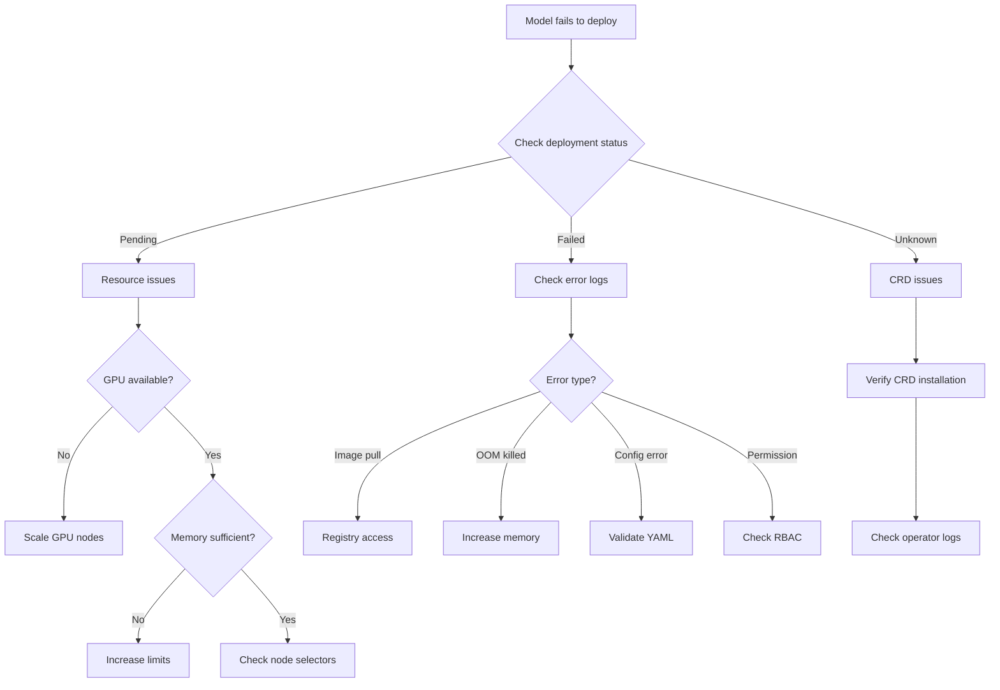
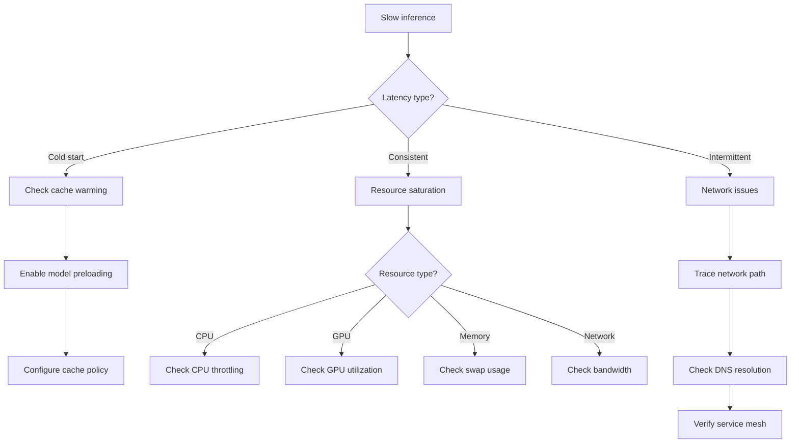
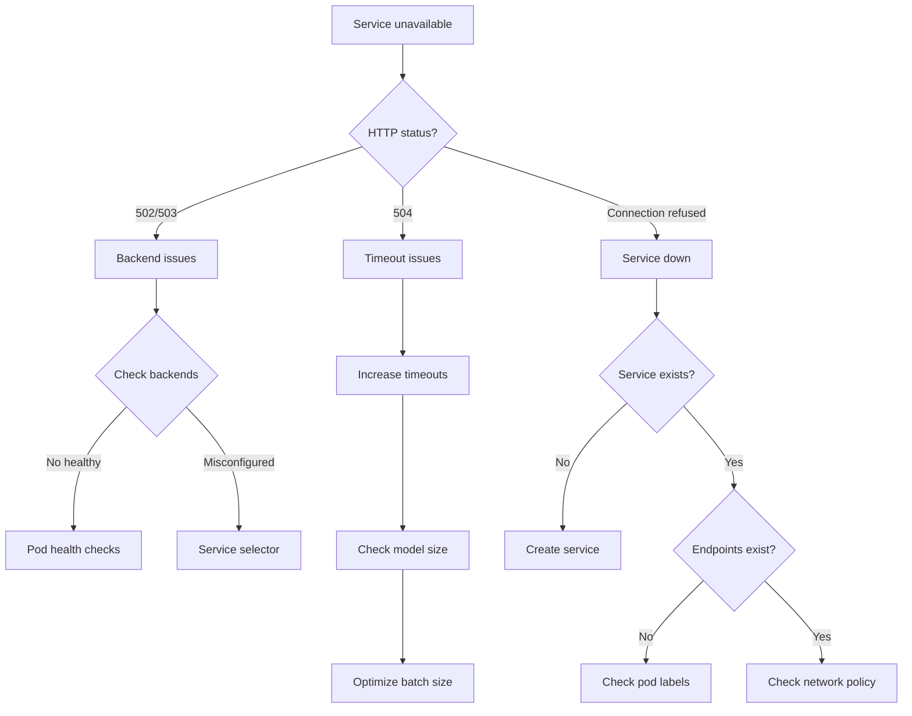
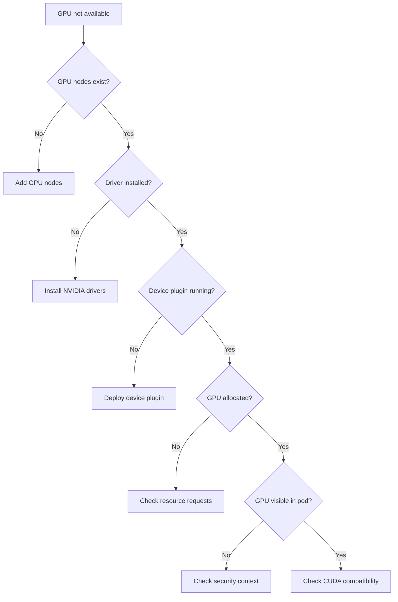
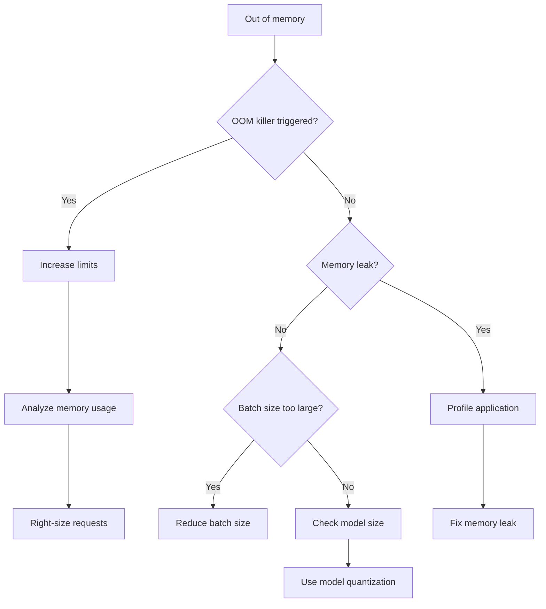
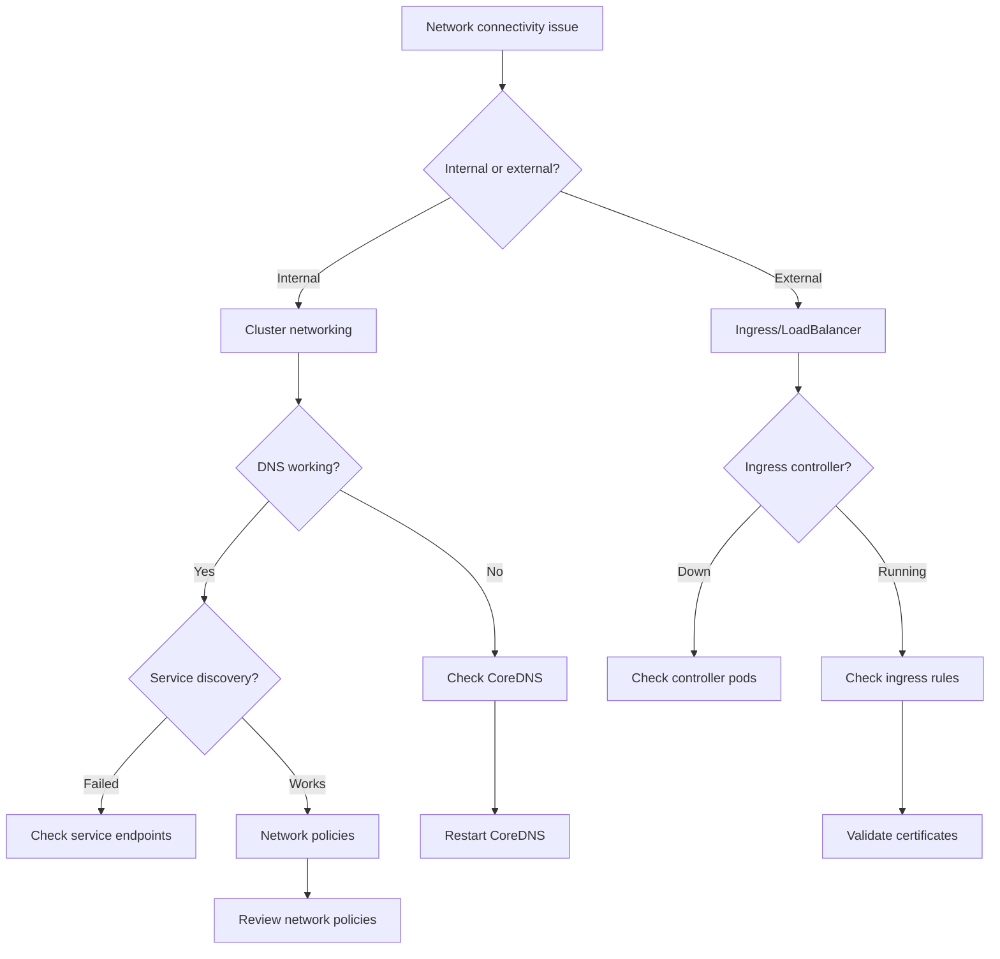
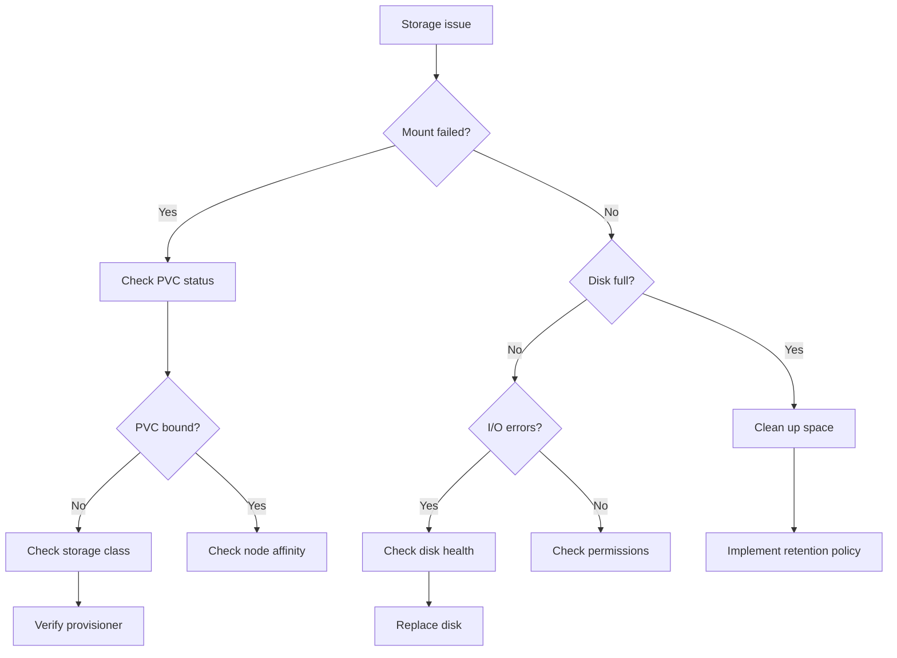

# Troubleshooting Decision Trees

Decision trees provide a systematic approach to identifying and resolving issues quickly. Start at the symptom and follow the tree to find the most likely cause and solution.

## Model Deployment Failures



### Resolution Steps

#### Resource Issues

```bash
# Check available resources
kubectl describe nodes | grep -E "Allocatable|Allocated" -A5

# Check pending pods
kubectl get pods -n <namespace> -o wide | grep Pending

# View resource requests
kubectl describe pod <pod-name> -n <namespace> | grep -A5 "Requests"
```

#### Image Pull Errors

```bash
# Check image pull secrets
kubectl get secrets -n <namespace>

# Test registry access
docker pull <registry>/<image>:<tag>

# Create pull secret if needed
kubectl create secret docker-registry regcred \
  --docker-server=<registry> \
  --docker-username=<username> \
  --docker-password=<password> \
  -n <namespace>
```

## Performance Degradation



### Diagnostic Commands

#### Performance Metrics

```bash
# GPU utilization
nvidia-smi -l 1

# CPU and memory
kubectl top pods -n <namespace>

# Network latency
kubectl exec -n <namespace> <pod> -- curl -w "@curl-format.txt" -o /dev/null -s http://service:8080/health

# Where curl-format.txt contains:
time_namelookup:  %{time_namelookup}s\n
time_connect:  %{time_connect}s\n
time_appconnect:  %{time_appconnect}s\n
time_pretransfer:  %{time_pretransfer}s\n
time_redirect:  %{time_redirect}s\n
time_starttransfer:  %{time_starttransfer}s\n
time_total:  %{time_total}s\n
```

## Service Unavailability



### Quick Checks

```bash
# Service and endpoints
kubectl get svc,endpoints -n <namespace>

# Pod readiness
kubectl get pods -n <namespace> -o custom-columns=NAME:.metadata.name,READY:.status.conditions[?(@.type=="Ready")].status

# Network policies
kubectl get networkpolicies -n <namespace>

# Service mesh status (if using Istio)
istioctl proxy-status
```

## GPU Issues



### GPU Diagnostics

```bash
# Check GPU nodes
kubectl get nodes -l nvidia.com/gpu=true

# GPU device plugin
kubectl get pods -n kube-system | grep nvidia-device-plugin

# GPU allocation
kubectl describe nodes | grep -A5 "nvidia.com/gpu"

# Inside pod GPU check
kubectl exec -n <namespace> <pod> -- nvidia-smi
```

## Memory Issues



### Memory Analysis

```bash
# Pod memory usage over time
kubectl top pod <pod-name> -n <namespace> --use-protocol-buffers | \
  while read line; do echo "$(date): $line"; sleep 5; done

# Check for OOM kills
kubectl describe pod <pod-name> -n <namespace> | grep -i "OOMKilled"

# System memory pressure
kubectl exec -n <namespace> <pod> -- cat /proc/meminfo | grep -E "MemTotal|MemFree|MemAvailable"
```

## Networking Issues



### Network Debugging

```bash
# DNS resolution test
kubectl run -it --rm debug --image=busybox --restart=Never -- nslookup <service>.<namespace>

# Service connectivity
kubectl run -it --rm debug --image=curlimages/curl --restart=Never -- curl -v http://<service>.<namespace>:8080

# Network policy test
kubectl exec -n <namespace> <pod> -- nc -zv <target-service> <port>

# Ingress debugging
kubectl logs -n ingress-nginx deployment/ingress-nginx-controller | grep <host>
```

## Storage Issues



### Storage Diagnostics

```bash
# PVC status
kubectl get pvc -A

# Storage usage
kubectl exec -n <namespace> <pod> -- df -h

# Disk I/O stats
kubectl exec -n <namespace> <pod> -- iostat -x 1

# Mount points
kubectl exec -n <namespace> <pod> -- mount | grep <volume>
```

## Best Practices

### Systematic Approach

1. **Gather symptoms** - What exactly is failing?
2. **Check recent changes** - What was modified?
3. **Follow the tree** - Use decision trees to narrow down
4. **Collect evidence** - Logs, metrics, events
5. **Test hypothesis** - Verify your theory
6. **Implement fix** - Apply the solution
7. **Verify resolution** - Confirm it's working
8. **Document findings** - Update runbooks

### Preventive Measures

- **Monitoring** - Set up comprehensive alerting
- **Logging** - Centralize and index all logs
- **Testing** - Regular chaos engineering
- **Documentation** - Keep runbooks updated
- **Training** - Regular incident response drills

### Emergency Kit

Keep these ready for quick access:

```bash
# Emergency diagnostic script
#!/bin/bash
echo "=== llm-d Emergency Diagnostic ==="
echo "Timestamp: $(date)"
echo ""
echo "=== Cluster Status ==="
kubectl cluster-info
echo ""
echo "=== Node Status ==="
kubectl get nodes
echo ""
echo "=== llm-d Components ==="
kubectl get all -n llm-d-system
echo ""
echo "=== LLM Deployments ==="
kubectl get llmdeployments -A
echo ""
echo "=== Recent Events ==="
kubectl get events -A --sort-by='.lastTimestamp' | head -20
```

## Next Steps

- Review [Common Issues](./02-common-issues.md) for specific problem solutions
- Check [Diagnostic Tools](./03-diagnostic-tools.md) for detailed analysis procedures
- See [Performance Troubleshooting](./04-performance-troubleshooting.md) for optimization techniques
