# Case Studies

This section presents real-world troubleshooting scenarios encountered in production llm-d deployments, including the diagnosis process, solutions, and lessons learned.

## Case Study 1: The Mystery of the Disappearing GPUs

### Background

**Company**: TechCorp  
**Environment**: EKS cluster with 20 p3.8xlarge nodes  
**Model**: GPT-3.5 equivalent (13B parameters)  
**Issue Duration**: 6 hours  

### Incident Timeline

**09:00** - Normal operation, all models serving traffic  
**09:15** - First alert: GPU utilization dropping to 0%  
**09:20** - Models start failing with "No CUDA devices available"  
**09:30** - Incident escalated to P1  
**10:00** - All GPU workloads down, switched to maintenance mode  

### Initial Investigation

```bash
# First checks revealed confusing state
$ kubectl get nodes -l nvidia.com/gpu=true
NAME                         STATUS   ROLES    AGE   VERSION
ip-10-0-1-100.ec2.internal   Ready    <none>   2d    v1.28.0
ip-10-0-1-101.ec2.internal   Ready    <none>   2d    v1.28.0
# ... all nodes showing Ready

$ kubectl describe nodes | grep "nvidia.com/gpu"
# No GPU resources showing in capacity/allocatable
```

**Red Herring**: Nodes appeared healthy, leading team down wrong path initially.

### Diagnostic Process

```bash
# Checked device plugin status
$ kubectl get ds -n kube-system nvidia-device-plugin-daemonset
NAME                             DESIRED   CURRENT   READY   UP-TO-DATE   AVAILABLE
nvidia-device-plugin-daemonset   20        20        0       20           0

# Device plugin pods failing
$ kubectl logs -n kube-system -l name=nvidia-device-plugin-ds
Failed to initialize NVML: could not load NVML library.

# Checked node-level NVIDIA driver
$ kubectl debug node/ip-10-0-1-100.ec2.internal -it --image=ubuntu
# Inside debug container
$ chroot /host
$ nvidia-smi
Failed to initialize NVML: Driver/library version mismatch
```

### Root Cause Discovery

The investigation revealed:

1. **Automatic driver update**: AWS had automatically updated NVIDIA drivers on all nodes
2. **Version mismatch**: New driver (470.x) incompatible with existing CUDA runtime (11.2)
3. **Silent failure**: No Kubernetes events or obvious alerts

### Solution Implementation

```bash
# Emergency fix: Rollback driver version
$ kubectl apply -f - <<EOF
apiVersion: apps/v1
kind: DaemonSet
metadata:
  name: nvidia-driver-rollback
  namespace: kube-system
spec:
  selector:
    matchLabels:
      name: nvidia-driver-rollback
  template:
    metadata:
      labels:
        name: nvidia-driver-rollback
    spec:
      hostPID: true
      hostNetwork: true
      containers:
      - name: rollback
        image: nvidia/driver:460.91.03-ubuntu20.04
        securityContext:
          privileged: true
        command:
        - /bin/bash
        - -c
        - |
          # Uninstall current driver
          /usr/bin/nvidia-uninstall --silent
          # Install compatible version
          /usr/bin/nvidia-installer --silent --install-libglvnd
          # Restart container runtime to pick up changes
          # For systems using Docker
          systemctl restart docker
          # For systems using containerd
          systemctl restart containerd
          # For systems using CRI-O (common on RHEL/OpenShift)
          systemctl restart crio
EOF

# Wait for rollback completion
$ kubectl rollout status ds nvidia-driver-rollback -n kube-system

# Restart device plugin
$ kubectl rollout restart ds nvidia-device-plugin-daemonset -n kube-system

# Verify GPU availability
$ kubectl get nodes -o custom-columns=NAME:.metadata.name,GPU:.status.capacity."nvidia\.com/gpu"
```

### Lessons Learned

1. **Monitoring Gap**: Need to monitor driver versions, not just availability
2. **Auto-updates Risk**: Disable automatic driver updates in production
3. **Testing Process**: Test driver compatibility in staging first

**Prevention Measures Implemented**:

```yaml
# Added monitoring for driver version drift
apiVersion: monitoring.coreos.com/v1
kind: PrometheusRule
metadata:
  name: nvidia-driver-monitoring
spec:
  groups:
  - name: nvidia-driver
    rules:
    - alert: NvidiaDriverVersionMismatch
      expr: |
        count by (instance) (nvidia_driver_version{}) > 1
      annotations:
        summary: "Multiple NVIDIA driver versions detected"
    
    - alert: NvidiaDriverUnavailable
      expr: |
        up{job="nvidia-dcgm-exporter"} == 0
      for: 5m
      annotations:
        summary: "NVIDIA driver unavailable on {{ $labels.instance }}"
```

## Case Study 2: The Gradual Performance Degradation

### Background

**Company**: AIStartup  
**Environment**: On-premises Kubernetes with V100 GPUs  
**Model**: Custom fine-tuned BERT-large  
**Issue**: Gradual 300% increase in inference latency over 2 weeks  

### Symptom Progression

```bash
# Week 1: Normal performance
P95 latency: 150ms
GPU utilization: 65%
Memory usage: 12GB/32GB

# Week 2: Degrading performance  
P95 latency: 450ms
GPU utilization: 45%
Memory usage: 28GB/32GB
```

### Investigation Timeline

**Day 1**: Team noticed increased latency complaints  
**Day 3**: Confirmed trend in metrics - gradual degradation  
**Day 5**: Started systematic investigation  

### Diagnostic Process

```python
# Created memory profiling script
import torch
import psutil
import time
from kubernetes import client, config

class MemoryProfiler:
    def __init__(self):
        config.load_incluster_config()
        self.v1 = client.CoreV1Api()
    
    def profile_pod_memory(self, namespace, pod_name):
        """Profile memory usage patterns"""
        results = []
        for i in range(144):  # 24 hours of 10-minute samples
            # Get pod metrics
            response = self.v1.read_namespaced_pod(pod_name, namespace)
            
            # Execute memory analysis in pod
            exec_response = stream(
                self.v1.connect_get_namespaced_pod_exec,
                pod_name, namespace,
                command=['python3', '-c', '''
import torch
import gc
import psutil

# GPU memory
if torch.cuda.is_available():
    print(f"GPU_MEM_ALLOCATED: {torch.cuda.memory_allocated()}")
    print(f"GPU_MEM_RESERVED: {torch.cuda.memory_reserved()}")

# System memory
process = psutil.Process()
print(f"RSS: {process.memory_info().rss}")
print(f"VMS: {process.memory_info().vms}")

# Object counts
print(f"TENSOR_COUNT: {len([obj for obj in gc.get_objects() if torch.is_tensor(obj)])}")
                '''],
                stderr=True, stdin=False, stdout=True, tty=False
            )
            
            results.append({
                'timestamp': time.time(),
                'metrics': exec_response
            })
            
            time.sleep(600)  # 10 minutes
        
        return results

# Run profiler
profiler = MemoryProfiler()
data = profiler.profile_pod_memory('production', 'bert-model-xyz')
```

### Key Findings

Analysis revealed a memory leak pattern:

```bash
# Memory growth over time
Day 1:  12GB GPU memory, 150ms latency
Day 7:  18GB GPU memory, 220ms latency  
Day 14: 28GB GPU memory, 450ms latency

# Correlation discovered
correlation(gpu_memory_usage, inference_latency) = 0.94
```

**Root Cause**: Memory leak in custom attention mechanism causing GPU memory fragmentation.

### Code Investigation

```python
# Found problematic code in custom attention layer
class CustomAttention(nn.Module):
    def __init__(self, hidden_size):
        super().__init__()
        self.attention_cache = {}  # PROBLEM: Never cleared!
        
    def forward(self, query, key, value):
        # Cache key computation - memory leak!
        cache_key = hash(query.data.ptr())
        if cache_key not in self.attention_cache:
            self.attention_cache[cache_key] = expensive_computation(query)
        
        return self.attention_cache[cache_key]

# Fix: Add cache management
class FixedCustomAttention(nn.Module):
    def __init__(self, hidden_size, cache_size=1000):
        super().__init__()
        self.attention_cache = {}
        self.cache_size = cache_size
        self.access_order = []
        
    def forward(self, query, key, value):
        cache_key = hash(query.data.ptr())
        
        if cache_key not in self.attention_cache:
            # LRU eviction when cache full
            if len(self.attention_cache) >= self.cache_size:
                oldest_key = self.access_order.pop(0)
                del self.attention_cache[oldest_key]
            
            self.attention_cache[cache_key] = expensive_computation(query)
        
        # Update access order
        if cache_key in self.access_order:
            self.access_order.remove(cache_key)
        self.access_order.append(cache_key)
        
        return self.attention_cache[cache_key]
```

### Solution and Recovery

```yaml
# 1. Immediate fix: Rolling restart with memory limits
apiVersion: inference.llm-d.io/v1alpha1
kind: LLMDeployment
metadata:
  name: bert-model
spec:
  resources:
    limits:
      memory: "20Gi"  # Reduced from 32Gi to force OOM before severe degradation
      nvidia.com/gpu: "1"
  
  # Add memory monitoring
  monitoring:
    enabled: true
    memoryThreshold: "16Gi"  # Alert at 80% usage
  
  # Automatic restart on memory pressure
  livenessProbe:
    exec:
      command:
      - python3
      - -c
      - |
        import torch
        if torch.cuda.memory_allocated() > 17179869184:  # 16GB threshold
          exit(1)
    initialDelaySeconds: 300
    periodSeconds: 60
```

### Long-term Prevention

```python
# Added comprehensive memory monitoring
class MemoryMonitor:
    def __init__(self, threshold_gb=16):
        self.threshold_bytes = threshold_gb * 1024**3
        self.alert_sent = False
        
    def check_memory(self):
        """Check and alert on memory usage"""
        if torch.cuda.is_available():
            allocated = torch.cuda.memory_allocated()
            reserved = torch.cuda.memory_reserved()
            
            if allocated > self.threshold_bytes and not self.alert_sent:
                self.send_alert(allocated, reserved)
                self.alert_sent = True
            elif allocated <= self.threshold_bytes:
                self.alert_sent = False
    
    def send_alert(self, allocated, reserved):
        """Send memory alert"""
        metrics = {
            'allocated_gb': allocated / 1024**3,
            'reserved_gb': reserved / 1024**3,
            'timestamp': time.time()
        }
        # Send to monitoring system
        
    def get_memory_stats(self):
        """Get detailed memory statistics"""
        if not torch.cuda.is_available():
            return {}
            
        stats = {
            'allocated': torch.cuda.memory_allocated(),
            'reserved': torch.cuda.memory_reserved(),
            'max_allocated': torch.cuda.max_memory_allocated(),
            'max_reserved': torch.cuda.max_memory_reserved()
        }
        
        # Reset peak stats for next measurement
        torch.cuda.reset_peak_memory_stats()
        
        return stats

# Integration with model server
monitor = MemoryMonitor()

class ModelServer:
    def __init__(self):
        self.monitor = MemoryMonitor()
        
    async def handle_request(self, request):
        # Check memory before processing
        self.monitor.check_memory()
        
        result = await self.process_request(request)
        
        # Log memory stats periodically
        if random.random() < 0.01:  # 1% of requests
            stats = self.monitor.get_memory_stats()
            logger.info(f"Memory stats: {stats}")
        
        return result
```

## Case Study 3: The Multi-Region Disaster

### Background

**Company**: GlobalAI  
**Environment**: Multi-region deployment (us-east-1, eu-west-1, ap-southeast-1)  
**Model**: Multiple LLMs serving global traffic  
**Issue**: Complete failure of primary region during peak traffic  

### Incident Details

**Time**: 14:30 UTC (peak European traffic)  
**Trigger**: AWS region outage in eu-west-1  
**Impact**: 40% of global traffic affected  
**Duration**: 3.5 hours total recovery  

### Pre-Disaster Architecture

```yaml
# Original setup - single region per model
regions:
  us-east-1:
    models: ["gpt-3.5", "bert-base"]
    traffic: "Americas"
  eu-west-1:  # PRIMARY FAILURE POINT
    models: ["gpt-4", "bert-large", "claude"]
    traffic: "Europe, Africa, Middle East"
  ap-southeast-1:
    models: ["gpt-3.5", "local-chinese"]
    traffic: "Asia Pacific"
```

### Disaster Response

**14:30** - Region failure detected  
**14:35** - Traffic routing updated manually  
**14:45** - Cross-region model deployment initiated  
**16:00** - Partial service restored  
**18:00** - Full service restored  

### Emergency Response Actions

```bash
# 1. Immediate traffic rerouting
kubectl apply -f - <<EOF
apiVersion: networking.istio.io/v1beta1
kind: VirtualService
metadata:
  name: emergency-failover
spec:
  hosts:
  - "api.globalai.com"
  http:
  - match:
    - headers:
        region:
          exact: "eu-west-1"
    fault:
      abort:
        percentage:
          value: 100
        httpStatus: 503
    route:
    - destination:
        host: api-us-east-1.globalai.com
      weight: 70
    - destination:
        host: api-ap-southeast-1.globalai.com  
      weight: 30
EOF

# 2. Scale up surviving regions
regions=("us-east-1" "ap-southeast-1")
for region in "${regions[@]}"; do
  kubectl config use-context $region
  # Scale up all deployments 3x
  for deployment in $(kubectl get llmdeployments -o name); do
    kubectl patch $deployment --type='merge' -p='{
      "spec": {
        "replicas": 12,
        "autoscaling": {
          "maxReplicas": 50
        }
      }
    }'
  done
done

# 3. Deploy missing models to other regions
cat <<EOF | kubectl apply -f -
apiVersion: inference.llm-d.io/v1alpha1
kind: LLMDeployment
metadata:
  name: gpt-4-emergency
  namespace: production
spec:
  model:
    name: gpt-4
    source:
      s3:
        bucket: globalai-models-backup
        prefix: gpt-4/
        region: us-east-1  # Cross-region backup
  replicas: 10
  resources:
    requests:
      nvidia.com/gpu: "2"
  priority: emergency  # High priority scheduling
EOF
```

### Post-Disaster Analysis

**Performance Impact**:

- Latency increased 250% during emergency
- 12% of requests failed during 1-hour window
- Revenue loss: $500K estimated

**Recovery Timeline**:

```mermaid
gantt
    title Disaster Recovery Timeline
    dateFormat HH:mm
    axisFormat %H:%M
    
    section Detection
    Region failure detected    :milestone, m1, 14:30, 0m
    
    section Response
    Traffic rerouting         :active, 14:35, 15m
    Emergency scaling         :active, 14:40, 30m
    Model redeployment        :active, 14:45, 75m
    
    section Recovery
    Partial service restored  :milestone, m2, 16:00, 0m
    Full service restored     :milestone, m3, 18:00, 0m
```



### Lessons Learned and Improvements

#### 1. Automated Failover System

```python
# disaster_recovery_controller.py
import asyncio
import aiohttp
from kubernetes import client, config

class DisasterRecoveryController:
    def __init__(self):
        self.regions = {
            'us-east-1': {'healthy': True, 'capacity': 100},
            'eu-west-1': {'healthy': True, 'capacity': 100},
            'ap-southeast-1': {'healthy': True, 'capacity': 100}
        }
        
    async def monitor_regions(self):
        """Continuously monitor region health"""
        while True:
            for region, info in self.regions.items():
                try:
                    async with aiohttp.ClientSession() as session:
                        async with session.get(
                            f"https://api-{region}.globalai.com/health",
                            timeout=aiohttp.ClientTimeout(total=5)
                        ) as response:
                            if response.status == 200:
                                info['healthy'] = True
                            else:
                                await self.handle_region_failure(region)
                except:
                    await self.handle_region_failure(region)
            
            await asyncio.sleep(30)  # Check every 30 seconds
    
    async def handle_region_failure(self, failed_region):
        """Automatically handle region failure"""
        if self.regions[failed_region]['healthy']:
            self.regions[failed_region]['healthy'] = False
            
            # Calculate capacity redistribution
            healthy_regions = [r for r, info in self.regions.items() 
                             if info['healthy'] and r != failed_region]
            
            if not healthy_regions:
                await self.trigger_emergency_alert()
                return
            
            # Redistribute traffic
            await self.redistribute_traffic(failed_region, healthy_regions)
            
            # Scale up healthy regions
            for region in healthy_regions:
                await self.emergency_scale_up(region)
    
    async def redistribute_traffic(self, failed_region, healthy_regions):
        """Update traffic routing"""
        # Implementation would update Istio VirtualService
        pass
    
    async def emergency_scale_up(self, region):
        """Scale up deployments in healthy region"""
        # Implementation would scale Kubernetes deployments
        pass
```

#### 2. Cross-Region Model Replication

```yaml
# Improved architecture with cross-region redundancy
apiVersion: v1
kind: ConfigMap
metadata:
  name: model-distribution-strategy
data:
  strategy.yaml: |
    models:
      gpt-4:
        primary_regions: ["eu-west-1", "us-east-1"]
        backup_regions: ["ap-southeast-1"]
        min_replicas_per_region: 3
        
      gpt-3.5:
        primary_regions: ["us-east-1", "ap-southeast-1"]  
        backup_regions: ["eu-west-1"]
        min_replicas_per_region: 2
        
    disaster_recovery:
      auto_failover: true
      cross_region_backup: true
      max_failover_time: "5m"
```

#### 3. Enhanced Monitoring

```yaml
# Regional health monitoring
apiVersion: monitoring.coreos.com/v1
kind: PrometheusRule
metadata:  
  name: regional-disaster-detection
spec:
  groups:
  - name: disaster-recovery
    rules:
    - alert: RegionDown
      expr: |
        up{job="api-health-check"} == 0
      for: 1m
      labels:
        severity: critical
        alert_type: disaster
      annotations:
        summary: "Region {{ $labels.region }} is down"
        runbook_url: "https://wiki.company.com/disaster-recovery"
    
    - alert: CrossRegionLatencyHigh  
      expr: |
        histogram_quantile(0.95, rate(http_request_duration_seconds_bucket{job="cross-region-proxy"}[5m])) > 2.0
      for: 5m
      annotations:
        summary: "High cross-region latency detected"
```

## Case Study 4: The Kubernetes Upgrade Gone Wrong

### Background

**Company**: MLPlatform Inc  
**Environment**: Self-managed Kubernetes 1.25 → 1.28 upgrade  
**Models**: 50+ different models across multiple namespaces  
**Issue**: CRD compatibility issues after upgrade  

### Upgrade Failure Timeline

**Saturday 02:00** - Started Kubernetes upgrade  
**Saturday 03:30** - Control plane upgraded successfully  
**Saturday 04:00** - Node upgrades completed  
**Saturday 04:15** - llm-d operator fails to start  
**Saturday 04:30** - All LLMDeployments show "Unknown" status  
**Saturday 05:00** - Emergency rollback initiated  

### Root Cause Investigation

```bash
# Operator failing with API errors
$ kubectl logs -n llm-d-system deployment/llm-d-operator
E0315 04:15:32.123456       1 controller.go:142] failed to get LLMDeployment: 
no matches for kind "LLMDeployment" in version "inference.llm-d.io/v1alpha1"

# CRD investigation
$ kubectl get crd llmdeployments.inference.llm-d.io -o yaml
apiVersion: apiextensions.k8s.io/v1beta1  # OLD VERSION!
kind: CustomResourceDefinition
# ...

# Kubernetes 1.28 dropped v1beta1 CRD support
$ kubectl api-resources | grep llmdeployment
# No output - CRD not recognized
```

**Problem**: Kubernetes 1.28 dropped support for `apiextensions.k8s.io/v1beta1` CRDs, but llm-d was still using the old version.

### Emergency Recovery Process

```bash
# 1. Backup existing CRD data
kubectl get llmdeployments -A -o yaml > llmdeployments-backup.yaml

# 2. Delete old CRD (dangerous but necessary)
kubectl delete crd llmdeployments.inference.llm-d.io

# 3. Install updated CRD with v1 API
cat <<EOF | kubectl apply -f -
apiVersion: apiextensions.k8s.io/v1
kind: CustomResourceDefinition
metadata:
  name: llmdeployments.inference.llm-d.io
spec:
  group: inference.llm-d.io
  versions:
  - name: v1alpha1
    served: true
    storage: true
    schema:
      openAPIV3Schema:
        type: object
        properties:
          spec:
            type: object
            properties:
              model:
                type: object
                properties:
                  name:
                    type: string
              replicas:
                type: integer
                minimum: 0
          status:
            type: object
            properties:
              phase:
                type: string
  scope: Namespaced
  names:
    plural: llmdeployments
    singular: llmdeployment
    kind: LLMDeployment
EOF

# 4. Restore data
kubectl apply -f llmdeployments-backup.yaml

# 5. Restart operator
kubectl rollout restart deployment/llm-d-operator -n llm-d-system
```

### Data Migration Script

```python
#!/usr/bin/env python3
# migrate_crds.py

import yaml
import subprocess
import sys
from kubernetes import client, config

def backup_resources(crd_name, output_file):
    """Backup all resources of a CRD"""
    cmd = f"kubectl get {crd_name} -A -o yaml"
    result = subprocess.run(cmd, shell=True, capture_output=True, text=True)
    
    if result.returncode != 0:
        print(f"Failed to backup {crd_name}: {result.stderr}")
        return False
    
    with open(output_file, 'w') as f:
        f.write(result.stdout)
    
    print(f"Backed up {crd_name} to {output_file}")
    return True

def convert_crd_version(crd_file, output_file):
    """Convert CRD from v1beta1 to v1"""
    with open(crd_file, 'r') as f:
        crd = yaml.safe_load(f)
    
    # Convert apiVersion
    crd['apiVersion'] = 'apiextensions.k8s.io/v1'
    
    # Convert schema structure
    if 'validation' in crd['spec']:
        crd['spec']['versions'] = [{
            'name': 'v1alpha1',
            'served': True,
            'storage': True,
            'schema': {
                'openAPIV3Schema': crd['spec']['validation']['openAPIV3Schema']
            }
        }]
        del crd['spec']['validation']
    
    # Ensure required fields
    if 'preserveUnknownFields' not in crd['spec']:
        crd['spec']['preserveUnknownFields'] = False
    
    with open(output_file, 'w') as f:
        yaml.dump(crd, f, default_flow_style=False)
    
    print(f"Converted CRD saved to {output_file}")

def migrate_crd(crd_name):
    """Complete CRD migration process"""
    backup_file = f"{crd_name}-backup.yaml"
    converted_file = f"{crd_name}-v1.yaml"
    
    # 1. Backup resources
    if not backup_resources(crd_name.split('.')[0], backup_file):
        return False
    
    # 2. Get current CRD definition
    cmd = f"kubectl get crd {crd_name} -o yaml"
    result = subprocess.run(cmd, shell=True, capture_output=True, text=True)
    
    if result.returncode != 0:
        print(f"Failed to get CRD {crd_name}: {result.stderr}")
        return False
    
    crd_backup_file = f"{crd_name}-crd-backup.yaml"
    with open(crd_backup_file, 'w') as f:
        f.write(result.stdout)
    
    # 3. Convert CRD
    convert_crd_version(crd_backup_file, converted_file)
    
    # 4. Replace CRD
    subprocess.run(f"kubectl delete crd {crd_name}", shell=True)
    subprocess.run(f"kubectl apply -f {converted_file}", shell=True)
    
    # 5. Restore resources
    subprocess.run(f"kubectl apply -f {backup_file}", shell=True)
    
    print(f"Migration completed for {crd_name}")
    return True

if __name__ == "__main__":
    if len(sys.argv) != 2:
        print("Usage: python migrate_crds.py <crd-name>")
        sys.exit(1)
    
    crd_name = sys.argv[1]
    migrate_crd(crd_name)
```

### Prevention Strategy

#### 1. Upgrade Testing Framework

```yaml
# test-upgrade.yaml - Upgrade testing pipeline
apiVersion: v1
kind: ConfigMap
metadata:
  name: upgrade-test-suite
data:
  test-script.sh: |
    #!/bin/bash
    set -e
    
    echo "=== Kubernetes Upgrade Test ==="
    
    # 1. Create test cluster with current version
    kind create cluster --name upgrade-test --config kind-config.yaml
    
    # 2. Install current llm-d version
    kubectl apply -f https://github.com/llm-d/llm-d/releases/v0.5.0/manifests.yaml
    
    # 3. Deploy test workloads
    kubectl apply -f test-workloads/
    
    # 4. Verify everything works
    ./verify-deployment.sh
    
    # 5. Upgrade cluster
    kind load docker-image kindest/node:v1.28.0 --name upgrade-test
    kubectl drain --ignore-daemonsets --delete-emptydir-data node/upgrade-test-control-plane
    
    # 6. Test CRD compatibility
    kubectl get crds -o yaml | grep apiVersion | grep -v "v1$" && echo "FAIL: Non-v1 CRDs found" && exit 1
    
    # 7. Verify workloads still function
    ./verify-deployment.sh
    
    echo "✅ Upgrade test passed"
```

#### 2. Automated CRD Version Checking

```python
# crd_version_checker.py
from kubernetes import client, config
import sys

def check_crd_versions():
    """Check all CRDs for deprecated API versions"""
    config.load_incluster_config()
    api = client.ApiextensionsV1Api()
    
    deprecated_crds = []
    
    try:
        crds = api.list_custom_resource_definition()
        for crd in crds.items:
            # Check if using deprecated API version
            if crd.api_version == 'apiextensions.k8s.io/v1beta1':
                deprecated_crds.append({
                    'name': crd.metadata.name,
                    'api_version': crd.api_version,
                    'group': crd.spec.group
                })
    
    except Exception as e:
        print(f"Error checking CRDs: {e}")
        return False
    
    if deprecated_crds:
        print("❌ Deprecated CRDs found:")
        for crd in deprecated_crds:
            print(f"  - {crd['name']} (API: {crd['api_version']})")
        return False
    else:
        print("✅ All CRDs using current API versions")
        return True

if __name__ == "__main__":
    success = check_crd_versions()
    sys.exit(0 if success else 1)
```

## Key Takeaways

### Common Patterns

1. **Silent Failures**: Many issues don't generate obvious alerts
2. **Cascade Effects**: Small problems can cause system-wide failures  
3. **Time Pressure**: Critical incidents require methodical approach under pressure
4. **Documentation**: Post-incident analysis prevents recurrence

### Best Practices Learned

1. **Comprehensive Monitoring**: Cover all failure modes, not just happy path
2. **Automated Recovery**: Humans are slow and error-prone under pressure
3. **Testing Strategy**: Test failure scenarios, not just success scenarios
4. **Runbook Maintenance**: Keep procedures updated and practiced

### Prevention Checklist

- [ ] Monitor all critical dependencies
- [ ] Implement automated failover mechanisms  
- [ ] Test disaster recovery procedures regularly
- [ ] Keep upgrade testing comprehensive
- [ ] Document and practice incident response
- [ ] Review and update monitoring after each incident
- [ ] Implement circuit breakers and graceful degradation
- [ ] Plan for capacity management during failures

## Next Steps

- Update your incident response procedures based on these case studies
- Implement monitoring and alerting improvements
- Schedule regular disaster recovery drills
