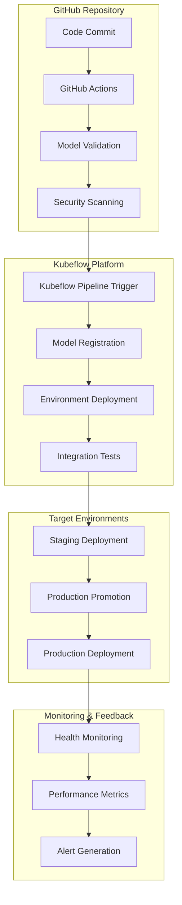

# CI/CD Pipeline Setup

This section covers building robust CI/CD pipelines that integrate GitHub Actions with Kubeflow Pipelines to automate LLM model deployment and management.

## Pipeline Architecture

### Overview



### Pipeline Stages

1. **Source Control**: Code and configuration changes trigger pipelines
2. **Validation**: Model compatibility and security scanning
3. **Registration**: Model artifacts stored in Kubeflow registry
4. **Deployment**: Automated deployment to target environments
5. **Testing**: Comprehensive testing and validation
6. **Monitoring**: Continuous monitoring and alerting

## GitHub Actions Integration

### Repository Structure

```
llm-models-repo/
├── .github/
│   └── workflows/
│       ├── model-validation.yml
│       ├── deploy-staging.yml
│       └── deploy-production.yml
├── models/
│   ├── llama-3.1-7b/
│   │   ├── model.yaml
│   │   └── deployment.yaml
│   └── llama-3.1-13b/
│       ├── model.yaml
│       └── deployment.yaml
├── pipelines/
│   ├── model-registration.py
│   ├── deployment.py
│   └── validation.py
├── tests/
│   ├── unit/
│   ├── integration/
│   └── performance/
└── config/
    ├── staging.yaml
    └── production.yaml
```

### GitHub Actions Workflows

#### Model Validation Workflow

The model validation workflow automatically detects changes to model configurations, validates them, runs security scans, and triggers Kubeflow pipelines for deployment.

📎 **Full Example**: [model-validation.yml](https://github.com/jeremyeder/llm-d-book-examples/tree/main/chapter-10-mlops/github-actions/model-validation.yml)

Key features:

- **Change Detection**: Uses path filters to detect model configuration changes
- **Parallel Validation**: Validates multiple models concurrently using matrix strategy
- **Security Scanning**: Integrates Trivy for vulnerability scanning
- **Kubeflow Integration**: Automatically triggers model registration pipelines

#### Staging Deployment Workflow

The staging deployment workflow automatically deploys validated models to staging environment and runs comprehensive integration tests.

📎 **Full Example**: [deploy-staging.yml](https://github.com/jeremyeder/llm-d-book-examples/tree/main/chapter-10-mlops/github-actions/deploy-staging.yml)

Key features:

- **Workflow Dependency**: Triggers only after successful validation
- **Integration Testing**: Comprehensive post-deployment testing
- **Notification**: Slack integration for deployment status
- **Validation Gates**: Post-deployment health checks

#### Production Deployment Workflow

The production deployment workflow supports manual deployments with approval gates, multiple deployment strategies, and comprehensive validation.

📎 **Full Example**: [deploy-production.yml](https://github.com/jeremyeder/llm-d-book-examples/tree/main/chapter-10-mlops/github-actions/deploy-production.yml)

Key features:

- **Manual Trigger**: Uses `workflow_dispatch` for controlled deployments
- **Approval Gates**: Optional manual approval for production changes
- **Multiple Strategies**: Supports blue-green and canary deployments
- **Readiness Validation**: Checks staging performance before promotion
- **Monitoring**: Post-deployment monitoring and smoke tests

## Pipeline Scripts

### Model Configuration Validation

Validates model YAML configuration against schema and business rules before deployment.

📎 **Full Example**: [validate-model-config.py](https://github.com/jeremyeder/llm-d-book-examples/tree/main/chapter-10-mlops/kubeflow-pipelines/validate-model-config.py)

Key features:

- **Schema Validation**: JSON Schema validation for configuration structure
- **Business Rules**: Memory-to-GPU ratio validation
- **Directory Consistency**: Ensures model name matches directory structure
- **CI/CD Integration**: Returns proper exit codes for pipeline integration

### Kubeflow Pipeline Trigger

Triggers model registration pipelines for changed models, integrating GitHub Actions with Kubeflow.

📎 **Full Example**: [trigger-registration-pipeline.py](https://github.com/jeremyeder/llm-d-book-examples/tree/main/chapter-10-mlops/kubeflow-pipelines/trigger-registration-pipeline.py)

Key features:

- **Change Detection**: Processes only models that have changed
- **Configuration Loading**: Reads model.yaml for pipeline parameters
- **Pipeline Orchestration**: Creates named pipeline runs with GitHub context
- **Error Handling**: Comprehensive error reporting and pipeline tracking

### Production Readiness Validation

Validates model performance in staging and checks resource capacity before production deployment.

📎 **Full Example**: [validate-production-readiness.py](https://github.com/jeremyeder/llm-d-book-examples/tree/main/chapter-10-mlops/kubeflow-pipelines/validate-production-readiness.py)

Key features:

- **SLO Validation**: Checks uptime, latency, and error rate requirements
- **Prometheus Integration**: Queries staging metrics for performance validation
- **Resource Capacity**: Validates sufficient GPU and memory resources
- **Production Gates**: Prevents deployment if requirements aren't met

## Environment Configuration

### Environment-Specific Configurations

Environment configurations define resource requirements, scaling policies, and deployment strategies.

📎 **Staging Config**: [staging-config.yaml](https://github.com/jeremyeder/llm-d-book-examples/tree/main/chapter-10-mlops/deployment/staging-config.yaml)
📎 **Production Config**: [production-config.yaml](https://github.com/jeremyeder/llm-d-book-examples/tree/main/chapter-10-mlops/deployment/production-config.yaml)

Key differences:

- **Staging**: V100 GPUs, rolling updates, lower resource limits
- **Production**: A100 GPUs, blue-green deployments, SLO requirements
- **Autoscaling**: Different replica ranges for cost optimization vs availability
- **Monitoring**: Environment-specific alert channels and thresholds

## Integration Testing

### Automated Test Suite

Comprehensive integration testing framework that validates deployed models across environments.

📎 **Full Example**: [run-integration-tests.py](https://github.com/jeremyeder/llm-d-book-examples/tree/main/chapter-10-mlops/testing/run-integration-tests.py)

Test categories:

- **Health Checks**: Validates model endpoint availability
- **Inference Testing**: Tests basic model functionality and response quality
- **Load Handling**: Concurrent request testing and performance validation
- **Environment Discovery**: Auto-detects deployed models for testing

Usage:

```bash
# Test staging environment
python run-integration-tests.py --environment staging

# Test specific models in production
python run-integration-tests.py --environment production --models llama-3.1-7b llama-3.1-13b
```

## Best Practices

### Pipeline Security

1. **Secret Management**
   - Use GitHub Secrets for sensitive data
   - Rotate tokens regularly
   - Use least-privilege access

2. **Image Security**
   - Scan all container images for vulnerabilities
   - Use signed images when possible
   - Keep base images updated

3. **Access Control**
   - Implement branch protection rules
   - Require PR reviews for production deployments
   - Use environment-specific approvals

### Performance Optimization

1. **Pipeline Efficiency**
   - Cache dependencies between runs
   - Parallelize independent steps
   - Use incremental builds when possible

2. **Resource Management**
   - Right-size pipeline runners
   - Use spot instances for non-critical tasks
   - Monitor pipeline costs

### Monitoring and Observability

1. **Pipeline Metrics**
   - Track deployment frequency
   - Monitor success rates
   - Measure lead time

2. **Alerting**
   - Set up alerts for pipeline failures
   - Monitor deployment rollback frequency
   - Track SLO compliance

## Next Steps

With robust CI/CD pipelines in place, the next step is implementing comprehensive [Automated Testing Strategies](./03-automated-testing.md) to ensure model quality and reliability throughout the deployment process.

## References

- [GitHub Actions Documentation](https://docs.github.com/en/actions)
- [Kubeflow Pipelines SDK](https://kubeflow-pipelines.readthedocs.io/)
- [Chapter 7: Security and Compliance](../07-security-compliance.md) - Security scanning and compliance
- [Chapter 8: Troubleshooting](../08-troubleshooting/index.md) - Pipeline troubleshooting procedures
