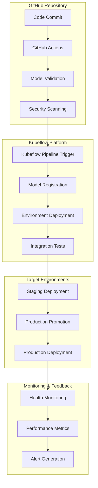

# CI/CD Pipeline Setup

This section covers building robust CI/CD pipelines that integrate GitHub Actions with Kubeflow Pipelines to automate LLM model deployment and management.

## Pipeline Architecture

### Overview



### Pipeline Stages

1. **Source Control**: Code and configuration changes trigger pipelines
2. **Validation**: Model compatibility and security scanning
3. **Registration**: Model artifacts stored in Kubeflow registry
4. **Deployment**: Automated deployment to target environments
5. **Testing**: Comprehensive testing and validation
6. **Monitoring**: Continuous monitoring and alerting

## GitHub Actions Integration

### Repository Structure

```
llm-models-repo/
├── .github/
│   └── workflows/
│       ├── model-validation.yml
│       ├── deploy-staging.yml
│       └── deploy-production.yml
├── models/
│   ├── llama-3.1-7b/
│   │   ├── model.yaml
│   │   └── deployment.yaml
│   └── llama-3.1-13b/
│       ├── model.yaml
│       └── deployment.yaml
├── pipelines/
│   ├── model-registration.py
│   ├── deployment.py
│   └── validation.py
├── tests/
│   ├── unit/
│   ├── integration/
│   └── performance/
└── config/
    ├── staging.yaml
    └── production.yaml
```

### GitHub Actions Workflows

#### Model Validation Workflow

```yaml
# .github/workflows/model-validation.yml
name: Model Validation Pipeline

on:
  pull_request:
    paths:
      - 'models/**'
      - 'pipelines/**'
  push:
    branches:
      - main
    paths:
      - 'models/**'

env:
  KUBEFLOW_ENDPOINT: ${{ secrets.KUBEFLOW_ENDPOINT }}
  KUBEFLOW_TOKEN: ${{ secrets.KUBEFLOW_TOKEN }}
  MODEL_REGISTRY_S3_BUCKET: ${{ secrets.MODEL_REGISTRY_S3_BUCKET }}

jobs:
  detect-changes:
    runs-on: ubuntu-latest
    outputs:
      models: ${{ steps.changes.outputs.models }}
      models_files: ${{ steps.changes.outputs.models_files }}
    steps:
      - uses: actions/checkout@v4
      - uses: dorny/paths-filter@v2
        id: changes
        with:
          list-files: json
          filters: |
            models:
              - 'models/**'

  validate-model-configs:
    needs: detect-changes
    if: ${{ needs.detect-changes.outputs.models == 'true' }}
    runs-on: ubuntu-latest
    strategy:
      matrix:
        model-path: ${{ fromJson(needs.detect-changes.outputs.models_files) }}
    steps:
      - uses: actions/checkout@v4
      
      - name: Setup Python
        uses: actions/setup-python@v4
        with:
          python-version: '3.9'
          
      - name: Install dependencies
        run: |
          pip install pyyaml jsonschema kfp boto3
          
      - name: Validate model configuration
        run: |
          python scripts/validate-model-config.py ${{ matrix.model-path }}
          
      - name: Check model artifacts
        run: |
          python scripts/check-model-artifacts.py ${{ matrix.model-path }}

  security-scan:
    needs: detect-changes
    if: ${{ needs.detect-changes.outputs.models == 'true' }}
    runs-on: ubuntu-latest
    steps:
      - uses: actions/checkout@v4
      
      - name: Run Trivy vulnerability scanner
        uses: aquasecurity/trivy-action@master
        with:
          scan-type: 'fs'
          scan-ref: '.'
          format: 'sarif'
          output: 'trivy-results.sarif'
          
      - name: Upload Trivy scan results
        uses: github/codeql-action/upload-sarif@v2
        if: always()
        with:
          sarif_file: 'trivy-results.sarif'

  trigger-kubeflow-pipeline:
    needs: [validate-model-configs, security-scan]
    if: github.ref == 'refs/heads/main'
    runs-on: ubuntu-latest
    steps:
      - uses: actions/checkout@v4
      
      - name: Setup Python
        uses: actions/setup-python@v4
        with:
          python-version: '3.9'
          
      - name: Install Kubeflow SDK
        run: |
          pip install kfp==2.0.0
          
      - name: Trigger Model Registration Pipeline
        run: |
          python scripts/trigger-registration-pipeline.py \
            --endpoint ${{ env.KUBEFLOW_ENDPOINT }} \
            --token ${{ env.KUBEFLOW_TOKEN }} \
            --models-changed '${{ needs.detect-changes.outputs.models_files }}'
```

#### Staging Deployment Workflow

```yaml
# .github/workflows/deploy-staging.yml
name: Deploy to Staging

on:
  workflow_run:
    workflows: ["Model Validation Pipeline"]
    types:
      - completed
    branches:
      - main

env:
  KUBEFLOW_ENDPOINT: ${{ secrets.KUBEFLOW_ENDPOINT }}
  KUBEFLOW_TOKEN: ${{ secrets.KUBEFLOW_TOKEN }}
  STAGING_CLUSTER: ${{ secrets.STAGING_CLUSTER }}

jobs:
  deploy-staging:
    if: ${{ github.event.workflow_run.conclusion == 'success' }}
    runs-on: ubuntu-latest
    steps:
      - uses: actions/checkout@v4
      
      - name: Setup Python
        uses: actions/setup-python@v4
        with:
          python-version: '3.9'
          
      - name: Install dependencies
        run: |
          pip install kfp==2.0.0 kubernetes boto3
          
      - name: Configure kubectl
        run: |
          echo "${{ secrets.STAGING_KUBECONFIG }}" | base64 -d > ~/.kube/config
          
      - name: Deploy to Staging
        run: |
          python scripts/deploy-to-staging.py \
            --kubeflow-endpoint ${{ env.KUBEFLOW_ENDPOINT }} \
            --kubeflow-token ${{ env.KUBEFLOW_TOKEN }} \
            --target-namespace staging
            
      - name: Run Integration Tests
        run: |
          python scripts/run-integration-tests.py \
            --environment staging \
            --timeout 600
            
      - name: Post Deployment Validation
        run: |
          python scripts/validate-deployment.py \
            --namespace staging \
            --timeout 300
            
      - name: Notify Slack
        if: always()
        uses: 8398a7/action-slack@v3
        with:
          status: ${{ job.status }}
          text: "Staging deployment ${{ job.status }} for commit ${{ github.sha }}"
        env:
          SLACK_WEBHOOK_URL: ${{ secrets.SLACK_WEBHOOK_URL }}
```

#### Production Deployment Workflow

```yaml
# .github/workflows/deploy-production.yml
name: Deploy to Production

on:
  workflow_dispatch:
    inputs:
      model_name:
        description: 'Model name to deploy'
        required: true
        type: string
      model_version:
        description: 'Model version to deploy'
        required: true
        type: string
      deployment_strategy:
        description: 'Deployment strategy'
        required: true
        default: 'blue-green'
        type: choice
        options:
          - blue-green
          - canary
      approval_required:
        description: 'Require manual approval'
        required: true
        default: true
        type: boolean

env:
  KUBEFLOW_ENDPOINT: ${{ secrets.KUBEFLOW_ENDPOINT }}
  KUBEFLOW_TOKEN: ${{ secrets.KUBEFLOW_TOKEN }}
  PRODUCTION_CLUSTER: ${{ secrets.PRODUCTION_CLUSTER }}

jobs:
  validate-production-readiness:
    runs-on: ubuntu-latest
    outputs:
      validation_result: ${{ steps.validate.outputs.result }}
    steps:
      - uses: actions/checkout@v4
      
      - name: Validate Production Readiness
        id: validate
        run: |
          python scripts/validate-production-readiness.py \
            --model-name ${{ github.event.inputs.model_name }} \
            --model-version ${{ github.event.inputs.model_version }} \
            --staging-namespace staging
            
  request-approval:
    needs: validate-production-readiness
    if: ${{ github.event.inputs.approval_required == 'true' && needs.validate-production-readiness.outputs.validation_result == 'passed' }}
    runs-on: ubuntu-latest
    environment: production-approval
    steps:
      - name: Manual Approval Required
        run: |
          echo "Manual approval required for production deployment"
          echo "Model: ${{ github.event.inputs.model_name }}"
          echo "Version: ${{ github.event.inputs.model_version }}"
          echo "Strategy: ${{ github.event.inputs.deployment_strategy }}"

  deploy-production:
    needs: [validate-production-readiness, request-approval]
    if: always() && (needs.request-approval.result == 'success' || github.event.inputs.approval_required == 'false')
    runs-on: ubuntu-latest
    steps:
      - uses: actions/checkout@v4
      
      - name: Setup Python
        uses: actions/setup-python@v4
        with:
          python-version: '3.9'
          
      - name: Install dependencies
        run: |
          pip install kfp==2.0.0 kubernetes boto3
          
      - name: Configure kubectl
        run: |
          echo "${{ secrets.PRODUCTION_KUBECONFIG }}" | base64 -d > ~/.kube/config
          
      - name: Deploy to Production
        run: |
          python scripts/deploy-to-production.py \
            --kubeflow-endpoint ${{ env.KUBEFLOW_ENDPOINT }} \
            --kubeflow-token ${{ env.KUBEFLOW_TOKEN }} \
            --model-name ${{ github.event.inputs.model_name }} \
            --model-version ${{ github.event.inputs.model_version }} \
            --strategy ${{ github.event.inputs.deployment_strategy }} \
            --target-namespace production
            
      - name: Monitor Deployment
        run: |
          python scripts/monitor-deployment.py \
            --namespace production \
            --model-name ${{ github.event.inputs.model_name }} \
            --timeout 900
            
      - name: Run Smoke Tests
        run: |
          python scripts/run-smoke-tests.py \
            --environment production \
            --model-name ${{ github.event.inputs.model_name }}
            
      - name: Update Deployment Status
        if: always()
        run: |
          python scripts/update-deployment-status.py \
            --model-name ${{ github.event.inputs.model_name }} \
            --model-version ${{ github.event.inputs.model_version }} \
            --status ${{ job.status }} \
            --environment production
```

## Pipeline Scripts

### Model Configuration Validation

```python
# scripts/validate-model-config.py
import yaml
import jsonschema
import sys
import os

# Model configuration schema
MODEL_CONFIG_SCHEMA = {
    "type": "object",
    "required": ["name", "version", "architecture", "resources"],
    "properties": {
        "name": {"type": "string", "pattern": "^[a-z0-9-]+$"},
        "version": {"type": "string", "pattern": "^\\d+\\.\\d+\\.\\d+$"},
        "architecture": {"type": "string"},
        "description": {"type": "string"},
        "resources": {
            "type": "object",
            "required": ["memory_gb", "gpu_count"],
            "properties": {
                "memory_gb": {"type": "number", "minimum": 1},
                "gpu_count": {"type": "integer", "minimum": 1},
                "gpu_type": {"type": "string"}
            }
        },
        "serving": {
            "type": "object",
            "properties": {
                "max_batch_size": {"type": "integer", "minimum": 1},
                "max_sequence_length": {"type": "integer", "minimum": 1},
                "protocol": {"type": "string", "enum": ["http", "grpc"]}
            }
        },
        "source": {
            "type": "object",
            "required": ["type", "uri"],
            "properties": {
                "type": {"type": "string", "enum": ["s3", "huggingface", "local"]},
                "uri": {"type": "string"}
            }
        }
    }
}

def validate_model_config(config_path: str) -> bool:
    """Validate model configuration file"""
    try:
        with open(config_path, 'r') as f:
            config = yaml.safe_load(f)
        
        # Validate against schema
        jsonschema.validate(config, MODEL_CONFIG_SCHEMA)
        
        # Additional business logic validation
        if config['resources']['memory_gb'] < config['resources']['gpu_count'] * 8:
            raise ValueError(f"Insufficient memory for {config['resources']['gpu_count']} GPUs")
        
        # Validate model name matches directory structure
        expected_model_name = os.path.basename(os.path.dirname(config_path))
        if config['name'] != expected_model_name:
            raise ValueError(f"Model name {config['name']} doesn't match directory {expected_model_name}")
        
        print(f"✅ Configuration valid: {config['name']} v{config['version']}")
        return True
        
    except Exception as e:
        print(f"❌ Configuration validation failed: {e}")
        return False

if __name__ == "__main__":
    if len(sys.argv) != 2:
        print("Usage: python validate-model-config.py <path-to-model-dir>")
        sys.exit(1)
    
    model_dir = sys.argv[1]
    config_path = os.path.join(model_dir, "model.yaml")
    
    if not os.path.exists(config_path):
        print(f"❌ Model configuration not found: {config_path}")
        sys.exit(1)
    
    if validate_model_config(config_path):
        sys.exit(0)
    else:
        sys.exit(1)
```

### Kubeflow Pipeline Trigger

```python
# scripts/trigger-registration-pipeline.py
import kfp
import argparse
import json
import os
import yaml
from typing import List

def trigger_model_registration(
    endpoint: str,
    token: str,
    models_changed: List[str]
) -> None:
    """Trigger Kubeflow pipeline for changed models"""
    
    # Initialize Kubeflow client
    client = kfp.Client(
        host=endpoint,
        existing_token=token
    )
    
    for model_path in models_changed:
        if not model_path.startswith('models/'):
            continue
            
        model_dir = os.path.dirname(model_path)
        config_path = os.path.join(model_dir, "model.yaml")
        
        if not os.path.exists(config_path):
            print(f"⚠️  Skipping {model_path} - no model.yaml found")
            continue
        
        # Load model configuration
        with open(config_path, 'r') as f:
            config = yaml.safe_load(f)
        
        # Prepare pipeline arguments
        pipeline_args = {
            'model_name': config['name'],
            'model_version': config['version'],
            'model_uri': config['source']['uri'],
            'architecture': config['architecture'],
            'memory_gb': config['resources']['memory_gb'],
            'gpu_count': config['resources']['gpu_count']
        }
        
        # Submit pipeline run
        try:
            run = client.create_run_from_pipeline_func(
                pipeline_func=model_registration_pipeline,
                arguments=pipeline_args,
                run_name=f"register-{config['name']}-{config['version']}-{os.environ.get('GITHUB_RUN_ID', 'manual')}"
            )
            
            print(f"✅ Triggered registration pipeline for {config['name']} v{config['version']}")
            print(f"   Run ID: {run.run_id}")
            print(f"   Run URL: {endpoint}/#/runs/details/{run.run_id}")
            
        except Exception as e:
            print(f"❌ Failed to trigger pipeline for {config['name']}: {e}")
            raise

if __name__ == "__main__":
    parser = argparse.ArgumentParser()
    parser.add_argument('--endpoint', required=True, help='Kubeflow endpoint')
    parser.add_argument('--token', required=True, help='Kubeflow auth token')
    parser.add_argument('--models-changed', required=True, help='JSON list of changed model files')
    
    args = parser.parse_args()
    
    models_changed = json.loads(args.models_changed)
    trigger_model_registration(args.endpoint, args.token, models_changed)
```

### Production Readiness Validation

```python
# scripts/validate-production-readiness.py
import argparse
import requests
import time
import json
from kubernetes import client, config
from prometheus_api_client import PrometheusConnect

def validate_staging_performance(
    model_name: str,
    staging_namespace: str,
    prometheus_url: str = "http://prometheus.monitoring.svc.cluster.local:9090"
) -> dict:
    """Validate model performance in staging environment"""
    
    prom = PrometheusConnect(url=prometheus_url)
    
    # Query metrics for the last 24 hours
    metrics = {}
    
    # Availability SLO: 99.9% uptime
    uptime_query = f'avg_over_time(up{{job="llm-model",model="{model_name}",namespace="{staging_namespace}"}}[24h])'
    uptime_result = prom.custom_query(uptime_query)
    metrics['uptime'] = float(uptime_result[0]['value'][1]) if uptime_result else 0
    
    # Latency SLO: P95 < 2 seconds
    latency_query = f'histogram_quantile(0.95, rate(llm_request_duration_seconds_bucket{{model="{model_name}",namespace="{staging_namespace}"}}[24h]))'
    latency_result = prom.custom_query(latency_query)
    metrics['p95_latency'] = float(latency_result[0]['value'][1]) if latency_result else 999
    
    # Error rate SLO: < 1% errors
    error_query = f'rate(llm_requests_failed_total{{model="{model_name}",namespace="{staging_namespace}"}}[24h]) / rate(llm_requests_total{{model="{model_name}",namespace="{staging_namespace}"}}[24h])'
    error_result = prom.custom_query(error_query)
    metrics['error_rate'] = float(error_result[0]['value'][1]) if error_result else 1
    
    # Validate SLOs
    slo_checks = {
        'uptime_slo': metrics['uptime'] >= 0.999,
        'latency_slo': metrics['p95_latency'] <= 2.0,
        'error_rate_slo': metrics['error_rate'] <= 0.01
    }
    
    return {
        'metrics': metrics,
        'slo_checks': slo_checks,
        'all_passed': all(slo_checks.values())
    }

def validate_resource_capacity(
    model_name: str,
    model_version: str,
    target_namespace: str = "production"
) -> dict:
    """Validate sufficient resources for production deployment"""
    
    config.load_incluster_config()
    v1 = client.CoreV1Api()
    
    # Get model resource requirements
    with open(f"models/{model_name}/model.yaml", 'r') as f:
        model_config = yaml.safe_load(f)
    
    required_gpu = model_config['resources']['gpu_count']
    required_memory_gb = model_config['resources']['memory_gb']
    
    # Check available resources in production namespace
    nodes = v1.list_node()
    available_gpu = 0
    available_memory_gb = 0
    
    for node in nodes.items:
        if node.spec.taints:
            # Skip tainted nodes (likely GPU nodes reserved for specific workloads)
            continue
            
        gpu_capacity = node.status.allocatable.get('nvidia.com/gpu', '0')
        memory_capacity = node.status.allocatable.get('memory', '0Gi')
        
        # Simple capacity calculation (would be more sophisticated in practice)
        available_gpu += int(gpu_capacity)
        available_memory_gb += int(memory_capacity.replace('Gi', ''))
    
    capacity_checks = {
        'gpu_available': available_gpu >= required_gpu,
        'memory_available': available_memory_gb >= required_memory_gb
    }
    
    return {
        'required': {
            'gpu': required_gpu,
            'memory_gb': required_memory_gb
        },
        'available': {
            'gpu': available_gpu,
            'memory_gb': available_memory_gb
        },
        'capacity_checks': capacity_checks,
        'sufficient_capacity': all(capacity_checks.values())
    }

def main():
    parser = argparse.ArgumentParser()
    parser.add_argument('--model-name', required=True)
    parser.add_argument('--model-version', required=True)
    parser.add_argument('--staging-namespace', default='staging')
    
    args = parser.parse_args()
    
    print(f"🔍 Validating production readiness for {args.model_name} v{args.model_version}")
    
    # Validate staging performance
    performance_result = validate_staging_performance(
        args.model_name,
        args.staging_namespace
    )
    
    # Validate resource capacity
    capacity_result = validate_resource_capacity(
        args.model_name,
        args.model_version
    )
    
    # Overall validation result
    validation_passed = (
        performance_result['all_passed'] and 
        capacity_result['sufficient_capacity']
    )
    
    print(f"📊 Performance Validation:")
    print(f"   Uptime: {performance_result['metrics']['uptime']:.3f} (>= 0.999: {performance_result['slo_checks']['uptime_slo']})")
    print(f"   P95 Latency: {performance_result['metrics']['p95_latency']:.3f}s (<= 2.0s: {performance_result['slo_checks']['latency_slo']})")
    print(f"   Error Rate: {performance_result['metrics']['error_rate']:.3f} (<= 0.01: {performance_result['slo_checks']['error_rate_slo']})")
    
    print(f"💾 Capacity Validation:")
    print(f"   GPU: {capacity_result['available']['gpu']} available, {capacity_result['required']['gpu']} required")
    print(f"   Memory: {capacity_result['available']['memory_gb']}GB available, {capacity_result['required']['memory_gb']}GB required")
    
    if validation_passed:
        print("✅ Production readiness validation PASSED")
        print("::set-output name=result::passed")
    else:
        print("❌ Production readiness validation FAILED")
        print("::set-output name=result::failed")
        exit(1)

if __name__ == "__main__":
    main()
```

## Environment Configuration

### Environment-Specific Configurations

```yaml
# config/staging.yaml
environment: staging
namespace: staging

cluster:
  gpu_node_selector:
    node-type: gpu-v100
  
resources:
  default_limits:
    memory_multiplier: 0.8
    gpu_multiplier: 1.0
  
autoscaling:
  enabled: true
  min_replicas: 1
  max_replicas: 5

monitoring:
  prometheus_namespace: monitoring
  alert_manager_webhook: "https://hooks.slack.com/services/staging-alerts"

deployment:
  strategy: "rolling-update"
  max_unavailable: 1
  max_surge: 1
```

```yaml
# config/production.yaml
environment: production
namespace: production

cluster:
  gpu_node_selector:
    node-type: gpu-a100
  
resources:
  default_limits:
    memory_multiplier: 1.0
    gpu_multiplier: 1.0
  
autoscaling:
  enabled: true
  min_replicas: 3
  max_replicas: 20

monitoring:
  prometheus_namespace: monitoring
  alert_manager_webhook: "https://hooks.slack.com/services/production-alerts"

deployment:
  strategy: "blue-green"
  approval_required: true
  canary_percentage: 10
  
slo:
  availability: 0.999
  latency_p95_ms: 2000
  error_rate: 0.01
```

## Integration Testing

### Automated Test Suite

```python
# scripts/run-integration-tests.py
import argparse
import requests
import time
import json
import yaml
from concurrent.futures import ThreadPoolExecutor, as_completed

class ModelIntegrationTester:
    def __init__(self, base_url: str, timeout: int = 300):
        self.base_url = base_url
        self.timeout = timeout
        
    def test_health_endpoint(self, model_name: str) -> dict:
        """Test model health endpoint"""
        url = f"{self.base_url}/{model_name}/health"
        
        try:
            response = requests.get(url, timeout=10)
            return {
                'test': 'health_check',
                'status': 'passed' if response.status_code == 200 else 'failed',
                'response_code': response.status_code,
                'response_time_ms': response.elapsed.total_seconds() * 1000
            }
        except Exception as e:
            return {
                'test': 'health_check',
                'status': 'failed',
                'error': str(e)
            }
    
    def test_inference_endpoint(self, model_name: str) -> dict:
        """Test model inference endpoint"""
        url = f"{self.base_url}/{model_name}/v1/completions"
        
        payload = {
            "prompt": "The quick brown fox",
            "max_tokens": 10,
            "temperature": 0.1
        }
        
        try:
            start_time = time.time()
            response = requests.post(url, json=payload, timeout=30)
            end_time = time.time()
            
            if response.status_code == 200:
                result = response.json()
                return {
                    'test': 'inference',
                    'status': 'passed',
                    'response_time_ms': (end_time - start_time) * 1000,
                    'output_length': len(result.get('choices', [{}])[0].get('text', '')),
                    'tokens_generated': result.get('usage', {}).get('completion_tokens', 0)
                }
            else:
                return {
                    'test': 'inference',
                    'status': 'failed',
                    'response_code': response.status_code,
                    'error': response.text
                }
                
        except Exception as e:
            return {
                'test': 'inference',
                'status': 'failed',
                'error': str(e)
            }
    
    def test_load_handling(self, model_name: str, concurrent_requests: int = 5) -> dict:
        """Test model load handling"""
        url = f"{self.base_url}/{model_name}/v1/completions"
        
        payload = {
            "prompt": "Generate a short response",
            "max_tokens": 5,
            "temperature": 0.1
        }
        
        def send_request():
            try:
                start_time = time.time()
                response = requests.post(url, json=payload, timeout=30)
                end_time = time.time()
                
                return {
                    'status_code': response.status_code,
                    'response_time_ms': (end_time - start_time) * 1000,
                    'success': response.status_code == 200
                }
            except Exception as e:
                return {
                    'status_code': 0,
                    'response_time_ms': 0,
                    'success': False,
                    'error': str(e)
                }
        
        # Send concurrent requests
        results = []
        with ThreadPoolExecutor(max_workers=concurrent_requests) as executor:
            futures = [executor.submit(send_request) for _ in range(concurrent_requests)]
            
            for future in as_completed(futures):
                results.append(future.result())
        
        # Analyze results
        successful_requests = sum(1 for r in results if r['success'])
        avg_response_time = sum(r['response_time_ms'] for r in results if r['success']) / max(successful_requests, 1)
        
        return {
            'test': 'load_handling',
            'status': 'passed' if successful_requests >= concurrent_requests * 0.8 else 'failed',
            'total_requests': concurrent_requests,
            'successful_requests': successful_requests,
            'success_rate': successful_requests / concurrent_requests,
            'avg_response_time_ms': avg_response_time
        }
    
    def run_integration_tests(self, models: list) -> dict:
        """Run complete integration test suite"""
        all_results = {}
        
        for model_name in models:
            print(f"🧪 Testing {model_name}...")
            
            model_results = []
            
            # Health check
            model_results.append(self.test_health_endpoint(model_name))
            
            # Basic inference
            model_results.append(self.test_inference_endpoint(model_name))
            
            # Load handling
            model_results.append(self.test_load_handling(model_name))
            
            all_results[model_name] = model_results
            
            # Print results
            for result in model_results:
                status_emoji = "✅" if result['status'] == 'passed' else "❌"
                print(f"  {status_emoji} {result['test']}: {result['status']}")
        
        return all_results

def main():
    parser = argparse.ArgumentParser()
    parser.add_argument('--environment', required=True, choices=['staging', 'production'])
    parser.add_argument('--timeout', type=int, default=600)
    parser.add_argument('--models', nargs='+', help='Specific models to test')
    
    args = parser.parse_args()
    
    # Load environment configuration
    with open(f"config/{args.environment}.yaml", 'r') as f:
        env_config = yaml.safe_load(f)
    
    # Determine base URL
    if args.environment == 'staging':
        base_url = "http://llm-gateway.staging.svc.cluster.local"
    else:
        base_url = "http://llm-gateway.production.svc.cluster.local"
    
    # Determine models to test
    if args.models:
        models_to_test = args.models
    else:
        # Auto-discover deployed models
        models_to_test = ["llama-3.1-7b", "llama-3.1-13b"]  # Default models
    
    # Run tests
    tester = ModelIntegrationTester(base_url, args.timeout)
    results = tester.run_integration_tests(models_to_test)
    
    # Summary
    total_tests = sum(len(model_results) for model_results in results.values())
    passed_tests = sum(
        1 for model_results in results.values() 
        for result in model_results 
        if result['status'] == 'passed'
    )
    
    print(f"\n📊 Integration Test Summary:")
    print(f"   Total Tests: {total_tests}")
    print(f"   Passed: {passed_tests}")
    print(f"   Failed: {total_tests - passed_tests}")
    print(f"   Success Rate: {passed_tests/total_tests:.1%}")
    
    if passed_tests == total_tests:
        print("🎉 All integration tests passed!")
        exit(0)
    else:
        print("❌ Some integration tests failed!")
        exit(1)

if __name__ == "__main__":
    main()
```

## Best Practices

### Pipeline Security

1. **Secret Management**
   - Use GitHub Secrets for sensitive data
   - Rotate tokens regularly
   - Use least-privilege access

2. **Image Security**
   - Scan all container images for vulnerabilities
   - Use signed images when possible
   - Keep base images updated

3. **Access Control**
   - Implement branch protection rules
   - Require PR reviews for production deployments
   - Use environment-specific approvals

### Performance Optimization

1. **Pipeline Efficiency**
   - Cache dependencies between runs
   - Parallelize independent steps
   - Use incremental builds when possible

2. **Resource Management**
   - Right-size pipeline runners
   - Use spot instances for non-critical tasks
   - Monitor pipeline costs

### Monitoring and Observability

1. **Pipeline Metrics**
   - Track deployment frequency
   - Monitor success rates
   - Measure lead time

2. **Alerting**
   - Set up alerts for pipeline failures
   - Monitor deployment rollback frequency
   - Track SLO compliance

## Next Steps

With robust CI/CD pipelines in place, the next step is implementing comprehensive [Automated Testing Strategies](./03-automated-testing.md) to ensure model quality and reliability throughout the deployment process.

## References

- [GitHub Actions Documentation](https://docs.github.com/en/actions)
- [Kubeflow Pipelines SDK](https://kubeflow-pipelines.readthedocs.io/)
- [Chapter 7: Security and Compliance](../07-security-compliance.md) - Security scanning and compliance
- [Chapter 8: Troubleshooting](../08-troubleshooting/index.md) - Pipeline troubleshooting procedures
