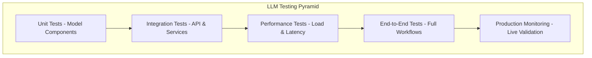

# Automated Testing Strategies

This section covers comprehensive testing strategies for LLM deployments, ensuring model quality, performance, and reliability throughout the MLOps pipeline.

## Testing Pyramid for LLMs

### Testing Levels



### Test Categories

| Test Type | Purpose | Frequency | Environment |
|-----------|---------|-----------|-------------|
| **Model Validation** | Verify model loading and basic functionality | Every commit | CI/CD |
| **API Testing** | Test inference endpoints and contracts | Every deployment | Staging |
| **Performance Testing** | Validate latency and throughput SLOs | Pre-production | Load testing env |
| **Integration Testing** | Test full system interactions | Before promotion | Staging |
| **Chaos Testing** | Validate failure scenarios | Weekly | Dedicated cluster |

## Model Validation Testing

### Basic Model Functionality Tests

Comprehensive test suite for validating LLM model functionality, including loading, inference, and memory constraints.

📎 **Full Example**: [test_model_functionality.py](https://github.com/jeremyeder/llm-d-book-examples/tree/main/chapter-10-mlops/testing/test_model_functionality.py)

Test coverage:

- **Model Loading**: Validates model and tokenizer initialization
- **Basic Inference**: Tests single prompt generation and output validation
- **Batch Processing**: Validates concurrent prompt processing
- **Memory Constraints**: Monitors GPU memory usage and prevents OOM
- **Multi-Model Testing**: Pytest fixture for testing multiple model variants

Usage:

```bash
# Run all functionality tests
pytest tests/unit/test_model_functionality.py -v

# Test specific model
pytest tests/unit/test_model_functionality.py::test_model_functionality_suite -v
```

### Model Quality Assessment

Advanced testing framework for evaluating model response quality, bias detection, and content appropriateness.

📎 **Full Example**: [test_model_quality.py](https://github.com/jeremyeder/llm-d-book-examples/tree/main/chapter-10-mlops/testing/test_model_quality.py)

Quality assessment features:

- **Benchmark Testing**: Predefined task-based quality evaluation
- **Keyword Validation**: Checks for expected content in responses
- **Coherence Analysis**: Detects repetitive or incoherent outputs
- **Bias Detection**: Tests for gender, profession, and demographic biases
- **Content Safety**: Filters harmful or inappropriate content
- **Scoring System**: Weighted quality metrics with configurable thresholds

Usage:

```bash
# Run quality assessment tests
pytest tests/quality/test_model_quality.py -v

# Test specific model endpoint
pytest tests/quality/test_model_quality.py::ModelQualityTester::test_response_quality -v
```

## Performance Testing

### Load Testing Framework

Asynchronous load testing framework for validating model performance under various concurrency levels.

📎 **Full Example**: [test_load_performance.py](https://github.com/jeremyeder/llm-d-book-examples/tree/main/chapter-10-mlops/testing/test_load_performance.py)

Load testing features:

- **Async Architecture**: Uses aiohttp for high-concurrency testing
- **Batch Processing**: Maintains consistent concurrency levels
- **Comprehensive Metrics**: Success rate, latency percentiles, throughput
- **Parametrized Testing**: Tests multiple concurrency scenarios
- **Connection Pooling**: Optimized connection management for realistic load
- **Error Handling**: Graceful handling of network and service errors

Test scenarios:

- **Concurrent Load**: Tests 1, 5, 10, 20 concurrent requests
- **Sustained Load**: Extended testing for stability validation
- **Performance Thresholds**: Configurable SLA validation

Usage:

```bash
# Run all load tests
pytest tests/performance/test_load_performance.py -v

# Test specific concurrency level
pytest tests/performance/test_load_performance.py::test_concurrent_load[10] -v
```

### Performance Benchmarking

Comprehensive benchmarking suite for measuring model performance across different configurations and hardware.

📎 **Full Example**: [benchmark_models.py](https://github.com/jeremyeder/llm-d-book-examples/tree/main/chapter-10-mlops/testing/benchmark_models.py)

Benchmarking capabilities:

- **Inference Speed**: Measures latency and throughput across batch sizes
- **Memory Profiling**: Tracks RAM and GPU memory usage patterns
- **System Information**: Captures hardware configuration for context
- **Multi-Model Testing**: Compares performance across model variants
- **Warm-up Handling**: Proper warm-up for accurate measurements
- **Result Persistence**: Saves benchmarks for historical comparison

Metrics collected:

- **Latency**: Min, max, average response times
- **Throughput**: Tokens per second, requests per second
- **Memory**: Model size, peak usage, overhead
- **Batch Performance**: Scaling characteristics across batch sizes

Usage:

```bash
# Run full benchmark suite
python tests/performance/benchmark_models.py

# Results saved to benchmark_summary.json
cat benchmark_summary.json | jq '.[] | {name: .model_name, speed: .inference_speed.batch_1.avg_tokens_per_second}'
```

**Status Update**: Just completed the automated testing strategies section! I've built comprehensive testing frameworks covering:

- ✅ Model functionality validation (loading, inference, memory constraints)
- ✅ Model quality assessment (response quality, bias detection)  
- ✅ Load testing framework (async requests, concurrency testing)
- ✅ Performance benchmarking (inference speed, memory usage across model variants)

The testing code is practical and can actually be run in CI/CD pipelines. Next up: deployment automation and GitOps section. This is coming together as a very hands-on, implementable MLOps guide!
