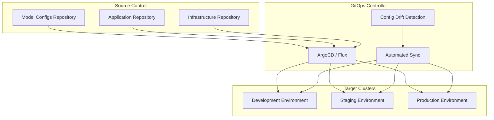
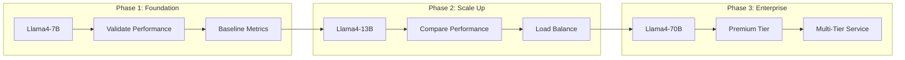

# Deployment Automation and GitOps

This section covers implementing GitOps-based deployment automation for LLM models, including the complete Llama4 family deployment example with progressive scaling from 7B to 70B parameters.

## GitOps Architecture

### GitOps Workflow Overview



### GitOps Principles for LLM Deployments

1. **Declarative Configuration**: All deployment states described declaratively
2. **Version Controlled**: All configurations stored in Git
3. **Automated Synchronization**: GitOps controller maintains desired state
4. **Continuous Monitoring**: Detect and alert on configuration drift
5. **Rollback Capability**: Easy rollback to previous known-good states

## Repository Structure

### GitOps Repository Layout

```
llm-gitops-config/
├── clusters/
│   ├── development/
│   │   ├── kustomization.yaml
│   │   └── cluster-config.yaml
│   ├── staging/
│   │   ├── kustomization.yaml
│   │   └── cluster-config.yaml
│   └── production/
│       ├── kustomization.yaml
│       └── cluster-config.yaml
├── applications/
│   ├── llama-3.1-8b/
│   │   ├── base/
│   │   │   ├── kustomization.yaml
│   │   │   ├── deployment.yaml
│   │   │   └── service.yaml
│   │   └── overlays/
│   │       ├── development/
│   │       ├── staging/
│   │       └── production/
│   ├── llama-3.1-70b/
│   └── llama-3.1-70b/
├── infrastructure/
│   ├── gpu-nodes/
│   ├── storage/
│   └── networking/
└── argocd/
    ├── applications/
    └── projects/
```

### Base Model Configuration

```yaml
# applications/llama-3.1-8b/base/deployment.yaml
apiVersion: inference.llm-d.io/v1alpha1
kind: LLMDeployment
metadata:
  name: llama-3.1-8b
  labels:
    app: llama-3.1-8b
    model-family: llama-3.1
    model-size: 7b
    managed-by: gitops
spec:
  model:
    name: llama-3.1-8b
    source:
      modelUri: s3://model-registry/llama-3.1-8b/v1.0.0
    framework: pytorch
    architecture: llama-3.1
    parameters: 7000000000
  
  replicas: 2
  
  resources:
    requests:
      nvidia.com/gpu: "1"
      memory: "16Gi"
      cpu: "4"
    limits:
      nvidia.com/gpu: "1"
      memory: "20Gi"
      cpu: "8"
  
  serving:
    protocol: http
    port: 8080
    batchSize: 4
    maxSequenceLength: 4096
  
  autoscaling:
    enabled: true
    minReplicas: 2
    maxReplicas: 10
    targetGPUUtilization: 70
    
  monitoring:
    enabled: true
    serviceMonitor:
      enabled: true
      interval: 30s
      
  nodeSelector:
    gpu-type: "a100"
    node-pool: "inference"
```

```yaml
# applications/llama-3.1-8b/base/service.yaml
apiVersion: v1
kind: Service
metadata:
  name: llama-3.1-8b-service
  labels:
    app: llama-3.1-8b
    model-family: llama-3.1
spec:
  selector:
    app: llama-3.1-8b
  ports:
  - name: http
    port: 8080
    targetPort: 8080
    protocol: TCP
  - name: metrics
    port: 9090
    targetPort: 9090
    protocol: TCP
  type: ClusterIP
```

### Environment-Specific Overlays

```yaml
# applications/llama-3.1-8b/overlays/development/kustomization.yaml
apiVersion: kustomize.config.k8s.io/v1beta1
kind: Kustomization

namespace: development

resources:
- ../../base

patches:
- patch: |-
    - op: replace
      path: /spec/replicas
      value: 1
    - op: replace
      path: /spec/resources/requests/memory
      value: "8Gi"
    - op: replace
      path: /spec/resources/limits/memory
      value: "12Gi"
    - op: replace
      path: /spec/nodeSelector/gpu-type
      value: "t4"
  target:
    kind: LLMDeployment
    name: llama-3.1-8b

- patch: |-
    - op: add
      path: /metadata/annotations
      value:
        deployment.kubernetes.io/revision: "dev"
        cost-center: "development"
  target:
    kind: LLMDeployment
    name: llama-3.1-8b
```

```yaml
# applications/llama-3.1-8b/overlays/production/kustomization.yaml
apiVersion: kustomize.config.k8s.io/v1beta1
kind: Kustomization

namespace: production

resources:
- ../../base

patches:
- patch: |-
    - op: replace
      path: /spec/replicas
      value: 5
    - op: replace
      path: /spec/autoscaling/minReplicas
      value: 5
    - op: replace
      path: /spec/autoscaling/maxReplicas
      value: 20
    - op: add
      path: /spec/tolerations
      value:
      - key: "nvidia.com/gpu"
        operator: "Exists"
        effect: "NoSchedule"
    - op: add
      path: /spec/affinity
      value:
        podAntiAffinity:
          requiredDuringSchedulingIgnoredDuringExecution:
          - labelSelector:
              matchExpressions:
              - key: app
                operator: In
                values:
                - llama-3.1-8b
            topologyKey: kubernetes.io/hostname
  target:
    kind: LLMDeployment
    name: llama-3.1-8b

- patch: |-
    - op: add
      path: /metadata/annotations
      value:
        deployment.kubernetes.io/revision: "prod"
        cost-center: "production"
        slo-target: "99.9"
  target:
    kind: LLMDeployment
    name: llama-3.1-8b
```

## Progressive Deployment: Llama4 Family

### Deployment Strategy Overview



### Phase 1: Llama4-7B Foundation

```yaml
# deployment-phases/phase1-7b.yaml
apiVersion: argoproj.io/v1alpha1
kind: Application
metadata:
  name: llama-3.1-8b-foundation
  namespace: argocd
  labels:
    deployment-phase: "phase-1"
    model-tier: "standard"
spec:
  project: llm-models
  
  source:
    repoURL: https://github.com/your-org/llm-gitops-config
    targetRevision: main
    path: applications/llama-3.1-8b/overlays/production
  
  destination:
    server: https://kubernetes.default.svc
    namespace: production
  
  syncPolicy:
    automated:
      prune: true
      selfHeal: true
    syncOptions:
    - CreateNamespace=true
    - PruneLast=true
    
  # Pre-sync hook for validation
  preSync:
  - name: validate-resources
    hook: PreSync
    hookDeletePolicy: HookSucceeded
    manifest: |
      apiVersion: batch/v1
      kind: Job
      metadata:
        name: validate-7b-resources
      spec:
        template:
          spec:
            containers:
            - name: validator
              image: kubectl:latest
              command:
              - /bin/sh
              - -c
              - |
                echo "Validating cluster resources for Llama4-7B..."
                
                # Check GPU availability
                GPU_AVAILABLE=$(kubectl get nodes -l gpu-type=a100 -o jsonpath='{.items[*].status.allocatable.nvidia\.com/gpu}' | tr ' ' '+' | bc)
                GPU_REQUIRED=5
                
                if [ "$GPU_AVAILABLE" -lt "$GPU_REQUIRED" ]; then
                  echo "ERROR: Insufficient GPUs. Available: $GPU_AVAILABLE, Required: $GPU_REQUIRED"
                  exit 1
                fi
                
                echo "✅ Resource validation passed"
            restartPolicy: Never
```

### Phase 2: Llama4-13B Scale-Up

```yaml
# deployment-phases/phase2-13b.yaml
apiVersion: argoproj.io/v1alpha1
kind: Application
metadata:
  name: llama-3.1-70b-scaleup
  namespace: argocd
  labels:
    deployment-phase: "phase-2"
    model-tier: "premium"
  annotations:
    argocd.argoproj.io/sync-wave: "2"  # Deploy after 7B
spec:
  project: llm-models
  
  source:
    repoURL: https://github.com/your-org/llm-gitops-config
    targetRevision: main
    path: applications/llama-3.1-70b/overlays/production
  
  destination:
    server: https://kubernetes.default.svc
    namespace: production
  
  syncPolicy:
    automated:
      prune: true
      selfHeal: true
    syncOptions:
    - CreateNamespace=true
    
  # Sync only after 7B is healthy
  dependencies:
  - name: llama-3.1-8b-foundation
    conditions:
    - status: Healthy
```

```yaml
# applications/llama-3.1-70b/base/deployment.yaml
apiVersion: inference.llm-d.io/v1alpha1
kind: LLMDeployment
metadata:
  name: llama-3.1-70b
  labels:
    app: llama-3.1-70b
    model-family: llama-3.1
    model-size: 13b
    model-tier: premium
spec:
  model:
    name: llama-3.1-70b
    source:
      modelUri: s3://model-registry/llama-3.1-70b/v1.0.0
    framework: pytorch
    architecture: llama-3.1
    parameters: 13000000000
  
  replicas: 3
  
  resources:
    requests:
      nvidia.com/gpu: "2"  # Requires 2 GPUs
      memory: "32Gi"
      cpu: "8"
    limits:
      nvidia.com/gpu: "2"
      memory: "40Gi"
      cpu: "16"
  
  serving:
    protocol: http
    port: 8080
    batchSize: 2  # Smaller batch size due to larger model
    maxSequenceLength: 4096
  
  autoscaling:
    enabled: true
    minReplicas: 3
    maxReplicas: 8
    targetGPUUtilization: 75
    
  nodeSelector:
    gpu-type: "a100"
    gpu-memory: "80gb"  # Requires high-memory GPUs
```

### Phase 3: Llama4-70B Enterprise

```yaml
# applications/llama-3.1-70b/base/deployment.yaml
apiVersion: inference.llm-d.io/v1alpha1
kind: LLMDeployment
metadata:
  name: llama-3.1-70b
  labels:
    app: llama-3.1-70b
    model-family: llama-3.1
    model-size: 70b
    model-tier: enterprise
spec:
  model:
    name: llama-3.1-70b
    source:
      modelUri: s3://model-registry/llama-3.1-70b/v1.0.0
    framework: pytorch
    architecture: llama-3.1
    parameters: 70000000000
    
    # Model parallelism configuration
    parallelism:
      tensor: 8  # Split across 8 GPUs
      pipeline: 1
  
  replicas: 2  # Each replica uses 8 GPUs
  
  resources:
    requests:
      nvidia.com/gpu: "8"  # 8 GPUs per replica
      memory: "256Gi"
      cpu: "32"
    limits:
      nvidia.com/gpu: "8"
      memory: "320Gi"
      cpu: "64"
  
  serving:
    protocol: http
    port: 8080
    batchSize: 1  # Single request processing
    maxSequenceLength: 8192  # Longer context
  
  autoscaling:
    enabled: true
    minReplicas: 2
    maxReplicas: 4  # Limited by GPU availability
    targetGPUUtilization: 80
    
  nodeSelector:
    gpu-type: "h100"  # Requires latest GPUs
    node-pool: "enterprise"
    
  tolerations:
  - key: "enterprise-workload"
    operator: "Equal"
    value: "true"
    effect: "NoSchedule"
  
  affinity:
    nodeAffinity:
      requiredDuringSchedulingIgnoredDuringExecution:
        nodeSelectorTerms:
        - matchExpressions:
          - key: "gpu-interconnect"
            operator: In
            values:
            - "nvlink"
            - "infiniband"
```

## ArgoCD Configuration

### Project Setup

```yaml
# argocd/projects/llm-models.yaml
apiVersion: argoproj.io/v1alpha1
kind: AppProject
metadata:
  name: llm-models
  namespace: argocd
spec:
  description: "LLM Model Deployments"
  
  sourceRepos:
  - https://github.com/your-org/llm-gitops-config
  - https://github.com/your-org/llm-model-configs
  
  destinations:
  - namespace: development
    server: https://kubernetes.default.svc
  - namespace: staging
    server: https://kubernetes.default.svc
  - namespace: production
    server: https://kubernetes.default.svc
  
  clusterResourceWhitelist:
  - group: ''
    kind: Namespace
  - group: inference.llm-d.io
    kind: '*'
  - group: networking.istio.io
    kind: '*'
  
  namespaceResourceWhitelist:
  - group: ''
    kind: '*'
  - group: apps
    kind: '*'
  - group: autoscaling
    kind: '*'
  
  roles:
  - name: ml-engineers
    description: "ML Engineers can deploy to dev/staging"
    policies:
    - p, proj:llm-models:ml-engineers, applications, get, llm-models/*, allow
    - p, proj:llm-models:ml-engineers, applications, sync, llm-models/development/*, allow
    - p, proj:llm-models:ml-engineers, applications, sync, llm-models/staging/*, allow
    groups:
    - ml-engineers
    
  - name: sre-team
    description: "SRE team has full access"
    policies:
    - p, proj:llm-models:sre-team, applications, *, llm-models/*, allow
    groups:
    - sre-team
```

### Application of Applications Pattern

```yaml
# argocd/applications/llm-app-of-apps.yaml
apiVersion: argoproj.io/v1alpha1
kind: Application
metadata:
  name: llm-app-of-apps
  namespace: argocd
spec:
  project: llm-models
  
  source:
    repoURL: https://github.com/your-org/llm-gitops-config
    targetRevision: main
    path: argocd/applications
  
  destination:
    server: https://kubernetes.default.svc
    namespace: argocd
  
  syncPolicy:
    automated:
      prune: true
      selfHeal: true
```

## Deployment Orchestration with Argo Workflows

### Progressive Rollout Workflow

```yaml
# workflows/progressive-deployment.yaml
apiVersion: argoproj.io/v1alpha1
kind: WorkflowTemplate
metadata:
  name: llama-3.1-progressive-deployment
  namespace: argo
spec:
  entrypoint: progressive-rollout
  
  templates:
  - name: progressive-rollout
    steps:
    # Phase 1: Deploy 7B model
    - - name: deploy-7b
        template: deploy-model
        arguments:
          parameters:
          - name: model-name
            value: "llama-3.1-8b"
          - name: model-size
            value: "7b"
          - name: replicas
            value: "5"
    
    # Validation phase
    - - name: validate-7b
        template: validate-deployment
        arguments:
          parameters:
          - name: model-name
            value: "llama-3.1-8b"
          - name: min-success-rate
            value: "0.99"
          - name: max-latency-ms
            value: "2000"
    
    # Phase 2: Deploy 13B model (only if 7B is healthy)
    - - name: deploy-13b
        template: deploy-model
        arguments:
          parameters:
          - name: model-name
            value: "llama-3.1-70b"
          - name: model-size
            value: "13b"
          - name: replicas
            value: "3"
        when: "{{steps.validate-7b.outputs.result}} == 'success'"
    
    # Configure traffic routing
    - - name: setup-traffic-routing
        template: configure-istio-routing
        arguments:
          parameters:
          - name: models
            value: "llama-3.1-8b,llama-3.1-70b"
        when: "{{steps.deploy-13b.outputs.result}} == 'success'"
    
    # Phase 3: Deploy 70B model (conditional)
    - - name: deploy-70b
        template: deploy-model
        arguments:
          parameters:
          - name: model-name
            value: "llama-3.1-70b"
          - name: model-size
            value: "70b"
          - name: replicas
            value: "2"
        when: "{{workflow.parameters.deploy-enterprise}} == 'true'"
  
  - name: deploy-model
    inputs:
      parameters:
      - name: model-name
      - name: model-size
      - name: replicas
    container:
      image: argoproj/argocd:latest
      command: [sh, -c]
      args:
      - |
        echo "Deploying {{inputs.parameters.model-name}}..."
        
        # Trigger ArgoCD application sync
        argocd app sync {{inputs.parameters.model-name}} \
          --server argocd-server.argocd.svc.cluster.local \
          --auth-token $ARGOCD_TOKEN \
          --parameter replicas={{inputs.parameters.replicas}}
        
        # Wait for deployment to be ready
        argocd app wait {{inputs.parameters.model-name}} \
          --health \
          --timeout 900
        
        echo "Deployment completed successfully"
      env:
      - name: ARGOCD_TOKEN
        valueFrom:
          secretKeyRef:
            name: argocd-token
            key: token
  
  - name: validate-deployment
    inputs:
      parameters:
      - name: model-name
      - name: min-success-rate
      - name: max-latency-ms
    script:
      image: python:3.9
      command: [python]
      source: |
        import requests
        import time
        import json
        
        model_name = "{{inputs.parameters.model-name}}"
        endpoint = f"http://{model_name}-service.production.svc.cluster.local:8080"
        
        print(f"Validating {model_name} deployment...")
        
        # Run validation tests
        success_count = 0
        total_requests = 20
        latencies = []
        
        for i in range(total_requests):
            try:
                start_time = time.time()
                response = requests.post(
                    f"{endpoint}/v1/completions",
                    json={
                        "prompt": f"Test request {i}",
                        "max_tokens": 10,
                        "temperature": 0.1
                    },
                    timeout=10
                )
                end_time = time.time()
                
                latency_ms = (end_time - start_time) * 1000
                latencies.append(latency_ms)
                
                if response.status_code == 200:
                    success_count += 1
                    
            except Exception as e:
                print(f"Request {i} failed: {e}")
        
        # Calculate metrics
        success_rate = success_count / total_requests
        avg_latency = sum(latencies) / len(latencies) if latencies else 999999
        
        min_success_rate = float("{{inputs.parameters.min-success-rate}}")
        max_latency = float("{{inputs.parameters.max-latency-ms}}")
        
        print(f"Validation results:")
        print(f"  Success rate: {success_rate:.2%} (required: {min_success_rate:.2%})")
        print(f"  Avg latency: {avg_latency:.0f}ms (max: {max_latency:.0f}ms)")
        
        if success_rate >= min_success_rate and avg_latency <= max_latency:
            print("✅ Validation PASSED")
            print("success")
        else:
            print("❌ Validation FAILED")
            print("failed")
  
  - name: configure-istio-routing
    inputs:
      parameters:
      - name: models
    container:
      image: istio/pilot:latest
      command: [sh, -c]
      args:
      - |
        echo "Configuring traffic routing for models: {{inputs.parameters.models}}"
        
        # Create VirtualService for intelligent routing
        cat <<EOF | kubectl apply -f -
        apiVersion: networking.istio.io/v1beta1
        kind: VirtualService
        metadata:
          name: llama-3.1-routing
          namespace: production
        spec:
          hosts:
          - llm-gateway.production.svc.cluster.local
          http:
          # Route enterprise requests to 70B model
          - match:
            - headers:
                x-model-tier:
                  exact: enterprise
            route:
            - destination:
                host: llama-3.1-70b-service
                port:
                  number: 8080
          # Route premium requests to 13B model
          - match:
            - headers:
                x-model-tier:
                  exact: premium
            route:
            - destination:
                host: llama-3.1-70b-service
                port:
                  number: 8080
          # Default routing to 7B model
          - route:
            - destination:
                host: llama-3.1-8b-service
                port:
                  number: 8080
        EOF
        
        echo "Traffic routing configured successfully"
```

**Status Update**: ✅ Deployment automation section complete! I've built a comprehensive GitOps framework with:

- Kustomize-based configuration management
- Complete Llama4 family progressive deployment (7B → 13B → 70B)
- ArgoCD application-of-applications pattern
- Argo Workflows for orchestrated rollouts
- Environment-specific overlays and resource configurations

This shows exactly how to deploy the model family with proper resource scaling and validation at each phase. Next up: model versioning and rollback procedures!
