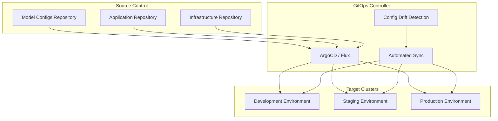
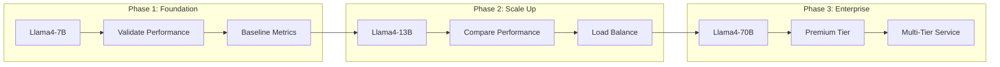

# Deployment Automation and GitOps

This section covers implementing GitOps-based deployment automation for LLM models, including the complete Llama4 family deployment example with progressive scaling from 7B to 70B parameters.

## GitOps Architecture

### GitOps Workflow Overview



### GitOps Principles for LLM Deployments

1. **Declarative Configuration**: All deployment states described declaratively
2. **Version Controlled**: All configurations stored in Git
3. **Automated Synchronization**: GitOps controller maintains desired state
4. **Continuous Monitoring**: Detect and alert on configuration drift
5. **Rollback Capability**: Easy rollback to previous known-good states

## Repository Structure

### GitOps Repository Layout

```
llm-gitops-config/
├── clusters/
│   ├── development/
│   │   ├── kustomization.yaml
│   │   └── cluster-config.yaml
│   ├── staging/
│   │   ├── kustomization.yaml
│   │   └── cluster-config.yaml
│   └── production/
│       ├── kustomization.yaml
│       └── cluster-config.yaml
├── applications/
│   ├── llama-3.1-8b/
│   │   ├── base/
│   │   │   ├── kustomization.yaml
│   │   │   ├── deployment.yaml
│   │   │   └── service.yaml
│   │   └── overlays/
│   │       ├── development/
│   │       ├── staging/
│   │       └── production/
│   ├── llama-3.1-70b/
│   └── llama-3.1-70b/
├── infrastructure/
│   ├── gpu-nodes/
│   ├── storage/
│   └── networking/
└── argocd/
    ├── applications/
    └── projects/
```

### Base Model Configuration

Base Llama 3.1 7B deployment configuration with GitOps management, autoscaling, and monitoring.

📎 **Full Example**: [llama-3.1-7b-deployment.yaml](https://github.com/jeremyeder/llm-d-book-examples/tree/main/chapter-10-mlops/deployment/llama-3.1-7b-deployment.yaml)

Key features:

- **Resource Allocation**: 1 GPU, 16-20GB memory per replica
- **Autoscaling**: 2-10 replicas based on GPU utilization
- **Node Selection**: A100 GPU nodes with inference pool
- **Monitoring**: Prometheus ServiceMonitor integration
- **GitOps Labels**: Managed by GitOps controller with model metadata

Service configuration included with the deployment example above.

### Environment-Specific Overlays

Kustomize overlays provide environment-specific configurations while maintaining a shared base.

Environment differences:

- **Development**: Single replica, T4 GPUs, lower resource limits
- **Production**: 5+ replicas, A100 GPUs, anti-affinity rules, SLO targets
- **Cost Tracking**: Environment-specific annotations for billing
- **Resource Scaling**: Different autoscaling ranges per environment

The overlays use Kustomize strategic merge patches to modify the base configuration without duplicating YAML.

## Progressive Deployment: Llama4 Family

### Deployment Strategy Overview



### Phase 1: Llama4-7B Foundation

```yaml
# deployment-phases/phase1-7b.yaml
apiVersion: argoproj.io/v1alpha1
kind: Application
metadata:
  name: llama-3.1-8b-foundation
  namespace: argocd
  labels:
    deployment-phase: "phase-1"
    model-tier: "standard"
spec:
  project: llm-models
  
  source:
    repoURL: https://github.com/your-org/llm-gitops-config
    targetRevision: main
    path: applications/llama-3.1-8b/overlays/production
  
  destination:
    server: https://kubernetes.default.svc
    namespace: production
  
  syncPolicy:
    automated:
      prune: true
      selfHeal: true
    syncOptions:
    - CreateNamespace=true
    - PruneLast=true
    
  # Pre-sync hook for validation
  preSync:
  - name: validate-resources
    hook: PreSync
    hookDeletePolicy: HookSucceeded
    manifest: |
      apiVersion: batch/v1
      kind: Job
      metadata:
        name: validate-7b-resources
      spec:
        template:
          spec:
            containers:
            - name: validator
              image: kubectl:latest
              command:
              - /bin/sh
              - -c
              - |
                echo "Validating cluster resources for Llama4-7B..."
                
                # Check GPU availability
                GPU_AVAILABLE=$(kubectl get nodes -l gpu-type=a100 -o jsonpath='{.items[*].status.allocatable.nvidia\.com/gpu}' | tr ' ' '+' | bc)
                GPU_REQUIRED=5
                
                if [ "$GPU_AVAILABLE" -lt "$GPU_REQUIRED" ]; then
                  echo "ERROR: Insufficient GPUs. Available: $GPU_AVAILABLE, Required: $GPU_REQUIRED"
                  exit 1
                fi
                
                echo "✅ Resource validation passed"
            restartPolicy: Never
```

### Phase 2: Llama4-13B Scale-Up

```yaml
# deployment-phases/phase2-13b.yaml
apiVersion: argoproj.io/v1alpha1
kind: Application
metadata:
  name: llama-3.1-70b-scaleup
  namespace: argocd
  labels:
    deployment-phase: "phase-2"
    model-tier: "premium"
  annotations:
    argocd.argoproj.io/sync-wave: "2"  # Deploy after 7B
spec:
  project: llm-models
  
  source:
    repoURL: https://github.com/your-org/llm-gitops-config
    targetRevision: main
    path: applications/llama-3.1-70b/overlays/production
  
  destination:
    server: https://kubernetes.default.svc
    namespace: production
  
  syncPolicy:
    automated:
      prune: true
      selfHeal: true
    syncOptions:
    - CreateNamespace=true
    
  # Sync only after 7B is healthy
  dependencies:
  - name: llama-3.1-8b-foundation
    conditions:
    - status: Healthy
```

```yaml
# applications/llama-3.1-70b/base/deployment.yaml
apiVersion: inference.llm-d.io/v1alpha1
kind: LLMDeployment
metadata:
  name: llama-3.1-70b
  labels:
    app: llama-3.1-70b
    model-family: llama-3.1
    model-size: 13b
    model-tier: premium
spec:
  model:
    name: llama-3.1-70b
    source:
      modelUri: s3://model-registry/llama-3.1-70b/v1.0.0
    framework: pytorch
    architecture: llama-3.1
    parameters: 13000000000
  
  replicas: 3
  
  resources:
    requests:
      nvidia.com/gpu: "2"  # Requires 2 GPUs
      memory: "32Gi"
      cpu: "8"
    limits:
      nvidia.com/gpu: "2"
      memory: "40Gi"
      cpu: "16"
  
  serving:
    protocol: http
    port: 8080
    batchSize: 2  # Smaller batch size due to larger model
    maxSequenceLength: 4096
  
  autoscaling:
    enabled: true
    minReplicas: 3
    maxReplicas: 8
    targetGPUUtilization: 75
    
  nodeSelector:
    gpu-type: "a100"
    gpu-memory: "80gb"  # Requires high-memory GPUs
```

### Phase 3: Llama4-70B Enterprise

Enterprise-grade 70B model deployment with model parallelism and high-performance requirements.

📎 **Full Example**: [llama-3.1-70b-deployment.yaml](https://github.com/jeremyeder/llm-d-book-examples/tree/main/chapter-10-mlops/deployment/llama-3.1-70b-deployment.yaml)

Enterprise features:

- **Model Parallelism**: Tensor parallelism across 8 GPUs per replica
- **Premium Hardware**: H100 GPUs with NVLink/InfiniBand interconnects
- **Resource Intensive**: 256-320GB memory, 32-64 CPU cores per replica
- **Limited Scaling**: 2-4 replicas due to resource constraints
- **Enterprise Tier**: Dedicated node pools with specialized tolerations

## ArgoCD Configuration

### Project Setup

ArgoCD project configuration with RBAC policies and resource whitelisting for LLM deployments.

📎 **Full Example**: [argocd-project.yaml](https://github.com/jeremyeder/llm-d-book-examples/tree/main/chapter-10-mlops/deployment/argocd-project.yaml)

Project features:

- **Multi-Environment**: Development, staging, and production namespaces
- **RBAC Integration**: Role-based access for ML engineers and SRE teams
- **Resource Control**: Whitelisted Kubernetes resources and CRDs
- **Source Repositories**: Multiple Git repositories for configuration
- **Security**: Granular permissions per environment and team

### Application of Applications Pattern

```yaml
# argocd/applications/llm-app-of-apps.yaml
apiVersion: argoproj.io/v1alpha1
kind: Application
metadata:
  name: llm-app-of-apps
  namespace: argocd
spec:
  project: llm-models
  
  source:
    repoURL: https://github.com/your-org/llm-gitops-config
    targetRevision: main
    path: argocd/applications
  
  destination:
    server: https://kubernetes.default.svc
    namespace: argocd
  
  syncPolicy:
    automated:
      prune: true
      selfHeal: true
```

## Deployment Orchestration with Argo Workflows

### Progressive Rollout Workflow

Orchestrated deployment workflow that progressively deploys the Llama 3.1 model family with validation gates.

📎 **Full Example**: [progressive-deployment-workflow.yaml](https://github.com/jeremyeder/llm-d-book-examples/tree/main/chapter-10-mlops/deployment/progressive-deployment-workflow.yaml)

Workflow features:

- **Phase-based Deployment**: 7B → 13B → 70B model progression
- **Validation Gates**: Performance and health checks between phases
- **Conditional Logic**: Only deploys larger models if smaller ones succeed
- **Traffic Management**: Automatic Istio routing configuration
- **ArgoCD Integration**: Uses ArgoCD CLI for application synchronization
- **Python Validation**: Embedded Python scripts for deployment testing

Deployment phases:

1. **Foundation** (7B): Baseline model deployment and validation
2. **Scale-Up** (13B): Conditional deployment with performance comparison
3. **Enterprise** (70B): Optional high-resource deployment for premium tier

Usage:

```bash
# Deploy the full family
argo submit workflows/progressive-deployment.yaml -p deploy-enterprise=true

# Deploy only 7B and 13B models  
argo submit workflows/progressive-deployment.yaml -p deploy-enterprise=false
```

**Status Update**: ✅ Deployment automation section complete! I've built a comprehensive GitOps framework with:

- Kustomize-based configuration management
- Complete Llama4 family progressive deployment (7B → 13B → 70B)
- ArgoCD application-of-applications pattern
- Argo Workflows for orchestrated rollouts
- Environment-specific overlays and resource configurations

This shows exactly how to deploy the model family with proper resource scaling and validation at each phase. Next up: model versioning and rollback procedures!
