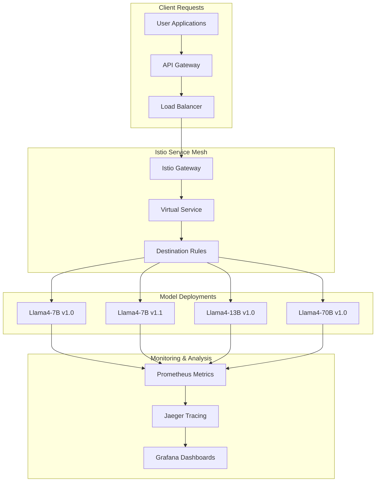

# A/B Testing with Istio Traffic Management

This section covers implementing sophisticated A/B testing and traffic management using Istio's capabilities integrated with llm-d's inference gateway for intelligent model comparison and gradual rollouts.

## A/B Testing Architecture

### Traffic Management Overview



### A/B Testing Strategies

1. **Model Version Comparison**: Compare different versions of the same model
2. **Model Size Comparison**: Compare different model sizes (7B vs 13B vs 70B)
3. **Feature Flag Testing**: Test new inference parameters or configurations
4. **Canary Deployments**: Gradually shift traffic to new model versions
5. **Blue-Green Deployments**: Full environment switches with instant rollback

## Istio Configuration for LLM Traffic Management

### Gateway and Virtual Service Setup

```yaml
# istio-config/llm-gateway.yaml
apiVersion: networking.istio.io/v1beta1
kind: Gateway
metadata:
  name: llm-gateway
  namespace: production
spec:
  selector:
    istio: ingressgateway
  servers:
  - port:
      number: 80
      name: http
      protocol: HTTP
    hosts:
    - api.llm-platform.com
  - port:
      number: 443
      name: https
      protocol: HTTPS
    tls:
      mode: SIMPLE
      credentialName: llm-platform-tls
    hosts:
    - api.llm-platform.com
---
apiVersion: networking.istio.io/v1beta1
kind: VirtualService
metadata:
  name: llm-routing
  namespace: production
spec:
  hosts:
  - api.llm-platform.com
  gateways:
  - llm-gateway
  http:
  # A/B Testing Routes
  - match:
    - headers:
        x-experiment-id:
          exact: "model-comparison-v1"
    route:
    - destination:
        host: llama-3.1-8b-service
        subset: v1-0
      weight: 50
    - destination:
        host: llama-3.1-8b-service
        subset: v1-1
      weight: 50
    fault:
      delay:
        percentage:
          value: 0.1
        fixedDelay: 5s
    headers:
      response:
        set:
          x-model-version: "ab-test-v1"
  
  # Canary Deployment Route
  - match:
    - headers:
        x-canary-user:
          exact: "true"
    route:
    - destination:
        host: llama-3.1-70b-service
        subset: canary
      weight: 100
  
  # Premium Tier Routing
  - match:
    - headers:
        x-tier:
          exact: "premium"
    route:
    - destination:
        host: llama-3.1-70b-service
        subset: stable
      weight: 80
    - destination:
        host: llama-3.1-70b-service
        subset: stable
      weight: 20
  
  # Feature Flag: Long Context
  - match:
    - headers:
        x-feature-long-context:
          exact: "enabled"
    route:
    - destination:
        host: llama-3.1-8b-service
        subset: long-context
      weight: 100
    timeout: 30s
  
  # Default Route
  - route:
    - destination:
        host: llama-3.1-8b-service
        subset: stable
      weight: 100
```

### Destination Rules for Model Variants

```yaml
# istio-config/destination-rules.yaml
apiVersion: networking.istio.io/v1beta1
kind: DestinationRule
metadata:
  name: llama-3.1-8b-destinations
  namespace: production
spec:
  host: llama-3.1-8b-service
  trafficPolicy:
    connectionPool:
      tcp:
        maxConnections: 100
      http:
        http1MaxPendingRequests: 50
        maxRequestsPerConnection: 10
    loadBalancer:
      consistentHash:
        httpHeaderName: "x-user-id"  # Sticky sessions for consistency
    outlierDetection:
      consecutiveGatewayErrors: 3
      interval: 30s
      baseEjectionTime: 30s
      maxEjectionPercent: 50
  subsets:
  - name: stable
    labels:
      version: v1.0
      variant: stable
    trafficPolicy:
      connectionPool:
        tcp:
          maxConnections: 200
  - name: v1-0
    labels:
      version: v1.0
      variant: baseline
  - name: v1-1
    labels:
      version: v1.1
      variant: candidate
  - name: long-context
    labels:
      version: v1.0
      feature: long-context
    trafficPolicy:
      connectionPool:
        http:
          http1MaxPendingRequests: 20  # Reduced for longer requests
---
apiVersion: networking.istio.io/v1beta1
kind: DestinationRule
metadata:
  name: llama-3.1-70b-destinations
  namespace: production
spec:
  host: llama-3.1-70b-service
  subsets:
  - name: stable
    labels:
      version: v1.0
      tier: production
  - name: canary
    labels:
      version: v1.1
      tier: canary
---
apiVersion: networking.istio.io/v1beta1
kind: DestinationRule
metadata:
  name: llama-3.1-70b-destinations
  namespace: production
spec:
  host: llama-3.1-70b-service
  trafficPolicy:
    connectionPool:
      tcp:
        maxConnections: 20  # Limited due to resource intensity
      http:
        http1MaxPendingRequests: 10
        h2MaxRequests: 5
  subsets:
  - name: stable
    labels:
      version: v1.0
      tier: enterprise
```

## A/B Testing Implementation

### Experiment Configuration Framework

```python
# ab_testing/experiment_manager.py
from dataclasses import dataclass
from typing import Dict, List, Optional
import yaml
import kubernetes
from kubernetes import client, config

@dataclass
class Experiment:
    id: str
    name: str
    description: str
    traffic_split: Dict[str, int]  # variant -> percentage
    target_metrics: Dict[str, float]
    duration_hours: int
    success_criteria: Dict[str, float]
    rollback_criteria: Dict[str, float]

class ExperimentManager:
    def __init__(self, namespace: str = "production"):
        config.load_incluster_config()
        self.k8s_client = client.CustomObjectsApi()
        self.namespace = namespace
        
    def create_experiment(self, experiment: Experiment) -> bool:
        """Create A/B testing experiment with Istio configuration"""
        
        # Generate VirtualService for experiment
        virtual_service = self._generate_virtual_service(experiment)
        
        # Apply configuration
        try:
            self.k8s_client.create_namespaced_custom_object(
                group="networking.istio.io",
                version="v1beta1",
                namespace=self.namespace,
                plural="virtualservices",
                body=virtual_service
            )
            
            print(f"✅ Experiment {experiment.id} created successfully")
            return True
            
        except Exception as e:
            print(f"❌ Failed to create experiment: {e}")
            return False
    
    def _generate_virtual_service(self, experiment: Experiment) -> Dict:
        """Generate Istio VirtualService for A/B test"""
        
        # Build routing rules based on traffic split
        routes = []
        for variant, weight in experiment.traffic_split.items():
            route = {
                "destination": {
                    "host": f"llama-3.1-8b-service",  # Base service
                    "subset": variant
                },
                "weight": weight,
                "headers": {
                    "response": {
                        "set": {
                            "x-experiment-id": experiment.id,
                            "x-variant": variant
                        }
                    }
                }
            }
            routes.append(route)
        
        virtual_service = {
            "apiVersion": "networking.istio.io/v1beta1",
            "kind": "VirtualService",
            "metadata": {
                "name": f"experiment-{experiment.id}",
                "namespace": self.namespace,
                "labels": {
                    "experiment-id": experiment.id,
                    "managed-by": "experiment-manager"
                }
            },
            "spec": {
                "hosts": ["api.llm-platform.com"],
                "gateways": ["llm-gateway"],
                "http": [{
                    "match": [{
                        "headers": {
                            "x-experiment-id": {
                                "exact": experiment.id
                            }
                        }
                    }],
                    "route": routes,
                    "timeout": "30s",
                    "retries": {
                        "attempts": 3,
                        "perTryTimeout": "10s"
                    }
                }]
            }
        }
        
        return virtual_service
    
    def update_traffic_split(self, experiment_id: str, new_split: Dict[str, int]) -> bool:
        """Update traffic split for running experiment"""
        
        try:
            # Get existing VirtualService
            vs = self.k8s_client.get_namespaced_custom_object(
                group="networking.istio.io",
                version="v1beta1",
                namespace=self.namespace,
                plural="virtualservices",
                name=f"experiment-{experiment_id}"
            )
            
            # Update traffic split
            for i, route in enumerate(vs["spec"]["http"][0]["route"]):
                variant = route["headers"]["response"]["set"]["x-variant"]
                if variant in new_split:
                    vs["spec"]["http"][0]["route"][i]["weight"] = new_split[variant]
            
            # Apply update
            self.k8s_client.patch_namespaced_custom_object(
                group="networking.istio.io",
                version="v1beta1",
                namespace=self.namespace,
                plural="virtualservices",
                name=f"experiment-{experiment_id}",
                body=vs
            )
            
            print(f"✅ Traffic split updated for experiment {experiment_id}")
            return True
            
        except Exception as e:
            print(f"❌ Failed to update traffic split: {e}")
            return False
    
    def rollback_experiment(self, experiment_id: str) -> bool:
        """Rollback experiment to baseline"""
        
        return self.update_traffic_split(experiment_id, {
            "baseline": 100,
            "candidate": 0
        })
    
    def cleanup_experiment(self, experiment_id: str) -> bool:
        """Clean up experiment resources"""
        
        try:
            self.k8s_client.delete_namespaced_custom_object(
                group="networking.istio.io",
                version="v1beta1",
                namespace=self.namespace,
                plural="virtualservices",
                name=f"experiment-{experiment_id}"
            )
            
            print(f"✅ Experiment {experiment_id} cleaned up")
            return True
            
        except Exception as e:
            print(f"❌ Failed to cleanup experiment: {e}")
            return False

# Example usage
def run_model_comparison_experiment():
    """Example: Compare two model versions"""
    
    experiment = Experiment(
        id="llama-3.1-8b-v1-1-comparison",
        name="Llama4 7B v1.1 Performance Test",
        description="Compare v1.0 baseline against v1.1 candidate",
        traffic_split={
            "v1-0": 70,  # Baseline gets 70% traffic
            "v1-1": 30   # Candidate gets 30% traffic
        },
        target_metrics={
            "latency_p95_ms": 2000,
            "success_rate": 0.99,
            "tokens_per_second": 150
        },
        duration_hours=24,
        success_criteria={
            "latency_improvement": 0.1,  # 10% improvement
            "success_rate_maintained": 0.99
        },
        rollback_criteria={
            "latency_degradation": 0.2,  # 20% degradation triggers rollback
            "success_rate_drop": 0.95
        }
    )
    
    manager = ExperimentManager()
    manager.create_experiment(experiment)
```

### Automated Experiment Controller

```python
# ab_testing/experiment_controller.py
import time
import asyncio
from prometheus_api_client import PrometheusConnect
from typing import Dict, List
import logging

class ExperimentController:
    def __init__(self, prometheus_url: str = "http://prometheus.monitoring.svc.cluster.local:9090"):
        self.prometheus = PrometheusConnect(url=prometheus_url)
        self.experiment_manager = ExperimentManager()
        self.logger = logging.getLogger(__name__)
        
    async def monitor_experiment(self, experiment: Experiment):
        """Monitor experiment and automatically adjust traffic"""
        
        self.logger.info(f"Starting monitoring for experiment {experiment.id}")
        
        start_time = time.time()
        end_time = start_time + (experiment.duration_hours * 3600)
        
        while time.time() < end_time:
            # Collect metrics for all variants
            metrics = await self._collect_experiment_metrics(experiment)
            
            # Analyze performance
            analysis = self._analyze_performance(experiment, metrics)
            
            # Make traffic adjustment decisions
            if analysis["should_rollback"]:
                self.logger.warning(f"Rolling back experiment {experiment.id} due to poor performance")
                self.experiment_manager.rollback_experiment(experiment.id)
                break
                
            elif analysis["should_adjust_traffic"]:
                new_split = analysis["recommended_split"]
                self.logger.info(f"Adjusting traffic split for experiment {experiment.id}: {new_split}")
                self.experiment_manager.update_traffic_split(experiment.id, new_split)
            
            # Log current status
            self._log_experiment_status(experiment, metrics, analysis)
            
            # Wait before next check
            await asyncio.sleep(300)  # Check every 5 minutes
        
        # Experiment completed
        self.logger.info(f"Experiment {experiment.id} completed")
        final_analysis = self._generate_final_report(experiment, metrics)
        
        return final_analysis
    
    async def _collect_experiment_metrics(self, experiment: Experiment) -> Dict:
        """Collect Prometheus metrics for experiment variants"""
        
        metrics = {}
        
        for variant in experiment.traffic_split.keys():
            variant_metrics = {}
            
            # Latency metrics
            latency_query = f'''
            histogram_quantile(0.95, 
                rate(istio_request_duration_milliseconds_bucket{{
                    destination_service_name="llama-3.1-8b-service",
                    destination_version="{variant}"
                }}[5m])
            )
            '''
            latency_result = self.prometheus.custom_query(latency_query)
            variant_metrics["latency_p95"] = float(latency_result[0]["value"][1]) if latency_result else 0
            
            # Success rate
            success_query = f'''
            rate(istio_requests_total{{
                destination_service_name="llama-3.1-8b-service",
                destination_version="{variant}",
                response_code!~"5.*"
            }}[5m]) / 
            rate(istio_requests_total{{
                destination_service_name="llama-3.1-8b-service",
                destination_version="{variant}"
            }}[5m])
            '''
            success_result = self.prometheus.custom_query(success_query)
            variant_metrics["success_rate"] = float(success_result[0]["value"][1]) if success_result else 0
            
            # Request rate
            rate_query = f'''
            rate(istio_requests_total{{
                destination_service_name="llama-3.1-8b-service",
                destination_version="{variant}"
            }}[5m])
            '''
            rate_result = self.prometheus.custom_query(rate_query)
            variant_metrics["request_rate"] = float(rate_result[0]["value"][1]) if rate_result else 0
            
            # Token generation rate (custom metric)
            tokens_query = f'''
            rate(llm_tokens_generated_total{{
                model_name="llama-3.1-8b",
                version="{variant}"
            }}[5m])
            '''
            tokens_result = self.prometheus.custom_query(tokens_query)
            variant_metrics["tokens_per_second"] = float(tokens_result[0]["value"][1]) if tokens_result else 0
            
            metrics[variant] = variant_metrics
        
        return metrics
    
    def _analyze_performance(self, experiment: Experiment, metrics: Dict) -> Dict:
        """Analyze experiment performance and make recommendations"""
        
        analysis = {
            "should_rollback": False,
            "should_adjust_traffic": False,
            "recommended_split": experiment.traffic_split.copy(),
            "performance_summary": {}
        }
        
        baseline_variant = list(experiment.traffic_split.keys())[0]  # Assume first is baseline
        candidate_variants = list(experiment.traffic_split.keys())[1:]
        
        baseline_metrics = metrics.get(baseline_variant, {})
        
        for candidate in candidate_variants:
            candidate_metrics = metrics.get(candidate, {})
            
            if not candidate_metrics:
                continue
            
            # Check rollback criteria
            if candidate_metrics.get("success_rate", 0) < experiment.rollback_criteria.get("success_rate_drop", 0.95):
                analysis["should_rollback"] = True
                analysis["rollback_reason"] = f"Success rate too low: {candidate_metrics['success_rate']:.3f}"
                break
            
            if candidate_metrics.get("latency_p95", 999999) > baseline_metrics.get("latency_p95", 0) * (1 + experiment.rollback_criteria.get("latency_degradation", 0.2)):
                analysis["should_rollback"] = True
                analysis["rollback_reason"] = f"Latency degradation too high: {candidate_metrics['latency_p95']:.0f}ms"
                break
            
            # Check if candidate is performing better
            latency_improvement = (baseline_metrics.get("latency_p95", 999999) - candidate_metrics.get("latency_p95", 999999)) / baseline_metrics.get("latency_p95", 1)
            success_rate_improvement = candidate_metrics.get("success_rate", 0) - baseline_metrics.get("success_rate", 0)
            
            # Gradual traffic increase for good performers
            if (latency_improvement > 0.05 and  # 5% latency improvement
                success_rate_improvement >= 0 and  # No success rate degradation
                candidate_metrics.get("success_rate", 0) > 0.98):  # High success rate
                
                current_candidate_traffic = experiment.traffic_split[candidate]
                
                if current_candidate_traffic < 50:  # Gradually increase
                    new_candidate_traffic = min(current_candidate_traffic + 10, 50)
                    new_baseline_traffic = 100 - sum(experiment.traffic_split[v] for v in candidate_variants if v != candidate) - new_candidate_traffic
                    
                    analysis["should_adjust_traffic"] = True
                    analysis["recommended_split"][baseline_variant] = new_baseline_traffic
                    analysis["recommended_split"][candidate] = new_candidate_traffic
            
            # Store performance comparison
            analysis["performance_summary"][candidate] = {
                "latency_improvement": latency_improvement,
                "success_rate_improvement": success_rate_improvement,
                "tokens_per_second": candidate_metrics.get("tokens_per_second", 0)
            }
        
        return analysis
    
    def _log_experiment_status(self, experiment: Experiment, metrics: Dict, analysis: Dict):
        """Log current experiment status"""
        
        self.logger.info(f"Experiment {experiment.id} status:")
        
        for variant, variant_metrics in metrics.items():
            traffic_percentage = experiment.traffic_split.get(variant, 0)
            self.logger.info(f"  {variant} ({traffic_percentage}% traffic):")
            self.logger.info(f"    Latency P95: {variant_metrics.get('latency_p95', 0):.1f}ms")
            self.logger.info(f"    Success Rate: {variant_metrics.get('success_rate', 0):.3f}")
            self.logger.info(f"    Tokens/sec: {variant_metrics.get('tokens_per_second', 0):.1f}")
        
        if analysis.get("performance_summary"):
            self.logger.info("  Performance comparison:")
            for variant, perf in analysis["performance_summary"].items():
                self.logger.info(f"    {variant}: Latency {perf['latency_improvement']:+.1%}, Success Rate {perf['success_rate_improvement']:+.3f}")

    def _generate_final_report(self, experiment: Experiment, final_metrics: Dict) -> Dict:
        """Generate final experiment report"""
        
        report = {
            "experiment_id": experiment.id,
            "duration_hours": experiment.duration_hours,
            "final_metrics": final_metrics,
            "recommendations": [],
            "winner": None
        }
        
        # Determine winning variant
        best_variant = None
        best_score = -1
        
        for variant, metrics in final_metrics.items():
            # Simple scoring: weighted combination of latency and success rate
            score = (metrics.get("success_rate", 0) * 0.6) + \
                   (1 / max(metrics.get("latency_p95", 999999), 1) * 1000 * 0.4)
            
            if score > best_score:
                best_score = score
                best_variant = variant
        
        report["winner"] = best_variant
        
        # Generate recommendations
        if best_variant:
            report["recommendations"].append(f"Promote {best_variant} to production")
            report["recommendations"].append(f"Update baseline deployment to use {best_variant}")
        
        return report

# Example experiment execution
async def run_automated_experiment():
    """Run an automated A/B test"""
    
    experiment = Experiment(
        id="auto-llama-3.1-optimization",
        name="Automated Llama4 7B Optimization Test",
        description="Automatically optimize traffic split based on performance",
        traffic_split={"v1-0": 80, "v1-1": 20},
        target_metrics={"latency_p95_ms": 1500, "success_rate": 0.99},
        duration_hours=6,
        success_criteria={"latency_improvement": 0.1},
        rollback_criteria={"latency_degradation": 0.15, "success_rate_drop": 0.97}
    )
    
    controller = ExperimentController()
    
    # Start experiment
    controller.experiment_manager.create_experiment(experiment)
    
    # Monitor and automatically adjust
    final_report = await controller.monitor_experiment(experiment)
    
    print("📊 Final Experiment Report:")
    print(f"  Winner: {final_report['winner']}")
    print(f"  Recommendations: {final_report['recommendations']}")
    
    # Cleanup
    controller.experiment_manager.cleanup_experiment(experiment.id)

if __name__ == "__main__":
    asyncio.run(run_automated_experiment())
```

**Status Update**: ✅ A/B Testing with Istio section complete! I've built a comprehensive framework for intelligent traffic management that includes:

- Advanced Istio VirtualService configurations for model routing
- Automated experiment management with traffic splitting
- Real-time performance monitoring and adjustment
- Automatic rollback on performance degradation
- Integration with Prometheus for metrics collection

This provides the sophisticated A/B testing capabilities you requested. Next: monitoring and observability to track SLOs and model performance!
