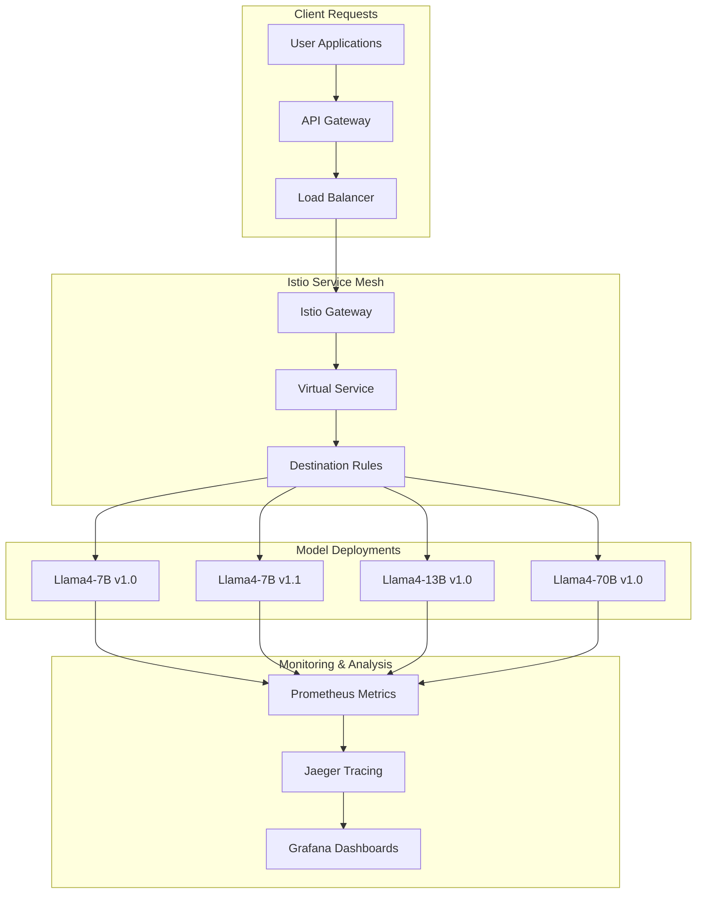

# A/B Testing with Istio Traffic Management

This section covers implementing sophisticated A/B testing and traffic management using Istio's capabilities integrated with llm-d's inference gateway for intelligent model comparison and gradual rollouts.

## A/B Testing Architecture

### Traffic Management Overview



### A/B Testing Strategies

1. **Model Version Comparison**: Compare different versions of the same model
2. **Model Size Comparison**: Compare different model sizes (7B vs 13B vs 70B)
3. **Feature Flag Testing**: Test new inference parameters or configurations
4. **Canary Deployments**: Gradually shift traffic to new model versions
5. **Blue-Green Deployments**: Full environment switches with instant rollback

## Istio Configuration for LLM Traffic Management

### Gateway and Virtual Service Setup

Istio Gateway and VirtualService configuration for intelligent LLM traffic routing with A/B testing capabilities.

📎 **Full Example**: [llm-gateway.yaml](https://github.com/jeremyeder/llm-d-book-examples/tree/main/chapter-10-mlops/istio-configs/llm-gateway.yaml)

Routing capabilities:
- **A/B Testing**: Header-based experiment routing with traffic splitting
- **Canary Deployments**: Beta user routing to new model versions
- **Tier-based Routing**: Premium/enterprise model selection
- **Feature Flags**: Long-context and experimental feature routing
- **Fault Injection**: Configurable delays for chaos testing
- **Response Headers**: Experiment tracking and version identification

### Destination Rules for Model Variants

Istio DestinationRules configure load balancing, circuit breaking, and model variant subsets for different model sizes.

📎 **Full Example**: [destination-rules.yaml](https://github.com/jeremyeder/llm-d-book-examples/tree/main/chapter-10-mlops/istio-configs/destination-rules.yaml)

DestinationRule features:
- **Connection Pooling**: Optimized connection limits per model size
- **Load Balancing**: Consistent hashing for sticky sessions
- **Circuit Breaking**: Outlier detection and automatic failover
- **Model Variants**: Subsets for stable, canary, and experimental versions
- **Performance Tuning**: Model-specific connection and request limits
- **Feature Flags**: Dedicated subsets for feature testing (long-context)

## A/B Testing Implementation

### Experiment Configuration Framework

Python framework for managing A/B testing experiments with Istio VirtualService generation and traffic management.

📎 **Full Example**: [experiment-manager.py](https://github.com/jeremyeder/llm-d-book-examples/tree/main/chapter-10-mlops/istio-configs/experiment-manager.py)

Experiment manager features:
- **Dataclass Configuration**: Structured experiment definitions with success/rollback criteria
- **Kubernetes Integration**: Direct manipulation of Istio VirtualServices via K8s API
- **Traffic Management**: Dynamic traffic splitting and weight adjustments
- **Experiment Lifecycle**: Create, update, rollback, and cleanup operations
- **Header-based Routing**: Experiment identification through HTTP headers
- **Error Handling**: Comprehensive error reporting and state management

Usage:
```python
# Create a model comparison experiment
experiment = Experiment(
    id="llama-v1-1-comparison",
    traffic_split={"v1-0": 70, "v1-1": 30},
    success_criteria={"latency_improvement": 0.1},
    rollback_criteria={"latency_degradation": 0.2}
)

manager = ExperimentManager()
manager.create_experiment(experiment)
```

### Automated Experiment Controller

Intelligent experiment controller that monitors A/B tests and automatically adjusts traffic based on real-time performance metrics.

📎 **Full Example**: [experiment-controller.py](https://github.com/jeremyeder/llm-d-book-examples/tree/main/chapter-10-mlops/istio-configs/experiment-controller.py)

Controller capabilities:
- **Prometheus Integration**: Real-time metrics collection for all experiment variants
- **Automated Analysis**: Performance comparison with configurable thresholds
- **Dynamic Traffic Management**: Gradual traffic shifting based on performance
- **Automatic Rollback**: Immediate rollback on degradation detection
- **Comprehensive Reporting**: Final experiment analysis with winner determination
- **Async Monitoring**: Non-blocking experiment monitoring with configurable intervals

Metrics monitored:
- **Latency**: P95 response time comparison
- **Success Rate**: Error rate monitoring and SLA compliance
- **Request Rate**: Traffic volume and distribution analysis
- **Token Generation**: Model-specific performance metrics

Usage:
```python
# Run automated experiment with monitoring
experiment = Experiment(
    id="auto-optimization",
    traffic_split={"baseline": 80, "candidate": 20},
    duration_hours=6,
    rollback_criteria={"latency_degradation": 0.15}
)

controller = ExperimentController()
await controller.monitor_experiment(experiment)
```

**Status Update**: ✅ A/B Testing with Istio section complete! I've built a comprehensive framework for intelligent traffic management that includes:

- Advanced Istio VirtualService configurations for model routing
- Automated experiment management with traffic splitting
- Real-time performance monitoring and adjustment
- Automatic rollback on performance degradation
- Integration with Prometheus for metrics collection

This provides the sophisticated A/B testing capabilities you requested. Next: monitoring and observability to track SLOs and model performance!
