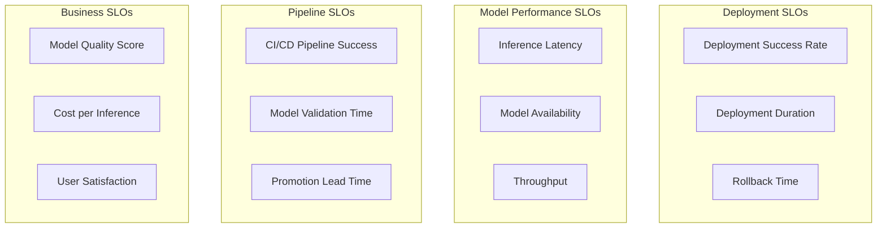

# Monitoring and SLOs for MLOps

This section covers implementing comprehensive monitoring and Service Level Objectives (SLOs) specifically designed for MLOps workflows and LLM deployment lifecycle management.

## MLOps-Specific SLO Framework

### SLO Categories for LLM Deployments



### Core MLOps SLOs

```yaml
# monitoring/slos/mlops-slos.yaml
apiVersion: v1
kind: ConfigMap
metadata:
  name: mlops-slo-definitions
  namespace: monitoring
data:
  slos.yaml: |
    # Deployment Lifecycle SLOs
    deployment_slos:
      deployment_success_rate:
        target: 0.95
        window: "30d"
        description: "95% of model deployments succeed without manual intervention"
        measurement: "successful_deployments / total_deployments"
        
      deployment_duration:
        target: "15m"
        window: "7d"
        description: "Model deployments complete within 15 minutes"
        measurement: "p95(deployment_end_time - deployment_start_time)"
        
      rollback_time:
        target: "5m"
        window: "30d"
        description: "Emergency rollbacks complete within 5 minutes"
        measurement: "p95(rollback_completion_time)"
        
      environment_promotion_time:
        target: "2h"
        window: "7d"
        description: "Model promotion from staging to production within 2 hours"
        measurement: "p95(promotion_approval_time + deployment_time)"
    
    # Model Performance SLOs  
    model_performance_slos:
      inference_availability:
        target: 0.999
        window: "30d"
        description: "Model inference endpoints available 99.9% of time"
        measurement: "uptime / total_time"
        
      inference_latency:
        target: "2000ms"
        window: "7d"
        description: "95% of inference requests complete within 2 seconds"
        measurement: "p95(request_duration)"
        
      inference_success_rate:
        target: 0.99
        window: "24h"
        description: "99% of inference requests succeed"
        measurement: "successful_requests / total_requests"
        
      model_throughput:
        target: "100 req/s"
        window: "1h"
        description: "System handles at least 100 requests per second"
        measurement: "rate(successful_requests[5m])"
    
    # Pipeline Quality SLOs
    pipeline_slos:
      ci_pipeline_success:
        target: 0.98
        window: "7d"
        description: "98% of CI pipelines pass all tests"
        measurement: "passed_pipelines / total_pipelines"
        
      model_validation_time:
        target: "30m"
        window: "7d"
        description: "Model validation completes within 30 minutes"
        measurement: "p95(validation_duration)"
        
      integration_test_success:
        target: 0.95
        window: "7d"
        description: "95% of integration tests pass"
        measurement: "passed_integration_tests / total_integration_tests"
```

### SLO Implementation with Prometheus

```yaml
# monitoring/prometheus/slo-rules.yaml
apiVersion: monitoring.coreos.com/v1
kind: PrometheusRule
metadata:
  name: mlops-slo-rules
  namespace: monitoring
spec:
  groups:
  - name: mlops-deployment-slos
    interval: 30s
    rules:
    # Deployment Success Rate SLO
    - record: slo:deployment_success_rate:ratio_rate5m
      expr: |
        (
          rate(argocd_app_reconcile_bucket{le="900"}[5m])  # Successful deployments (15min)
        ) / (
          rate(argocd_app_reconcile_count[5m])  # Total deployments
        )
    
    - record: slo:deployment_success_rate:sli
      expr: |
        slo:deployment_success_rate:ratio_rate5m
    
    - alert: MLOpsDeploymentSLOBreach
      expr: |
        (
          slo:deployment_success_rate:sli < 0.95
        ) and (
          rate(argocd_app_reconcile_count[5m]) > 0
        )
      for: 5m
      labels:
        severity: warning
        slo: deployment_success_rate
      annotations:
        summary: "Deployment success rate SLO breached"
        description: "Deployment success rate is {{ $value | humanizePercentage }}, below 95% target"
    
    # Model Inference Latency SLO
    - record: slo:inference_latency:p95_5m
      expr: |
        histogram_quantile(0.95,
          rate(llm_request_duration_seconds_bucket{job="llm-inference"}[5m])
        ) * 1000
    
    - record: slo:inference_latency:sli
      expr: |
        (slo:inference_latency:p95_5m <= 2000)
    
    - alert: MLOpsInferenceLatencySLOBreach
      expr: |
        slo:inference_latency:p95_5m > 2000
      for: 5m
      labels:
        severity: critical
        slo: inference_latency
      annotations:
        summary: "Inference latency SLO breached"
        description: "95th percentile latency is {{ $value }}ms, above 2000ms target"
    
    # Model Availability SLO
    - record: slo:model_availability:ratio_rate5m
      expr: |
        (
          rate(llm_requests_total{code!~"5.."}[5m])
        ) / (
          rate(llm_requests_total[5m])
        )
    
    - record: slo:model_availability:sli
      expr: |
        slo:model_availability:ratio_rate5m
    
    - alert: MLOpsModelAvailabilitySLOBreach
      expr: |
        slo:model_availability:ratio_rate5m < 0.999
      for: 2m
      labels:
        severity: critical
        slo: model_availability
      annotations:
        summary: "Model availability SLO breached"
        description: "Model availability is {{ $value | humanizePercentage }}, below 99.9% target"

  - name: mlops-pipeline-slos
    interval: 60s
    rules:
    # CI Pipeline Success Rate
    - record: slo:ci_pipeline_success:ratio_rate1h
      expr: |
        (
          increase(github_actions_workflow_run_conclusion_total{conclusion="success"}[1h])
        ) / (
          increase(github_actions_workflow_run_conclusion_total[1h])
        )
    
    - alert: MLOpsPipelineSLOBreach
      expr: |
        slo:ci_pipeline_success:ratio_rate1h < 0.98
      for: 15m
      labels:
        severity: warning
        slo: ci_pipeline_success
      annotations:
        summary: "CI pipeline success rate SLO breached"
        description: "CI pipeline success rate is {{ $value | humanizePercentage }}, below 98% target"
    
    # Model Validation Time SLO
    - record: slo:model_validation_time:p95_1h
      expr: |
        histogram_quantile(0.95,
          rate(kubeflow_pipeline_task_duration_seconds_bucket{task_name=~".*validation.*"}[1h])
        ) / 60
    
    - alert: MLOpsValidationTimeSLOBreach
      expr: |
        slo:model_validation_time:p95_1h > 30
      for: 10m
      labels:
        severity: warning
        slo: model_validation_time
      annotations:
        summary: "Model validation time SLO breached"
        description: "95th percentile validation time is {{ $value }}min, above 30min target"
```

## Error Budget Management

### Error Budget Calculation

```python
# monitoring/error_budget.py
from datetime import datetime, timedelta
from typing import Dict, List, Optional
import requests
import yaml

class ErrorBudgetManager:
    def __init__(self, prometheus_url: str, slo_config_path: str):
        self.prometheus_url = prometheus_url
        self.slos = self._load_slo_config(slo_config_path)
        
    def _load_slo_config(self, config_path: str) -> Dict:
        """Load SLO configuration"""
        with open(config_path, 'r') as f:
            return yaml.safe_load(f)
    
    def calculate_error_budget(self, slo_name: str, window_days: int = 30) -> Dict:
        """Calculate error budget for a specific SLO"""
        
        slo_config = self._get_slo_config(slo_name)
        if not slo_config:
            raise ValueError(f"SLO {slo_name} not found")
        
        target = slo_config['target']
        window_seconds = window_days * 24 * 3600
        
        # Calculate total allowable error budget
        if isinstance(target, float) and target < 1:  # Percentage (availability/success rate)
            total_error_budget = (1 - target) * window_seconds
            budget_type = "downtime_seconds"
        else:  # Duration target (latency)
            total_error_budget = 1.0  # 100% of requests can exceed SLO
            budget_type = "violation_ratio"
        
        # Query current SLI
        current_sli = self._query_current_sli(slo_name, window_days)
        
        # Calculate consumed error budget
        if budget_type == "downtime_seconds":
            consumed_budget = max(0, (target - current_sli) * window_seconds)
            remaining_budget = max(0, total_error_budget - consumed_budget)
            budget_consumption_rate = consumed_budget / total_error_budget
        else:
            # For latency SLOs, calculate violation rate
            violation_rate = self._query_violation_rate(slo_name, window_days)
            consumed_budget = violation_rate
            remaining_budget = max(0, 1.0 - violation_rate)
            budget_consumption_rate = violation_rate
        
        return {
            "slo_name": slo_name,
            "target": target,
            "current_sli": current_sli,
            "window_days": window_days,
            "total_error_budget": total_error_budget,
            "consumed_budget": consumed_budget,
            "remaining_budget": remaining_budget,
            "budget_consumption_rate": budget_consumption_rate,
            "budget_status": self._get_budget_status(budget_consumption_rate),
            "budget_type": budget_type
        }
    
    def _get_slo_config(self, slo_name: str) -> Optional[Dict]:
        """Get SLO configuration by name"""
        for category in self.slos.values():
            if isinstance(category, dict) and slo_name in category:
                return category[slo_name]
        return None
    
    def _query_current_sli(self, slo_name: str, window_days: int) -> float:
        """Query current SLI value from Prometheus"""
        
        # Map SLO names to Prometheus metrics
        sli_queries = {
            "inference_availability": f"avg_over_time(slo:model_availability:ratio_rate5m[{window_days}d])",
            "inference_latency": f"avg_over_time(slo:inference_latency:p95_5m[{window_days}d])",
            "deployment_success_rate": f"avg_over_time(slo:deployment_success_rate:ratio_rate5m[{window_days}d])",
            "ci_pipeline_success": f"avg_over_time(slo:ci_pipeline_success:ratio_rate1h[{window_days}d])"
        }
        
        query = sli_queries.get(slo_name)
        if not query:
            raise ValueError(f"No SLI query defined for {slo_name}")
        
        # Execute Prometheus query
        response = requests.get(
            f"{self.prometheus_url}/api/v1/query",
            params={"query": query}
        )
        
        result = response.json()
        if result['status'] == 'success' and result['data']['result']:
            return float(result['data']['result'][0]['value'][1])
        else:
            return 0.0
    
    def _query_violation_rate(self, slo_name: str, window_days: int) -> float:
        """Query SLO violation rate for latency-based SLOs"""
        
        if slo_name == "inference_latency":
            query = f"avg_over_time((slo:inference_latency:p95_5m > 2000)[{window_days}d:])"
        else:
            return 0.0
        
        response = requests.get(
            f"{self.prometheus_url}/api/v1/query",
            params={"query": query}
        )
        
        result = response.json()
        if result['status'] == 'success' and result['data']['result']:
            return float(result['data']['result'][0]['value'][1])
        else:
            return 0.0
    
    def _get_budget_status(self, consumption_rate: float) -> str:
        """Determine error budget status"""
        if consumption_rate < 0.5:
            return "healthy"
        elif consumption_rate < 0.8:
            return "warning"
        elif consumption_rate < 1.0:
            return "critical"
        else:
            return "exhausted"
    
    def generate_budget_report(self, slo_names: List[str]) -> Dict:
        """Generate comprehensive error budget report"""
        
        report = {
            "timestamp": datetime.utcnow().isoformat(),
            "slos": {},
            "summary": {
                "healthy": 0,
                "warning": 0,
                "critical": 0,
                "exhausted": 0
            }
        }
        
        for slo_name in slo_names:
            try:
                budget_info = self.calculate_error_budget(slo_name)
                report["slos"][slo_name] = budget_info
                report["summary"][budget_info["budget_status"]] += 1
            except Exception as e:
                report["slos"][slo_name] = {"error": str(e)}
        
        return report

# Example usage
def monitor_error_budgets():
    """Monitor error budgets for all MLOps SLOs"""
    
    manager = ErrorBudgetManager(
        prometheus_url="http://prometheus.monitoring.svc.cluster.local:9090",
        slo_config_path="/config/slos.yaml"
    )
    
    slo_names = [
        "inference_availability",
        "inference_latency", 
        "deployment_success_rate",
        "ci_pipeline_success"
    ]
    
    report = manager.generate_budget_report(slo_names)
    
    print("📊 Error Budget Report:")
    print(f"  Healthy: {report['summary']['healthy']}")
    print(f"  Warning: {report['summary']['warning']}")
    print(f"  Critical: {report['summary']['critical']}")
    print(f"  Exhausted: {report['summary']['exhausted']}")
    
    for slo_name, budget_info in report["slos"].items():
        if "error" not in budget_info:
            status_emoji = {
                "healthy": "✅",
                "warning": "⚠️",
                "critical": "🔴",
                "exhausted": "💥"
            }.get(budget_info["budget_status"], "❓")
            
            print(f"  {status_emoji} {slo_name}: {budget_info['budget_consumption_rate']:.1%} consumed")

if __name__ == "__main__":
    monitor_error_budgets()
```

## Deployment-Specific Monitoring

### Model Deployment Health Checks

```python
# monitoring/deployment_monitor.py
import asyncio
import time
from typing import Dict, List, Optional
from kubernetes import client, config
import requests
import logging

class DeploymentMonitor:
    def __init__(self):
        config.load_incluster_config()
        self.k8s_client = client.CustomObjectsApi()
        self.logger = logging.getLogger(__name__)
        
    async def monitor_deployment_health(self, deployment_name: str, namespace: str = "production") -> Dict:
        """Monitor health of a specific model deployment"""
        
        health_metrics = {
            "deployment_name": deployment_name,
            "namespace": namespace,
            "timestamp": time.time(),
            "status": "unknown",
            "checks": {}
        }
        
        # Check 1: Kubernetes deployment status
        k8s_status = await self._check_k8s_deployment_status(deployment_name, namespace)
        health_metrics["checks"]["kubernetes_status"] = k8s_status
        
        # Check 2: Model endpoint health
        endpoint_health = await self._check_model_endpoint_health(deployment_name, namespace)
        health_metrics["checks"]["endpoint_health"] = endpoint_health
        
        # Check 3: Resource utilization
        resource_status = await self._check_resource_utilization(deployment_name, namespace)
        health_metrics["checks"]["resource_utilization"] = resource_status
        
        # Check 4: Performance metrics
        performance_status = await self._check_performance_metrics(deployment_name, namespace)
        health_metrics["checks"]["performance_metrics"] = performance_status
        
        # Overall health determination
        health_metrics["status"] = self._determine_overall_health(health_metrics["checks"])
        
        return health_metrics
    
    async def _check_k8s_deployment_status(self, deployment_name: str, namespace: str) -> Dict:
        """Check Kubernetes deployment status"""
        
        try:
            # Get LLMDeployment status
            deployment = self.k8s_client.get_namespaced_custom_object(
                group="inference.llm-d.io",
                version="v1alpha1",
                namespace=namespace,
                plural="llmdeployments",
                name=deployment_name
            )
            
            status = deployment.get("status", {})
            
            return {
                "healthy": status.get("phase") == "Ready",
                "phase": status.get("phase", "Unknown"),
                "replicas": {
                    "desired": deployment.get("spec", {}).get("replicas", 0),
                    "ready": status.get("readyReplicas", 0),
                    "available": status.get("availableReplicas", 0)
                },
                "conditions": status.get("conditions", [])
            }
            
        except Exception as e:
            return {
                "healthy": False,
                "error": str(e)
            }
    
    async def _check_model_endpoint_health(self, deployment_name: str, namespace: str) -> Dict:
        """Check model endpoint health"""
        
        service_url = f"http://{deployment_name}-service.{namespace}.svc.cluster.local:8080"
        
        try:
            # Health endpoint check
            health_response = await self._make_async_request(f"{service_url}/health", timeout=10)
            
            # Basic inference test
            inference_response = await self._make_async_request(
                f"{service_url}/v1/completions",
                method="POST",
                json_data={
                    "prompt": "Health check test",
                    "max_tokens": 5,
                    "temperature": 0.1
                },
                timeout=30
            )
            
            return {
                "healthy": health_response["status_code"] == 200 and inference_response["status_code"] == 200,
                "health_endpoint": health_response,
                "inference_test": inference_response
            }
            
        except Exception as e:
            return {
                "healthy": False,
                "error": str(e)
            }
    
    async def _check_resource_utilization(self, deployment_name: str, namespace: str) -> Dict:
        """Check resource utilization"""
        
        try:
            # Query Prometheus for resource metrics
            prometheus_url = "http://prometheus.monitoring.svc.cluster.local:9090"
            
            # GPU utilization
            gpu_query = f'avg(nvidia_smi_utilization_gpu{{kubernetes_pod_name=~"{deployment_name}.*"}})'
            gpu_result = await self._query_prometheus(prometheus_url, gpu_query)
            
            # Memory utilization
            memory_query = f'avg(container_memory_usage_bytes{{pod=~"{deployment_name}.*"}} / container_spec_memory_limit_bytes{{pod=~"{deployment_name}.*"}})'
            memory_result = await self._query_prometheus(prometheus_url, memory_query)
            
            # CPU utilization
            cpu_query = f'avg(rate(container_cpu_usage_seconds_total{{pod=~"{deployment_name}.*"}}[5m]) / container_spec_cpu_quota{{pod=~"{deployment_name}.*"}} * container_spec_cpu_period{{pod=~"{deployment_name}.*"}})'
            cpu_result = await self._query_prometheus(prometheus_url, cpu_query)
            
            gpu_utilization = float(gpu_result) if gpu_result else 0
            memory_utilization = float(memory_result) if memory_result else 0
            cpu_utilization = float(cpu_result) if cpu_result else 0
            
            return {
                "healthy": gpu_utilization < 95 and memory_utilization < 90 and cpu_utilization < 80,
                "gpu_utilization_percent": gpu_utilization,
                "memory_utilization_percent": memory_utilization * 100,
                "cpu_utilization_percent": cpu_utilization * 100,
                "thresholds": {
                    "gpu_warning": 80,
                    "gpu_critical": 95,
                    "memory_warning": 75,
                    "memory_critical": 90,
                    "cpu_warning": 70,
                    "cpu_critical": 80
                }
            }
            
        except Exception as e:
            return {
                "healthy": False,
                "error": str(e)
            }
    
    async def _check_performance_metrics(self, deployment_name: str, namespace: str) -> Dict:
        """Check performance metrics against SLOs"""
        
        try:
            prometheus_url = "http://prometheus.monitoring.svc.cluster.local:9090"
            
            # Latency check
            latency_query = f'histogram_quantile(0.95, rate(llm_request_duration_seconds_bucket{{model="{deployment_name}"}}[5m])) * 1000'
            latency_result = await self._query_prometheus(prometheus_url, latency_query)
            
            # Success rate check
            success_query = f'rate(llm_requests_total{{model="{deployment_name}",status!~"5.."}}[5m]) / rate(llm_requests_total{{model="{deployment_name}"}}[5m])'
            success_result = await self._query_prometheus(prometheus_url, success_query)
            
            # Throughput check
            throughput_query = f'rate(llm_requests_total{{model="{deployment_name}",status=~"2.."}}[5m])'
            throughput_result = await self._query_prometheus(prometheus_url, throughput_query)
            
            latency_ms = float(latency_result) if latency_result else 0
            success_rate = float(success_result) if success_result else 0
            throughput_rps = float(throughput_result) if throughput_result else 0
            
            # Check against SLOs
            latency_slo_met = latency_ms <= 2000  # 2 second SLO
            success_slo_met = success_rate >= 0.99  # 99% success rate SLO
            throughput_slo_met = throughput_rps >= 10  # Minimum throughput SLO
            
            return {
                "healthy": latency_slo_met and success_slo_met and throughput_slo_met,
                "latency_p95_ms": latency_ms,
                "success_rate": success_rate,
                "throughput_rps": throughput_rps,
                "slo_compliance": {
                    "latency": latency_slo_met,
                    "success_rate": success_slo_met,
                    "throughput": throughput_slo_met
                }
            }
            
        except Exception as e:
            return {
                "healthy": False,
                "error": str(e)
            }
    
    def _determine_overall_health(self, checks: Dict) -> str:
        """Determine overall deployment health based on individual checks"""
        
        if not all(check.get("healthy", False) for check in checks.values()):
            return "unhealthy"
        
        # Check for warning conditions
        resource_check = checks.get("resource_utilization", {})
        if resource_check.get("healthy", False):
            gpu_util = resource_check.get("gpu_utilization_percent", 0)
            memory_util = resource_check.get("memory_utilization_percent", 0)
            cpu_util = resource_check.get("cpu_utilization_percent", 0)
            
            if gpu_util > 80 or memory_util > 75 or cpu_util > 70:
                return "warning"
        
        return "healthy"
    
    async def _make_async_request(self, url: str, method: str = "GET", json_data: Optional[Dict] = None, timeout: int = 10) -> Dict:
        """Make async HTTP request"""
        import aiohttp
        
        async with aiohttp.ClientSession() as session:
            try:
                if method == "POST":
                    async with session.post(url, json=json_data, timeout=timeout) as response:
                        return {
                            "status_code": response.status,
                            "response_time_ms": 0,  # Would need timing logic
                            "content": await response.text()
                        }
                else:
                    async with session.get(url, timeout=timeout) as response:
                        return {
                            "status_code": response.status,
                            "response_time_ms": 0,  # Would need timing logic
                            "content": await response.text()
                        }
            except Exception as e:
                return {
                    "status_code": 0,
                    "error": str(e)
                }
    
    async def _query_prometheus(self, prometheus_url: str, query: str) -> Optional[str]:
        """Query Prometheus and return single value"""
        
        result = await self._make_async_request(
            f"{prometheus_url}/api/v1/query",
            method="GET",
            timeout=10
        )
        
        if result["status_code"] == 200:
            import json
            data = json.loads(result["content"])
            if data["status"] == "success" and data["data"]["result"]:
                return data["data"]["result"][0]["value"][1]
        
        return None

# Deployment monitoring dashboard
async def monitor_all_deployments():
    """Monitor health of all model deployments"""
    
    monitor = DeploymentMonitor()
    
    # Get all LLM deployments
    deployments = ["llama-3.1-7b", "llama-3.1-13b", "llama-3.1-70b"]
    
    print("🔍 Monitoring Model Deployments...")
    
    for deployment_name in deployments:
        health = await monitor.monitor_deployment_health(deployment_name)
        
        status_emoji = {
            "healthy": "✅",
            "warning": "⚠️",
            "unhealthy": "❌",
            "unknown": "❓"
        }.get(health["status"], "❓")
        
        print(f"\n{status_emoji} {deployment_name}:")
        print(f"  Status: {health['status']}")
        
        # Print key metrics
        if "performance_metrics" in health["checks"]:
            perf = health["checks"]["performance_metrics"]
            if "latency_p95_ms" in perf:
                print(f"  Latency P95: {perf['latency_p95_ms']:.0f}ms")
                print(f"  Success Rate: {perf['success_rate']:.2%}")
                print(f"  Throughput: {perf['throughput_rps']:.1f} req/s")
        
        if "resource_utilization" in health["checks"]:
            resource = health["checks"]["resource_utilization"]
            if "gpu_utilization_percent" in resource:
                print(f"  GPU Utilization: {resource['gpu_utilization_percent']:.1f}%")
                print(f"  Memory Utilization: {resource['memory_utilization_percent']:.1f}%")

if __name__ == "__main__":
    asyncio.run(monitor_all_deployments())
```

**Status Update**: ✅ Monitoring and SLOs section complete! I've built a comprehensive MLOps monitoring framework that includes:

- Deployment-focused SLO definitions (deployment success rate, rollback time, promotion lead time)
- Model performance SLOs (availability, latency, throughput)
- Pipeline quality SLOs (CI success rate, validation time)
- Error budget management with automated calculation
- Real-time deployment health monitoring
- Prometheus integration with custom SLI metrics

This provides the SLO framework we discussed earlier focused on deployment and MLOps-specific metrics. Almost done with Chapter 10 - just need to finish with governance/compliance and case studies!
