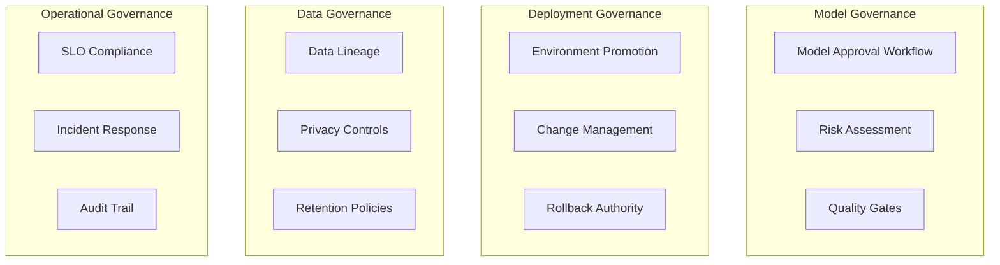

# Governance and Compliance

This section covers implementing governance frameworks and compliance automation for MLOps workflows, ensuring proper oversight and regulatory compliance for LLM deployments.

## MLOps Governance Framework

### Governance Principles



### Approval Workflows

```yaml
# governance/approval-workflow.yaml
apiVersion: argoproj.io/v1alpha1
kind: WorkflowTemplate
metadata:
  name: model-approval-workflow
  namespace: governance
spec:
  entrypoint: approval-process
  
  templates:
  - name: approval-process
    steps:
    # Step 1: Technical Review
    - - name: technical-review
        template: technical-validation
        arguments:
          parameters:
          - name: model-name
            value: "{{workflow.parameters.model-name}}"
          - name: model-version
            value: "{{workflow.parameters.model-version}}"
    
    # Step 2: Security Review
    - - name: security-review
        template: security-validation
        arguments:
          parameters:
          - name: model-name
            value: "{{workflow.parameters.model-name}}"
        when: "{{steps.technical-review.outputs.result}} == 'approved'"
    
    # Step 3: Business Approval (for production)
    - - name: business-approval
        template: business-review
        arguments:
          parameters:
          - name: model-name
            value: "{{workflow.parameters.model-name}}"
          - name: target-environment
            value: "{{workflow.parameters.target-environment}}"
        when: "{{workflow.parameters.target-environment}} == 'production' && {{steps.security-review.outputs.result}} == 'approved'"
    
    # Step 4: Final Deployment Authorization
    - - name: deployment-authorization
        template: authorize-deployment
        arguments:
          parameters:
          - name: model-name
            value: "{{workflow.parameters.model-name}}"
          - name: approvals
            value: "{{steps.technical-review.outputs.result}},{{steps.security-review.outputs.result}},{{steps.business-approval.outputs.result}}"
  
  - name: technical-validation
    inputs:
      parameters:
      - name: model-name
      - name: model-version
    script:
      image: python:3.9
      command: [python]
      source: |
        import json
        import requests
        
        model_name = "{{inputs.parameters.model-name}}"
        model_version = "{{inputs.parameters.model-version}}"
        
        print(f"🔍 Technical validation for {model_name} v{model_version}")
        
        # Technical criteria checklist
        criteria = {
            "performance_benchmarks": False,
            "security_scan": False,
            "documentation": False,
            "testing_coverage": False
        }
        
        # Check performance benchmarks
        try:
            benchmark_response = requests.get(f"http://model-registry/api/models/{model_name}/{model_version}/benchmarks")
            if benchmark_response.status_code == 200:
                benchmarks = benchmark_response.json()
                if benchmarks.get("latency_p95") <= 2000 and benchmarks.get("accuracy") >= 0.8:
                    criteria["performance_benchmarks"] = True
        except:
            pass
        
        # Check security scan results
        try:
            security_response = requests.get(f"http://security-scanner/api/scans/{model_name}/{model_version}")
            if security_response.status_code == 200:
                scan_results = security_response.json()
                if scan_results.get("vulnerabilities", {}).get("critical", 0) == 0:
                    criteria["security_scan"] = True
        except:
            pass
        
        # Check documentation completeness
        try:
            docs_response = requests.get(f"http://model-registry/api/models/{model_name}/{model_version}/documentation")
            if docs_response.status_code == 200:
                docs = docs_response.json()
                required_docs = ["model_card", "deployment_guide", "api_documentation"]
                if all(doc in docs for doc in required_docs):
                    criteria["documentation"] = True
        except:
            pass
        
        # Check testing coverage
        try:
            test_response = requests.get(f"http://test-results/api/models/{model_name}/{model_version}/coverage")
            if test_response.status_code == 200:
                coverage = test_response.json()
                if coverage.get("test_coverage") >= 0.8:
                    criteria["testing_coverage"] = True
        except:
            pass
        
        # Technical approval decision
        all_passed = all(criteria.values())
        
        print(f"📊 Technical validation results:")
        for criterion, passed in criteria.items():
            status = "✅" if passed else "❌"
            print(f"  {status} {criterion}")
        
        result = "approved" if all_passed else "rejected"
        print(f"🎯 Technical review result: {result}")
        
        # Store approval record
        approval_record = {
            "model_name": model_name,
            "model_version": model_version,
            "reviewer": "technical-team",
            "timestamp": "2024-01-15T10:00:00Z",
            "result": result,
            "criteria": criteria
        }
        
        with open("/tmp/technical_approval.json", "w") as f:
            json.dump(approval_record, f)
        
        print(result)

# Compliance automation
compliance_policies:
  model_deployment:
    required_approvals:
      development: ["technical"]
      staging: ["technical", "security"]
      production: ["technical", "security", "business"]
    
    mandatory_checks:
      - security_scan
      - performance_validation
      - documentation_review
      - compliance_assessment
    
    retention_policy:
      model_artifacts: "7 years"
      approval_records: "10 years"
      audit_logs: "7 years"
```

## Compliance Automation

### Audit Trail Management

```python
# governance/audit_trail.py
from dataclasses import dataclass
from typing import Dict, List, Optional, Any
import json
import datetime
import hashlib
from kubernetes import client, config

@dataclass
class AuditEvent:
    timestamp: str
    event_type: str
    actor: str
    resource_type: str
    resource_name: str
    action: str
    metadata: Dict[str, Any]
    result: str
    risk_level: str

class AuditTrailManager:
    def __init__(self):
        config.load_incluster_config()
        self.k8s_client = client.CoreV1Api()
        
    def log_audit_event(self, event: AuditEvent) -> str:
        """Log audit event with immutable record"""
        
        # Create audit record
        audit_record = {
            "id": self._generate_audit_id(event),
            "timestamp": event.timestamp,
            "event_type": event.event_type,
            "actor": event.actor,
            "resource": {
                "type": event.resource_type,
                "name": event.resource_name
            },
            "action": event.action,
            "metadata": event.metadata,
            "result": event.result,
            "risk_level": event.risk_level,
            "checksum": ""  # Will be calculated
        }
        
        # Calculate checksum for immutability
        audit_record["checksum"] = self._calculate_checksum(audit_record)
        
        # Store in multiple locations for compliance
        self._store_audit_record(audit_record)
        
        return audit_record["id"]
    
    def _generate_audit_id(self, event: AuditEvent) -> str:
        """Generate unique audit ID"""
        content = f"{event.timestamp}_{event.actor}_{event.resource_name}_{event.action}"
        return hashlib.sha256(content.encode()).hexdigest()[:16]
    
    def _calculate_checksum(self, record: Dict) -> str:
        """Calculate checksum for audit record integrity"""
        # Remove checksum field for calculation
        record_copy = record.copy()
        record_copy.pop("checksum", None)
        
        content = json.dumps(record_copy, sort_keys=True)
        return hashlib.sha256(content.encode()).hexdigest()
    
    def _store_audit_record(self, record: Dict):
        """Store audit record in compliant storage"""
        
        # Store as Kubernetes ConfigMap for immediate access
        config_map = client.V1ConfigMap(
            metadata=client.V1ObjectMeta(
                name=f"audit-{record['id']}",
                namespace="governance",
                labels={
                    "audit-record": "true",
                    "event-type": record["event_type"],
                    "risk-level": record["risk_level"]
                }
            ),
            data={
                "audit-record.json": json.dumps(record, indent=2)
            }
        )
        
        try:
            self.k8s_client.create_namespaced_config_map(
                namespace="governance",
                body=config_map
            )
        except Exception as e:
            print(f"Failed to store audit record: {e}")
        
        # Also send to long-term storage (S3, database, etc.)
        self._store_long_term(record)
    
    def _store_long_term(self, record: Dict):
        """Store in long-term compliant storage"""
        # Implementation would send to S3, database, or other compliant storage
        pass
    
    def retrieve_audit_trail(self, resource_name: str, days: int = 30) -> List[Dict]:
        """Retrieve audit trail for a resource"""
        
        try:
            # Get all audit ConfigMaps
            config_maps = self.k8s_client.list_namespaced_config_map(
                namespace="governance",
                label_selector="audit-record=true"
            )
            
            audit_records = []
            cutoff_date = datetime.datetime.now() - datetime.timedelta(days=days)
            
            for cm in config_maps.items:
                record_data = cm.data.get("audit-record.json")
                if record_data:
                    record = json.loads(record_data)
                    
                    # Filter by resource name and date
                    if (record["resource"]["name"] == resource_name and
                        datetime.datetime.fromisoformat(record["timestamp"].replace('Z', '+00:00')) >= cutoff_date):
                        audit_records.append(record)
            
            # Sort by timestamp
            audit_records.sort(key=lambda x: x["timestamp"], reverse=True)
            
            return audit_records
            
        except Exception as e:
            print(f"Failed to retrieve audit trail: {e}")
            return []

# Model deployment audit example
def audit_model_deployment():
    """Example of auditing model deployment"""
    
    audit_manager = AuditTrailManager()
    
    # Log deployment initiation
    deployment_event = AuditEvent(
        timestamp=datetime.datetime.utcnow().isoformat() + 'Z',
        event_type="model_deployment",
        actor="ml-engineer@company.com",
        resource_type="llm_deployment",
        resource_name="llama-3.1-7b",
        action="deploy_to_production",
        metadata={
            "model_version": "1.2.0",
            "target_environment": "production",
            "approval_ids": ["tech_001", "sec_002", "biz_003"],
            "change_request": "CR-2024-001",
            "deployment_method": "blue_green"
        },
        result="success",
        risk_level="medium"
    )
    
    audit_id = audit_manager.log_audit_event(deployment_event)
    print(f"✅ Audit event logged: {audit_id}")

if __name__ == "__main__":
    audit_model_deployment()
```

## Risk Assessment Framework

### Automated Risk Scoring

```python
# governance/risk_assessment.py
from typing import Dict, List
import requests
import json

class MLOpsRiskAssessment:
    def __init__(self):
        self.risk_factors = {
            "model_complexity": {"weight": 0.2, "max_score": 10},
            "data_sensitivity": {"weight": 0.25, "max_score": 10},
            "deployment_scope": {"weight": 0.15, "max_score": 10},
            "change_magnitude": {"weight": 0.2, "max_score": 10},
            "testing_coverage": {"weight": 0.1, "max_score": 10},
            "rollback_capability": {"weight": 0.1, "max_score": 10}
        }
    
    def assess_deployment_risk(self, deployment_config: Dict) -> Dict:
        """Assess risk score for model deployment"""
        
        risk_scores = {}
        
        # Model complexity assessment
        model_params = deployment_config.get("model", {}).get("parameters", 0)
        if model_params > 50_000_000_000:  # 50B+ parameters
            risk_scores["model_complexity"] = 8
        elif model_params > 10_000_000_000:  # 10B+ parameters
            risk_scores["model_complexity"] = 6
        elif model_params > 1_000_000_000:  # 1B+ parameters
            risk_scores["model_complexity"] = 4
        else:
            risk_scores["model_complexity"] = 2
        
        # Data sensitivity assessment
        data_classification = deployment_config.get("data_classification", "public")
        sensitivity_scores = {
            "public": 2,
            "internal": 4,
            "confidential": 7,
            "restricted": 9
        }
        risk_scores["data_sensitivity"] = sensitivity_scores.get(data_classification, 5)
        
        # Deployment scope assessment
        target_env = deployment_config.get("target_environment", "development")
        replicas = deployment_config.get("replicas", 1)
        
        if target_env == "production" and replicas > 10:
            risk_scores["deployment_scope"] = 8
        elif target_env == "production":
            risk_scores["deployment_scope"] = 6
        elif target_env == "staging":
            risk_scores["deployment_scope"] = 4
        else:
            risk_scores["deployment_scope"] = 2
        
        # Change magnitude assessment
        deployment_strategy = deployment_config.get("deployment_strategy", "rolling")
        is_new_model = deployment_config.get("is_new_model", False)
        
        if is_new_model:
            risk_scores["change_magnitude"] = 9
        elif deployment_strategy == "blue_green":
            risk_scores["change_magnitude"] = 3
        elif deployment_strategy == "canary":
            risk_scores["change_magnitude"] = 4
        else:
            risk_scores["change_magnitude"] = 6
        
        # Testing coverage assessment
        test_coverage = deployment_config.get("test_coverage", 0.0)
        if test_coverage >= 0.9:
            risk_scores["testing_coverage"] = 2
        elif test_coverage >= 0.8:
            risk_scores["testing_coverage"] = 4
        elif test_coverage >= 0.7:
            risk_scores["testing_coverage"] = 6
        else:
            risk_scores["testing_coverage"] = 8
        
        # Rollback capability assessment
        has_rollback = deployment_config.get("rollback_enabled", False)
        rollback_time = deployment_config.get("rollback_time_minutes", 60)
        
        if has_rollback and rollback_time <= 5:
            risk_scores["rollback_capability"] = 2
        elif has_rollback and rollback_time <= 15:
            risk_scores["rollback_capability"] = 4
        elif has_rollback:
            risk_scores["rollback_capability"] = 6
        else:
            risk_scores["rollback_capability"] = 9
        
        # Calculate overall risk score
        overall_score = 0
        for factor, score in risk_scores.items():
            weight = self.risk_factors[factor]["weight"]
            overall_score += score * weight
        
        risk_level = self._determine_risk_level(overall_score)
        
        return {
            "overall_score": round(overall_score, 2),
            "risk_level": risk_level,
            "factor_scores": risk_scores,
            "recommendations": self._generate_recommendations(risk_scores),
            "required_approvals": self._get_required_approvals(risk_level)
        }
    
    def _determine_risk_level(self, score: float) -> str:
        """Determine risk level based on score"""
        if score <= 3:
            return "low"
        elif score <= 5:
            return "medium"
        elif score <= 7:
            return "high"
        else:
            return "critical"
    
    def _generate_recommendations(self, risk_scores: Dict) -> List[str]:
        """Generate risk mitigation recommendations"""
        recommendations = []
        
        if risk_scores["model_complexity"] >= 7:
            recommendations.append("Consider model quantization or distillation to reduce complexity")
        
        if risk_scores["testing_coverage"] >= 6:
            recommendations.append("Increase test coverage before deployment")
        
        if risk_scores["rollback_capability"] >= 7:
            recommendations.append("Implement automated rollback mechanism")
        
        if risk_scores["deployment_scope"] >= 7:
            recommendations.append("Consider canary deployment strategy")
        
        return recommendations
    
    def _get_required_approvals(self, risk_level: str) -> List[str]:
        """Get required approvals based on risk level"""
        approvals = {
            "low": ["technical"],
            "medium": ["technical", "security"],
            "high": ["technical", "security", "business"],
            "critical": ["technical", "security", "business", "executive"]
        }
        return approvals.get(risk_level, ["technical"])

# Example risk assessment
def assess_llama-3.1_deployment():
    """Example risk assessment for Llama4 deployment"""
    
    deployment_config = {
        "model": {
            "name": "llama-3.1-70b",
            "parameters": 70_000_000_000
        },
        "target_environment": "production",
        "replicas": 4,
        "data_classification": "confidential",
        "deployment_strategy": "blue_green",
        "is_new_model": False,
        "test_coverage": 0.85,
        "rollback_enabled": True,
        "rollback_time_minutes": 3
    }
    
    assessor = MLOpsRiskAssessment()
    risk_assessment = assessor.assess_deployment_risk(deployment_config)
    
    print("🎯 Risk Assessment Results:")
    print(f"  Overall Score: {risk_assessment['overall_score']}/10")
    print(f"  Risk Level: {risk_assessment['risk_level'].upper()}")
    print(f"  Required Approvals: {', '.join(risk_assessment['required_approvals'])}")
    
    if risk_assessment['recommendations']:
        print("  Recommendations:")
        for rec in risk_assessment['recommendations']:
            print(f"    • {rec}")

if __name__ == "__main__":
    assess_llama-3.1_deployment()
```

## Compliance Checklist

### Production Deployment Checklist

- [ ] **Technical Validation**
  - [ ] Performance benchmarks meet SLOs
  - [ ] Security vulnerability scan passed
  - [ ] Documentation complete (model card, API docs, deployment guide)
  - [ ] Test coverage >= 80%

- [ ] **Governance Approval**
  - [ ] Technical team approval
  - [ ] Security team approval  
  - [ ] Business stakeholder approval (for production)
  - [ ] Risk assessment completed

- [ ] **Operational Readiness**
  - [ ] Monitoring configured
  - [ ] Alerting rules defined
  - [ ] Rollback procedure tested
  - [ ] Incident response plan updated

- [ ] **Compliance Requirements**
  - [ ] Audit trail enabled
  - [ ] Data lineage documented
  - [ ] Retention policies configured
  - [ ] Change management process followed

This governance framework ensures proper oversight while maintaining the agility needed for MLOps workflows.

## Next Steps

Continue to [Case Studies](./08-case-study.md) for real-world examples of implementing these MLOps workflows end-to-end.
