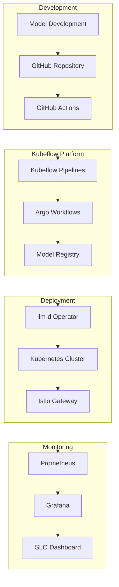
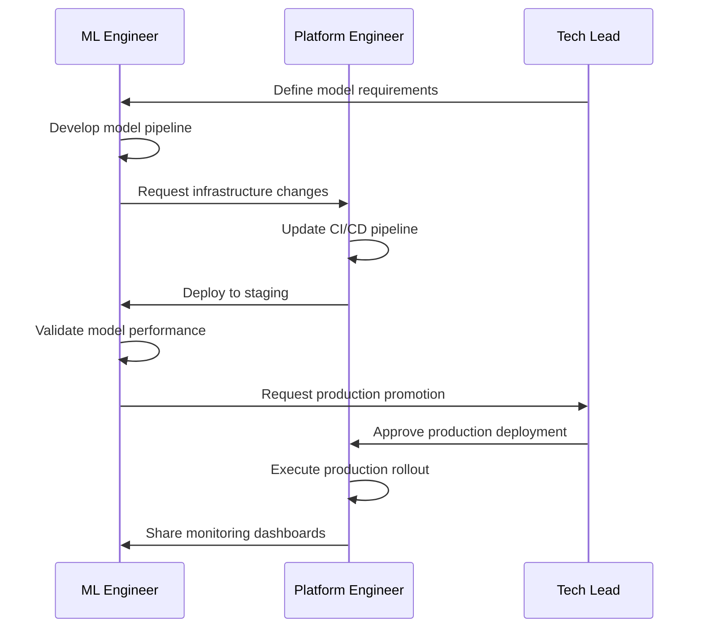

# MLOps Workflows and CI/CD

This chapter provides a comprehensive guide to implementing MLOps workflows for Large Language Model deployments using Kubeflow Pipelines, llm-d, and modern CI/CD practices.

## Overview

MLOps for LLMs presents unique challenges compared to traditional machine learning workflows. Large models require specialized infrastructure, careful resource management, and robust deployment strategies. This chapter shows how to build production-ready MLOps workflows that can scale from small teams to enterprise deployments.

### What You'll Learn

- **Kubeflow Integration**: Leverage Kubeflow Pipelines with Argo Workflows for LLM workflows
- **Model Lifecycle Management**: Automate model deployment from development to production
- **CI/CD Best Practices**: Build robust pipelines using GitHub Actions and GitOps
- **Progressive Deployment**: Deploy model families (Llama4) across different scales
- **A/B Testing**: Implement intelligent traffic routing with Istio
- **Monitoring & SLOs**: Establish service level objectives for model deployments
- **Team Collaboration**: Structure workflows for small, multi-role teams

### Prerequisites

Before diving into this chapter, ensure you have:

- Completed [Chapter 2: Installation and Setup](../02-installation-setup)
- Understanding of [Chapter 3: Architecture](../03-understanding-architecture)  
- Familiarity with [Chapter 5: SRE Operations](../05-sre-operations)
- Basic Kubernetes knowledge
- Git and GitHub experience

## The Modern LLM MLOps Stack

### Core Components



### Technology Stack

| Component | Technology | Purpose |
|-----------|------------|---------|
| **Source Control** | GitHub | Code, configuration, and model versioning |
| **CI/CD** | GitHub Actions | Automated testing and deployment |
| **Workflow Engine** | Kubeflow + Argo | Model pipeline orchestration |
| **Model Registry** | Kubeflow Model Registry | Model versioning and metadata |
| **Deployment** | llm-d Operator | LLM-specific Kubernetes deployments |
| **Traffic Management** | Istio | A/B testing and progressive rollouts |
| **Storage** | S3-Compatible | Model artifacts and data |
| **Monitoring** | Prometheus + Grafana | Metrics and SLO tracking |

## Target Infrastructure

This chapter focuses on bare metal GPU infrastructure optimized for LLM workloads, particularly:

### **Recommended Partners**

#### **CoreWeave**

- Specialized GPU cloud with bare metal performance
- H100, A100, and V100 clusters available
- Kubernetes-native infrastructure
- Direct integration with llm-d deployments

#### **Lambda Labs**

- On-demand and reserved GPU instances
- Cost-effective training and inference infrastructure
- Pre-configured deep learning environments
- Excellent for development and staging

#### **NVIDIA DGX Cloud**

- Enterprise-grade AI infrastructure
- Fully managed Kubernetes with GPU optimization
- Integration with NVIDIA AI Enterprise software
- Ideal for production workloads

### **Storage Architecture**

```yaml
# S3-compatible storage configuration
storage:
  # On-premise option
  minio:
    endpoint: "minio.company.local:9000"
    bucket: "llm-models"
    region: "us-east-1"
  
  # Cloud options
  aws_s3:
    bucket: "company-llm-models"
    region: "us-west-2"
  
  coreweave_s3:
    endpoint: "object.ord1.coreweave.com"
    bucket: "llm-models"
    region: "us-central"
```

## Team Structure and Roles

### Small Team Model (2-3 People)

This chapter assumes a lean team structure where individuals wear multiple hats:

#### **ML Engineer/Data Scientist**

- Model selection and evaluation
- Pipeline development
- Performance optimization
- A/B test design

#### **Platform Engineer/SRE**

- Infrastructure management
- CI/CD pipeline maintenance
- Monitoring and alerting
- Incident response

#### **Product/Tech Lead**

- Requirements and prioritization
- Architecture decisions
- Cross-team coordination
- Business metrics

### Collaboration Workflow



## Chapter Roadmap

The following sections will guide you through building a complete MLOps workflow:

### **1. Model Lifecycle Management**

Learn how to structure model development, versioning, and promotion workflows using Kubeflow's model registry and llm-d's deployment capabilities.

### **2. CI/CD Pipeline Setup**

Build automated pipelines using GitHub Actions that integrate with Kubeflow Pipelines for seamless model deployment.

### **3. Progressive Deployment Strategy**

Implement a real-world example deploying the Llama4 model family (7B → 13B → 70B) with proper resource scaling.

### **4. A/B Testing and Traffic Management**

Use Istio's traffic management capabilities with llm-d's inference gateway to implement sophisticated model comparison strategies.

### **5. Monitoring and SLOs**

Establish service level objectives and monitoring practices that ensure reliable model serving at scale.

### **6. Team Workflows**

Structure collaboration patterns that work for small, multi-disciplinary teams managing LLM deployments.

## Quick Start

If you're ready to dive in, here's what you'll need to get started:

```bash
# Verify prerequisites
kubectl get nodes
kubectl get namespaces kubeflow

# Check llm-d operator
kubectl get pods -n llm-d-system

# Verify Istio installation
kubectl get pods -n istio-system

# Test S3 connectivity
aws s3 ls s3://your-model-bucket/ --endpoint-url=https://your-s3-endpoint
```

Ready to build production-ready MLOps workflows? Let's begin with [Model Lifecycle Management](./01-model-lifecycle).

---

```mdx-code-block
import DocCardList from '@theme/DocCardList';

<DocCardList />
```
