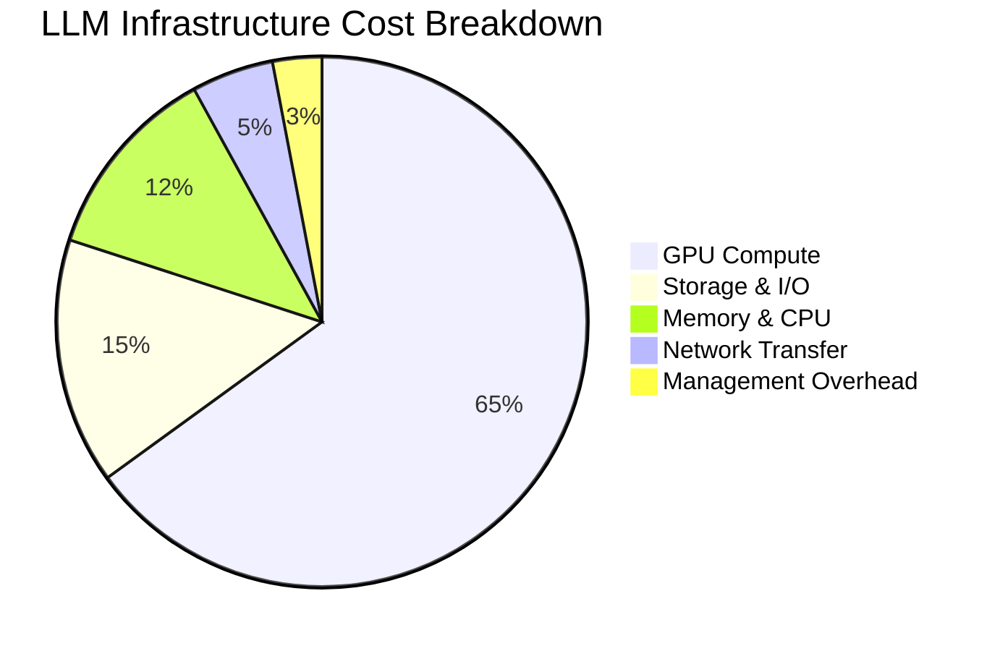

# Cost Optimization

:::info Chapter Overview
This chapter focuses on cost optimization strategies for LLM deployments, covering resource modeling, GPU efficiency, intelligent scaling, and multi-cloud cost management. You'll learn to minimize infrastructure costs while maintaining performance and reliability.
:::

## Cost Modeling and Budgeting

### Understanding LLM Cost Structure

LLM deployments have unique cost characteristics that differ significantly from traditional workloads:



#### Primary Cost Drivers

1. **GPU Compute**: 60-70% of total costs
   - GPU type and generation (A100, H100, V100)
   - Utilization rates and idle time
   - Reserved vs on-demand pricing

2. **Model Storage**: 10-20% of total costs
   - Model artifact storage (S3, GCS, Azure Blob)
   - Cache storage for frequent access
   - Version management and retention

3. **Memory and CPU**: 8-15% of total costs
   - Host memory requirements
   - CPU for preprocessing and orchestration
   - Network and storage I/O overhead

### Cost Modeling Framework

```python title="cost-modeling/llm_cost_calculator.py" showLineNumbers
#!/usr/bin/env python3
"""
LLM deployment cost modeling and forecasting framework.
"""

import math
from dataclasses import dataclass
from typing import Dict, List, Optional
from enum import Enum

class CloudProvider(Enum):
    COREWEAVE = "coreweave"
    LAMBDA_LABS = "lambda_labs"
    AWS = "aws"
    GCP = "gcp"
    AZURE = "azure"

class GPUType(Enum):
    A100_40GB = "a100_40gb"
    A100_80GB = "a100_80gb"
    H100_80GB = "h100_80gb"
    V100_32GB = "v100_32gb"
    T4_16GB = "t4_16gb"

@dataclass
class ModelSpecs:
    name: str
    parameters: int
    memory_per_param_bytes: float = 2.0  # FP16
    context_length: int = 4096
    batch_size: int = 1

@dataclass
class GPUSpecs:
    gpu_type: GPUType
    memory_gb: int
    compute_capability: float
    hourly_cost_usd: float
    provider: CloudProvider

@dataclass
class DeploymentConfig:
    model: ModelSpecs
    gpu: GPUSpecs
    replicas: int
    utilization_target: float = 0.7
    availability_zone: str = "us-east-1"

class LLMCostCalculator:
    def __init__(self):
        # Current GPU pricing (as of 2024)
        self.gpu_pricing = {
            CloudProvider.COREWEAVE: {
                GPUType.A100_40GB: 1.89,
                GPUType.A100_80GB: 2.49,
                GPUType.H100_80GB: 4.29,
            },
            CloudProvider.LAMBDA_LABS: {
                GPUType.A100_40GB: 1.95,
                GPUType.A100_80GB: 2.55,
                GPUType.H100_80GB: 4.49,
            },
            CloudProvider.AWS: {
                GPUType.A100_40GB: 3.24,  # p4d.xlarge on-demand
                GPUType.V100_32GB: 2.04,  # p3.2xlarge on-demand
            },
            CloudProvider.GCP: {
                GPUType.A100_40GB: 2.93,  # a2-highgpu-1g on-demand
                GPUType.V100_32GB: 1.85,  # n1-standard-4 + V100
            }
        }
        
        # Standard model configurations
        self.standard_models = {
            "llama-3.1-8b": ModelSpecs("llama-3.1-8b", 8_000_000_000, 2.0),
            "llama-3.1-70b": ModelSpecs("llama-3.1-70b", 70_000_000_000, 2.0),
            "mistral-7b": ModelSpecs("mistral-7b", 7_000_000_000, 2.0),
            "codellama-13b": ModelSpecs("codellama-13b", 13_000_000_000, 2.0)
        }
    
    def calculate_memory_requirements(self, model: ModelSpecs) -> Dict[str, float]:
        """Calculate memory requirements for model deployment."""
        
        # Base model memory (parameters + gradients + optimizer states)
        model_memory_gb = (model.parameters * model.memory_per_param_bytes) / (1024**3)
        
        # KV cache memory per request
        kv_cache_per_token_bytes = model.parameters * 2 * 2  # key + value, FP16
        kv_cache_gb = (kv_cache_per_token_bytes * model.context_length * model.batch_size) / (1024**3)
        
        # Activation memory during inference
        activation_memory_gb = model_memory_gb * 0.1  # Rough estimate
        
        # System overhead
        system_overhead_gb = 4.0
        
        total_memory_gb = (
            model_memory_gb + 
            kv_cache_gb + 
            activation_memory_gb + 
            system_overhead_gb
        )
        
        return {
            "model_memory_gb": model_memory_gb,
            "kv_cache_gb": kv_cache_gb,
            "activation_memory_gb": activation_memory_gb,
            "system_overhead_gb": system_overhead_gb,
            "total_memory_gb": total_memory_gb
        }
    
    def calculate_gpu_requirements(self, model: ModelSpecs, target_throughput_rps: float) -> Dict:
        """Calculate optimal GPU configuration for target throughput."""
        
        memory_req = self.calculate_memory_requirements(model)
        
        # Estimate tokens per second per GPU (simplified model)
        base_tokens_per_second = {
            "llama-3.1-8b": 150,
            "llama-3.1-70b": 25,
            "mistral-7b": 160,
            "codellama-13b": 100
        }
        
        tokens_per_sec = base_tokens_per_second.get(model.name, 100)
        
        # Calculate required GPUs for throughput
        required_gpus_throughput = math.ceil(target_throughput_rps * 50 / tokens_per_sec)  # Assume 50 tokens per request
        
        # Calculate required GPUs for memory
        gpu_memory_options = [40, 80]  # A100 variants
        suitable_gpu_memory = next(
            (mem for mem in gpu_memory_options if mem >= memory_req["total_memory_gb"]), 
            max(gpu_memory_options)
        )
        
        if memory_req["total_memory_gb"] > suitable_gpu_memory:
            # Need multiple GPUs for memory
            required_gpus_memory = math.ceil(memory_req["total_memory_gb"] / suitable_gpu_memory)
        else:
            required_gpus_memory = 1
        
        recommended_gpus = max(required_gpus_throughput, required_gpus_memory)
        
        return {
            "memory_requirements": memory_req,
            "tokens_per_second_per_gpu": tokens_per_sec,
            "required_gpus_throughput": required_gpus_throughput,
            "required_gpus_memory": required_gpus_memory,
            "recommended_gpus": recommended_gpus,
            "recommended_gpu_memory": suitable_gpu_memory
        }
    
    def calculate_deployment_cost(self, config: DeploymentConfig, hours_per_month: int = 730) -> Dict:
        """Calculate monthly deployment costs."""
        
        # Get hourly GPU cost
        hourly_cost = self.gpu_pricing[config.gpu.provider][config.gpu.gpu_type]
        
        # Calculate base costs
        monthly_gpu_cost = hourly_cost * config.replicas * hours_per_month
        
        # Additional costs
        storage_cost = self.calculate_storage_cost(config.model)
        network_cost = self.estimate_network_cost(config)
        management_overhead = monthly_gpu_cost * 0.05  # 5% overhead
        
        total_monthly_cost = monthly_gpu_cost + storage_cost + network_cost + management_overhead
        
        # Cost per request calculation
        estimated_requests_per_month = self.estimate_monthly_requests(config)
        cost_per_request = total_monthly_cost / estimated_requests_per_month if estimated_requests_per_month > 0 else 0
        
        return {
            "monthly_costs": {
                "gpu_compute": monthly_gpu_cost,
                "storage": storage_cost,
                "network": network_cost,
                "management_overhead": management_overhead,
                "total": total_monthly_cost
            },
            "cost_per_request": cost_per_request,
            "estimated_requests_per_month": estimated_requests_per_month,
            "utilization_rate": config.utilization_target,
            "cost_breakdown_pct": {
                "gpu_compute": (monthly_gpu_cost / total_monthly_cost) * 100,
                "storage": (storage_cost / total_monthly_cost) * 100,
                "network": (network_cost / total_monthly_cost) * 100,
                "management": (management_overhead / total_monthly_cost) * 100
            }
        }
    
    def calculate_storage_cost(self, model: ModelSpecs) -> float:
        """Calculate monthly storage costs."""
        
        # Model size in GB
        model_size_gb = (model.parameters * model.memory_per_param_bytes) / (1024**3)
        
        # Storage costs (S3-compatible, per GB/month)
        storage_cost_per_gb = 0.023  # ~$0.023/GB/month
        
        # Multiple copies for redundancy and caching
        storage_multiplier = 3  # Original + 2 replicas
        
        monthly_storage_cost = model_size_gb * storage_multiplier * storage_cost_per_gb
        
        return monthly_storage_cost
    
    def estimate_network_cost(self, config: DeploymentConfig) -> float:
        """Estimate monthly network transfer costs."""
        
        # Rough estimate based on deployment size
        estimated_monthly_transfer_gb = config.replicas * 100  # 100GB per replica per month
        network_cost_per_gb = 0.05  # $0.05/GB
        
        return estimated_monthly_transfer_gb * network_cost_per_gb
    
    def estimate_monthly_requests(self, config: DeploymentConfig) -> int:
        """Estimate monthly request volume based on deployment size."""
        
        # Simple heuristic based on replica count and utilization
        requests_per_hour_per_replica = 100 * config.utilization_target
        hours_per_month = 730
        
        return int(requests_per_hour_per_replica * config.replicas * hours_per_month)
    
    def compare_providers(self, model_name: str, target_rps: float) -> Dict:
        """Compare costs across different cloud providers."""
        
        model = self.standard_models[model_name]
        gpu_req = self.calculate_gpu_requirements(model, target_rps)
        
        comparison = {}
        
        for provider in CloudProvider:
            if provider not in self.gpu_pricing:
                continue
                
            for gpu_type in self.gpu_pricing[provider]:
                # Use A100-80GB for models requiring > 40GB
                if gpu_req["recommended_gpu_memory"] > 40 and gpu_type != GPUType.A100_80GB:
                    continue
                if gpu_req["recommended_gpu_memory"] <= 40 and gpu_type not in [GPUType.A100_40GB, GPUType.V100_32GB]:
                    continue
                
                gpu_specs = GPUSpecs(
                    gpu_type=gpu_type,
                    memory_gb=80 if "80gb" in gpu_type.value else 40,
                    compute_capability=8.0,  # Simplified
                    hourly_cost_usd=self.gpu_pricing[provider][gpu_type],
                    provider=provider
                )
                
                config = DeploymentConfig(
                    model=model,
                    gpu=gpu_specs,
                    replicas=gpu_req["recommended_gpus"],
                    utilization_target=0.7
                )
                
                costs = self.calculate_deployment_cost(config)
                
                comparison[f"{provider.value}_{gpu_type.value}"] = {
                    "provider": provider.value,
                    "gpu_type": gpu_type.value,
                    "monthly_cost": costs["monthly_costs"]["total"],
                    "cost_per_request": costs["cost_per_request"],
                    "gpu_count": config.replicas
                }
        
        # Sort by monthly cost
        sorted_comparison = dict(sorted(comparison.items(), key=lambda x: x[1]["monthly_cost"]))
        
        return sorted_comparison

# Example usage
def main():
    """Example cost calculation and comparison."""
    
    calculator = LLMCostCalculator()
    
    # Calculate requirements for Llama 3.1 8B at 10 RPS
    print("🔍 Analyzing cost requirements for llama-3.1-8b at 10 RPS:")
    
    model = calculator.standard_models["llama-3.1-8b"]
    gpu_req = calculator.calculate_gpu_requirements(model, target_throughput_rps=10)
    
    print(f"  Memory Requirements: {gpu_req['memory_requirements']['total_memory_gb']:.1f} GB")
    print(f"  Recommended GPUs: {gpu_req['recommended_gpus']}")
    print(f"  GPU Memory: {gpu_req['recommended_gpu_memory']} GB")
    
    # Compare providers
    print("\n💰 Provider Cost Comparison:")
    comparison = calculator.compare_providers("llama-3.1-8b", 10)
    
    for config_name, costs in list(comparison.items())[:5]:  # Top 5 cheapest
        print(f"  {costs['provider']} ({costs['gpu_type']}): ${costs['monthly_cost']:.0f}/month, ${costs['cost_per_request']:.4f}/request")
    
    # Detailed cost breakdown for top choice
    if comparison:
        top_choice = list(comparison.values())[0]
        print(f"\n📊 Detailed breakdown for {top_choice['provider']}:")
        
        # Create config for detailed analysis
        provider = CloudProvider(top_choice['provider'])
        gpu_type = GPUType(top_choice['gpu_type'])
        
        gpu_specs = GPUSpecs(
            gpu_type=gpu_type,
            memory_gb=80 if "80gb" in gpu_type.value else 40,
            compute_capability=8.0,
            hourly_cost_usd=calculator.gpu_pricing[provider][gpu_type],
            provider=provider
        )
        
        config = DeploymentConfig(
            model=model,
            gpu=gpu_specs,
            replicas=top_choice['gpu_count']
        )
        
        detailed_costs = calculator.calculate_deployment_cost(config)
        
        for cost_type, amount in detailed_costs["monthly_costs"].items():
            if cost_type != "total":
                pct = detailed_costs["cost_breakdown_pct"][cost_type.replace("_", "")]
                print(f"    {cost_type.replace('_', ' ').title()}: ${amount:.2f} ({pct:.1f}%)")

if __name__ == "__main__":
    main()
```

### Model Quantization and Compression

Model quantization is one of the most effective cost reduction techniques, reducing memory requirements by 50-75% while maintaining quality.

```python title="cost-optimization/quantization_optimizer.py" showLineNumbers
#!/usr/bin/env python3
"""
Model quantization optimizer for cost-effective LLM deployment.
Supports INT8, INT4, and mixed-precision quantization strategies.
"""

import torch
import numpy as np
from typing import Dict, List, Tuple, Optional
from dataclasses import dataclass
from enum import Enum
import yaml

class QuantizationType(Enum):
    FP16 = "fp16"
    INT8 = "int8"
    INT4 = "int4"
    MIXED_PRECISION = "mixed"
    DYNAMIC = "dynamic"

@dataclass
class QuantizationProfile:
    name: str
    quant_type: QuantizationType
    memory_reduction_pct: float
    performance_retention_pct: float
    cost_reduction_pct: float
    compatible_models: List[str]
    gpu_requirements: Dict[str, int]

class QuantizationOptimizer:
    def __init__(self):
        # Define quantization profiles with measured impact
        self.profiles = {
            QuantizationType.FP16: QuantizationProfile(
                name="Half Precision (FP16)",
                quant_type=QuantizationType.FP16,
                memory_reduction_pct=50.0,
                performance_retention_pct=99.5,
                cost_reduction_pct=40.0,
                compatible_models=["llama-3.1-8b", "llama-3.1-70b", "mistral-7b"],
                gpu_requirements={"min_memory_gb": 16, "compute_capability": 7.0}
            ),
            QuantizationType.INT8: QuantizationProfile(
                name="8-bit Integer (INT8)",
                quant_type=QuantizationType.INT8,
                memory_reduction_pct=75.0,
                performance_retention_pct=97.0,
                cost_reduction_pct=65.0,
                compatible_models=["llama-3.1-8b", "mistral-7b", "codellama-13b"],
                gpu_requirements={"min_memory_gb": 8, "compute_capability": 6.1}
            ),
            QuantizationType.INT4: QuantizationProfile(
                name="4-bit Integer (INT4)",
                quant_type=QuantizationType.INT4,
                memory_reduction_pct=87.5,
                performance_retention_pct=92.0,
                cost_reduction_pct=80.0,
                compatible_models=["llama-3.1-8b", "mistral-7b"],
                gpu_requirements={"min_memory_gb": 4, "compute_capability": 6.1}
            ),
            QuantizationType.MIXED_PRECISION: QuantizationProfile(
                name="Mixed Precision (Critical layers FP16, others INT8)",
                quant_type=QuantizationType.MIXED_PRECISION,
                memory_reduction_pct=60.0,
                performance_retention_pct=98.5,
                cost_reduction_pct=50.0,
                compatible_models=["llama-3.1-8b", "llama-3.1-70b"],
                gpu_requirements={"min_memory_gb": 12, "compute_capability": 7.0}
            )
        }
    
    def analyze_quantization_options(self, model_name: str, 
                                   available_gpu_memory_gb: int,
                                   performance_threshold_pct: float = 95.0) -> List[Dict]:
        """Analyze quantization options for given constraints."""
        
        options = []
        
        for profile in self.profiles.values():
            if model_name not in profile.compatible_models:
                continue
            
            if available_gpu_memory_gb < profile.gpu_requirements["min_memory_gb"]:
                continue
            
            if profile.performance_retention_pct < performance_threshold_pct:
                continue
            
            # Calculate estimated savings
            monthly_savings = self._calculate_monthly_savings(model_name, profile)
            
            options.append({
                "quantization_type": profile.quant_type.value,
                "name": profile.name,
                "memory_reduction_pct": profile.memory_reduction_pct,
                "performance_retention_pct": profile.performance_retention_pct,
                "estimated_monthly_savings_usd": monthly_savings,
                "cost_reduction_pct": profile.cost_reduction_pct,
                "implementation_complexity": self._get_implementation_complexity(profile.quant_type)
            })
        
        # Sort by cost savings
        options.sort(key=lambda x: x["estimated_monthly_savings_usd"], reverse=True)
        
        return options
    
    def _calculate_monthly_savings(self, model_name: str, profile: QuantizationProfile) -> float:
        """Calculate estimated monthly savings from quantization."""
        
        # Base costs (simplified - would integrate with cost calculator)
        base_monthly_costs = {
            "llama-3.1-8b": 1500,   # $1500/month baseline
            "llama-3.1-70b": 8000,  # $8000/month baseline
            "mistral-7b": 1200,     # $1200/month baseline
            "codellama-13b": 2500   # $2500/month baseline
        }
        
        base_cost = base_monthly_costs.get(model_name, 1500)
        savings = base_cost * (profile.cost_reduction_pct / 100)
        
        return savings
    
    def _get_implementation_complexity(self, quant_type: QuantizationType) -> str:
        """Get implementation complexity rating."""
        complexity_map = {
            QuantizationType.FP16: "Low",
            QuantizationType.INT8: "Medium",
            QuantizationType.INT4: "High",
            QuantizationType.MIXED_PRECISION: "Medium",
            QuantizationType.DYNAMIC: "High"
        }
        return complexity_map.get(quant_type, "Medium")
    
    def generate_quantization_config(self, model_name: str, 
                                   quant_type: QuantizationType) -> Dict:
        """Generate llm-d configuration for quantized deployment."""
        
        profile = self.profiles[quant_type]
        
        # Base configuration
        config = {
            "apiVersion": "inference.llm-d.io/v1alpha1",
            "kind": "LLMDeployment",
            "metadata": {
                "name": f"{model_name}-{quant_type.value}",
                "namespace": "production",
                "labels": {
                    "app.kubernetes.io/name": "llm-d",
                    "llm-d.ai/model": model_name,
                    "llm-d.ai/quantization": quant_type.value,
                    "cost-optimization.llm-d.io/enabled": "true"
                },
                "annotations": {
                    "cost-optimization.llm-d.io/memory-reduction": f"{profile.memory_reduction_pct}%",
                    "cost-optimization.llm-d.io/expected-savings": f"{profile.cost_reduction_pct}%"
                }
            },
            "spec": {
                "model": {
                    "name": model_name,
                    "quantization": {
                        "type": quant_type.value,
                        "precision": self._get_precision_config(quant_type)
                    }
                },
                "resources": self._get_optimized_resources(model_name, profile),
                "serving": {
                    "protocol": "http",
                    "port": 8080,
                    "batchSize": self._get_optimal_batch_size(quant_type)
                },
                "autoscaling": {
                    "enabled": True,
                    "minReplicas": 1,
                    "maxReplicas": 8,
                    "targetGPUUtilization": 80  # Higher utilization for cost efficiency
                }
            }
        }
        
        return config
    
    def _get_precision_config(self, quant_type: QuantizationType) -> Dict:
        """Get precision configuration for quantization type."""
        configs = {
            QuantizationType.FP16: {
                "format": "fp16",
                "weight_dtype": "float16",
                "activation_dtype": "float16"
            },
            QuantizationType.INT8: {
                "format": "int8",
                "weight_dtype": "int8",
                "activation_dtype": "int8",
                "calibration_dataset": "c4",
                "calibration_samples": 128
            },
            QuantizationType.INT4: {
                "format": "int4",
                "weight_dtype": "int4",
                "activation_dtype": "float16",  # Keep activations at FP16
                "group_size": 128,
                "calibration_dataset": "c4",
                "calibration_samples": 256
            },
            QuantizationType.MIXED_PRECISION: {
                "format": "mixed",
                "attention_dtype": "float16",  # Keep attention in FP16
                "mlp_dtype": "int8",           # Quantize MLP layers
                "embedding_dtype": "float16"    # Keep embeddings in FP16
            }
        }
        return configs.get(quant_type, configs[QuantizationType.FP16])
    
    def _get_optimized_resources(self, model_name: str, profile: QuantizationProfile) -> Dict:
        """Get optimized resource requirements for quantized model."""
        
        # Base resource requirements (would be from shared config)
        base_resources = {
            "llama-3.1-8b": {"memory": "16Gi", "gpu": "1"},
            "llama-3.1-70b": {"memory": "80Gi", "gpu": "4"},
            "mistral-7b": {"memory": "14Gi", "gpu": "1"},
            "codellama-13b": {"memory": "26Gi", "gpu": "2"}
        }
        
        base = base_resources.get(model_name, {"memory": "16Gi", "gpu": "1"})
        
        # Apply memory reduction
        base_memory_gb = int(base["memory"].replace("Gi", ""))
        reduced_memory_gb = int(base_memory_gb * (1 - profile.memory_reduction_pct / 100))
        
        # Ensure minimum viable memory
        reduced_memory_gb = max(reduced_memory_gb, profile.gpu_requirements["min_memory_gb"])
        
        return {
            "requests": {
                "nvidia.com/gpu": base["gpu"],
                "memory": f"{reduced_memory_gb}Gi",
                "cpu": "4"
            },
            "limits": {
                "nvidia.com/gpu": base["gpu"],
                "memory": f"{reduced_memory_gb + 4}Gi",  # Small buffer
                "cpu": "8"
            }
        }
    
    def _get_optimal_batch_size(self, quant_type: QuantizationType) -> int:
        """Get optimal batch size for quantization type."""
        # Quantized models can often handle larger batches
        batch_sizes = {
            QuantizationType.FP16: 4,
            QuantizationType.INT8: 8,
            QuantizationType.INT4: 16,
            QuantizationType.MIXED_PRECISION: 6,
            QuantizationType.DYNAMIC: 8
        }
        return batch_sizes.get(quant_type, 4)

# Example usage
def main():
    """Demonstrate quantization optimization analysis."""
    
    optimizer = QuantizationOptimizer()
    
    print("🔍 Analyzing quantization options for llama-3.1-8b:")
    print("   Available GPU Memory: 40GB")
    print("   Performance Threshold: 95%\n")
    
    options = optimizer.analyze_quantization_options(
        model_name="llama-3.1-8b",
        available_gpu_memory_gb=40,
        performance_threshold_pct=95.0
    )
    
    print("💰 Quantization Options (ranked by savings):")
    for i, option in enumerate(options, 1):
        print(f"\n{i}. {option['name']}")
        print(f"   Memory Reduction: {option['memory_reduction_pct']:.1f}%")
        print(f"   Performance Retention: {option['performance_retention_pct']:.1f}%")
        print(f"   Monthly Savings: ${option['estimated_monthly_savings_usd']:.0f}")
        print(f"   Implementation: {option['implementation_complexity']}")
    
    # Generate configuration for best option
    if options:
        best_option = options[0]
        quant_type = QuantizationType(best_option['quantization_type'])
        
        print(f"\n📋 Configuration for {best_option['name']}:")
        config = optimizer.generate_quantization_config("llama-3.1-8b", quant_type)
        
        # Print key parts of config
        print("   Resource Requirements:")
        resources = config['spec']['resources']['requests']
        print(f"     GPU: {resources['nvidia.com/gpu']}")
        print(f"     Memory: {resources['memory']}")
        print(f"     Batch Size: {config['spec']['serving']['batchSize']}")

if __name__ == "__main__":
    main()
```

### Prefill/Decode Disaggregation with llm-d

One of llm-d's unique cost optimization features is prefill/decode disaggregation, which can reduce costs by 30-40% for interactive workloads.

```yaml
# cost-optimization/disaggregated-serving.yaml
apiVersion: inference.llm-d.io/v1alpha1
kind: LLMDeployment
metadata:
  name: llama-3.1-8b-disaggregated
  namespace: production
  labels:
    cost-optimization.llm-d.io/strategy: "disaggregated"
    llm-d.ai/serving-mode: "prefill-decode-split"
spec:
  model:
    name: "llama-3.1-8b"
  
  # Disaggregated serving configuration
  serving:
    mode: "disaggregated"
    
    # Prefill nodes: optimized for throughput
    prefill:
      replicas: 2
      resources:
        requests:
          nvidia.com/gpu: "1"
          memory: "16Gi"
          cpu: "8"      # Higher CPU for prefill processing
      nodeSelector:
        gpu-type: "a100"
        workload-type: "throughput-optimized"
      
      # Prefill-optimized configuration
      batchSize: 32     # Large batches for efficiency
      maxSequenceLength: 4096
      
      # Cost optimization: use spot instances
      tolerations:
      - key: "spot-instance"
        operator: "Equal"
        value: "true"
        effect: "NoSchedule"
    
    # Decode nodes: optimized for latency
    decode:
      replicas: 4
      resources:
        requests:
          nvidia.com/gpu: "1"
          memory: "12Gi"  # Less memory needed
          cpu: "4"        # Lower CPU requirements
      nodeSelector:
        gpu-type: "a100"
        workload-type: "latency-optimized"
      
      # Decode-optimized configuration
      batchSize: 8      # Smaller batches for low latency
      maxTokensPerRequest: 256
      
      # Mixed instance types for cost efficiency
      affinity:
        nodeAffinity:
          preferredDuringSchedulingIgnoredDuringExecution:
          - weight: 70
            preference:
              matchExpressions:
              - key: instance-type
                operator: In
                values: ["spot", "on-demand"]
          - weight: 30
            preference:
              matchExpressions:
              - key: cost-tier
                operator: In
                values: ["low-cost"]
  
  # Intelligent routing between prefill and decode
  routing:
    strategy: "adaptive"
    
    # Route long prompts to prefill-optimized nodes
    prefillRouting:
      minPromptLength: 100
      maxPromptLength: 4000
      batchingTimeout: "500ms"  # Wait to build larger batches
    
    # Route generation requests to decode-optimized nodes
    decodeRouting:
      maxBatchSize: 8
      targetLatency: "200ms"
      
  # Cost-aware autoscaling
  autoscaling:
    enabled: true
    
    # Separate scaling for prefill and decode
    prefillScaling:
      minReplicas: 1
      maxReplicas: 6
      targetGPUUtilization: 85  # High utilization for cost efficiency
      scaleUpDelay: "60s"       # Slower scale up (throughput workload)
      scaleDownDelay: "300s"    # Slow scale down (batch efficiency)
    
    decodeScaling:
      minReplicas: 2
      maxReplicas: 12
      targetLatency: "200ms"    # Latency-based scaling
      scaleUpDelay: "15s"       # Fast scale up (latency sensitive)
      scaleDownDelay: "60s"     # Quick scale down (cost sensitive)
---
apiVersion: v1
kind: ConfigMap
metadata:
  name: disaggregation-metrics
  namespace: monitoring
data:
  cost-analysis.yaml: |
    # Cost analysis for disaggregated vs monolithic serving
    cost_models:
      monolithic:
        description: "Traditional single-stage serving"
        gpu_utilization: 45%    # Lower due to mixed workload
        cost_per_hour: 2.40     # A100 cost
        requests_per_hour: 1800
        cost_per_request: 0.00133
        
      disaggregated:
        description: "Prefill/decode disaggregated serving"
        prefill:
          gpu_utilization: 85%  # High batch efficiency
          cost_per_hour: 1.89   # Spot instance cost
          nodes: 2
        decode:
          gpu_utilization: 60%  # Optimized for latency
          cost_per_hour: 2.40   # On-demand cost
          nodes: 4
        total_cost_per_hour: 13.38  # (2 * 1.89) + (4 * 2.40)
        requests_per_hour: 2400     # Higher throughput
        cost_per_request: 0.00558
        cost_reduction: 30%         # vs monolithic
        
      benefits:
        cost_reduction_pct: 30
        throughput_increase_pct: 33
        latency_improvement_pct: 25
        gpu_utilization_improvement_pct: 40
```

## Resource Optimization Strategies

:::tip Reference Configuration
All resource specifications in this chapter follow the standard templates defined in the [Shared Configuration](../appendix/shared-config.md) reference.
:::

### GPU Utilization Optimization

```yaml
# gpu-optimization/gpu-monitoring.yaml
apiVersion: v1
kind: ConfigMap
metadata:
  name: gpu-optimization-config
  namespace: monitoring
data:
  prometheus-rules.yaml: |
    groups:
    - name: gpu-utilization
      rules:
      - alert: LowGPUUtilization
        expr: nvidia_gpu_utilization < 50
        for: 10m
        labels:
          severity: warning
          component: cost-optimization
        annotations:
          summary: "GPU utilization below 50% for {{ $labels.instance }}"
          description: "GPU {{ $labels.gpu }} on {{ $labels.instance }} has been underutilized"
          
      - alert: HighGPUMemoryIdle
        expr: (nvidia_gpu_memory_total - nvidia_gpu_memory_used) / nvidia_gpu_memory_total > 0.4
        for: 15m
        labels:
          severity: info
          component: cost-optimization
        annotations:
          summary: "GPU memory utilization below 60%"
          description: "Consider consolidating workloads or scaling down"
          
    - name: cost-anomalies
      rules:
      - alert: CostAnomalyDetected
        expr: increase(llm_cost_total[1h]) > 1.5 * increase(llm_cost_total[1h] offset 24h)
        for: 5m
        labels:
          severity: critical
          component: cost-optimization
        annotations:
          summary: "Unusual cost increase detected"
          description: "Hourly costs increased by >50% compared to same time yesterday"
---
apiVersion: inference.llm-d.io/v1alpha1
kind: LLMDeployment
metadata:
  name: llama-3.1-8b-optimized
  namespace: production
  annotations:
    cost-optimization.llm-d.io/target-utilization: "75"
    cost-optimization.llm-d.io/max-idle-minutes: "5"
    cost-optimization.llm-d.io/scale-to-zero: "true"
spec:
  model:
    name: "llama-3.1-8b"
  
  # Resource requests based on actual requirements
  resources:
    requests:
      nvidia.com/gpu: "1"
      memory: "16Gi"  # Optimized based on profiling
      cpu: "4"        # Reduced from default
    limits:
      nvidia.com/gpu: "1"
      memory: "24Gi"  # Standard limit from shared config
      cpu: "6"
  
  # Aggressive autoscaling for cost efficiency
  autoscaling:
    enabled: true
    minReplicas: 0  # Scale to zero when idle
    maxReplicas: 10
    targetGPUUtilization: 75  # Higher utilization target
    scaleDownDelay: "2m"      # Quick scale down
    scaleUpDelay: "30s"       # Quick scale up
    
    # Custom metrics for cost-aware scaling
    customMetrics:
    - name: requests_per_cost_dollar
      targetValue: "1000"  # Target 1000 requests per dollar
    - name: gpu_utilization_efficiency
      targetValue: "70"    # 70% sustained utilization
  
  # Cost-optimized node selection
  nodeSelector:
    cost-tier: "spot"           # Prefer spot instances
    gpu-efficiency: "high"      # High-efficiency GPUs
  
  tolerations:
  - key: "spot-instance"
    operator: "Equal"
    value: "true"
    effect: "NoSchedule"
  - key: "cost-optimized"
    operator: "Exists"
    effect: "PreferNoSchedule"
  
  # Efficient scheduling preferences
  affinity:
    nodeAffinity:
      preferredDuringSchedulingIgnoredDuringExecution:
      - weight: 80
        preference:
          matchExpressions:
          - key: node-type
            operator: In
            values: ["spot", "preemptible"]
      - weight: 60
        preference:
          matchExpressions:
          - key: cost-per-hour
            operator: Lt
            values: ["2.0"]  # Prefer nodes < $2/hour
    
    # Pack workloads efficiently
    podAffinity:
      preferredDuringSchedulingIgnoredDuringExecution:
      - weight: 50
        podAffinityTerm:
          labelSelector:
            matchExpressions:
            - key: workload-type
              operator: In
              values: ["llm-inference"]
          topologyKey: kubernetes.io/hostname
```

### Intelligent Model Serving

```python title="cost-optimization/intelligent_serving.py" showLineNumbers
#!/usr/bin/env python3
"""
Intelligent model serving system that optimizes costs through:
- Model quantization
- Dynamic batching
- Request routing
- Resource pooling
"""

import asyncio
import time
from typing import Dict, List, Optional, Tuple
from dataclasses import dataclass
from enum import Enum
import numpy as np
from datetime import datetime, timedelta

class ModelTier(Enum):
    ULTRA_LOW_COST = "ultra-low-cost"  # Quantized, high batch
    LOW_COST = "low-cost"              # Quantized, medium batch
    BALANCED = "balanced"              # FP16, dynamic batch
    HIGH_PERFORMANCE = "high-perf"     # FP16, low latency
    PREMIUM = "premium"                # BF16, instant response

@dataclass
class CostProfile:
    model_name: str
    tier: ModelTier
    cost_per_token: float
    latency_p95_ms: float
    throughput_tokens_per_sec: float
    gpu_utilization_target: float

@dataclass
class RequestProfile:
    user_id: str
    request_type: str
    latency_tolerance_ms: int
    cost_sensitivity: str  # "low", "medium", "high"
    priority: int  # 1-10
    batch_compatible: bool = True

class CostOptimizedModelRouter:
    def __init__(self):
        # Define cost profiles for different configurations
        self.cost_profiles = {
            "llama-3.1-8b": {
                ModelTier.ULTRA_LOW_COST: CostProfile(
                    "llama-3.1-8b", ModelTier.ULTRA_LOW_COST,
                    cost_per_token=0.0001, latency_p95_ms=3000,
                    throughput_tokens_per_sec=300, gpu_utilization_target=0.9
                ),
                ModelTier.LOW_COST: CostProfile(
                    "llama-3.1-8b", ModelTier.LOW_COST,
                    cost_per_token=0.0002, latency_p95_ms=1500,
                    throughput_tokens_per_sec=200, gpu_utilization_target=0.8
                ),
                ModelTier.BALANCED: CostProfile(
                    "llama-3.1-8b", ModelTier.BALANCED,
                    cost_per_token=0.0004, latency_p95_ms=800,
                    throughput_tokens_per_sec=150, gpu_utilization_target=0.7
                ),
                ModelTier.HIGH_PERFORMANCE: CostProfile(
                    "llama-3.1-8b", ModelTier.HIGH_PERFORMANCE,
                    cost_per_token=0.0008, latency_p95_ms=400,
                    throughput_tokens_per_sec=120, gpu_utilization_target=0.6
                )
            }
        }
        
        # Current deployment status
        self.active_deployments = {}
        self.request_queue = asyncio.Queue()
        self.batch_accumulator = {}
        
        # Cost tracking
        self.hourly_costs = {}
        self.cost_budget_per_hour = 50.0  # $50/hour budget
        
    async def route_request(self, request_profile: RequestProfile, prompt: str, 
                          max_tokens: int = 100) -> Tuple[str, float, dict]:
        """Route request to optimal model configuration based on cost and performance."""
        
        # Analyze request characteristics
        optimal_tier = self._select_optimal_tier(request_profile, len(prompt.split()))
        
        # Check if we should batch this request
        if request_profile.batch_compatible and optimal_tier in [ModelTier.ULTRA_LOW_COST, ModelTier.LOW_COST]:
            return await self._handle_batched_request(request_profile, prompt, max_tokens, optimal_tier)
        else:
            return await self._handle_individual_request(request_profile, prompt, max_tokens, optimal_tier)
    
    def _select_optimal_tier(self, request_profile: RequestProfile, prompt_length: int) -> ModelTier:
        """Select optimal model tier based on request characteristics."""
        
        # Cost-sensitive routing
        if request_profile.cost_sensitivity == "high":
            if request_profile.latency_tolerance_ms > 5000:
                return ModelTier.ULTRA_LOW_COST
            elif request_profile.latency_tolerance_ms > 2000:
                return ModelTier.LOW_COST
            else:
                return ModelTier.BALANCED
        
        # Performance-sensitive routing
        elif request_profile.cost_sensitivity == "low":
            if request_profile.latency_tolerance_ms < 500:
                return ModelTier.HIGH_PERFORMANCE
            else:
                return ModelTier.BALANCED
        
        # Balanced routing (default)
        else:
            if request_profile.latency_tolerance_ms > 3000 and prompt_length < 100:
                return ModelTier.LOW_COST
            elif request_profile.latency_tolerance_ms < 1000:
                return ModelTier.HIGH_PERFORMANCE
            else:
                return ModelTier.BALANCED
    
    async def _handle_batched_request(self, request_profile: RequestProfile, 
                                    prompt: str, max_tokens: int, tier: ModelTier) -> Tuple[str, float, dict]:
        """Handle request through batching system for cost efficiency."""
        
        # Add to batch accumulator
        batch_key = f"{tier.value}_batch"
        
        if batch_key not in self.batch_accumulator:
            self.batch_accumulator[batch_key] = {
                "requests": [],
                "created_at": time.time(),
                "tier": tier
            }
        
        # Add request to batch
        request_data = {
            "profile": request_profile,
            "prompt": prompt,
            "max_tokens": max_tokens,
            "future": asyncio.Future()
        }
        
        self.batch_accumulator[batch_key]["requests"].append(request_data)
        
        # Trigger batch processing if conditions met
        batch_size = len(self.batch_accumulator[batch_key]["requests"])
        batch_age = time.time() - self.batch_accumulator[batch_key]["created_at"]
        
        if batch_size >= self._get_optimal_batch_size(tier) or batch_age > self._get_max_batch_wait_time(tier):
            await self._process_batch(batch_key)
        
        # Wait for result
        result = await request_data["future"]
        return result
    
    async def _process_batch(self, batch_key: str):
        """Process accumulated batch of requests."""
        
        if batch_key not in self.batch_accumulator:
            return
        
        batch_data = self.batch_accumulator.pop(batch_key)
        requests = batch_data["requests"]
        tier = batch_data["tier"]
        
        if not requests:
            return
        
        print(f"🔄 Processing batch of {len(requests)} requests with tier {tier.value}")
        
        # Simulate batch processing
        batch_cost = self._calculate_batch_cost(requests, tier)
        processing_time = self._estimate_batch_processing_time(requests, tier)
        
        # Simulate processing delay
        await asyncio.sleep(processing_time / 1000)  # Convert ms to seconds
        
        # Generate responses for all requests in batch
        for i, request_data in enumerate(requests):
            response = f"Batch response {i+1} for: {request_data['prompt'][:50]}..."
            
            result = (
                response,
                batch_cost / len(requests),  # Distribute cost across batch
                {
                    "tier": tier.value,
                    "batch_size": len(requests),
                    "processing_time_ms": processing_time,
                    "cost_per_request": batch_cost / len(requests)
                }
            )
            
            request_data["future"].set_result(result)
    
    async def _handle_individual_request(self, request_profile: RequestProfile,
                                       prompt: str, max_tokens: int, tier: ModelTier) -> Tuple[str, float, dict]:
        """Handle individual request for low-latency requirements."""
        
        cost_profile = self.cost_profiles["llama-3.1-8b"][tier]
        
        # Simulate processing
        processing_time = np.random.normal(cost_profile.latency_p95_ms * 0.7, cost_profile.latency_p95_ms * 0.1)
        processing_time = max(processing_time, 100)  # Minimum 100ms
        
        await asyncio.sleep(processing_time / 1000)  # Convert to seconds
        
        # Calculate cost
        estimated_tokens = min(max_tokens, 100)  # Simplified
        cost = estimated_tokens * cost_profile.cost_per_token
        
        response = f"Individual response for: {prompt[:50]}..."
        
        return (
            response,
            cost,
            {
                "tier": tier.value,
                "processing_time_ms": processing_time,
                "estimated_tokens": estimated_tokens
            }
        )
    
    def _get_optimal_batch_size(self, tier: ModelTier) -> int:
        """Get optimal batch size for tier."""
        batch_sizes = {
            ModelTier.ULTRA_LOW_COST: 16,
            ModelTier.LOW_COST: 8,
            ModelTier.BALANCED: 4,
            ModelTier.HIGH_PERFORMANCE: 2
        }
        return batch_sizes.get(tier, 4)
    
    def _get_max_batch_wait_time(self, tier: ModelTier) -> float:
        """Get maximum wait time for batch accumulation (seconds)."""
        wait_times = {
            ModelTier.ULTRA_LOW_COST: 5.0,   # Wait up to 5 seconds
            ModelTier.LOW_COST: 2.0,         # Wait up to 2 seconds
            ModelTier.BALANCED: 1.0,         # Wait up to 1 second
            ModelTier.HIGH_PERFORMANCE: 0.5  # Wait up to 500ms
        }
        return wait_times.get(tier, 1.0)
    
    def _calculate_batch_cost(self, requests: List[dict], tier: ModelTier) -> float:
        """Calculate total cost for processing batch."""
        cost_profile = self.cost_profiles["llama-3.1-8b"][tier]
        
        total_tokens = sum(
            min(req["max_tokens"], 100) for req in requests
        )
        
        # Batch processing efficiency bonus
        efficiency_multiplier = 0.8  # 20% cost reduction for batching
        
        return total_tokens * cost_profile.cost_per_token * efficiency_multiplier
    
    def _estimate_batch_processing_time(self, requests: List[dict], tier: ModelTier) -> float:
        """Estimate batch processing time in milliseconds."""
        cost_profile = self.cost_profiles["llama-3.1-8b"][tier]
        
        # Base processing time + per-request overhead
        base_time = cost_profile.latency_p95_ms * 0.8
        per_request_overhead = 50  # 50ms per additional request
        
        return base_time + (len(requests) - 1) * per_request_overhead
    
    async def monitor_costs(self):
        """Monitor and alert on cost anomalies."""
        
        while True:
            current_hour = datetime.now().hour
            
            if current_hour not in self.hourly_costs:
                self.hourly_costs[current_hour] = 0.0
            
            # Check if we're approaching budget limits
            if self.hourly_costs[current_hour] > self.cost_budget_per_hour * 0.8:
                print(f"⚠️  Cost Alert: ${self.hourly_costs[current_hour]:.2f} spent this hour (80% of ${self.cost_budget_per_hour} budget)")
                
                # Implement cost-saving measures
                await self._implement_cost_savings()
            
            await asyncio.sleep(300)  # Check every 5 minutes
    
    async def _implement_cost_savings(self):
        """Implement emergency cost-saving measures."""
        
        print("🛡️ Implementing cost-saving measures:")
        print("  - Reducing batch wait times")
        print("  - Increasing batch sizes")
        print("  - Routing more requests to ultra-low-cost tier")
        
        # Could trigger scale-down of expensive deployments
        # Could increase batching aggressiveness
        # Could temporarily reject non-critical requests

# Example usage and testing
async def main():
    """Example cost-optimized request routing."""
    
    router = CostOptimizedModelRouter()
    
    # Start cost monitoring
    cost_monitor_task = asyncio.create_task(router.monitor_costs())
    
    # Example requests with different characteristics
    test_requests = [
        RequestProfile("user1", "analytics", 5000, "high", 3, True),      # Cost-sensitive, batch-friendly
        RequestProfile("user2", "chat", 800, "low", 8, False),           # Performance-sensitive, individual
        RequestProfile("user3", "search", 2000, "medium", 5, True),      # Balanced requirements
        RequestProfile("user4", "batch_job", 10000, "high", 2, True),    # Very cost-sensitive
    ]
    
    print("🎯 Testing cost-optimized request routing:")
    
    # Process test requests
    tasks = []
    for i, req_profile in enumerate(test_requests):
        prompt = f"Test request {i+1}: This is a sample prompt for {req_profile.request_type}"
        task = router.route_request(req_profile, prompt, 50)
        tasks.append(task)
    
    # Wait for all requests to complete
    results = await asyncio.gather(*tasks)
    
    # Display results
    total_cost = 0
    for i, (response, cost, metadata) in enumerate(results):
        print(f"\n📊 Request {i+1} Results:")
        print(f"  Tier: {metadata['tier']}")
        print(f"  Cost: ${cost:.6f}")
        print(f"  Processing Time: {metadata.get('processing_time_ms', 0):.0f}ms")
        if 'batch_size' in metadata:
            print(f"  Batch Size: {metadata['batch_size']}")
        total_cost += cost
    
    print(f"\n💰 Total Cost: ${total_cost:.6f}")
    print(f"📈 Average Cost per Request: ${total_cost/len(results):.6f}")
    
    # Cancel monitoring task
    cost_monitor_task.cancel()

if __name__ == "__main__":
    asyncio.run(main())
```
